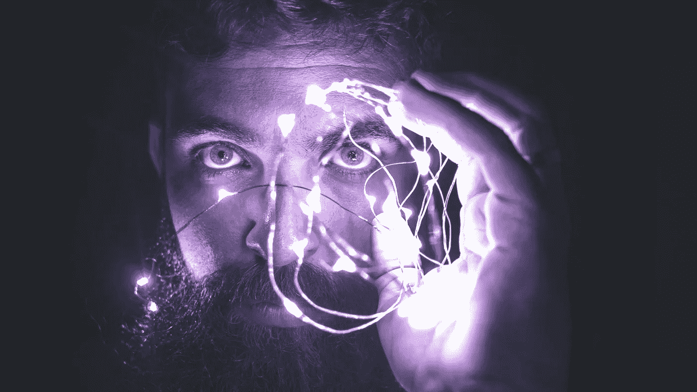

# 怪神经元。当神经科学和人工智能再次相遇。

> 原文：<https://towardsdatascience.com/blame-neurons-when-neuroscience-and-ai-cross-paths-again-8be12f6c9229?source=collection_archive---------51----------------------->

## 神经科学和人工智能一直紧密相连，然而，是时候报仇了。

*“责怪别人需要时间和精力来提升自己”。*

L 让我们来谈谈神经科学。我们能够将一种主要的人工智能算法应用于我们的大脑吗？*是的，你没看错！*

是什么控制着我们每个人的思想、行为或争论？

的确，**神经元**。完美运行的无限神经回路。但是，这些神经元如何表现和顺应，以便不犯错误呢？*想象你正在跑步，第一次你会摔倒，但一点一点地你会加快步伐，直到你完成第一场比赛。*

那么一开始摔倒我们怪谁呢？*那个神经元！或者是那个？大脑是如何从我们的错误中学习的？*

深度学习的教父杰弗里·希尔顿(Geoffrey Hilton)博士以及其他伟大的特权思想认为，在这种机制背后是一种深度学习核心算法，它在大脑内部以同样的方式运行。

## 我们称之为“反向传播”。

由[大卫·卡索拉托](https://www.pexels.com/@davidcassolato)在[像素上拍摄的照片](https://pexels.com)

*如果你想了解更多，去 oscargarciaramos.com*访问

*以防你以前从未听说过这个概念。在很高的层面上，这个概念是基于从错误中学习的想法，并且在做一件特定的事情时变得更好。这将是一种“责怪”我们网络中的神经元连接错误的方式，以便逐步提高期望的输出。*

*尽管这种说法尚未得到验证，甚至被一些神经科学家斥为“生物学上不可能”，但深度学习技术和神经科学日益交织的事实，唤起了许多“来自过去的幽灵”。但是，在理解我们的大脑方面也面临新的挑战。*

> *就人工智能而言，它将令人惊讶地成为理解我们人类如何学习的奥秘的一种方式。*

# *回去怪他们吧！*

*根据神经科学学习的教条是基于“一起开火，一起连线”。这是什么意思？当我们想要学习做一件新的事情时，神经元通过*突触*相互连接，形成一个网络，这个网络慢慢完善，将允许我们学习做一项新的任务，比如跑步。*

## *但是它实际上是如何工作的呢？*

*神经网络由不同的个体或神经元组成，这些个体或神经元只与它们的邻居进行交互。换句话说，单个神经元只接收来自其上游伙伴的信息，并将该信息委托或传输给其下游伙伴。这些连接的强度或阻力取决于什么？上 ***【突触重量】*** 。一个明喻可以是一个有力或无力的握手。正如你所知道的，取决于你握手的对象，并不总是强有力的握手是最理想的。学习的要点是基于“调整”或平衡我们所有握手的重量，这样我们才能得到我们想要的结果。*

*现在，想象所有的神经元和它们的邻居决定投票选举社区的“市长”。然而，他的对手出来了。谁投票不好，网络如何整体解决？我们不得不“责怪”某人，这样我们才能让结果变得更好。**那是我们的“学习过程”**。但是为了学习，我们必须“调整”权重，甚至在我们知道首先调整哪些连接之前。*

*早在 1986 年，希尔顿、大卫·鲁梅尔哈特和罗纳德·威廉姆斯发现，信息通过不同的神经层传播，如果我们观察获得的输出与预期的输出有多远，就有可能用数学方法计算出一个 ***误差信号*** 。该信号可以通过神经层传输，每个神经层基于其上层接收新的信号误差。*

*因此得名**“反向传播”**。*

*想象一场足球比赛。小区域有四名球员，最后一名球员失败，不得分。教练会怎么做？。他将从最后一个触球的球员开始，判断他/她没有最终得分“有多内疚”，并将倒退判断谁需要“穿上他的靴子”进行调整，也就是说，他将改变他们的*“突触重量”。**

*玩家回到该区域，也就是说，我们再次计算同样的问题，然后… Goooaaaal！我们成功了！反向传播调整已经生效，网络将把新的突触权重作为参考，并继续学习。*

## *那么，下一步是什么？*

****这一切有意义吗？****

*反向投影结合其他算法已经成为面部识别、自动文本转录甚至人工智能游戏胜利(如围棋或扑克)等领域的主导技术。*

*然而，至少到目前为止，大脑中类似反向传播信号的想法仍然是猜测。*

*你可能想知道为什么…*

*一个最强有力的原因是，一般来说，人工智能网络的配置不像生物网络，因此，我们不能推断它们的反向传播。*

*基本上，我们的大脑不能回到过去改变突触的重量。生物神经元不是这样工作的。它们可以通过更多的输入或激素或化学递质等其他类型的调节来改变它们的连接，但在不混淆生物神经元的情况下，将相同的物理分支和突触用于直接和反馈信号被认为是“不可能的”。*

*但是，如果我们将这一理论应用到我们的大脑中，我们可以开发一个新的层次，将生物学习与人工智能联系起来。*

****你觉得这篇文章有用吗？****

**欢迎发表评论或分享这篇文章。关注* [*me*](https://medium.com/@ogarciaramos) *未来岗位。**

**如果你想了解更多，你可以在*[***oscargarciaramos.com***](https://oscargarciaramos.com)找到我*