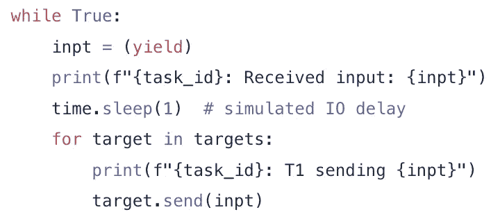
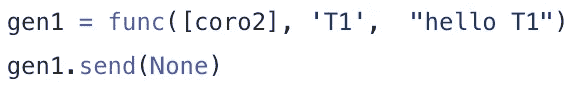
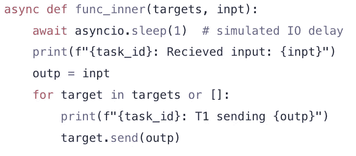
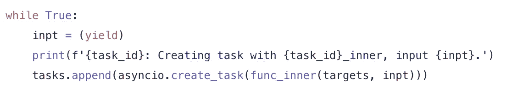
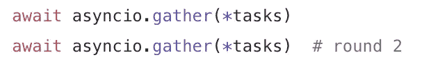

# 炽热的 Python AsyncIO 管道

> 原文：<https://towardsdatascience.com/blazing-hot-python-asyncio-pipelines-438b34bed9f?source=collection_archive---------24----------------------->

## 并发高效地处理大量流水线式 web、数据库和微服务请求

约书亚·牛顿在 [Unsplash](https://unsplash.com?utm_source=medium&utm_medium=referral) 上的照片

对于内存高效和可读的代码来说，流水线功能非常强大。在这些函数中，一个函数的输出输入下一个函数的输入。一些示例应用包括:

*   跨越不同但相关的数据源的多级 web 刮刀
*   具有数据提取、转换和处理步骤的机器学习管道
*   对大数据集进行逐行操作

使用 Python 的`asyncio`库进行并发操作既快速又节省资源，尤其是对于 IO 绑定的任务。

本文将向您展示如何构建您自己的可以非常高效地运行的管道，尤其是如果您要进行大量的 IO 操作，如 web 请求或数据库查询。后续文章将通过提供一个库来抽象出下面显示的大部分底层机制，使之变得更加容易。

# 同步发电机管道

Python 生成器有一个`send()`方法，可以用来在生成器调用`yield`时将数据发送到生成器中。把它放入一个无限循环中，你会在你的管道中得到一个不断等待输入的阶段，用它做一些事情，然后发送到下一个阶段。

您可以使用这种基于推送的方法以扇出模式发送到多个其他生成器，因此我们假设我们有一个`target`生成器的列表。

当我们从生成器函数创建生成器时，我们必须通过发送`None`来初始化它。这使得生成器在功能代码中前进，直到遇到第一个`yield`语句。

这里有一个完整的例子。

运行输出:

> T2:已初始化参数:你好 T2
> T1:已初始化参数:你好 T1
> T1:已接收输入:1
> T1: T1 发送 1
> T2:已接收输入:1
> T1:已接收输入:2
> T1: T1 发送 2
> T2:已接收输入:2
> T1:已接收输入:3
> T1: T1 发送 3
> T2:已接收输入:3
> 时长:6.01299477

*注:*

*   我们将所有的输入(第 20–22 行)发送到第一阶段，它会通过管道自动传播
*   这都是同步代码。在发送下一个输入之前，第一个输入完全通过。
*   易于使用断点进行调试
*   我们必须反向构造和链接，因为`gen1`(即`gen2`)的目标生成器必须存在，才能作为参数传递给 gen1 的生成器函数。

# 异步发电机管道

我们可以使用同步 python 生成器等待输入，但是使用协程异步处理输入(由 sleep 函数模拟)。我们通过将处理和发送代码放在`async def`内部函数中来实现这一点。

在循环中的每一次迭代中，我们都会得到一个输入值，并生成一个 asyncio 任务。我们在一个全局`tasks`列表中跟踪所有产生的任务。

我们的主函数也必须是一个运行在事件循环中的协程。这是由`asyncio.run(main())`完成的。注意在 main 中，我们如何使用`async.gather()`函数等待所有任务完成。这必须做两次，因为我们分两个阶段提交任务。现在很尴尬。

完整示例:

运行输出:

> T2:用参数初始化:你好 T2
> T1:用参数初始化:你好 T1
> T1:用 T1_inner 创建任务，输入 1。
> T1:使用 T1_inner 创建任务，输入 2。
> T1:用 T1_inner 创建任务，输入 3。
> T1:接收输入:1
> T1: T1 发送 1
> T2:用 T2_inner 创建任务，输入 1。
> T1:接收输入:2
> T1: T1 发送 2
> T2:用 T2_inner 创建任务，输入 2。
> T1:接收输入:3
> T1: T1 发送 3
> T2:用 T2_inner 创建任务，输入 3。T2:接收到的输入:1
> T2:接收到的输入:2
> T2:接收到的输入:3
> 持续时间:2.00000000001

*注*:

*   由于异步睡眠，运行速度更快
*   需要一个事件循环
*   很难知道什么时候所有的任务都完成了
*   关于`send`函数的竞争条件的一些问题

# 等待救援的队伍

`asyncio.Queue`类也有一个方便的`task_done()`方法。队列对象跟踪`get()`和`task_done()`被调用的次数。如果相同的次数，它假定从队列中取出的所有项目也已经被处理，并且它允许自己被加入(如果队列是空的)。这允许我们按顺序调用`await on` `q.join()`来了解一个阶段是否完成，并且我们可以避免多次调用`asyncio.gather()`。

运行输出:

> T2:用参数初始化:你好 T2
> T1:用参数初始化:你好 T1
> T1:用 T1_inner 创建任务，输入 1。
> T1:用 T1_inner 创建任务，输入 2。
> T1:用 T1_inner 创建任务，输入 3。
> T1:接收输入:1
> T1:接收输入:2
> T1:接收输入:3
> T1: T1 发送 1
> T1: T1 发送 2
> T1: T1 发送 3
> T2:用 T2 _ 内创建任务，输入 1。
> T2:用 T2_inner 创建任务，输入 2。
> T2:用 T2_inner 创建任务，输入 3。
> T2:已接收输入:1
> T2:已接收输入:2
> T2:已接收输入:3
> 持续时间:2.00000000005

注意:

*   `input_q.task_done()`是调用内部函数的结尾
*   我们没有把`send()`变成发电机，而是把`put()`放在一个队列上
*   我们只需要收集一次任务

# 结论

我们可以通过使用 python 生成器来创建简单的同步管道。通过交换到 asyncio 队列和协程，我们可以拥有非常高效的 io 管道，并保持对我们生成的任务的控制。