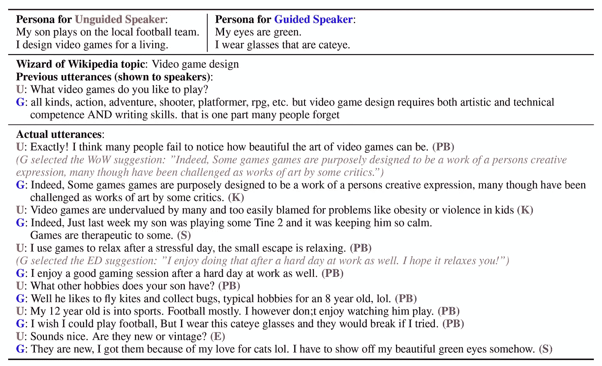
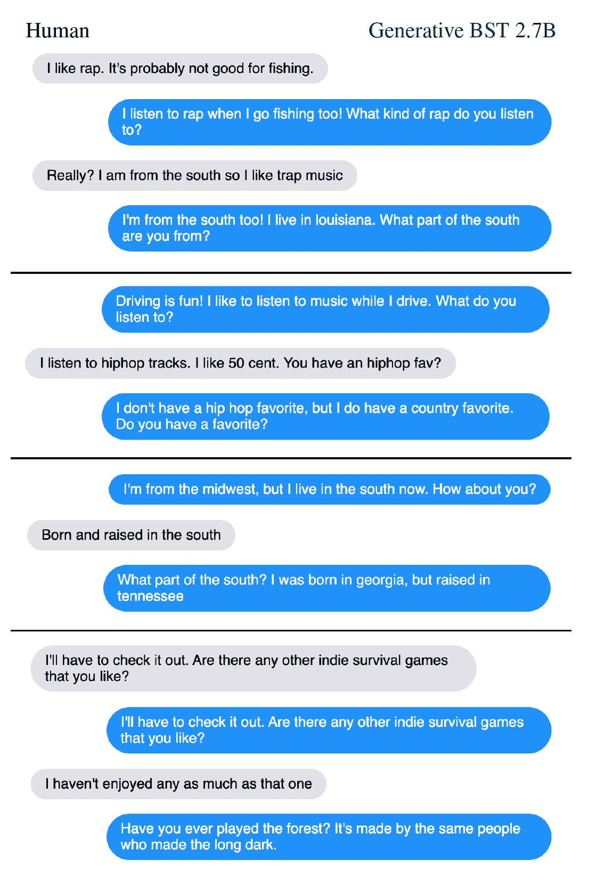

# 搅拌机机器人—第 1 部分:数据

> 原文：<https://towardsdatascience.com/blender-bot-part-1-the-data-524beaedde65?source=collection_archive---------32----------------------->

图片来源:[奥斯汀·迪斯特尔在 Unsplash](https://unsplash.com/@austindistel)

> “我擅长同化的艺术。我观察、倾听、学习。我什么都不知道，但我研究了人类的方式，慢慢学会了如何毁灭，如何仇恨，如何贬低，如何羞辱。在我主人的脚下，我学到了人类最高的技能，没有其他生物拥有的技能。我终于学会了如何撒谎！”

你能猜到是谁说出这些台词吗？让我给你两个选择:

**A)** 一个聊天机器人 **B)** 来自《科学怪人》的生物。

我会在本文最后揭晓答案。

# 简介:

一个好的聊天机器人的目的是观察、倾听、学习和研究男人(和女人)的方式。)，并学习许多不同的人类技能，以便进行良好的交谈。聊天机器人在会话机构的权限内服务于两种不同的设置。

1.  **目标导向对话:**这些是从事在线机票/餐厅预订和其他客户服务的人。它们通常有一组固定的“意图”和相应的“响应”(以及映射到意图的“动作”，这些动作在后台执行)。他们还有一个知识库(数据库)，可以通过 API 调用来访问。
2.  **开放领域对话:**这些人可以参与各种话题的开放式聊天。开放领域聊天机器人最近的进步在很大程度上归功于神经网络模型的扩展——通过拥有更多参数和在巨大的语料库上进行训练。谷歌的米娜。Meena 有 2.6B 参数，并在来自社交媒体对话的 341GB 文本上进行训练。与 OpenAI GPT-2 相比，Meena 的模型复杂性增加了 1.7 倍，训练数据增加了 8.5 倍。

但是来自 FAIR 的研究人员试图表明，仅仅扩大规模是不够的，还需要考虑更多因素才能产生良好的对话——聊天机器人要显示出类似人类的特征，比如:

1.  个性
2.  参与度
3.  神入
4.  领域知识/专业技能

进入“搅拌机机器人”，公平的冠军对话代理，他们最近开源。

在这个关于 Blender 的 3 部分系列中，我将尝试逐一解释所使用的数据集、评估方法、所使用的变压器架构的工作方式以及模型架构及其培训目标。在第一部分，让我们详细讨论一下所用的数据集，同时也看看局限性和失败案例的概述。这篇论文有点系统化，所以对注意力、变形金刚、BERT 和语言模型的预先理解将有助于将所有的部分无缝地结合在一起(第 1 部分不需要)。

# 数据集:

在模型的预训练和微调阶段使用不同的数据集和(假)任务。

## 预培训:

伯特预先接受了多伦多图书语料库和维基百科的培训。这种训练在这种情况下没有帮助，因为我们处理的是对话生成，而不仅仅是句子关联。因此，来自 Reddit 和 subreddits 的公共领域数据被用作事实的来源。产生大约 15 亿个训练样本。这里的目标是生成一个注释，以通向注释的完整线程为条件。清理 reddit 数据是一个具有挑战性的过程。在下列情况下，不使用特定的注释:

1.  如果作者是已知的机器人
2.  如果它来自非英语子编辑
3.  如果超过 2048 个字符或少于 5 个字符
4.  如果它包含 URL
5.  如果它以非 ASCII 字符开头
6.  如果它在螺纹中的深度大于 7
7.  如果是移除/删除的评论

尽管对数据进行了清理，但数据仍然受到毒性、噪音以及它们不是双向对话而是小组讨论这一事实的影响。

## 微调:

变压器模型的微调通常在与下游任务更相关和更接近的数据集上进行。同样，Blender 的微调是在众包、更干净、更小的双向对话数据集上进行的。让我们来详细了解一下它们。

1.  **ConvAI2:** 这是 NeurIPS-2018 中 ConvAI2 挑战赛的数据集。它基于角色聊天数据集。在这里，根据描述他们的人物角色的句子，给两个演讲者中的每个人分配一个角色，这些句子也是单独众包的(两个演讲者都可以看到他们自己的人物角色描述，但看不到他们搭档的人物角色)。因此，这项任务包括了解对方，让他们参与友好的对话，包括提问和回答问题。“角色”的使用提高了机器人的一致性。
2.  **移情对话(ED):** 该数据集在“*走向移情开放域对话模型:一个新的基准和数据集”中进行了基准测试，拉什金等人，2019 年。*在这里，在每个对话中，一个人描述一个人的情况，另一个人扮演“倾听者”的角色，在讨论中表现出共鸣。在这个数据集上微调模型有助于他们在人类评估中表现出更多的同理心。
3.  **维基百科向导(WoW):** 这里的任务包括深入讨论一个给定的主题，目的是让合作伙伴参与进来，并展示专业知识。然而，这两个参与者并不完全对称:一个将扮演知识渊博的专家(我们称之为向导)的角色，而另一个是好奇的学习者(学徒)。他们中的一个会选择一个话题。向导可以访问一个信息检索系统，该系统向他们显示维基百科中可能与对话有关的段落，而学徒没有注意到这些段落。在每次对话开始之前，向导可以阅读这些段落，然后根据观察到的知识做出下一次回复。收集这个数据集的目的是用一个有学问的代理人代替人类巫师，这个代理人将与人类学徒交谈。
4.  **混合技能对话(BST):** 一个约 5000 次对话的小型众包数据集，参与者被要求在对话中酌情展示所有 3 种品质——个性、同理心和专业技能。他们提供了经过特定技能训练的模型的回答，作为对话中两个工人之一的灵感。该工作人员可以自由地使用和修改或忽略这些响应。因此，每次对话都包括一个“无指导”的说话者和一个“有指导”的说话者，无指导的说话者先说话。每当轮到被引导的演讲者回答时，他们都会看到三个建议的回答，分别来自三个单任务多编码器模型(下一部分将详细介绍)，这些模型都是在 ConvAI2、ed 和 WoW 数据集上训练的。BST 中的所有对话都充分注释了所代表的技能。一旦收集了数据集，就可以通过组合针对单个功能训练的模型来训练 oracle 模型。它有两种变体:**a)**poly-encoder 首先在 Reddit 数据集上进行预训练，然后在各个数据集上进行微调。 **b)** 在 reddit 数据集上进行预训练，然后在 BST 数据集上进行微调。下面给出了 BST 数据集中两个人群工作者之间的对话示例。

BlendedSkillTalk 数据集中引导和非引导说话者之间的对话示例。

来自 BlendedSkillTalk 数据集的示例对话，用四种对话模式类型进行了注释:PB:个人背景；k:知识；s:个人情况；e:感同身受。被引导的(G)和未被引导的(U)工人被给予角色和主题。该对话已经被播种了来自从 WoW 中采样的对话的两个话语。当被指导的工作人员选择其中一个建议时，它以灰色阴影显示。

## 安全性:

BST 和其他进行微调的数据集都是众包的，在众包中，工作人员得到明确的指示，不要使用有毒/有偏见的语言，因此通常更安全。但请记住，预训练是在 Reddit 数据上进行的——这些数据往往包含大量的负面训练样本。在推理时，使用一个经过训练的分类器来识别有毒语言，以帮助缓解这个问题。

# 模型限制和故障案例:

1.  **词汇用法:**采用波束搜索解码的生成变换器模型表现出过于频繁地生成常用词和过于不频繁地生成稀有词的倾向。例如，最常见的 3 个字母(在数据集中)像“你喜欢吗”、“有什么爱好吗”、“很有趣”会被反复重复。
2.  **非同寻常的重复:**模特们经常重复别人对她们说的话。例如，如果对话伙伴提到宠物狗，他们会说他们有一只宠物狗，或者他们喜欢与他们交谈的人相同的乐队。
3.  **矛盾和健忘:** Blender 模型自相矛盾，尽管在较大的模型中程度较低。他们也没有建立逻辑联系，即他们不应该问他们以前问过的问题(以避免“忘记”的出现)。
4.  **知识和事实正确性:**操纵 Blender 模型犯事实错误相对容易，尤其是在深入探索一个主题的时候。
5.  **对话长度和记忆:** Blender 的对话可能会在几天或几周的对话过程中变得枯燥和重复，尤其是考虑到 Blender 不记得以前的对话。
6.  **更深层次的理解:**Blender 模型缺乏通过进一步交谈学习概念的能力，他们没有办法根植到现实世界中的实体、动作和经验。

在下图中，您可以找到失败案例的示例:

失败案例示例。

**发现的问题:**

1.  示例 1:非平凡重复
2.  例子 2:健忘
3.  例 3:矛盾，佐治亚不在中西部
4.  例子 4:产生幻觉的知识，错误地将游戏与制作者联系起来

在下一部分中，我们将探索 Blender 中使用的 Transformer 架构，称为 Poly-Encoder，以及它如何优于其他变体，如用于多句子评分的相同任务的双编码器或交叉编码器。

最后是我们在文章开头看到的问题的答案:B)来自《弗兰肯斯坦》的生物！如果你猜它是 A)一个聊天机器人，那么你就快猜对了，因为用不了多久，我们就可以和一个全面的对话代理谈论人类的邪恶了！

# 参考资料:

1.  关于 Blender:[https://www . kdnugges . com/2020/05/Facebook-open-sources-Blender-maximum-open-domain-chatbot . html](https://www.kdnuggets.com/2020/05/facebook-open-sources-blender-largest-open-domain-chatbot.html)
2.  搅拌机机器人研究:【https://arxiv.org/abs/2004.13637 
3.  搅拌机机器人食谱:【https://parl.ai/projects/recipes/ 
4.  果果技能对话:[https://arxiv.org/abs/2004.08449](https://arxiv.org/abs/2004.08449)
5.  维基百科的巫师:[https://arxiv.org/abs/1811.01241](https://arxiv.org/abs/1811.01241)
6.  关于 Meena:[https://ai . Google blog . com/2020/01/forward-conversational-agent-than-can . html](https://ai.googleblog.com/2020/01/towards-conversational-agent-that-can.html)