# 搅拌机机器人——第二部分:变压器

> 原文：<https://towardsdatascience.com/blender-bot-part-2-the-transformer-2e4d960b149f?source=collection_archive---------23----------------------->

科迪·恩格尔在 Unsplash 上的照片

脸书开源聊天机器人“Blender”打破了之前由谷歌“Meena”创造的所有记录。在本帖中，我们将回顾构成 Blender 核心的**多编码器**转换器架构。

你可以在 [TDS](/blender-bot-part-1-the-data-524beaedde65) 上阅读本系列的第一部分，在那里我们已经查看了训练聊天机器人的数据集。

假设读者对注意力、变形金刚、伯特和生成性语言模型有预先的了解，我将继续前进。

# 简介:

在看到如何在 Blender 的上下文中使用 Poly-Encoder 之前，我们将首先独立地理解它们。在预训练和微调搅拌机中使用的数据集和(假)训练任务(在第 1 部分中有详细解释)不应该与我下面将要解释的细节混淆。这里给出的实验设置是为了在一般设置中理解一个名为“**多句子评分**的特定任务以及为该任务训练的编码器架构。然后，在为此任务训练的编码器架构中，我们将看到多编码器是如何优越的。

# 任务:

多句子评分在输入和输出序列之间进行成对比较。给定一个输入序列，我们对一组候选标签进行评分。

从这里开始，我们将用**【INPUT，LABEL】**来表示输入输出对。

目标是从有限的候选标签列表中找到最佳标签。所使用的编码器是 BERT-Base，在前向网络中具有 12 个编码器块、12 个注意头和 768 个隐藏神经元。

## 预培训:

为此任务进行了两个版本的预培训:

1.  像伯特一样预先训练，在多伦多图书语料库和维基百科上。这里的[输入，标签]可以认为是[句子 A，句子 B]。
2.  接受过 Reddit 上公共领域社交媒体对话的预培训。这里的[输入，标签]可以理解为[上下文，下一句]

## 假训练任务:

训练任务与 BERT 预训练中使用的任务相同。

1.  **MLM:屏蔽语言模型:**这里，一定百分比的输入标记被随机屏蔽(使用[MASK]标记)。接下来的任务是学习预测屏蔽的令牌。
2.  **NSP:下一句预测:**这里给出两个句子 A 和 B，任务是说 B 是否跟随 A？(带负采样)。负抽样是通过从数据集中随机抽取一个句子作为 B 来实现的，50%的情况下。

这里有点跑题。为了记住 BERT 中这些预训练任务的性质，我使用的一个技巧是与生成 Word2Vec 嵌入时使用的假训练任务进行直接比较，即:1) CBOW 2) Skip-Gram。如果你能回忆起来，在 CBOW(连续单词袋)中，给定一个上下文，任务是预测目标单词——类似于 MLM 任务。在 Skip-Gram 模型中，给定目标词，预测上下文= >但是我们改变数据集而不是预测上下文/相邻词，任务变成:给定目标词和另一个词->预测另一个词是否是目标词的邻居(二进制分类问题)。由于初始数据集仅由目标单词和它们上下文中的单词形成，修改后的数据集现在仅包含正面的例子。所以我们通过负采样引入噪声。非常非常类似于伯特的 NSP 任务。(如果你认为在 BERT 和单词嵌入的训练任务之间进行这样的比较有任何不一致之处，请在评论中告诉我。谢谢！)

## 微调:

该模型在 ConvAI2 数据集上单独进行了微调，从而鼓励他们学习“个性”特征，并在 Ubuntu 聊天日志上帮助他们学习“领域知识/专业技能”。

# 架构:

我们将看到解决“多句子评分”任务的 3 种编码器架构，即，

1.  双编码器
2.  交叉编码器
3.  多元编码器

一个架构在推理过程中的性能是通过预测质量和预测速度来衡量的。

在继续之前，重要的是要记住这是一个**检索而不是生成任务**:我们只需要从一组固定的候选标签中检索一个正确的标签。

# 双编码器:

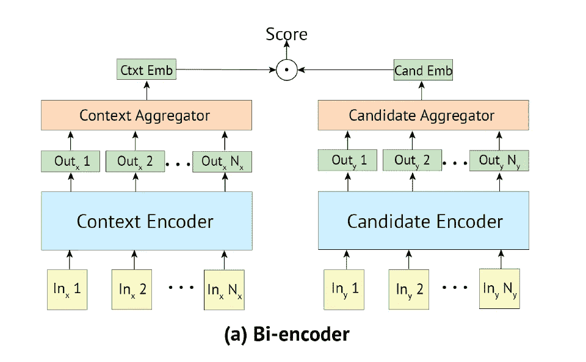

**参考文献[1]中的双编码器架构**

在双编码器中，对输入和标签分别进行自我关注。这不过是向量空间模型的更一般的概念。这种架构的优点是在推理过程中速度更快，因为我们可以预先计算和缓存大型固定候选标签集的编码。这是可能的，因为标签是单独编码的，与输入上下文无关。

*   输入和标签都被一个特殊的标记包围。这类似于 BERT 中的[CLS]标记，它捕获了整个句子的特征。
*   输入到编码器的嵌入是标记嵌入+段嵌入+位置嵌入的组合。段嵌入一般用来说一个令牌是属于 A 句还是 B 句(在 BERT 的上下文中)。因为输入和标签在这里是分开编码的，所以在两种情况下，段嵌入都是‘0’。
*   将输入和候选标签分别映射到一个公共特征空间。在所示的公式中，T1 和 T2 是两个独立的变压器(编码器)。

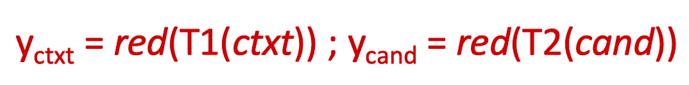

*   编码器在对输入令牌嵌入执行自我关注后，给出每个令牌的编码器表示，如:

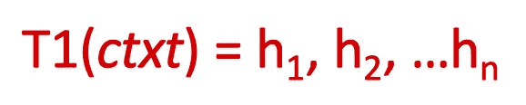

*   然后使用 reduce 函数( **red** )将其简化为单个嵌入表示。**减少**功能可以是以下任何一种:

->它可以采用第一个令牌的表示形式。这是对应于特殊令牌的表示

->或者我们可以取所有输出嵌入的平均值

->或者我们可以取第一个“m”的平均值(m

*   Once the INPUT and LABEL are represented thus in a common vector space, measure the similarity between them using standard dot product or any other non-linear function.

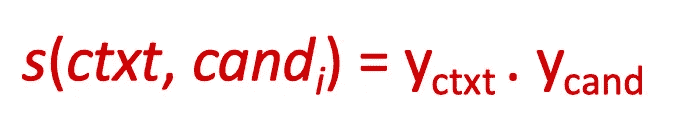

*   We then minimize the Cross Entropy loss function, where the logits look like:

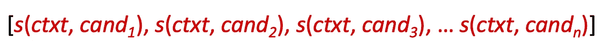

# Cross-Encoder:

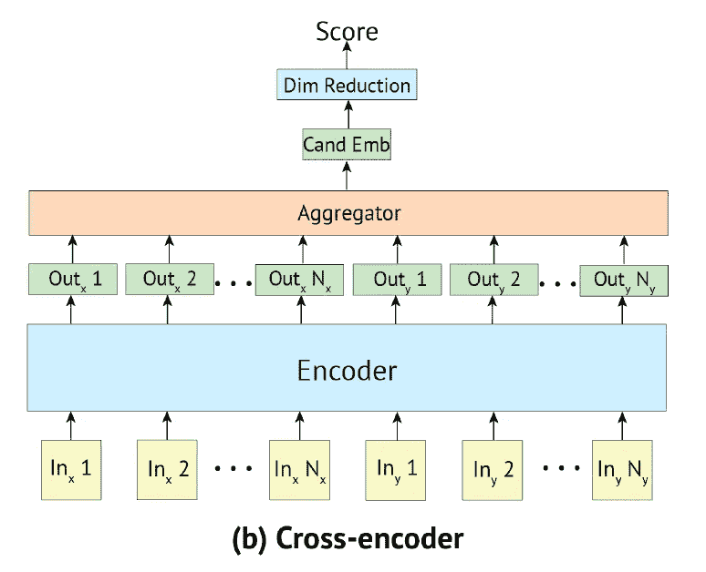

**参考文献[1]** 中的交叉编码器架构)

*   这里，输入和标签被连接起来，并且在输入和标签的整个序列之间执行完全的自我关注。也就是说，输入的每一个标记都将关注标签的每一个标记，反之亦然。这导致了输入和标签之间丰富的交互。
*   即使在这里，输入和标签都被一个特殊的标记包围。
*   同样，输入到编码器的嵌入是令牌嵌入+段嵌入+位置嵌入的组合。因为输入和标签是组合的，所以段嵌入对于输入令牌是“0 ”,对于标签令牌是“1”。
*   交叉编码器比双编码器提供更高的精度，因为输入和标签之间的完全双向关注。同时，它们在推理过程中非常慢——因为每个候选标签都应该与输入上下文连接，而不能像双编码器那样单独编码。因此，候选嵌入不能被预先计算和缓存。当候选标签的数量很大时(正如在大多数真实场景中一样)，交叉编码器不可伸缩。
*   在自我关注之后，转换器给出所有输入标记的编码器表示。通过采用对应于第一个标记(即特殊标记)的嵌入，我们将其简化为单个表示。然后通过线性投影将该嵌入向量转换成标量分数。这两个步骤如下所示:

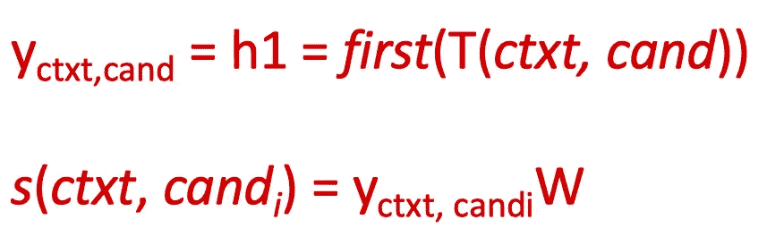

*   这里的训练目标也是最小化由逻辑给出的交叉熵损失函数:

*   其中' *cand1'* 是正确的候选，其他的是从训练集中取出的否定。这里的一个问题是，在双编码器中，我们可以使用批中的其他标签作为负训练样本-这里我们不能这样做。我们使用训练集中提供的外部否定。因为它计算量大，所以交叉编码器的内存批量也很小。

# 多元编码器:

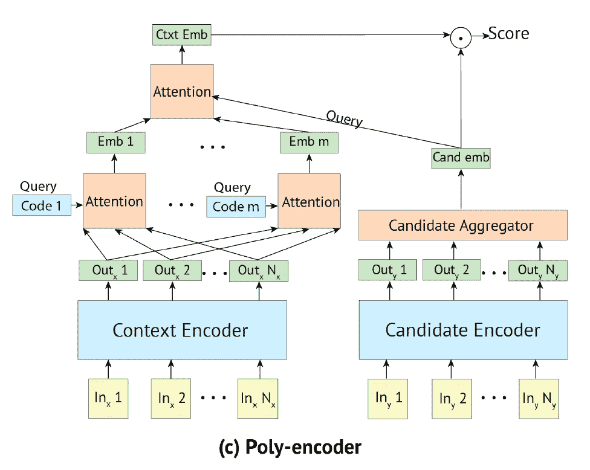

**参考文献[1]中的多编码器架构**

*   多编码器结合了双编码器和交叉编码器的优点。因此，在推理过程中，它比交叉编码器更快，比双编码器更准确。
*   候选标签被单独编码。
*   给定输入上下文，如:

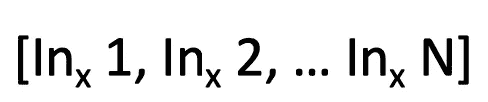

我们执行 3 种类型的注意，如下所述:

*   自我关注输入上下文的标记，我们得到:

*   第二，我们学习“m”码(或自我关注的说法中的查询)，其中 m < N (N being the length of the INPUT). The number of codes to be learnt, ‘m’, is a hyperparameter. Each code Ci attends over all the outputs of the previous Self-Attention. The ‘m’ codes are randomly initialized.
*   We first get the Attention weights (w’s) by performing a dot-product attention (or a multiplicative attention in general) between the ‘m’ codes — which serve as the “Queries”, and the previous Self-Attention outputs (Out’s)—which serve as the “Keys”. Then use these attention weights to get a weighted sum of the previous Self-Attention outputs(Out’s) — which serve as the “Values”.

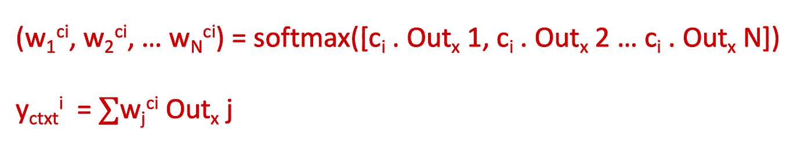

*   Think about why we are doing this kind of an Attention mechanism here. In a Bi-Encoder, the candidate label does not attend over the tokens of the input context. A Cross-Encoder on the other extreme, makes the candidate label attend over every token of the input context. Somehow in the Poly-Encoder we are trying to find a middle ground, by making the candidate label embedding attend over not the entire input context, but over a subset of features learnt from the input context.

*   The third kind of attention (alluded to in the previous paragraph) is between the ‘m’ global features of the Input Context and the embedding of the Candidate Label.

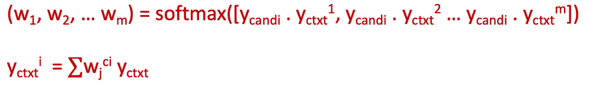

*   Now we compute the Similarity score between the Input Context embedding and the Candidate Label embedding as:

*   Once again, the training objective here too is to minimize the Cross-Entropy loss function given by the logits as before.

We saw three different Encoder architectures for the task of “Multi-Sentence Scoring” and saw how the Poly-Encoders were better. In the next part, we will see how the Poly-Encoders are used in the Blender and also about the different Model Architectures and training objectives. We will also touch upon the Evaluation methods used to compare the performance of Blender with that of the other Chatbots.

**注意:**上面所有的符号、公式和编码器框图都与参考文献中提到的原始论文中使用的相同。[1].

# 参考资料:

1.  多编码器变压器:【https://arxiv.org/abs/1905.01969 
2.  https://arxiv.org/abs/1810.04805
3.  变形金刚:[https://arxiv.org/abs/1706.03762](https://arxiv.org/abs/1706.03762)