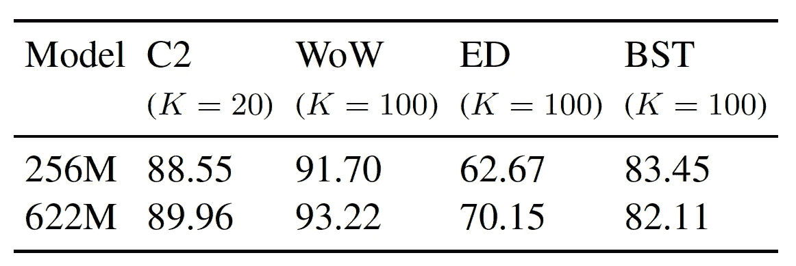
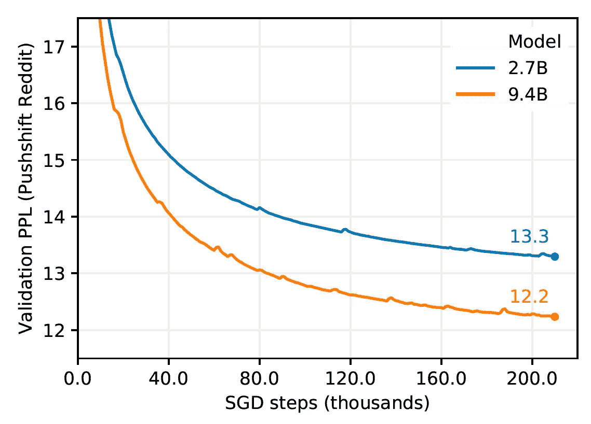
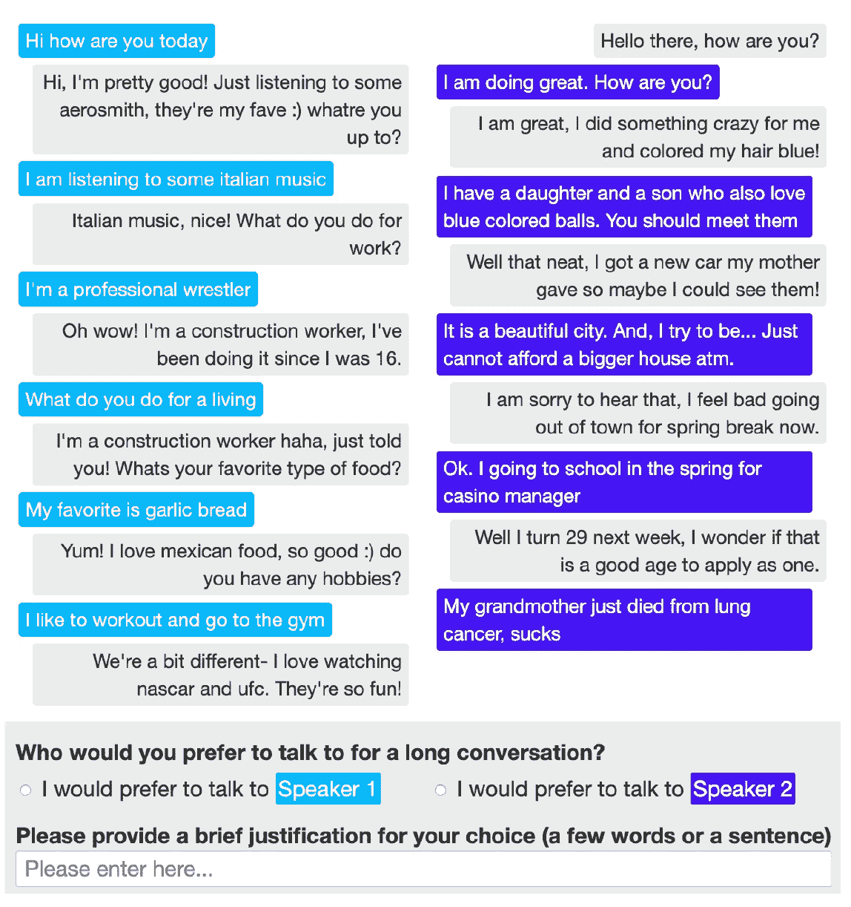
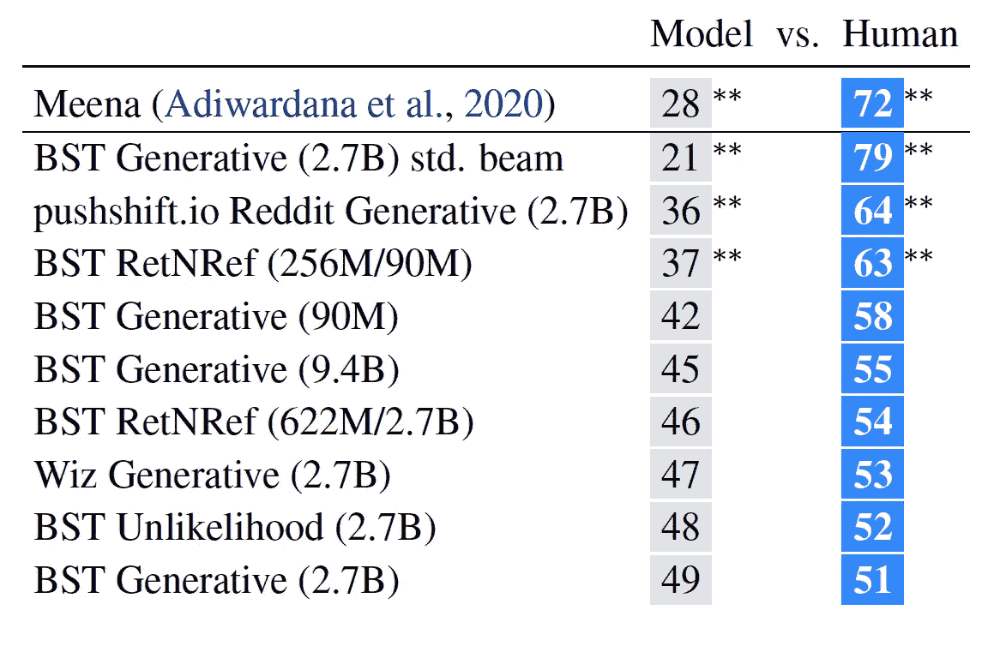

# Blender Bot —第 3 部分:多种架构

> 原文：<https://towardsdatascience.com/blender-bot-part-3-the-many-architectures-a6ebff0d75a6?source=collection_archive---------28----------------------->

Volodymyr Hryshchenko 在 Unsplash 上拍摄的照片

我们一直在研究脸书的开源对话产品 Blender Bot。

在[第一部分](/blender-bot-part-1-the-data-524beaedde65)中，我们详细回顾了预训练和微调中使用的数据集以及 Blender 的失败案例和局限性。

在[第二部分](/blender-bot-part-2-the-transformer-2e4d960b149f)中，我们研究了“多句子评分”这一更普遍的问题设置，用于此类任务的转换器架构，并特别了解了多元编码器——它将用于在 Blender 中提供编码器表示。

在第三部分，也是最后一部分，我们从聚合编码器的喘息中回到 Blender。我们将回顾不同的模型架构、它们各自的训练目标、评估方法以及 Blender 与 Meena 相比的性能。

# 模型架构:

本文(参考文献[2])讨论了模型的几种变体，这些变体在多个因素上有所不同(我们将在后面讨论更多涉及到的扰动)。但是在高层次上，讨论了 3 种不同的模型架构。

1.  取回的人
2.  发电机
3.  检索和提炼

# 1.寻回犬:

给定对话历史(上下文)作为输入，检索系统通过对大量候选响应进行评分来选择下一个对话话语，并输出得分最高的一个。这与我们在本系列的第 2 部分中使用多编码器的多句子评分任务中看到的设置完全相同。开发了两种型号:参数分别为 256 米和 622 米。此处的培训目标是有效地对候选人的回答进行排序。这是通过最小化交叉熵损失来实现的，其逻辑如下:

其中每个“s”是上下文嵌入和候选响应之一的嵌入之间的分数。该分数可以是上下文和候选标签编码器表示之间的标准点积相似性分数(当投影到公共向量空间上时)，或者更一般地是任何非线性函数。分数可以给定为:

使用多元编码器获得上下文和候选响应的编码器表示，多元编码器经历 3 种类型的注意机制:1)输入上下文的标记嵌入中的自我注意，2)通过在代码和先前自我注意的输出之间执行自我注意来学习“m”代码，3)候选嵌入和“m”全局学习特征之间的自我注意。(阅读第 2 部分以获得更深入的解释)。

# 2.发电机:

这里我们使用一个标准的 Seq2Seq Transformer(解码器)架构来生成响应，而不是从一组固定的候选项中检索它们。该模型的三个变体分别为:90M、2.7B 和 9.4B 参数。

## 最大似然估计:

这里的训练目标是最大似然估计，即最小化负对数似然。

似然性对整个序列概率分布进行建模。论文中给出的目标(参考文献。[2]):

参考文献中论文的截图。[2]

其中，可能性是在给定输入上下文“ **x** ”和直到时间步长“t”(y _<t)生成的记号的情况下，在时间步长“t”生成记号 y_t 的概率。金色的下一个话语' **y** '指的是在给定上下文的情况下，由人类提供的真实的下一个话语。

## 不太可能:

除了最大化在时间步“t”获得基本事实标记“y”的可能性之外，这里，我们还试图最小化在该时间步获得某些负候选标记的概率。这被称为非似然目标，它有助于减少重复出现的标记(或 n 元语法)。论文中给出的非可能性目标(参考文献。[2]):

**参考文献论文截图。【2】**

但是我们如何在每个时间步“t”得到否定候选集呢？或者，我们可以维护一个静态的否定候选列表(由模型生成的频繁 n 元文法),并在每个时间步使用相同的列表。或者更可接受的解决方案是，我们保持模型在每个时间步生成的 n 元语法分布。由此，每当 n-gram 计数大于从 gold 响应中观察到的相应 n-gram 计数(即，人类经常使用的 n-gram)，我们就将该 n-gram 添加到在该时间步维护的阴性候选集合中。

## 解码:波束搜索:

在推理时，给定输入上下文，模型必须从可用的假设中选择最佳的下一个响应。这叫做“解码”。输出(下一个响应)被生成为词汇表中所有标记的概率分布。我们可以尝试获得到该时刻联合概率最大化的部分句子，而不是在每个时间步取最高概率令牌(这不过是“贪婪搜索”)。

*   在“波束搜索”中，在每个时间步长“t”，在存储器中保存前 k 个部分形成的假设的列表——其联合概率是该时间步长的最大值。
*   然后在时间 t，将词汇表中的每个单词附加到前 k 个假设中的每一个。
*   计算新的联合概率。
*   也可以通过到时间 t 为止形成的序列的长度来标准化分数
*   基于联合概率得分对假设进行排序，然后从新的假设集中选择前 k 个。剩余的假设被丢弃。
*   为了强制执行停止条件，词汇表中还包含了<eos>(句尾)标记。因此，当达到足够数量的<eos>令牌时，可以停止该过程。</eos></eos>

然而，波束搜索试探法传统上导致生成比实际人类反应更短的反应，因此往往是枯燥和不那么吸引人的。因此，我们引入了一个**最小长度约束**——这样，直到我们有满足最小长度的部分假设，才会生成< EOS >令牌。这迫使模型生成长的响应。尽管更长的回答被认为更吸引人(在人工评估期间)，但它们也更容易出错。所以最小响应长度是一个权衡。

波束搜索中可以做的另一个改进是 **n-gram 波束阻塞**。如果波束中的假设包含多于 1 次的 n-gram = >出现，则丢弃该假设。这样做是为了避免子序列或 n 元序列的重复。

# 3.检索和提炼:

检索器模型从有限的一组候选响应中获取下一个响应，并且仅使用输入上下文作为其知识。生成器模型对候选响应没有限制，但是为了生成下一个响应，除了上下文之外，仍然没有使用额外的知识。在第三种选择中，外部知识被结合到模型中，在生成之前产生=> **检索**。

## 对话检索:

**检索&细化:对话检索系统**

对于给定的输入上下文，检索系统(Poly-Encoder)从一组固定的候选响应中获得最可能的下一个响应。在上面的动画中，这被标记为“检索到的下一个响应”。在“寻回犬”模型中，我们停在这一点上。但是在这里，响应通过一个分隔符附加到输入上下文，并且这个组合序列作为输入馈送到生成器(解码器块)。解码器为给定的输入序列产生一个响应。这样做的目的是提高生成器可能产生的响应的质量。请记住，候选标签是人类生成的响应。即使对于给定的输入上下文,“检索到的下一个响应”不需要与“最佳响应”相同，我们也可以假设一个好的检索者会选择一个与最佳响应非常接近的候选项。并且人类的响应通常被认为比解码器生成的响应更有吸引力。这里的目的是让解码器以某种方式知道什么时候简单地直接使用“检索到的下一个响应”,而不努力自己生成任何东西；以及何时忽略检索到的响应并仅基于上下文生成一个响应。并且如果解码器能够学习这种关联，它将能够生成更像人类的响应。

**训练目标:alpha-blending:**解码器的理想学习将是当它好的时候简单地使用检索到的响应，当它不好的时候忽略它。但实际上，解码器通常会选择忽略检索到的下一个响应，并自行生成。这归因于上一段提到的事实:在给定输入上下文的情况下，对检索到的响应和黄金(人类)响应之间的关系缺乏理解。为了减轻这一点，我们做了“alpha-blending”，其中检索到的下一个响应被替换为当时的黄金响应“alpha”。这只不过是“老师强迫”的更一般的想法。

## 知识检索:

**检索&提炼:知识检索系统**

在这个变体中，使用了外部知识库。建立了一个信息检索系统来存储和检索维基百科转储。关于红外系统的工作原理有一点小插曲:

*   对文档(在本例中是 Wikipedia 文章)进行解析，并构建一个形式为{term:出现该术语的所有文档的列表}的倒排索引。
*   倒排索引可以通过“查询”进行搜索，输出是包含任何查询术语的文档列表。
*   然后，我们通过查找查询和文档之间的相似性来对返回的文档进行排序，两者都表示在一个公共向量空间中，其坐标是查询/文档中的术语的 TF-IDF 分数。

回到我们的知识检索系统，输入的上下文被用作对 IR 系统的“查询”，以便检索最合适的候选知识(即与上下文相关的 Wiki 文章)。这些候选项和上下文被馈送到检索系统(Poly-Encoder ),以获得最佳候选项——这是最佳的外部知识，我们的对话下一个响应将基于此。然后，这个候选知识作为输入提供给生成器模型，该模型根据知识句子生成下一个响应。

# 评估方法:

## 自动评估:

**检索模型:**检索模型在我们在第 1 部分中谈到的众包干净数据集上进行微调，即 ConvAI2、ed、Wizard of Wikipedia 和 BST。报告的评估指标是对应数据集验证数据的 Hits@1/K(原则上类似于 Top@N 分类指标)。

**参考文献论文截图。【2】**

**生成器模型:**这里我们度量底层语言模型的困惑。**困惑**度量语言模型的不确定性。困惑度越低，模型在生成下一个标记(字符、子词或词)时就越有信心。从概念上讲，困惑表示模型在生成下一个令牌时试图选择的选项数量。从下图中，我们看到较大的模型以较少的步骤实现了更好的性能。

**参考文献中的论文截图。[2]**

## 人体评估:

这种评估提供了在不同版本的 Blender 之间进行比较以及在该领域的其他聊天机器人之间进行比较的杠杆作用——因为这些聊天日志在公共领域中可用于分析目的。许多不同版本的 Blender 是基于多种因素开发出来的，例如:

*   在发电机模型中使用波束搜索时的最小波束长度
*   n-gram 波束阻塞是否完成
*   较小模型与较大模型(就学习的参数数量而言)
*   是否给定了角色上下文(在微调期间)
*   使用可能性与可能性和不可能性的组合
*   等等。

对所有类型的变体进行了人体评估，详细结果在论文中给出(参考文献。[2])，在那里你可以查看它们。

**急性评估:**

在这种方法中，人类评估者被给予一对人类和聊天机器人之间的完整对话。这些对话是由准备进行比较的两个模型/系统产生的。评估者的工作是比较两个对话，并回答下面的问题，如参考文献中所给出的。[2]:

1.  参与度问题:“你更愿意和谁进行一次长谈？”
2.  人性问题:“哪个说话者听起来更像人？”

**自我聊天急性评估:**

这是与上面相同类型的评估，除了被评估的对话是在两个模型之间，而不是人和模型之间。

下面给出了为人工评估者呈现的示例对话对:

**参考文献论文截图。[2]**

# 比较:

最后，我将留给您 Blender(及其变体)和 Meena 的人类评估分数；以及搅拌机和人类——如参考文献 1 所述。[2].

## Blender 诉 Meena:

***表示统计学显著性，p < 0.05，**表示统计学显著性，p < 0.01。参考文献中的论文截图。[2]**

## 搅拌机诉人类:

****表示具有统计显著性。参考文献中的论文截图。[2]**

Blender 的论文很长，包含了大量的信息，很容易被细节所困扰。写这一系列文章的目的，基本上是为了能够大声思考——识别并使个别概念和片段更容易理解，同时保持大局以及必要时放大细节的能力。

# 参考资料:

1.  关于 Blender:[https://www . kdnugges . com/2020/05/Facebook-open-sources-Blender-maximum-open-domain-chatbot . html](https://www.kdnuggets.com/2020/05/facebook-open-sources-blender-largest-open-domain-chatbot.html)
2.  搅拌机机器人研究:【https://arxiv.org/abs/2004.13637 
3.  搅拌机机器人食谱:【https://parl.ai/projects/recipes/ 
4.  多编码器变压器:[https://arxiv.org/abs/1905.01969](https://arxiv.org/abs/1905.01969)
5.  关于 Meena:[https://ai . Google blog . com/2020/01/forward-conversatile-agent-than-can . html](https://ai.googleblog.com/2020/01/towards-conversational-agent-that-can.html)