# BLEU —双语评估替补演员

> 原文：<https://towardsdatascience.com/bleu-bilingual-evaluation-understudy-2b4eab9bcfd1?source=collection_archive---------1----------------------->

## 理解 BLEU 的逐步方法，理解机器翻译(MT)有效性的度量标准

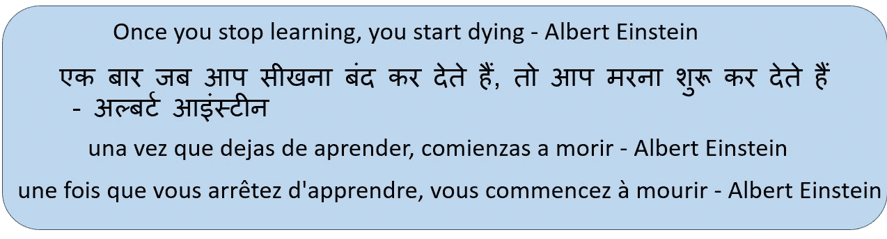

在这篇文章中你会学到什么？

*   如何衡量一种语言翻译成另一种语言的效果？
*   什么是 BLEU，我们如何计算机器翻译有效性的 BLEU 分数？
*   理解 BLEU 的公式，什么是修正精度，计数剪辑和简洁惩罚(BP)
*   使用示例逐步计算 BLEU
*   使用 python nltk 库计算 BLEU 分数

你正在看一部你不懂的语言的非常受欢迎的电影，所以你用你知道的语言阅读字幕。

我们如何知道译文足以传达正确的意思？

我们查看翻译的**充分性、流畅性和保真度**以了解其有效性。

充分性是一个衡量标准，用来判断源语言和目标语言之间是否表达了所有的意思

**保真度**是指**翻译**准确呈现源文本含义的程度

**流利度**衡量句子在语法上的良好构成以及解释的难易程度。

翻译一个句子的另一个挑战是使用不同的词和改变词序。下面是几个例子。

**不同的词语选择，但传达相同的意思**

我喜欢这场音乐会

我喜欢这个节目

我喜欢这部音乐剧

**传达相同信息的不同语序**

由于交通堵塞，我上班迟到了

交通堵塞是我迟到的原因

交通堵塞耽误了我去办公室

有了这些复杂性，我们如何衡量机器翻译的有效性呢？

我们将使用基肖尔·帕皮尼尼描述的主要思想

> 机器翻译越接近专业的人工翻译越好:[BLEU:Kishore papi neni 的机器翻译自动评测方法](https://www.aclweb.org/anthology/P02-1040.pdf)

我们将通过在参考人工翻译和机器生成的翻译之间寻找单词选择和词序的合理差异来衡量翻译的接近程度。

BLEU 上下文中的几个术语

***参考译文是人类译文***

***候选翻译是机器翻译***

为了衡量机器翻译的有效性，我们将**使用一种称为 BLEU-双语评估替角**的指标来评估机器翻译与人类参考翻译的接近程度。

让我们举一个例子，我们有以下参考译文。

1.  我一向如此。
2.  我总是这样。
3.  我永远都是。

我们有两个不同的机器翻译候选人

1.  我总是永远这样做。
2.  我总是这样

候选人 2***我总是做***与这三个参考译文分享最多的单词和短语。我们通过比较每个候选翻译和参考翻译之间的 n-gram 匹配来得出这个结论。

我们所说的 n-gram 是什么意思？

n 元语法是在给定窗口内出现的单词序列，其中 ***n*** 表示窗口大小。

就拿这句话，“ ***一旦停止学习，就开始死亡*** ”来理解 n-grams。

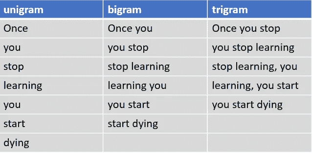

一旦你停止学习，你就开始死亡。

BLEU 将候选翻译的 n 元语法与参考翻译的 n 元语法进行比较，以计算匹配的数量。这些匹配与它们发生的位置无关。

候选翻译和参考翻译之间的匹配数量越多，机器翻译就越好。

让我们从一个熟悉的指标开始:**精度**。

就机器翻译而言，我们将精确度定义为“任何参考翻译中出现的候选翻译单词数”除以“候选翻译中的总单词数”

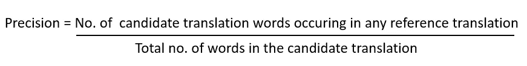

让我们举一个例子，计算候选翻译的精确度

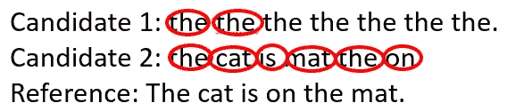

*   候选 1 的精度是 2/7 (28.5%)
*   候选项 2 的精度为 1(100%)。

这些是不合理的高精度，我们知道这些不是好的翻译。

为了解决这个问题，我们将使用**改进的 n-gram 精度**。对于每个 n 元语法，它是分多个步骤计算的。

我们举个例子，了解一下修改后的精度分值是怎么计算的。我们有三个人工参考翻译和一个机器翻译候选人

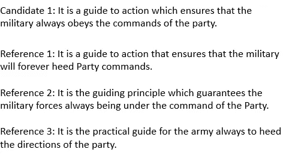

我们首先使用以下步骤计算任何 n 元语法的计数剪辑

*   步骤 1:统计候选 n 元语法在任何单个参考翻译中出现的最大次数；这被称为**计数。**
*   第二步:对于每个参考句子，计算候选 n 元语法出现的次数。因为我们有三个参考转换，所以我们计算 Ref 1 计数、Ref2 计数和 Ref 3 计数。
*   步骤 3:在任何引用计数中取 n 元文法出现的最大数量。也称为**最大引用计数**。
*   步骤 4:取最小的计数和最大的引用计数。也称为 **Count clip** ，因为它通过每个候选词的最大引用计数来削减其总计数

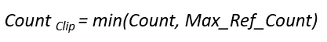

*   第五步:将所有这些剪辑计数相加。

下面是一元和二元模型的剪辑计数

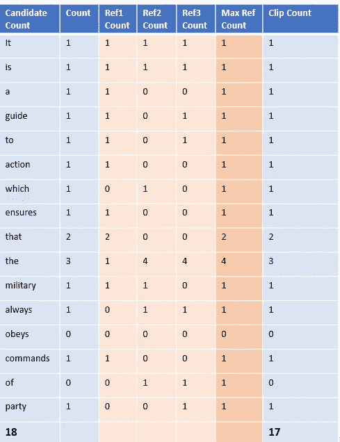

unigram 的剪辑计数

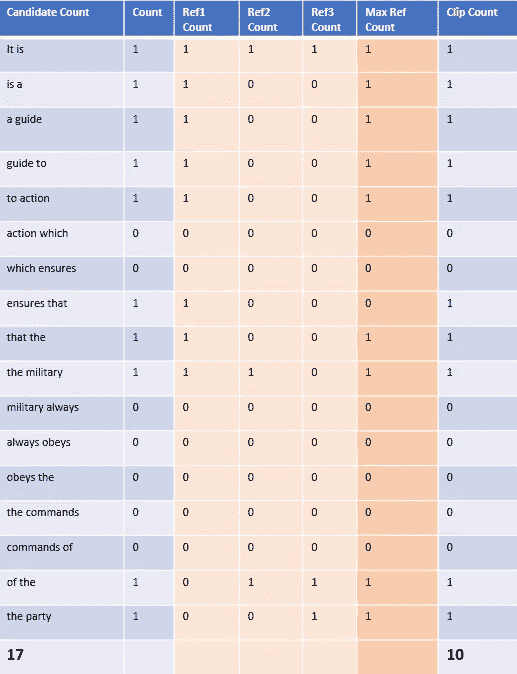

二元模型的剪辑计数

*   第 6 步:最后，将修剪后的计数除以候选 n 元文法的总数(未修剪的)以获得修改后的精度分数。

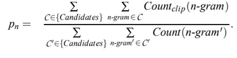

Pₙ正在修改精确分数

*   单字的修正精确度分数是 17/18
*   双字母组合的修正精度分数为 10/17

汇总修改后的精度分数

> 语料库中所有候选句子的剪切 n 元语法计数的修正精度 Pₙ:总和除以候选 n 元语法的数量

***这个修改后的精度分数有什么帮助？***

修正的 n-gram precision score 抓住了翻译的两个方面:充分性和流畅性。

*   使用与参考文献中相同的词的翻译倾向于满足充分性。
*   **候选翻译和参考翻译之间更长的 n-gram 匹配说明了流畅性**

***翻译太短或太长会怎样？***

我们增加了简洁惩罚来处理太短的翻译。

**当候选翻译长度与任何参考翻译长度相同时，简洁罚分(BP)** 将为 1.0。最接近的参考句子长度是**“最佳匹配长度”**

**通过简短惩罚，我们看到高分候选翻译将在长度、单词选择和词序方面匹配参考翻译。**

BP 是指数衰减，计算如下

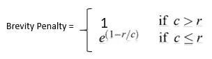

参考译文中的字数

候选翻译中的字数统计

**注**:简洁罚函数和修正的 n-gram 精度长度都没有直接考虑源长度；相反，他们只考虑目标语言的参考翻译长度的范围

最后，我们计算 BLEU

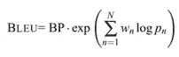

BP-简洁惩罚

n:n 个字母的数字，我们通常用一个字母，两个字母，三个字母，四个字母

wₙ:权重为每个修正精度，默认情况下 n 为 4，wₙ为 1/4=0.25

Pₙ:修正精度

BLEU 度量的范围从 0 到 1。当机器翻译与参考翻译之一相同时，它将获得 1 分。正因如此，即使是人类翻译也不一定会得 1 分。

我希望你现在对 BLEU 有了很好的了解。

BLEU 度量用于

*   机器翻译
*   图像字幕
*   文本摘要
*   语音识别

***如何用 python 计算 BLEU？***

nltk 库提供了计算 BLRU 分数的实现

导入所需的库

```
import  nltk.translate.bleu_score as bleu
```

设置两个不同的候选翻译，我们将与两个参考翻译进行比较

```
reference_translation=['The cat is on the mat.'.split(),
                       'There is a cat on the mat.'.split()
                      ]
candidate_translation_1='the the the mat on the the.'.split()
candidate_translation_2='The cat is on the mat.'.split()
```

计算候选翻译 1 的 BLEU 分数

```
print("BLEU Score: ",bleu.sentence_bleu(reference_translation, candidate_translation_1))
```


计算候选翻译 2 的 BLEU 分数，其中候选翻译与参考翻译之一匹配

```
print("BLEU Score: ",bleu.sentence_bleu(reference_translation, candidate_translation_2))
```

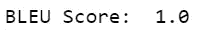

我们也可以使用 nltk 库在 python 中创建自己的方法，用于计算 github 中可用的 BLEU

## 结论:

BLEU 衡量机器翻译与人类参考翻译的接近程度，考虑翻译长度、单词选择和词序。它用于机器翻译、抽象文本摘要、图像字幕和语音识别

## 参考资料:

[BLEU:一种自动评估机器翻译的方法 Kishore Papineni，Salim Roukos，Todd Ward，和 Wei-朱婧](https://www.aclweb.org/anthology/P02-1040.pdf)

【https://www.statmt.org/book/slides/08-evaluation.pdf 

[http://www.nltk.org/_modules/nltk/translate/bleu_score.html](http://www.nltk.org/_modules/nltk/translate/bleu_score.html)