# 数据挖掘时控制错误发现

> 原文：<https://towardsdatascience.com/blind-data-mining-is-bad-a609982a767f?source=collection_archive---------44----------------------->

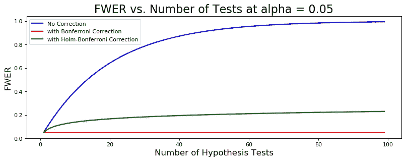

至少 1 个假阳性的概率与有和无校正的假设检验的数量

## 多重比较问题背后的数学原理以及如何应对

2005 年，约翰·约安尼迪斯博士发表了一篇令人震惊的论文，题为[为什么大多数发表的研究结果是假的](https://www.ncbi.nlm.nih.gov/pmc/articles/PMC1182327/)，引发了对[复制危机](https://en.wikipedia.org/wiki/Replication_crisis)的认识。复制危机有多种原因，但与本文相关的是[多重比较问题](https://en.wikipedia.org/wiki/Multiple_comparisons_problem)。数据分析师和科学家经常会遇到开放式的问题，这些问题需要进行数据探索，如“我们的客户在盈利能力方面的顶层和底层有什么不同？”本文解释了为什么分析师在探索数据集时不应该天真地测试多个假设。

# 多重比较问题背后的数学

多重比较问题可以用一句话来概括；如果你测试了足够多的假设，你会发现一些有统计学意义的结果，即使由于随机性，在潜在人群中没有真正的关系或差异。

> “如果你折磨数据的时间足够长，它就会招供。”罗纳德·科斯

要理解为什么会这样，我们先用数学来定义这个问题。在测试多个独立假设时，我们担心在不应该的时候拒绝至少一个无效假设的可能性。这被称为家庭式错误率(FWER)。

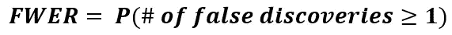

这可能很难用大量的假设检验来解决，因此使用补充规则来重写等式会更容易，补充规则认为事件不发生的概率等于 1 减去事件发生的概率。这给出了:

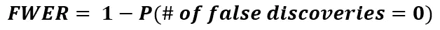

那么我们如何计算 ***P(错误发现数= 0)*** 的概率呢？在单一假设检验中做出错误发现的概率是:

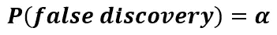

对于单个测试

使用补充规则，在单次测试中不出现错误发现的概率为:

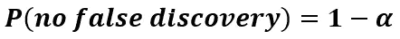

对于单个测试

因为我们指定了我们的假设检验是相互独立的，所以我们可以用检验的数量乘以上面的数量。

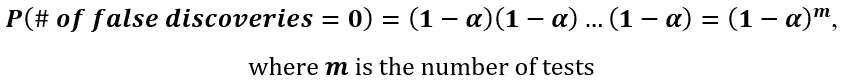

现在我们有了一个 FWER 的公式:

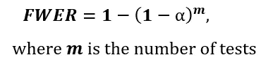

让我们看看 FWER 是如何随着使用 Python 执行的测试数量的增加而增长的。

```
import numpy as np
import matplotlib.pyplot as pltalpha = 0.05
num_tests = np.arange(1, 100, 1, int)
fwer = 1 - (1 - alpha)**num_testsplt.plot(num_tests, fwer, linewidth=2)
plt.title(f'FWER vs. Number of Tests at alpha = {alpha}')
plt.xlabel('Number of Hypothesis Tests')
plt.ylabel('FWER')
plt.show()
```

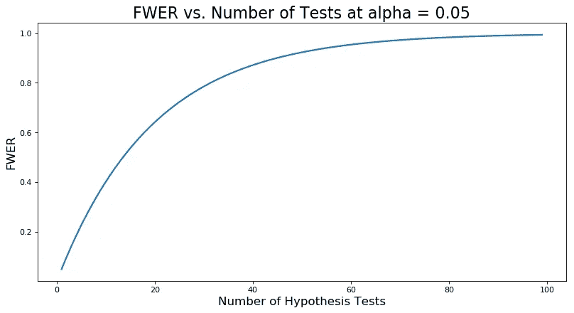

如您所见，找到至少一个错误发现的概率增长很快。在 13 次假设测试中，至少有 1 次错误发现的概率为 50–50 %,在 27 次测试中有 75%的概率，在 90 次测试中有 99%的概率。

# 模拟演示

如果你不相信，这里有一个模拟演示。我写了一个函数，对从[标准正态分布](https://en.wikipedia.org/wiki/Normal_distribution)中随机抽取的样本重复执行均值差异测试。我们知道每个样本都来自具有相同均值的相同分布，因此低于临界值的 p 值是假阳性。因此，我们可以对至少有一个假阳性的模拟进行计数，然后除以模拟的数量，得到一个近似的 FWER。这个结果可以与上面的精确公式进行比较。

正如您在下面看到的，模拟的 FWER 接近每种情况下的确切 FWER。

```
from scipy.stats import norm
from scipy.stats import ttest_inddef exact_fwer(alpha, num_tests):
    return 1 - (1 - alpha)**num_testsdef simulated_fwer(alpha, num_tests, num_sims):
    count = 0
    for i in range(num_sims):
        false_disc = 0
        for j in range(0, num_tests):
            x = norm(loc=0, scale=1).rvs(size=100)
            y = norm(loc=0, scale=1).rvs(size=100)
            pvalue = ttest_ind(x, y)[1]
            if pvalue < alpha:
                false_disc += 1
                break
        if false_disc != 0:
            count += 1             
    return count / num_simsdef compare_exact_sim_fwer(alpha, num_tests, num_sims):
    exact = exact_fwer(alpha, num_tests)
    sim = simulated_fwer(alpha, num_tests, num_sims)
    return f'At alpha = {alpha} and {num_tests} Hypothesis Tests: \
             Exact FWER = {exact}, Simulated FWER ={sim}'print(compare_exact_sim_fwer(0.05, 13, 1000))
print(compare_exact_sim_fwer(0.05, 27, 1000))
print(compare_exact_sim_fwer(0.05, 90, 1000))
```

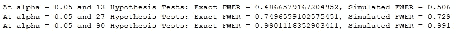

既然我们知道有问题，我们如何纠正它？

# 如何纠正多重比较偏差

有许多方法可以缓解多重比较问题，但有两种方法特别受欢迎:T2 的邦费罗尼校正法和 T4 的霍尔姆-邦费罗尼法。

## 邦费罗尼校正

要进行 Bonferroni 校正，只需将您的统计显著性临界值除以进行的测试次数。

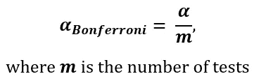

Bonferroni 校正 FWER 与下面的未调整 FWER 一起绘制。

```
alpha = 0.05
num_tests = np.arange(1, 100, 1, int)
fwer = 1 - (1 - alpha)**num_tests
fwer_bonferroni = 1 - (1 - alpha / num_tests)**num_testsplt.plot(num_tests, fwer, linewidth=2, color='b', label='No Correction')
plt.plot(num_tests, fwer_bonferroni, linewidth=2, color='r', label='with Bonferroni Correction')
plt.legend()
plt.title(f'FWER vs. Number of Tests at alpha = {alpha}'0)
plt.xlabel('Number of Hypothesis Tests')
plt.ylabel('FWER')
plt.show();
```

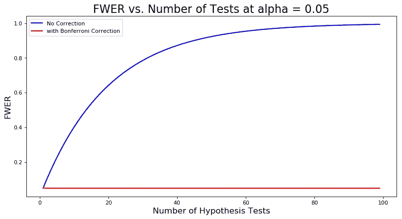

这种校正的一个好处是易于实现。一个缺点是，一旦测试数量变大，或者如果测试统计数据是相关的，它可能会过于保守。通过保持低的假阳性率，我们增加了假阴性的概率。如果我们非常关心这种权衡，我们可以考虑 Holm-Bonferroni 方法。

## 霍尔姆-邦费罗尼方法

Holm-Bonferroni 方法比 Bonferroni 校正方法保守一些，但需要做更多的工作。

首先，从最小到最大排列假设检验的 p 值，然后应用此公式按最小 p 值的顺序获得每个假设检验的 alpha 值:

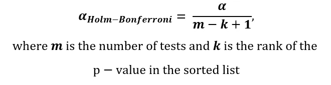

您浏览排序后的列表，将 p 值与其相关的 Holm-Bonferroni 校正α值进行比较。在第一次拒绝零假设失败时，你忽略了当时和之后的所有测试结果。

下图比较了 Holm-Bonferroni 调整和 Bonferroni 校正。如您所见，它不如 Bonferroni 校正保守，但与什么都不做相比，它确实大幅降低了 FWER。

```
def holm_bonf_fwer(alpha, num_tests):
    ranks = [i + 1 for i in range(num_tests)]
    adj_alphas = [alpha / (num_tests - rank + 1) for rank in ranks]

    p_no_false_disc = 1
    for adj_alpha in adj_alphas: 
        p_no_false_disc = p_no_false_disc * (1 - adj_alpha) 

    return 1 - p_no_false_discalpha = 0.05
num_tests = np.arange(1, 100, 1, int)
fwer = 1 - (1 - alpha)**num_tests
fwer_bonferroni = 1 - (1 - alpha / num_tests)**num_tests
fwer_holm_bonferroni = [holm_bonf_fwer(alpha, i) for i in num_tests]plt.plot(num_tests, fwer, linewidth=2, color='b', label='No Correction')
plt.plot(num_tests, fwer_bonferroni, linewidth=2, color='r', label='with Bonferroni Correction')
plt.plot(num_tests, fwer_holm_bonferroni, linewidth=2, color='g', label='with Holm-Bonferroni Correction')
plt.legend()
plt.title(f'FWER vs. Number of Tests at alpha = {alpha}')
plt.xlabel('Number of Hypothesis Tests')
plt.ylabel('FWER')
plt.show();
```

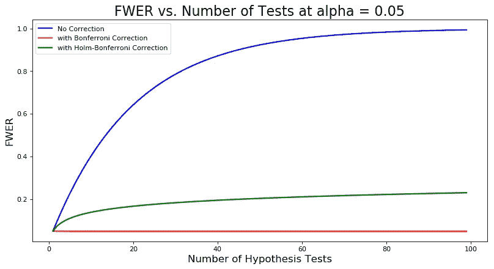

# 结论

如果您在阅读本文之前没有意识到多重比较问题，那么您现在应该知道为什么不能盲目地对一个数据集进行假设检验，看看哪些检验有意义。您还有两个工具来缓解这个问题。下次你在探索一个数据集时，别忘了使用它们。

注意:如果你对代码的理解受益于评论，请留言，我会添加它们。