# 使用眼睛视网膜图像上的深度学习进行失明检测(糖尿病视网膜病变)

> 原文：<https://towardsdatascience.com/blindness-detection-diabetic-retinopathy-using-deep-learning-on-eye-retina-images-baf20fcf409e?source=collection_archive---------4----------------------->

## 使用卷积神经网络(使用 Python)自动化该过程，以在为时已晚之前加速患者的失明检测

# 目录

1.  使用深度学习来检测失明
2.  评估指标(二次加权 kappa)
3.  图像处理和分析
4.  使用多任务学习实现 arXiv.org 研究论文(前 1%解决方案)
5.  其他迁移学习模式
6.  未来的工作
7.  链接到 github 代码和 linkedin 个人资料
8.  使用的参考文献

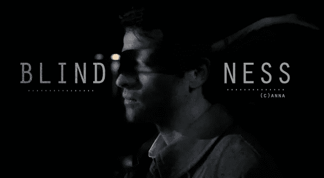

图片来源—[http://images 2 . fan pop . com/image/photos/10300000/Cas-Blindness-casti El-10370846-640-352 . jpg](http://images2.fanpop.com/image/photos/10300000/Cas-Blindness-castiel-10370846-640-352.jpg)

# 1.使用深度学习来检测失明

本案例研究基于 **APTOS 2019 失明检测**基于此处的 kaggle 挑战赛——[https://www . ka ggle . com/c/APTOS 2019-失明检测/概述](https://www.kaggle.com/c/aptos2019-blindness-detection/overview)。

数百万人患有 [**糖尿病视网膜病变**](https://www.mayoclinic.org/diseases-conditions/diabetic-retinopathy/symptoms-causes/syc-20371611) ，这是工作年龄成人失明的主要原因。**印度 Aravind 眼科医院**希望在难以进行医学筛查的农村地区发现并预防这种疾病。目前，技术人员前往这些农村地区采集图像，然后依靠训练有素的医生来检查图像并提供诊断。

这里的目标是通过技术扩大他们的努力；以获得自动筛查疾病图像并提供病情严重程度的信息的能力。我们将通过建立一个 [**卷积神经网络**](https://en.wikipedia.org/wiki/Convolutional_neural_network) 模型来实现这一点，该模型可以自动查看患者的眼睛图像，并估计患者失明的严重程度。这种自动化过程可以减少大量时间，从而大规模筛选治疗糖尿病性视网膜病变的过程。

我们得到了 **3200 张**眼睛图像及其对应的严重程度等级，严重程度等级为**【0，1，2，3，4】**之一。该数据将用于训练模型，并对测试数据进行预测。

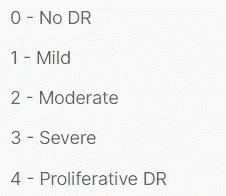

失明严重程度量表(5 级)

数据集中的样本眼睛图像如下—

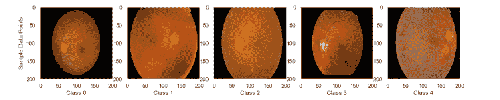

对应于每个失明等级严重性(0-4)的眼睛图像

# 2.评估指标(二次加权 kappa)

**二次加权 kappa** 衡量两个评级之间的**一致性。该指标通常从 0(评分者之间的随机一致)到 1(评分者之间的完全一致)不等。如果评定者之间的一致程度偶然低于预期，该指标可能会低于 0。在由**人类评价人**分配的分数和**预测分数**之间计算二次加权 kappa。**

## 科恩卡帕的直觉

要理解这个指标，我们需要理解**科恩的 kappa (** 维基百科— [链接](https://en.wikipedia.org/wiki/Cohen%27s_kappa#Weighted_kappa))的概念。该指标说明了除了我们从**混淆矩阵**中观察到的一致性之外，偶然出现的一致性。我们可以用一个简单的例子来理解这一点—

假设我们想从下面的协议表中计算科恩的 kappa，这基本上是一个混淆矩阵。从下表中我们可以看出，在总共 50 项观察中，“A”和“B”评定者同意(20 项是+ 15 项否)= 35 项观察。所以，观察到的一致是**P(o)**= 35/50 =**0.7**

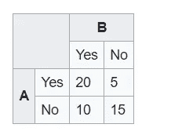

来源——维基百科

我们还需要找到多大比例的评级是由于随机的机会，而不是由于' A '和' B '之间的实际协议。我们可以看到，' A '说是 25/50 = 0.5 次，' B '说是 30/50 = 0.6 次。所以两个人随机同时说‘是’的概率是 0.5*0.6 = **0.3** 。同样，他们两个随机同时说‘不’的概率是 0.5*0.4 = **0.2** 。这样，随机一致的概率就是 0.3 + 0.2 = **0.5** 。让我们称之为 P(e)。

所以，Cohens kappa 会是 **0.4** (公式如下)。

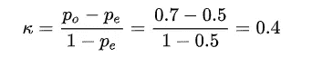

来源——维基百科，科恩斯卡帕公式

我们得到的值是 **0.4，**我们可以用下表来解释。你可以在本博客中阅读更多关于这一指标的解读——[**https://towardsdatascience . com/inter-rater-agreement-kappas-69 CD 8 b 91 ff 75**](/inter-rater-agreement-kappas-69cd8b91ff75)。

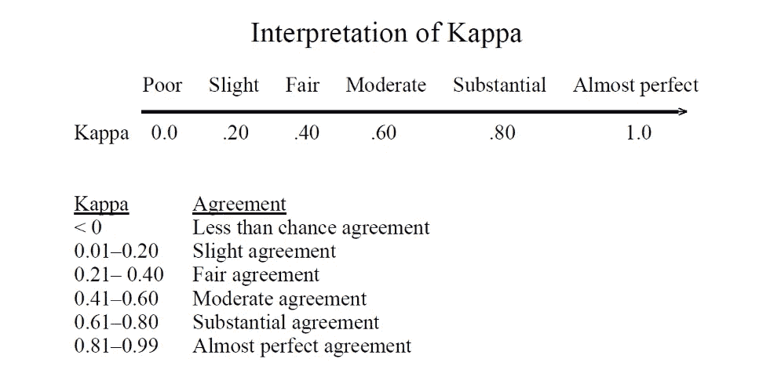

来源—[https://towards data science . com/inter-rater-agreement-kappas-69 CD 8 b 91 ff 75](/inter-rater-agreement-kappas-69cd8b91ff75)

值 **0.4** 将意味着我们有一个公平/适度的协议。

## 序数类中二次权的直觉——二次加权 kappa

当涉及到多类时，我们可以扩展相同的概念，并在这里引入**权重**的概念。引入权重背后的直觉是，它们是**序数变量，**，这意味着类别‘1’和‘2’之间的一致优于类别‘1’和‘3’，因为它们在序数尺度上更接近。在我们的失明严重度案例中，输出是**序数**(失明严重度，0 代表无失明，4 代表最高)。为此，引入了二次标度的权重。序数类越接近，它们的权重越高。下面是很好解释这个概念的博文链接—[**https://medium . com/x8-the-ai-community/kappa-coefficient-for-dummies-84d 98 b 6 f 13 ee**](https://medium.com/x8-the-ai-community/kappa-coefficient-for-dummies-84d98b6f13ee)。

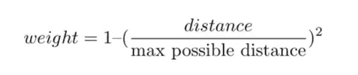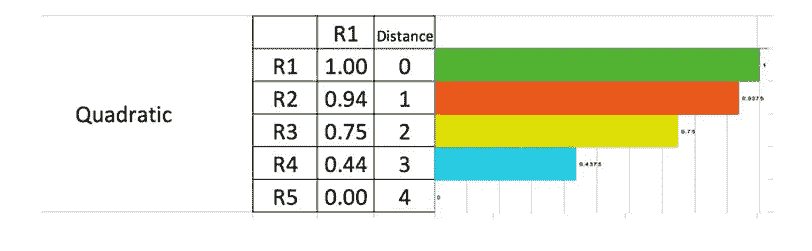

来源—[https://medium . com/x8-the-ai-community/kappa-coefficient-for-dummies-84d 98 b 6 f 13 ee](https://medium.com/x8-the-ai-community/kappa-coefficient-for-dummies-84d98b6f13ee)

正如我们所见，R1 和 R4 的权重为 0.44(因为它们比 R1 和 R2 的权重 0.94 大 3 个等级，因为它们更接近)。在计算观察概率和随机概率时，这些权重乘以相应的概率。

# 3.图像处理和分析

## 输出变量的类别分布

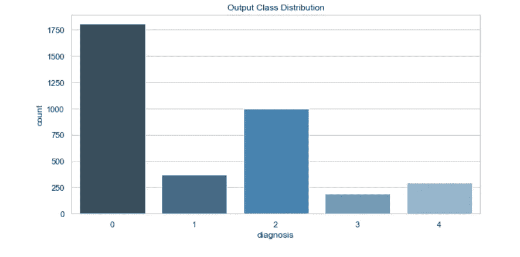

阶级不平衡——分布

正如我们所看到的，在训练数据集中存在类别不平衡，大多数情况下值为“0 ”,在“1”和“3”类别中最少。

## 视觉化眼睛图像

用于生成可视化效果的代码段

这些基本上是使用 [**眼底照相**](https://en.wikipedia.org/wiki/Fundus_photography) 拍摄的眼睛视网膜图像。正如我们所见，图像包含伪像，其中一些是失焦，曝光不足，或曝光过度等。此外，一些图像具有低亮度和低闪电条件，因此难以评估图像之间的差异。

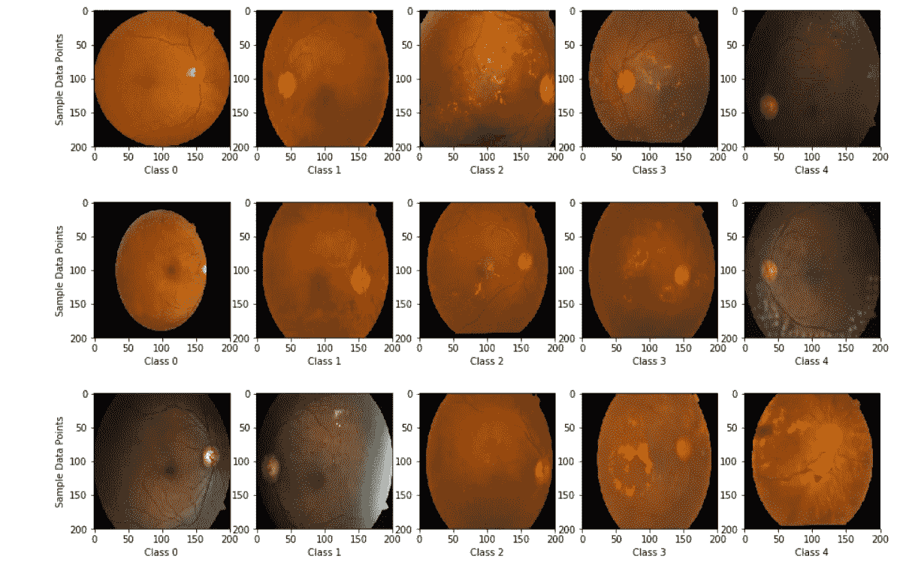

样本 15 幅眼睛图像

下图是一只眼睛的视网膜图像样本，该眼睛可能患有**糖尿病视网膜病变**。源链接— kaggle [内核链接 T21**。**](https://www.kaggle.com/ratthachat/aptos-eye-preprocessing-in-diabetic-retinopathy)**[原文出处—**https://www.eyeops.com/**](https://www.eyeops.com/)**

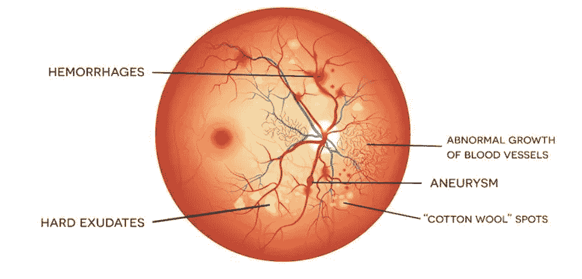

img 来源—[https://www . ka ggle . com/ratthachat/aptos-眼部预处理-糖尿病视网膜病变](https://www.kaggle.com/ratthachat/aptos-eye-preprocessing-in-diabetic-retinopathy)，【https://www.eyeops.com/】T2

如我们所见，我们正试图找出那些出血/渗出物等。在有博士学位的高年级学生中。

## 图像处理

为了对图像进行调整，制作更清晰的图像，使模型能够更有效地学习特征，我们将使用 python 中的 **OpenCV** 库( **cv2** )进行一些图像处理技术。

我们可以应用 [**高斯模糊**](https://www.tutorialspoint.com/opencv/opencv_gaussian_blur.htm) 来突出图像中的特征。在高斯模糊操作中，图像与高斯滤波器卷积，高斯滤波器是去除高频分量的低通滤波器。

代码片段—高斯模糊

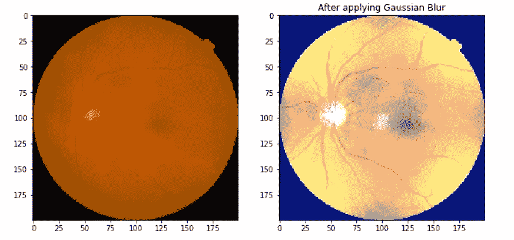

高斯模糊之前/之后

这个写得很棒的内核( [**链接**](https://www.kaggle.com/ratthachat/aptos-eye-preprocessing-in-diabetic-retinopathy) )介绍了从灰度图像中进行**圆形裁剪的思想。**在下面的代码部分实现相同的功能:-

代码片段—圆形裁剪

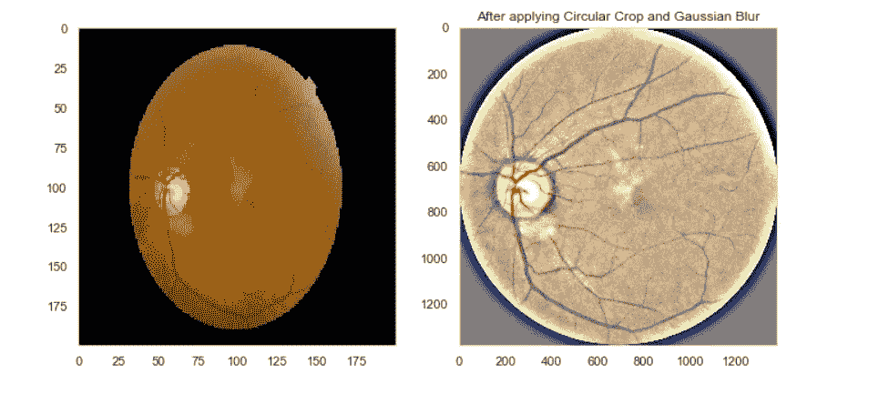

之前/之后(模糊+裁剪)

正如我们所看到的，我们现在能够更清楚地看到图像中的独特模式。以下是对 15 个图像样本进行的图像处理。

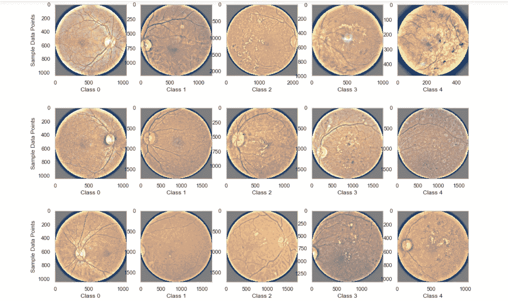

图像处理后

## 多重处理和调整图像大小，以保存在目录中

应用上述操作后，我们需要将新图像保存在文件夹中，以便以后使用。原始图像每个大约 3 MB，整个图像文件夹占用 20 GB 空间。我们可以通过调整图像大小来减少这种情况。使用多核线程/多处理，我们可以在一分钟内完成这项任务。我们可以使用具有 6 个内核的**线程池**(因为我有 8 个内核的 CPU)来实现这一点，并使用(512x512)的图像大小来实现这一点( **IMG 大小**)。

代码片段—使用线程池的多重处理

## TSNE 可视化

为了理解这些图像在各自的类别(失明严重程度)中是否是可分离的，我们可以首先使用 TSNE 在二维空间中对其进行可视化。我们可以首先将 RGB 等级的图像转换为灰度等级的图像，然后将这些图像展平以生成一个矢量表示，该矢量表示可以用作该图像的特征表示。

**RGB(256 x256 x3)——>灰度(256 x256)——>展平(65536)**

代码片段— TSNE

困惑是需要调整以获得良好结果的超参数。迭代之后，我们可以使用 TSNE 图来表示困惑= 40。

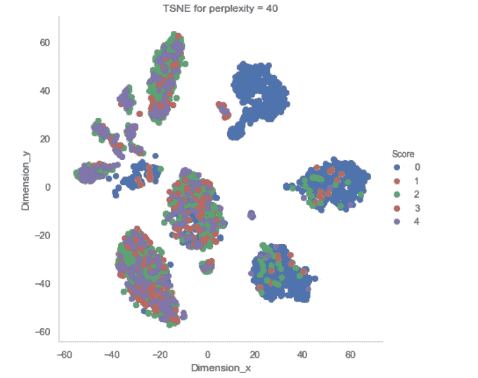

TSNE 情节，困惑= 40

从上面的图中我们可以看出，类“0”与其他类有些分离，而其他类之间的区别仍然很模糊。

## 图像增强

这是最常用的程序之一，通过从数据集创建额外的图像来生成数据的鲁棒性，以使其通过旋转翻转、裁剪、填充等对新数据进行良好的概括。使用 keras **ImageDataGenerator** 类

上述代码生成了应用增强后获得的样本图像—

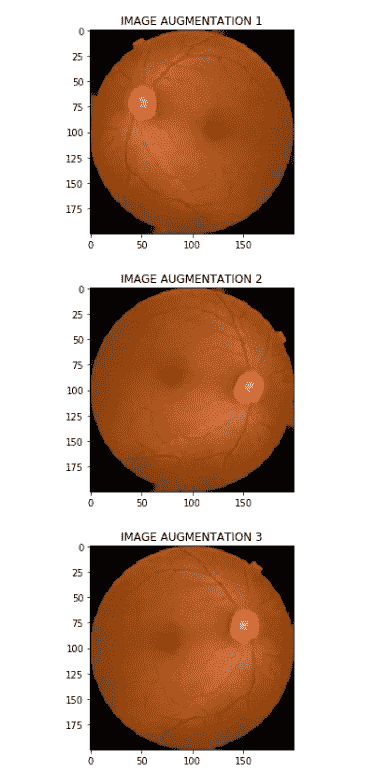

图像放大(示例)

# 4.使用多任务学习实现 arXiv.org 研究论文(前 1%解决方案)

在 arXiv.org 上发现的一篇研究论文——[**研究论文链接**](https://arxiv.org/pdf/2003.02261.pdf) 在 2943 个中获得第 54 位(前 1%)涉及多任务学习的详细方法来解决这个问题陈述。下面是使用 Python 复制研究论文代码的尝试。在 github 上没有找到这篇研究论文的代码参考。我已经在一篇**研究论文(summary doc)中总结了研究论文。pdf** 文件— [**github 链接**](https://github.com/debayanmitra1993-data/Blindness-Detection-Diabetic-Retinopathy-) 。总结以下研究论文中的指针和代码实现—

## 使用的数据集

实际的研究论文使用了来自其他来源的多个数据集，比如—

1.  来自糖尿病视网膜病变的 35，216 张图像，2015 年挑战—[https://www . ka ggle . com/c/Diabetic-Retinopathy-detection/overview/timeline](https://www.kaggle.com/c/diabetic-retinopathy-detection/overview/timeline)
2.  印度糖尿病视网膜病变图像数据集(IDRiD) (Sahasrabuddhe 和 Meriaudeau，2018 年)=使用 413 张图像
3.  梅西多数据集(Google Brain，2018)数据集
4.  完整的数据集由 18590 张眼底照片组成，由 Kaggle 竞赛的组织者分为 3662 张训练，1928 张验证和 13000 张测试图像

然而，由于不容易获得所有数据集，我们只能使用现有的 APTOS 2019 数据集来完成这项任务。

## 图像预处理和增强

多种图像预处理技术，如图像大小调整、裁剪，被用来从眼睛图像中提取出与众不同的特征(如以上章节中所讨论的)。

使用的图像增强包括:光学失真、网格失真、分段仿射变换、水平翻转、垂直翻转、随机旋转、随机移动、随机缩放、RGB 值移动、随机亮度和对比度、加性高斯噪声、模糊、锐化、浮雕、随机伽玛和剪切等。

然而，我们可以使用类似于上面的替代图像增强(使用参考— [**链接**](https://github.com/dimitreOliveira/APTOS2019BlindnessDetection/tree/master/Model%20backlog) )。

## 使用的模型架构

正如我们在下面看到的，研究论文使用了多任务学习模型(它并行进行回归、分类、有序回归的训练)。这样，它可以使用单个模型，并且由于第一层无论如何都会学习相似的特征，所以实现该架构以减少训练时间(而不是训练 3 个单独的模型)。对于编码器部分，我们可以使用任何现有的 CNN 架构— **ResNet50，EfficientNetB4，EfficientNetB5 (** 和 ensemble 这些)。

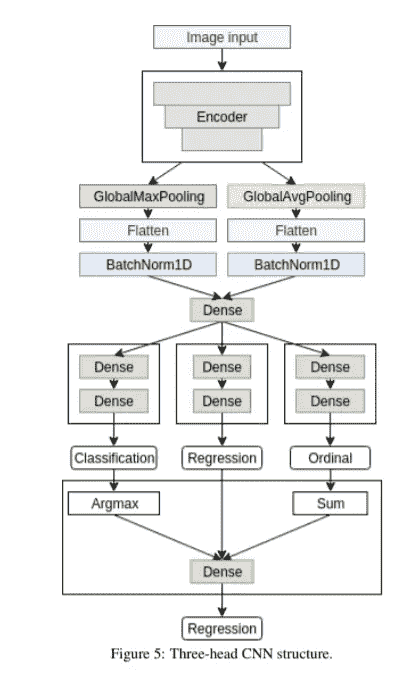

来源—[https://arxiv.org/pdf/2003.02261.pdf](https://arxiv.org/pdf/2003.02261.pdf)

上述架构的代码实现如下(用 keras 表示)—

## 创建多输出-自定义图像数据生成器

我们需要创建一个自定义的 ImageDataGenerator 函数，因为我们有 3 个输出(引用— [**链接**](https://classifai.net/blog/multiple-outputs-keras/) )。请注意，此函数**产生** 3 个输出(回归、分类、有序回归)代码如下—

请注意，对于每个类(0，1，2，3，4)，顺序回归编码按如下方式进行。sklearn 中的**multilabel binary izer**实现了这个任务，如上面的代码要点所示。

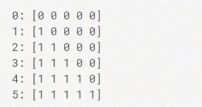

来源—[https://www . ka ggle . com/c/aptos 2019-失明-检测/讨论/98239](https://www.kaggle.com/c/aptos2019-blindness-detection/discussion/98239)

## 第一阶段(预培训)

这包括使所有层可训练，并使用现有的 Imagenet 权重作为 ResNet50 编码器的权重初始化器。模型仅被训练到 3 个输出头。使用以下损失函数编译模型(使用 SGD 优化器、余弦衰减调度程序的 20 个时期)—

```
model.compile(
optimizer = optimizers.SGD(lr=LEARNING_RATE),loss={'regression_output': 'mean_absolute_error',
'classification_output':'categorical_crossentropy',
'ordinal_regression_output' : 'binary_crossentropy'},metrics = ['accuracy'])
```

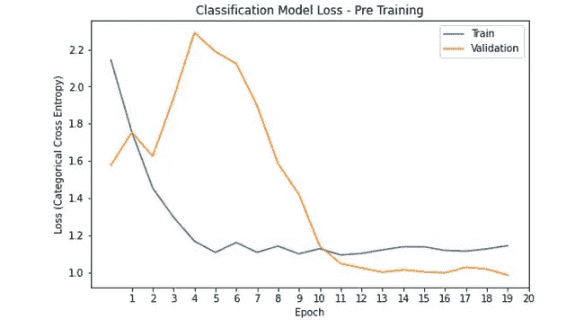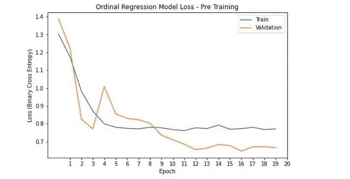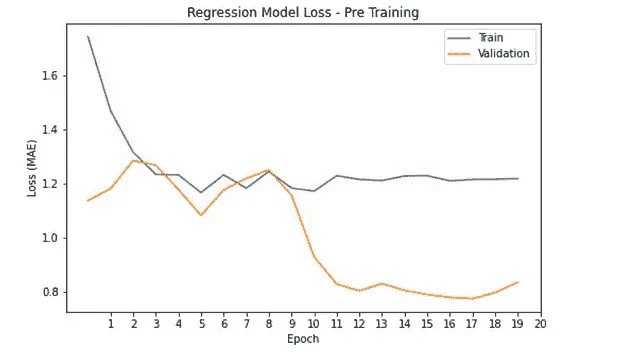

预训练阶段的历元(vs)损失图

## 第二阶段(主要训练)

在这个阶段，事情发生了变化。

1.  首先，损失函数从交叉熵变为**聚焦损失**。你可以在这里阅读更多关于焦损的内容——[https://medium . com/adventures-with-deep-learning/Focal-loss-demystified-c 529277052 de](https://medium.com/adventures-with-deep-learning/focal-loss-demystified-c529277052de)。简而言之，焦点丢失在处理**等级不平衡**方面做得更好，正如我们任务中的情况。

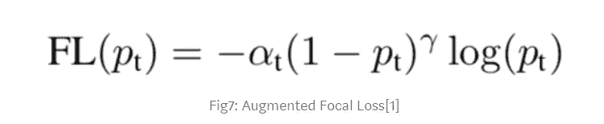

来源—[https://medium . com/adventures-with-deep-learning/focal-loss-demystified-c 529277052 de](https://medium.com/adventures-with-deep-learning/focal-loss-demystified-c529277052de)

焦点损失参考代码—[https://github.com/umbertogriffo/focal-loss-keras](https://github.com/umbertogriffo/focal-loss-keras)

```
model.compile(
optimizer = optimizers.Adam(lr=LEARNING_RATE),loss={
'regression_output': mean_squared_error, 
'classification_output': categorical_focal_loss(alpha=.25,gamma=2),
'ordinal_regression_output' : binary_focal_loss(alpha=.25,gamma=2)
},metrics = ['accuracy'])
```

2.第二，第二阶段的训练分两个阶段进行。第一子阶段包括冻结模型网络中的所有编码器层。这样做是为了预热权重(使用 Imagenet 权重初始化对小数据集进行迁移学习)。第二个子阶段包括解冻和训练所有层。

```
# SUB STAGE 1 (2nd Stage) - Freeze Encoder layers**for** layer **in** model.layers:
    layer.trainable = **False**
**for** i **in** range(-14,0):
  model.layers[i].trainable = **True**# SUB STAGE 2(2nd Stage) - Unfreeze All layers**for** layer **in** model.layers:
    layer.trainable = **True**
```

图表如下所示—

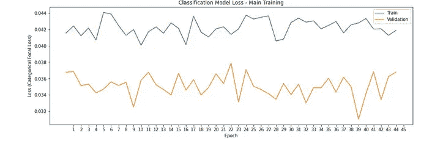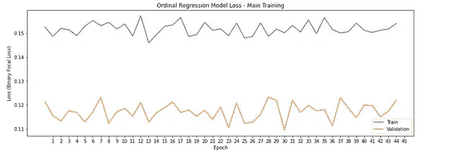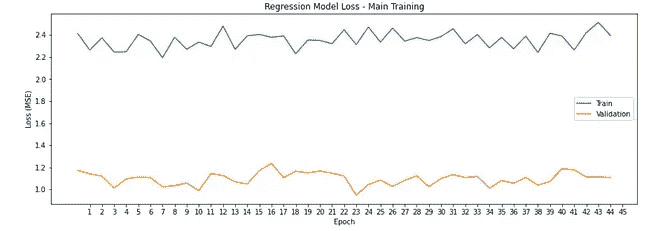

主要训练阶段的历元(vs)损失图

## 第三阶段(岗位培训)

这包括从 3 个头部(分类、回归、有序回归)获得输出，并将其传递给单个密集神经元(线性激活)以最小化均方误差(50 个时期)

```
train_preds = model.predict_generator(
complete_generator, steps=STEP_SIZE_COMPLETE,verbose = 1
)train_output_regression = np.array(train_preds[0]).reshape(-1,1)
train_output_classification = np.array(np.argmax(train_preds[1],axis = -1)).reshape(-1,1)
train_output_ordinal_regression = np.array(np.sum(train_preds[2],axis = -1)).reshape(-1,1)X_train = np.hstack((
train_output_regression,
train_output_classification,
train_output_ordinal_regression))model_post = Sequential()
model_post.add(Dense(1, activation='linear', input_shape=(3,)))model_post.compile(
optimizer=optimizers.SGD(lr=LEARNING_RATE), loss='mean_squared_error',
metrics=['mean_squared_error'])
```

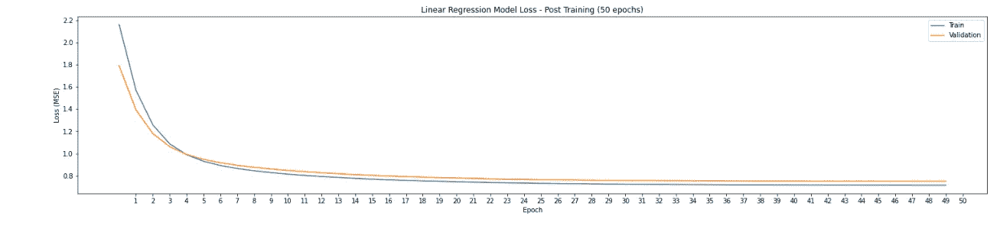

培训后—纪元(vs)损失

## 测试数据的模型评估

因为我们有回归输出，所以我们可以进行最近整数舍入来得到最终的类标签。

我们在测试数据上获得的最终二次加权 kappa 分数是 **0.704** (这表明模型预测和人类评分者之间的基本一致)。

在测试数据上获得的归一化混淆矩阵(matplotlib 的代码已从— [**链接**](https://github.com/dimitreOliveira/APTOS2019BlindnessDetection/tree/master/Model%20backlog) 中引用)

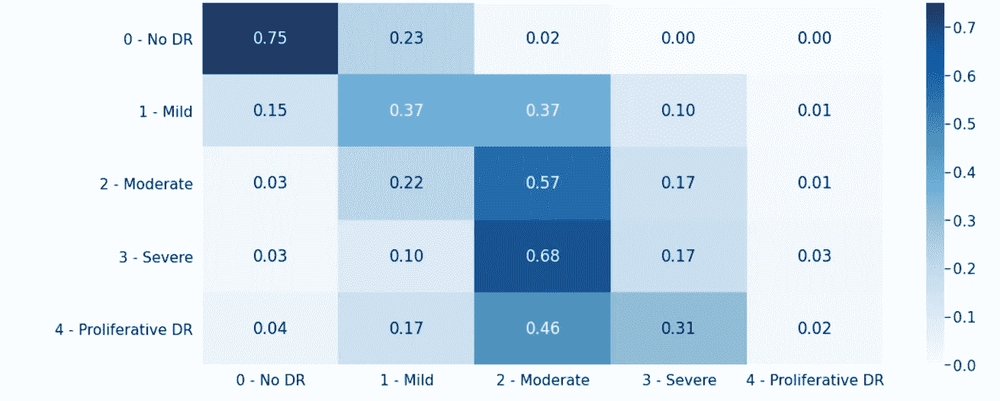

测试数据—标准化混淆矩阵

# 5.其他迁移学习模式

在处理小数据集(与 ImageNet 数据集没有相似性)时，常用的迁移学习方法是首先使用现有的 ImageNet 权重作为初始值(冻结前几层)，然后重新训练模型。

我们可以使用类似的实现。一个简单的 **ResNet50** 架构在这样使用的时候会给出很好的结果(参考— [**链接**](https://github.com/dimitreOliveira/APTOS2019BlindnessDetection/tree/master/Model%20backlog) )

我们可以训练上述模型 2-5 个时期(只有最后 5 层是可训练的，它们基本上是在 **ResNet50** 之后的层)。

然后，我们可以使所有层可训练，并训练整个模型。

```
**for** layer **in** model.layers:
    layer.trainable = **True**
```

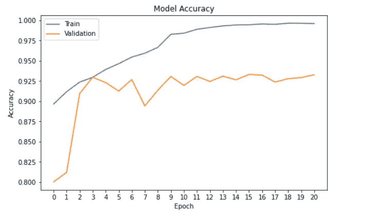

ResNet50(迁移学习)—纪元(vs)丢失

正如我们所看到的，仅在 20 个时期内，我们就获得了良好的准确度分数——在验证数据集上接近 92%。

该模型在测试数据上给出了 **0.83** 的二次加权 kappa(这是一个很好的一致性分数)。

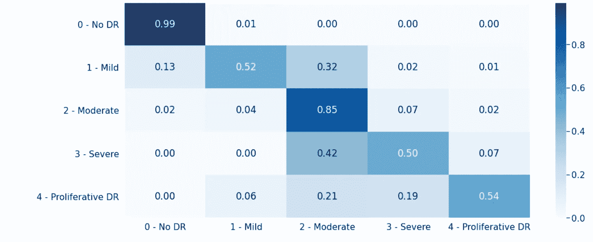

标准化混淆矩阵(测试数据)

同样，我们可以用本页提到的其他**keras . applications**——[**link**](https://keras.io/api/applications/)**做类似的实现。**以下是在其中一些模型上实现时获得的结果(仅模型架构发生变化，其他参数保持不变)。


模型性能—摘要

# 6.未来的工作

## **优化器实验**

正如我们所看到的，在主要的培训阶段，培训损失并没有减少。我们可以解决这个问题的方法之一是将优化器从 Adam 改为**修正 Adam 优化器**。(更多关于 RAdam 的内容在这里—[https://www . pyimagesearch . com/2019/10/07/is-rectified-Adam-actually-better-Adam/](https://www.pyimagesearch.com/2019/10/07/is-rectified-adam-actually-better-than-adam/))。此外，我们可以用 **SGD (Momentum)** 优化器和**权重衰减方法**，更多的**学习率调度器**来检查模型性能的改进。

## **规则化方法实验**

此外，我们还可以在模型上使用更多的正则化来帮助更好地训练模型——一些技术可能涉及**标签平滑**(向目标标签添加噪声)——这将允许模型更好地概括并防止过度拟合。此外，我们可以尝试 L2 正则化来提高模型的泛化能力。

## **集合实验和 K 倍交叉验证**

该研究论文还提到了跨各种架构使用集成技术，如 **EfficientNetB4、5EfficientNetB5、SE-ResNeXt50** 等，并使用**分层交叉验证(5 折)**来提高模型性能和泛化能力。

# 7.链接到 Github 代码和 linkedin 个人资料

所有代码都在我的 Github 库— [**链接**](https://github.com/debayanmitra1993-data/Blindness-Detection-Diabetic-Retinopathy-) 里。如果你想讨论这方面的进一步实验，你可以在我的 Linkedin 个人资料上联系我— [**链接**](https://www.linkedin.com/in/debayan-mitra-63282398/) 。你也可以通过**debayanmitra1993@gmail.com**联系我。

# 6.使用的参考文献

[](https://github.com/dimitreOliveira/APTOS2019BlindnessDetection) [## dimitrioliveira/aptos 2019 盲检

### 这个知识库的目标是使用比赛数据建立机器学习模型来处理图像数据…

github.com](https://github.com/dimitreOliveira/APTOS2019BlindnessDetection) [](https://www.kaggle.com/ratthachat/aptos-eye-preprocessing-in-diabetic-retinopathy) [## APTOS:糖尿病视网膜病变中的眼睛预处理

### 使用 Kaggle 笔记本探索和运行机器学习代码|使用来自多个数据源的数据

www.kaggle.com](https://www.kaggle.com/ratthachat/aptos-eye-preprocessing-in-diabetic-retinopathy) [](https://www.kaggle.com/tanlikesmath/intro-aptos-diabetic-retinopathy-eda-starter) [## 介绍 APTOS 糖尿病视网膜病变(EDA & Starter)

### 使用 Kaggle 笔记本探索和运行机器学习代码|使用来自多个数据源的数据

www.kaggle.com](https://www.kaggle.com/tanlikesmath/intro-aptos-diabetic-retinopathy-eda-starter) 

研究论文—[https://arxiv.org/pdf/2003.02261.pdf](https://arxiv.org/pdf/2003.02261.pdf)