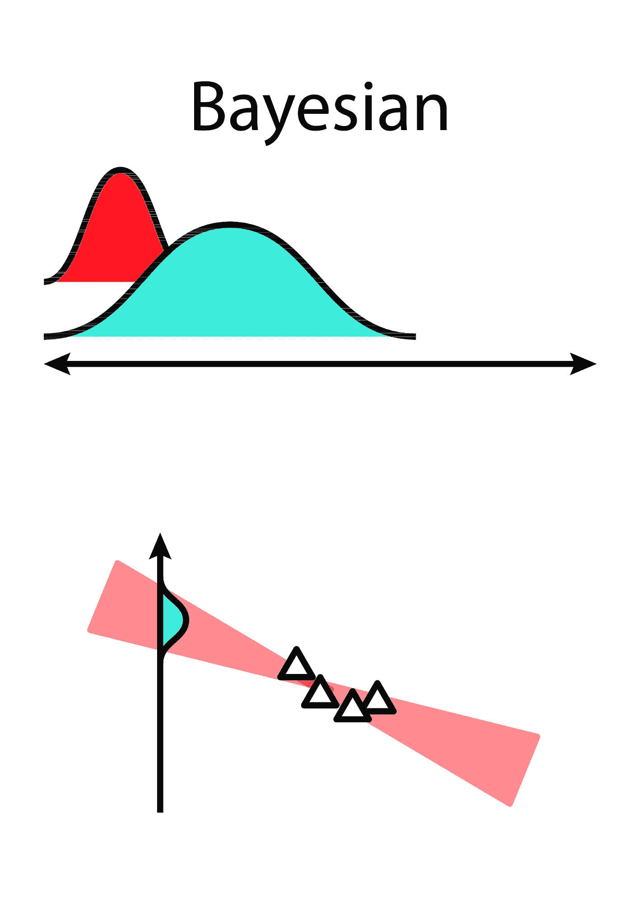
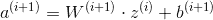
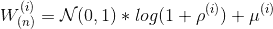
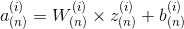
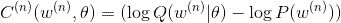

# BLiTZ——py torch 的贝叶斯神经网络库

> 原文：<https://towardsdatascience.com/blitz-a-bayesian-neural-network-library-for-pytorch-82f9998916c7?source=collection_archive---------9----------------------->

## blitz——Torch Zoo 中的贝叶斯层是一个简单且可扩展的库，用于在 PyTorch 上创建贝叶斯神经网络层。

贝叶斯回归图解。来源:[https://ericmjl . github . io/Bayesian-deep-learning-demystified/images/linreg-Bayesian . png](https://ericmjl.github.io/bayesian-deep-learning-demystified/images/linreg-bayesian.png)(2020–03–30 访问)

这是一篇关于使用库进行深度贝叶斯学习的文章。如果你是这个主题的新手，你可能想在 medium 上寻找关于它的许多帖子中的一个，或者只是我们 lib repo 的 Bayesian DL 的[文档部分。](https://github.com/piEsposito/blitz-bayesian-deep-learning#Bayesian-Deep-Learning-in-a-Nutshell)

由于越来越需要收集神经网络预测的不确定性，使用贝叶斯神经网络层成为最直观的方法之一-这可以通过贝叶斯网络作为深度学习研究领域的趋势得到证实。

事实是，尽管 PyTorch 有成为主要深度学习框架的趋势(至少对于研究而言)，但没有一个库让用户像使用`nn.Linear`和`nn.Conv2d`那样轻松地引入贝叶斯神经网络层。

从逻辑上来说，这对于任何想要灵活地使用贝叶斯方法进行数据建模的人来说都是一个瓶颈，因为用户必须开发贝叶斯层的整个部分以供使用，而不是专注于其模型的架构。

BLiTZ 就是为了解决这一瓶颈而产生的。通过与 PyTorch(包括与`nn.Sequential`模块)完全集成，并易于扩展为贝叶斯深度学习库，BLiTZ 允许用户在其神经网络上引入不确定性，只需调整其超参数。

在本帖中，我们将讨论如何使用 BLiTZ 层和采样工具创建、训练和推断不确定性引入的神经网络。

# 贝叶斯深度学习层

正如我们所知，贝叶斯深度学习的主要思想是，在每个前馈操作中，贝叶斯层从正态分布中采样其权重，而不是具有确定性的权重。

因此，该层的可训练参数是确定该分布的平均值和方差的参数。

从数学上讲，操作将从:

确定性“香草”神经网络前馈操作。

收件人:

贝叶斯神经网络层的前馈操作。

在 Torch 上实现ρ和μ为可训练参数的层可能很难，除此之外，创建超参数可调层可能更难。BLiTZ 有一个内置的`BayesianLinear`层，可以很容易地引入到模型中:

它像一个普通的 Torch `nn.Module`网络一样工作，但是它的`BayesianLinear`模块利用之前解释的其权重的不确定性来执行训练和推理。

# **损失计算**

正如在其原始论文中提出的，贝叶斯神经网络成本函数是“复杂性成本”与“数据拟合成本”的组合。在所有的代数争论之后，对于每个前馈操作，我们有:

贝叶斯神经网络的代价函数。

相对于简单得多的预定义 pdf 函数，复杂性成本(P(W))由(网络上每个贝叶斯层的)采样权重的概率密度函数之和组成。通过这样做，我们确保了在优化的同时，我们的模型相对于预测的方差将会减少。

为此，BLiTZ 为我们带来了引入一些方法的`variational_estimator`装饰器，比如将`nn_kl_divergence`方法引入我们的`nn.Module`。给定数据点、其标签和标准，我们可以通过以下方式获得预测的损失:

# 简单的模型优化

在优化和继续之前，贝叶斯神经网络通常通过对同一批次的损失进行多次采样来优化，这是为了补偿权重的随机性，并避免因受离群值影响的损失而优化它们。

BLiTZ 的`variational_estimator`装饰器也用`sample_elbo`方法为神经网络提供动力。给定`inputs`、`outputs`、`criterion`和`sample_nbr`，它估计在计算批次`sample_nbr`次损失时进行迭代过程，并收集其平均值，返回复杂度损失与拟合值之和。

优化贝叶斯神经网络模型非常容易:

# 看一个例子:

我们现在通过[这个例子](https://github.com/piEsposito/blitz-bayesian-deep-learning/blob/master/blitz/examples/bayesian_regression_boston.py)，使用 BLiTZ 创建一个贝叶斯神经网络来估计波士顿房屋 sklearn 内置数据集的房价的置信区间。如果你想寻找其他的例子，库上有更多的

## 必要的进口

除了已知的模块，我们将从 BLiTZ 带来`variational_estimator`装饰器，它帮助我们处理模块上的贝叶斯层，保持它与 Torch 的其余部分完全集成，当然，还有`BayesianLinear`，它是我们的层，具有权重不确定性。

## 加载和缩放数据

这并不是什么新鲜事，我们正在导入和标准化数据来帮助训练。

## 创建我们的回归类

我们可以通过继承`nn.Module`来创建我们的类，就像我们对任何火炬网络所做的那样。我们的装饰者介绍了处理贝叶斯特征的方法，计算贝叶斯层的复杂性成本，并进行许多前馈(对每一个采样不同的权重)来采样我们的损失。

## 定义置信区间评估函数

该函数确实为我们试图对标签值进行采样的批次上的每个预测创建了一个置信区间。然后，我们可以通过寻找有多少预测分布包含数据点的正确标签来衡量我们预测的准确性。

## 创建回归变量并加载数据

注意这里我们创建了我们的`BayesianRegressor`,就像我们创建其他神经网络一样。

## 我们的主要培训和评估循环

我们做了一个训练循环，唯一不同于普通火炬训练的是通过`sample_elbo`方法对其损耗进行采样。所有其他的事情都可以正常完成，因为我们使用 BLiTZ 的目的是让你轻松地用不同的贝叶斯神经网络迭代数据。

这是我们非常简单的训练循环:

# 结论

BLiTZ 是一个有用的 lib，可以在深度学习实验中使用贝叶斯层进行迭代，并且对通常的代码进行很小的更改。它的层和装饰器与神经网络的 Torch 模块高度集成，使得创建定制网络和提取它们的复杂性成本没有困难。

当然，这是我们回购的链接:[https://github.com/piEsposito/blitz-bayesian-deep-learning](https://github.com/piEsposito/blitz-bayesian-deep-learning)

# 参考

 [## piEsposito/blitz-贝叶斯深度学习

### BLiTZ 是一个简单且可扩展的库，用于创建贝叶斯神经网络层(基于 Weight…

github.com](https://github.com/piEsposito/blitz-bayesian-deep-learning)  [## 神经网络中的权重不确定性

### 我们介绍了一个新的，有效的，原则性和反向传播兼容的算法学习概率…

arxiv.org](https://arxiv.org/abs/1505.05424)