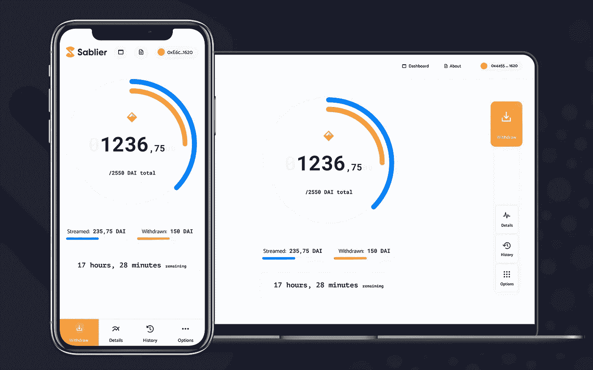

# 区块链和以太坊终于有了一些黑仔应用

> 原文：<https://towardsdatascience.com/blockchain-and-ethereum-are-finally-getting-some-killer-apps-6666cf9f0f56?source=collection_archive---------15----------------------->

## 流动资金、在线投票、无损失彩票等等

照片:[阿纳斯塔西娅·杜尔吉尔](https://unsplash.com/@dulgier)

作为一项新兴技术，区块链[已经](https://www.wired.com/story/theres-no-good-reason-to-trust-blockchain-technology/) [被](https://www.bloomberg.com/opinion/articles/2019-05-03/blockchain-hype-missed-the-mark-and-not-by-a-little) [淘汰](https://www.economist.com/open-future/2019/01/08/the-meaning-of-the-blockchain)的频率大致相当于[谷歌眼镜](https://www.investopedia.com/articles/investing/052115/how-why-google-glass-failed.asp)或 [3D 电视](https://www.lifewire.com/why-3d-tv-died-4126776)。忽视区块链是一种理智的时尚，认为它是被过度炒作的电子表格，唯一值得注意的是支撑比特币的可疑成就。一位评论家大胆批评这是“人类历史上最没用的发明”。

对于像我这样充满希望的技术人员来说，这些声明因为拥有真理之环而更加令人沮丧。尽管智能合同和区块链平台为研发筹集了数十亿美元的资金(T21 ),但几乎没有区块链的实际应用。比特币的价值已经飙升，但缺乏持续的技术发展、大规模采用或相对于美元等现有货币的任何真正优势。

然而，在过去的一年(尤其是过去的三个月),有用的区块链应用程序终于出现了激增，这些应用程序实际上可能代表了该技术的杀手级应用程序。大量的开发人员已经聚集在一个平台上，特别是以太坊，由此产生的新应用程序的爆炸看到了区块链实现的一些希望。

# 实时流动资金

Sablier 团队开发了一个协议，让人们可以像在 Spotify 上播放播放列表一样轻松地实时传输资金。不要每四周领一次工资，想象一下持续领工资——每小时，甚至每秒。Sablier 应用程序在透明的界面中显示正在进行的交易，因此您可以准确地看到支付了多少钱，以及支付的速度有多快。通过完全绕过银行系统，交易费用几乎不存在。

Sablier 应用程序，在本例中为 DAI 流(数字化美元)

实时工资支付是一种诱人的可能性——每月工资支付的效率低得可怕，让大量工人靠一张张支票生活，有时甚至无法满足日常开支。流动支付代表了一种解决方案，尤其是对低收入工人来说，是一种可能改变生活的服务。我们目前支付薪水和工资的方式可能会被扔进历史垃圾堆——谁会真正喜欢每月领取一次总付款，而不是每天领一次工资？

有了一个像流动资金一样完全通用的协议，潜在的应用范围远远超出了工资。遗产继承传统上被认为是死后一次性支付的一大笔钱——但是想象一下这样一个系统，一个去世的家庭成员*在很长一段时间内将他们的遗产转移给他们的家庭，以避免税收和一次性支付大笔款项的冲动。实时流动资金也可能完全扰乱按小时计费的服务:法律费用、车辆租赁、停车场等等——只要你在使用服务，就要付费，不要多花一秒钟。*

# 无损失彩票

仅在美国，花在彩票上的钱就有 710 亿英镑，这是一个荒谬的数字，尤其是任何一个参与者真的中奖的可能性极小，这让这个数字变得更加疯狂。当你停下来想一想，这是一个令人困惑的财务自残行为，只有获胜的乐趣和兴奋才能证明这是正当的——我们人类很容易受到基于游戏的反馈循环的影响

进入 [PoolTogether](https://www.pooltogether.com/) ，这是一款将自己打造成“无损失储蓄游戏”的新应用。本质上，它是一种数字彩票，你用存款“购买”彩票——每周给你一次中头奖的机会——但你永远不会失去存款。你可以随时撤回。看起来像是黑魔法的东西是由区块链实现的——协议将所有存款“汇集”在一个生息的智能合同中，产生的利息作为头奖奖励给每周的持票人。

毫无疑问，虽然 PoolTogether 还处于早期阶段，用户相对较少，累积奖金也相对较少，但这个概念是基于金钱的(可以这么说)。世界上最大的赔钱游戏(彩票)可能会被一个激励人们储蓄的系统所取代，同时保留使彩票如此令人上瘾的类似游戏的属性。

# 安全在线投票

如果你关注美国政治(因为你的罪过)，或者即使你不关注，你可能已经听说过民主党总统初选投票是一场灾难——爱荷华州党团会议仍然在确认确切的总数，尽管投票发生在三周前。总的来说，投票过程中有一长串的问题，从长长的队伍和等待时间到坏掉的机器，以及投票地点的党派安排。十年前的解决方案——在线投票——一直被认为太不安全，容易被黑客攻击或操纵。

由于区块链系统在安全性和效率方面的优势，安全的在线投票系统还是有希望的。一个名为 [Vocdoni](https://vocdoni.io/docs/#/) 的团队正在构建一个具有“普遍可验证”投票的在线投票协议——使用一些复杂的加密技术来构建一个系统，选民可以使用区块链协议投票，该协议会不断检查每一张选票的完整性，以保证其完整性(并阻止破坏系统的企图)。Vocdoni 还在构建协议时考虑到了智能手机的接入，目的是让民主变得更加简单和容易实现。

# 投资你最喜爱的体育明星

如果为一个特定的运动队或运动员加油的情感投资还不够，智能合同现在让球迷用自己的钱投资。布鲁克林篮网队的斯宾塞·丁翁迪在以太坊上将其 3400 万美元的三年合同进行了“T2 化”——这实质上意味着球迷可以购买他合同中的一小部分股份，将其转化为可交易的金融资产。如果你认为丁威迪将会有一个伟大的赛季，你不需要只是把他加入你的梦幻团队——你可以真正投资于他的表现，如果他达到了合同中基于表现的奖金，就可以获得收益。

一种行走、呼吸、可交易的金融资产。照片:[杰罗姆米隆 ](https://www.instagram.com/jeromepmiron/?hl=en)

尽管体育明星投资的全新市场还处于早期阶段(当然还会有更多的障碍——NBA 对丁威迪的创新并不太看好),但这是朝着更具流动性的金融体系迈出的相当令人兴奋的一步。区块链和智能合约允许新类型的投资和新颖的金融工具，看到智能合约的沙箱为体育部门产生真正的游戏规则改变者令人兴奋。

对于人类历史上最没用的发明来说还不算太寒酸。如果你对这些关于这个新兴平台的文章感兴趣，你可能会喜欢我的新出版物 [Technocracy](https://technocracy.substack.com/) 。我将定期撰写关于技术正在改变社会的文章，比如我最近的一篇关于冠状病毒如何让大规模监控成为我们的新常态的文章。