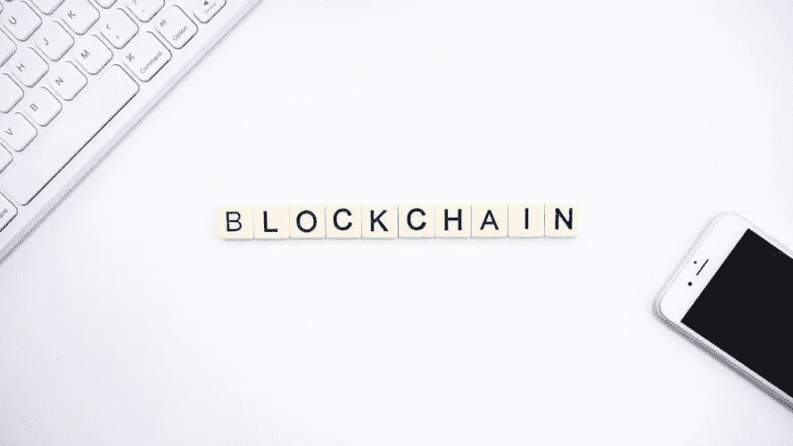

# 区块链技术确保数据安全性和不变性

> 原文：<https://towardsdatascience.com/blockchain-technology-ensuring-data-security-immutability-7150d309352c?source=collection_archive---------11----------------------->

图片资源:[https://unsplash.com/@launchpresso](https://unsplash.com/@launchpresso)

目前，区块链是最安全的数据保护技术之一。数字技术的快速发展也给数据安全带来了新的挑战。组织需要通过实施强身份认证和加密密钥保险机制来保护其数据。

***区块链技术足以应对如何保护数据和防止恶意网络攻击的挑战。报告称，到 2024 年，全球区块链技术市场可能会达到 200 亿美元左右。区块链具有革命性，被用于医疗保健、金融、体育等许多行业。***

与传统方法不同，这项技术主要激励许多[区块链开发公司](https://www.quytech.com/blockchain-development-company.php)重新构建和重新表述安全问题。区块链提供了在数据中引入信任因素的真正意义。

## **区块链技术挑战漏洞**

由分布式分类帐系统提供的高级安全性为建立安全的数据网络提供了好处。在消费产品和服务中提供服务的企业采用区块链技术来保护记录消费者的数据。

由于区块链是本世纪的主要技术突破之一，它允许在不需要任何第三方信任的情况下保持竞争力。

这项技术正在为消费者带来颠覆商业服务和解决方案的新机遇。在未来，这项技术将随着各个领域中不断发展的全球服务而成为领跑者。

## **提供加密和验证**

区块链技术足够精通，可以管理一切，因此数据没有以任何方式被更改。区块链本质上是加密的，这使得提供适当的验证成为可能。

图片资源:[/unsplash . com/@ clinta dair](https://unsplash.com/@clintadair)

***智能合约可与区块链一起使用，以确保每次满足特定条件时发生特定的验证。*** 如果在任何情况下，有人确实更改了数据，网络中所有节点上的所有分类帐都验证更改已完成。

## **提供安全的数据存储**

区块链是保护共享社区数据的最佳方式。利用区块链的功能，没有人可以读取或干扰任何敏感的存储数据。

处理分布在人际网络中的数据很有帮助。此外，该技术还可以用于公共服务，以保持公共记录的分散和安全。

图片资源:[https://unsplash.com/@austindistel](https://unsplash.com/@austindistel)

***除此之外，商业模式可以在区块链上保存一个数据的加密签名或者庞大的数据形式。这将允许用户留下来，以确保数据的安全。*** 区块链用于分布式存储软件，将海量数据分解成块。这在网络上的加密数据中可用，意味着所有数据都是安全的。

## **无法攻击**

谈到区块链，黑客或攻击变得异常困难。区块链是去中心化的、加密的和交叉检查的，这允许数据保持强大的备份。由于区块链满载节点，同时攻击大多数节点是不可能的。

图片资源:[https://unsplash.com/@markusspiske](https://unsplash.com/@markusspiske)

***作为分布式账本技术之一，其最基本的属性是数据不可变。*** 它提供了一种全新的成功安全性，任何行为或交易都不能被篡改或伪造。这项技术使每一笔交易都有效，得到网络上多个节点的确认。

## **最终想法**

由于应用范围广泛，区块链用于建立安全网络。对于安全的数据交换，[区块链安全开发服务](https://www.quytech.com/blockchain-development-company.php)是挑战传统方法的最佳选择。采用区块链技术可以改善技术和用户隐私之间的关系。

区块链技术的数字景观是安全性和透明性的组合。区块链带来了解决数据管理问题的技术，主要涉及安全、隐私和验证。

***来自《走向数据科学》编辑的提示:*** *虽然我们允许独立作者根据我们的* [*规则和指导方针*](/questions-96667b06af5) *发表文章，但我们并不认可每个作者的贡献。你不应该在没有寻求专业建议的情况下依赖一个作者的作品。详见我们的* [*读者术语*](/readers-terms-b5d780a700a4) *。*