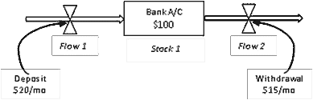
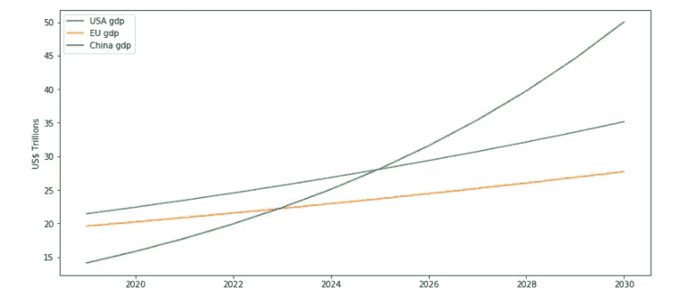

# 一个简单预测程序的蓝图

> 原文：<https://towardsdatascience.com/blueprint-for-a-simple-forecasting-program-567833b3fc86?source=collection_archive---------47----------------------->

## 预测，但不是时间序列预测

[万花筒](https://unsplash.com/@kaleidico?utm_source=medium&utm_medium=referral)在 [Unsplash](https://unsplash.com?utm_source=medium&utm_medium=referral) 上拍摄的照片

短期和长期预测是每个部门决策的基本商业活动。呼叫中心需要知道五年后呼叫量的增长情况，以保持足够的人员来为客户服务。电力公司希望预测未来十年的电力消耗增长，这样他们就可以投资新的装置来满足额外的需求。小企业需要了解他们的投资在未来几年的回报情况，并做出必要的调整。

所有这些业务需求都需要预测。传统上，这些预测是在*临时*的基础上进行的，数据科学家可以使用的工具有限。时间序列技术已经存在了很长一段时间，但是它们有自己的局限性，并且通常它们不能提供必要的准确性和指向特定的不确定性。对于时间序列，由于新政策的实施，也很难制定方案并对关键绩效指标(KPI)进行敏感性分析。

考虑到这一点，在本文中，我将介绍一种不同的预测技术的蓝图，这种技术依赖于很少的数据点。正如下面将要看到的，这种技术还允许对特定业务决策的影响及其对 KPI 的影响进行场景分析。

## 系统动态建模

系统动力学是一种复杂系统建模的方法，其中一个元素的变化导致其他元素的变化。

它广泛应用于医疗保健、流行病学、运输、商业管理和收入预测。可以说，其中最著名的是罗马俱乐部的增长极限模型。

一个系统动态模型代表了一个复杂的系统，通过反馈循环来预测系统的行为。假设一个银行账户有 100 美元的“股票”。每月存入 20 美元(由*流程 1* 表示)，每月提取 15 美元(*流程 2* )。在这种简单的情况下，*流程 1* 的变化将导致*库存 1* 和*流程 2 的变化。*因此，如果我们知道*流量 1* 将如何演变成未来，我们就可以预测*股票 1* 和*流量 2* 。

SD 建模中的存量、流量和反馈循环(来源:作者)

使用类似的概念，下面我将介绍一种依赖于更少数据点的预测方法，而不是传统预测中使用的复杂时间序列建模。

下面是一个简单的蓝图和必要的代码。我还在世界三大经济体的 GDP 预测中测试它。但这一概念可以应用于任何其他业务预测和决策过程。

## 方法、数据和代码

所以基本上我创建了一个名为`forecast()`的函数，它有 4 个参数:

*   初始值
*   变化的速度
*   预测时间步数
*   当前时间段。

然后，在给定初始值和变化率的情况下，该模型计算每个时间步中的未来值。该函数输出所有时间步长的预测值列表。

然后将预测值绘制成时间曲线。这里生成多个预测来比较不同的实体，但是如果我们要对单个实体进行预测，这个概念也可以以类似的方式工作。在这种情况下，业务政策或活动的变化将采用不同的参数，并对未来每个时间步的预测估计的变化进行建模。

因此，我在这个演示中提出的问题是，主要经济体的 GDP 将如何发展，它们在 2030 年将会是什么样子？这个简单的模型只需要 2 个参数，2019 年名义 GDP(美元)和 GDP 增长(%)，但正如你将看到的，即使在这个简化版本中，它也可以产生强大的洞察力。以下数据用于演示:

*   [美国 GDP: 21.43 万亿](https://www.bea.gov/news/2020/gross-domestic-product-fourth-quarter-and-year-2019-advance-estimate#:~:text=Current%2Ddollar%20GDP%20increased%204.1,table%201%20and%20table%203) & [增长:2.3%](https://www.bea.gov/news/2020/gross-domestic-product-fourth-quarter-and-year-2019-advance-estimate#:~:text=Current%2Ddollar%20GDP%20increased%204.1,table%201%20and%20table%203)
*   [欧盟国内生产总值:19.6 万亿](https://www.imf.org/external/pubs/ft/weo/2020/01/weodata/weorept.aspx?pr.x=29&pr.y=7&sy=2017&ey=2021&scsm=1&ssd=1&sort=country&ds=.&br=1&c=998&s=NGDP_RPCH%2CPPPGDP%2CPCPIPCH&grp=1&a=1) & [增长:1.6%](https://www.imf.org/external/pubs/ft/weo/2020/01/weodata/weorept.aspx?pr.x=29&pr.y=7&sy=2017&ey=2021&scsm=1&ssd=1&sort=country&ds=.&br=1&c=998&s=NGDP_RPCH%2CPPPGDP%2CPCPIPCH&grp=1&a=1)
*   [中国 GDP: 14.1 万亿](https://www.imf.org/external/pubs/ft/weo/2019/02/weodata/weorept.aspx?pr.x=29&pr.y=5&sy=2017&ey=2021&scsm=1&ssd=1&sort=country&ds=.&br=1&c=924&s=NGDPD%2CPPPGDP%2CNGDPDPC%2CPPPPC%2CPCPIPCH&grp=0&a=) & [增速:6.1%](https://www.imf.org/external/pubs/ft/weo/2020/01/weodata/weorept.aspx?pr.x=50&pr.y=12&sy=2017&ey=2021&scsm=1&ssd=1&sort=country&ds=.&br=1&c=924&s=NGDP_RPCH%2CPPPGDP%2CPCPIPCH%2CLUR&grp=0&a=)

## 预测

使用上述函数预测了美国、欧盟和中国的国内生产总值，并在每个预测年填入同一个面板中。

业内每个人都知道中国的经济正在着火。这种预测给出了火球有多大的概念。在这一点上，中国的经济似乎远远落后于美国和欧盟，但考虑到增长率，中国将很快超越只是时间问题。但是多快呢？

2023 年是中国接管欧盟的一年，2025 年 GDP 超过美国经济。

在美国和欧盟之间，在这一点上，他们的 GDP 处于类似的数量级，但正如预测所示，由于美国的增长率更高，差距将继续扩大。

2030 年世界主要经济体 GDP 预测

但当然，这些都是 COVID 之前的情况，在 COVID 之后，一切都将发生变化。我们需要等待一段时间，以了解事情的发展方向。

## 离别的思绪

本文的目的是展示一个简单的程序如何生成强大的预测洞察力。当然，这是一个简单的演示，但我的目标是给出超越传统时间序列预测的可能性的直觉，并尝试一些不同的东西，尤其是当数据是一个限制因素时。