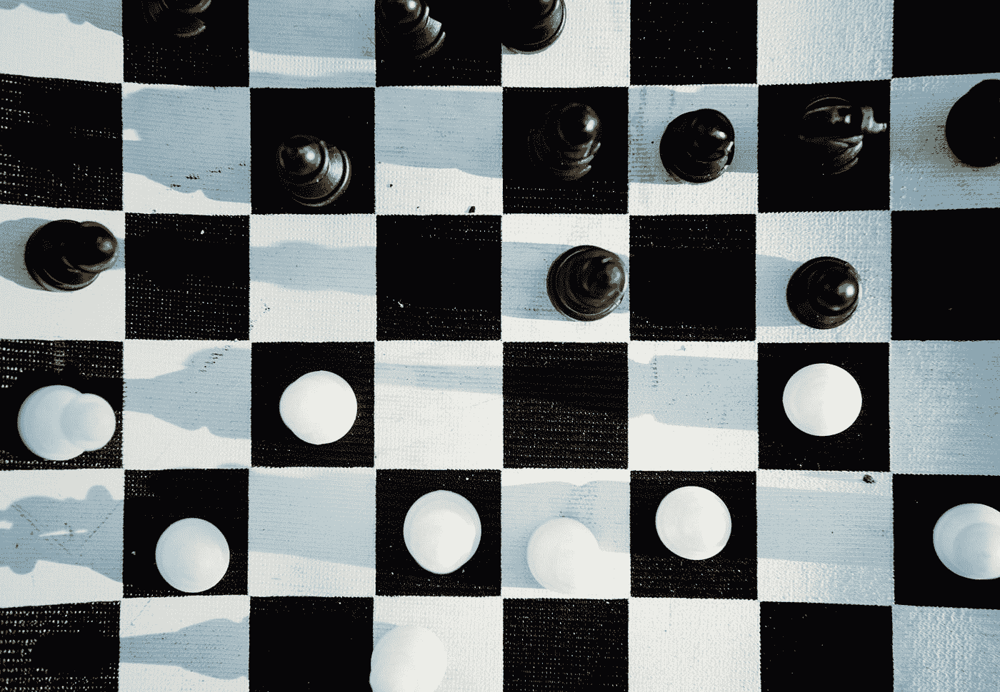
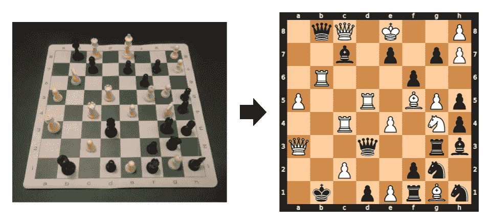
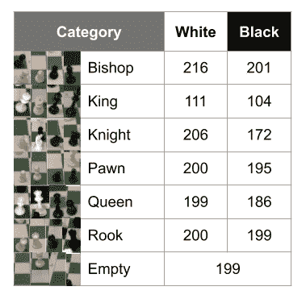
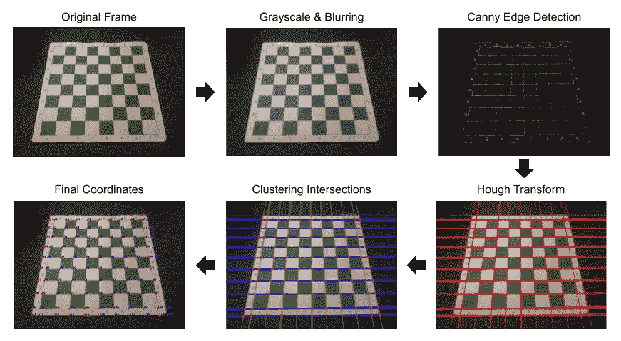
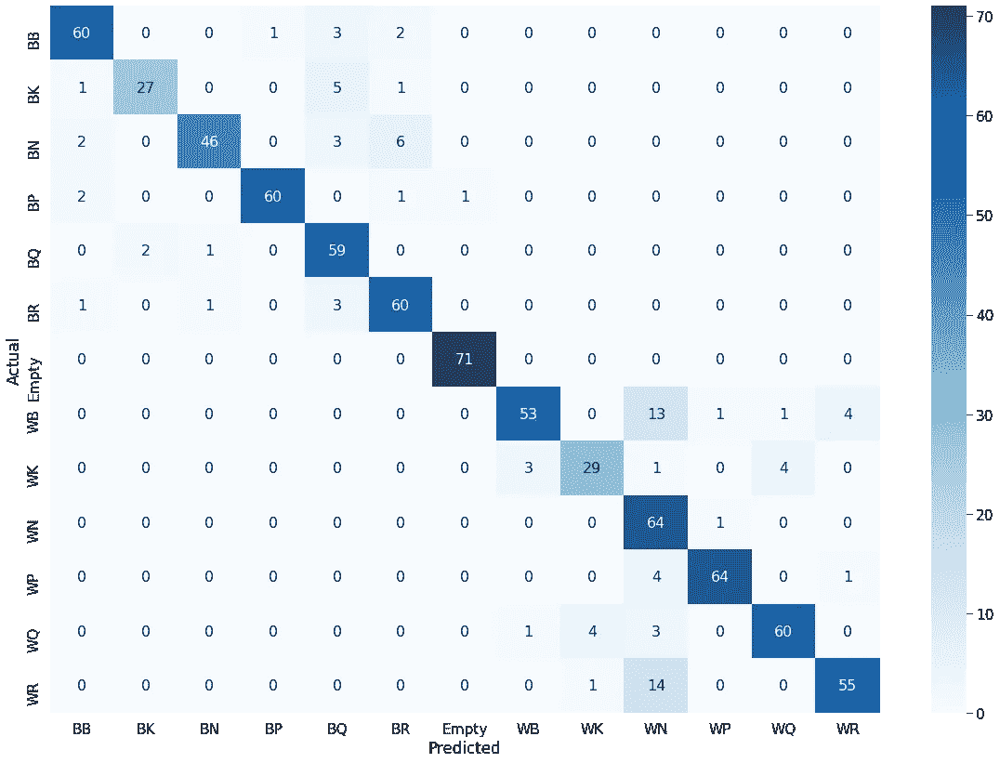

# 基于神经网络的棋盘游戏图像识别

> 原文：<https://towardsdatascience.com/board-game-image-recognition-using-neural-networks-116fc876dafa?source=collection_archive---------11----------------------->

## 如何使用计算机视觉技术来识别棋子及其在棋盘上的位置



蒂姆·福斯特在 [Unsplash](https://unsplash.com?utm_source=medium&utm_medium=referral) 上的照片

利用计算机视觉技术和卷积神经网络(CNN)，为这个项目创建的算法对棋子进行分类，并识别它们在棋盘上的位置。最终的应用程序保存图像，以可视化的表现，并输出棋盘的 2D 图像，以查看结果(见下文)。本文的目的是逐步完成这个项目，以便它可以作为新迭代的“基础”。参见 [GitHub](https://github.com/andrewleeunderwood/project_MYM) 上该项目的代码。



(左)来自现场摄像机的画面和(右)棋盘的 2D 图像

# 数据

我对这个项目的数据集有很高的要求，因为我知道它最终会推动我的成果。我在网上找到的国际象棋数据集要么是用不同的国际象棋设置( [Chess Vision](https://github.com/jialinding/ChessVision/tree/master/images) )、不同的相机设置( [Chess ID Public Data](https://www.dropbox.com/s/618l4ddoykotmru/Chess%20ID%20Public%20Data.zip?dl=0) )创建的，要么是两者都用( [Raspberry Turk Project](https://www.kaggle.com/joeymeyer/raspberryturk) )，这让我创建了自己的数据集。我使用我的[国际象棋](https://www.amazon.com/Best-Value-Tournament-Chess-Set/dp/B003DMITE6/ref=sr_1_39?crid=3AN8U1ERTLVID&dchild=1&keywords=chess+set&qid=1601908425&sprefix=chess+%2Caps%2C195&sr=8-39)和相机设置( [GoPro Hero6 Black](https://www.cnet.com/reviews/gopro-hero6-black-review/) 在“第一人称视角”)生成了一个自定义数据集，这使得我的模型更加准确。该数据集包含 2，406 幅图像，分为 13 类(见下文)。**要点:这花费了我大部分的时间，但最终你会希望在图像上训练你的模型，使其尽可能接近你的应用程序中使用的图像。**



自定义数据集的细分(*图片由作者*提供)

为了构建这个数据集，我首先创建了 *capture_data.py* ，它在点击 *S 键*时从视频流中提取一帧，并将其保存到导演。这个程序允许我无缝地改变棋盘上的棋子，并一遍又一遍地捕捉棋盘的图像，直到我建立了大量不同的棋盘配置。接下来，我创建了 *create_data.py* ，通过使用下一节讨论的电路板检测技术将帧裁剪成独立的片段。最后，我将裁剪后的图像分类，将它们放入带标签的文件夹中。然后…瞧！

# 棋盘检测

对于棋盘检测，我想做一些比使用*findchesboardcorners*(OpenCV)更复杂的事情，但不像 CNN 那么高级。使用低级和中级计算机视觉技术来寻找棋盘的特征，然后将这些特征转化为外边界和 64 个独立方格的坐标。该过程围绕实现 [Canny 边缘检测](/canny-edge-detection-step-by-step-in-python-computer-vision-b49c3a2d8123)和 [Hough 变换](/lines-detection-with-hough-transform-84020b3b1549)来生成相交的水平线和垂直线。分层聚类用于根据距离对交叉点进行分组，并对各组进行平均以创建最终坐标(见下文)。



完整的棋盘检测过程(*图片作者*

# 棋子分类

当我开始这个项目时，我知道我想使用 Keras/TensorFlow 创建一个 CNN 模型，并对棋子进行分类。然而，在创建我的数据集之后，在给定数据集大小的情况下，CNN 本身不会给我想要的结果。为了克服这个障碍，我利用了[*imagedata generator*](https://www.pyimagesearch.com/2019/07/08/keras-imagedatagenerator-and-data-augmentation/)和 [transfer learning](https://keras.io/guides/transfer_learning/) ，它们扩充了我的数据，并使用其他预先训练的模型作为基础。

## 创建 CNN 模型

为了使用 GPU，我在云中创建并训练了 CNN 模型，这大大减少了训练时间。**快速提示:**[**Google Colab**](https://www.tutorialspoint.com/google_colab/google_colab_using_free_gpu.htm)**是一种快速简单地开始使用 GPU 的方法。**为了提高我的数据的有效性，我使用 *ImageDataGenerator* 来扩充我的原始图像，并将我的模型暴露给不同版本的数据。函数 *ImageDataGenerator* 随机旋转、重新缩放和翻转(水平)每个时期的我的训练数据，本质上创建了更多的数据(见下文)。虽然有更多的转换选项，但我发现这些对于这个项目来说是最有效的。

```
**from** **keras.preprocessing.image** **import** ImageDataGeneratordatagen = ImageDataGenerator(
        rotation_range=5,
        rescale=1./255,
        horizontal_flip=**True**,
        fill_mode='nearest')test_datagen = ImageDataGenerator(rescale=1./255)train_gen = datagen.flow_from_directory(
    folder + '/train',
    target_size = image_size,
    batch_size = batch_size,
    class_mode = 'categorical',
    color_mode = 'rgb',
    shuffle=**True**)test_gen = test_datagen.flow_from_directory(
    folder + '/test',
    target_size = image_size,
    batch_size = batch_size,
    class_mode = 'categorical',
    color_mode = 'rgb',
    shuffle=**False**)
```

我没有从头开始训练一个全尺寸模型，而是通过利用一个预训练模型来实现迁移学习，并添加了一个顶层模型，使用我的自定义数据集进行训练。我遵循典型的迁移学习工作流程:

1.从先前训练的模型(VGG16)中提取图层。

```
**from** **keras.applications.vgg16** **import** VGG16model = VGG16(weights='imagenet')
model.summary()
```

2.冷冻它们是为了避免在训练中破坏它们所包含的任何信息。

3.在冻结层上增加了新的可训练层。

```
**from** **keras.models** **import** Sequential
**from** **keras.layers** **import** Dense, Conv2D, MaxPooling2D, Flatten
**from** **keras.models** **import** Modelbase_model = VGG16(weights='imagenet', include_top=**False**, input_shape=(224,224,3)) 

*# Freeze convolutional layers from VGG16*
**for** layer **in** base_model.layers:
    layer.trainable = **False***# Establish new fully connected block*
x = base_model.output
x = Flatten()(x) 
x = Dense(500, activation='relu')(x) 
x = Dense(500, activation='relu')(x)
predictions = Dense(13, activation='softmax')(x)*# This is the model we will train*
model = Model(inputs=base_model.input, outputs=predictions)
model.compile(optimizer='adam', loss='categorical_crossentropy', metrics=['categorical_accuracy'])
```

4.在自定义数据集上训练新图层。

```
epochs = 10history = model.fit(
    train_gen, 
    epochs=epochs,
    verbose = 1,
    validation_data=test_gen)model.save_weights('model_VGG16.h5')
```

虽然我使用 VGG16 或 VGG19 作为预训练模型来创建模型，但由于验证准确性更高，我选择了使用 VGG16 的模型。此外，我发现最佳的历元数是 10。任何大于 10 的数字都不会导致验证准确性的增加，并且会增加训练和验证准确性之间的差异，这暗示着过度拟合。**收获:迁移学习让我能够充分利用深度学习在图像分类方面的优势，而不需要大型数据集。**

## 结果

为了更好地可视化验证的准确性，我创建了一个模型预测的混淆矩阵。从这个图表中，很容易评估模型的优点和缺点。**优势:**空— [准确率](https://developers.google.com/machine-learning/crash-course/classification/precision-and-recall)为 99%，[召回率](https://developers.google.com/machine-learning/crash-course/classification/precision-and-recall)为 100%；白棋和黑棋(WP 和 BP)——F1 值约为 95%。**弱点:**《白骑士》(WN)——召回率高(98%)，但准确率很低(65%)；白人主教(WB)——召回率最低，为 74%。



测试数据的混淆矩阵(作者的*图片)*

# 应用

该应用程序的目标是使用 CNN 模型并可视化每一步的性能。我创建了 *cv_chess.py* (见下面的摘录)，它清楚地显示了步骤，还创建了 *cv_chess_functions.py* ，它显示了每个步骤的细节。这个应用程序保存来自实时视频流的原始帧，每个方格的 64 个裁剪图像，以及棋盘的最终 2D 图像。我以这种方式构建应用程序，以快速确定未来改进的优势和劣势。

```
print('Working...') 

# Save the frame to be analyzed        
cv2.imwrite('frame.jpeg', frame)  

# Low-level CV techniques (grayscale & blur)        
img, gray_blur = read_img('frame.jpeg') 

# Canny algorithm        
edges = canny_edge(gray_blur) 

# Hough Transform        
lines = hough_line(edges)   

# Separate the lines into vertical and horizontal lines        h_lines, v_lines = h_v_lines(lines) 

# Find and cluster the intersecting        
intersection_points = line_intersections(h_lines, v_lines)        points = cluster_points(intersection_points)   

# Final coordinates of the board        
points = augment_points(points)       

# Crop the squares of the board a organize into a sorted list        x_list = write_crop_images(img, points, 0)        
img_filename_list = grab_cell_files()        img_filename_list.sort(key=natural_keys)   

# Classify each square and output the board in Forsyth-Edwards Notation (FEN)        
fen = classify_cells(model, img_filename_list) 

# Create and save the board image from the FEN        
board = fen_to_image(fen)      

# Display the board in ASCII        
print(board)# Display and save the chessboard image        
board_image = cv2.imread('current_board.png')        cv2.imshow('current board', board_image)  

print('Completed!')
```

## 演示

显示了变化板现场(左)和新的 2D 图像输出(右)

我希望你喜欢这个演示！更多我的项目，请看我的[网站](http://andrewleeunderwood.com)和 [GitHub](https://github.com/andrewleeunderwood) 。请随时通过 [LinkedIn](https://www.linkedin.com/in/andrewleeunderwood/) 与我联系，对这个项目的未来迭代有想法。干杯！