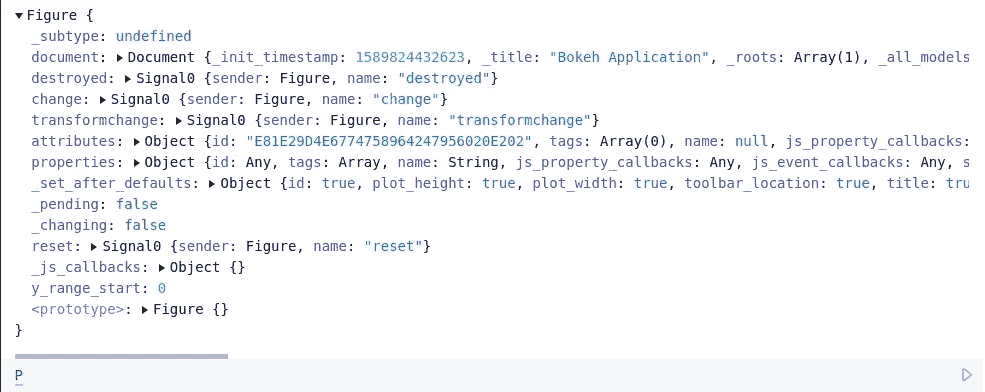
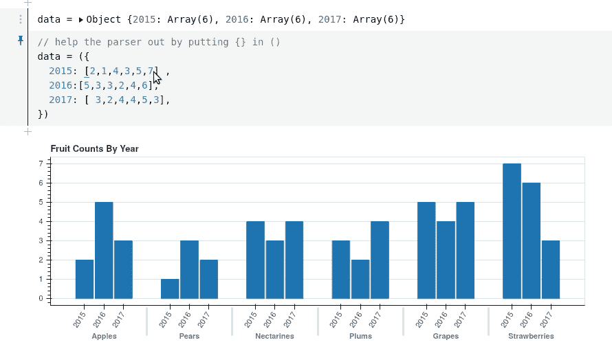

# 散景、散景和可观察总部

> 原文：<https://towardsdatascience.com/bokeh-bokehjs-and-observablehq-6ddf0c5ffe8a?source=collection_archive---------66----------------------->

## 脱离朱庇特轨道的冒险


2019 年 11 月朱诺号拍摄的木星北纬(图片来源:[美国宇航局/JPL 加州理工](https://photojournal.jpl.nasa.gov/catalog/PIA23442)

在 jupyter 笔记本中使用 python 时，[散景](https://bokeh.org)可视化库已经成为我最喜欢的显示数据的工具之一。散景功能强大，易于使用，具有可访问的交互功能，并生成美丽的图形。然而，随着我在过去几个月中使用 Bokeh，并对其内部有了更多的了解，我开始意识到 jupyter 中用于 Bokeh 的 python API 只是整个 Bokeh 包的一小部分。除了这个 API，Bokeh 还包括一个服务器包和一个名为 bokehjs 的 javascript 库。事实上，Bokeh 的 python“绘图”包根本不做任何绘图；相反，它是一种描述绘图的语言，这些绘图被序列化到 json 包中，并传递给 bokehjs 以在浏览器中呈现。随着我尝试在我的情节中添加更多的交互性，我逐渐清楚地知道，了解一些 JavaScript——我并不知道——并对散景有更清晰的理解会让我用散景做更多的事情。

与此同时，出于完全不同的原因，我遇到了 [Observablehq](https://observablehq.com) 。Observablehq 是由 javascript [D3](https://d3js.org) 可视化包的开发者 [Mike Bostock](https://bost.ocks.org/mike/) 领导的团队创建的。乍一看，它非常像一个基于 javascript 的云托管 jupyter 笔记本。考虑到我探索 bokehjs 和学习一些 javascript 的目标，我天真地认为 Observablehq 是最适合我的工具。嗯，这并不那么简单，因为 Observablehq 不仅仅是 jupyter 笔记本的 javascript 版本，它是一个非常不同的东西，并且以自己的方式非常漂亮；bokehjs 并不完全适合 Observablehq 世界。尽管如此，在尝试将这些世界融合在一起的过程中，我学到了很多关于 bokehjs 和 Observablehq 的知识，并且我看到了很多进一步发展的潜力。这里有一份简短的进度报告和一些提示，如果你也想开始这段旅程的话。

# Observablehq 不是 Javascript 的 Jupyter

正如我上面提到的，当我查看 Observablehq 用户界面时，我的第一反应是*这只是 javascript 的 Jupyter*！


如上面的小动画所示，Observable 有笔记本，有单元格，你在单元格里输入 javascript(或者 markdown)；按 shift-enter 键，单元格就会被求值。听起来像朱庇特，对吧？但是可观察的笔记本是完全不同的——每个单元格都有一个值，并且这些单元格根据引用组合成一个图表。当一个单元格的值发生变化时，所有依赖于该单元格的单元格都会被重新计算。这有点像小 javascript 程序的电子表格。这种设计意味着可观察笔记本以一种自然的方式支持高度的交互性，远远超过 jupyter 笔记本的能力。如果你感兴趣，你最好的选择是阅读 Observablehq 网站上的优秀文章。除了[的介绍性文章](https://observablehq.com/@observablehq/user-manual)，尤其值得一提的是:

*   【jupyter 用户可观察到的
*   [如何观察运行](https://observablehq.com/@observablehq/how-observable-runs)

# 在 Observable 中加载 Bokehjs

在可观察的笔记本中试验散景的第一步是加载库。对于这一步，我得到了布莱恩·陈的[你好，Bokehjs](https://observablehq.com/@bryangingechen/hello-bokeh-js) 笔记本的帮助。将下面的代码放入一个可观察到的笔记本单元格中，然后按 Shift-Enter 键，就可以实现这个目的:

正在将 Bokehjs 库加载到 Observablehq 中

不必在细节上花费太多时间，值得指出的是，加载 Bokeh 的代码被括在大括号中，以便作为一个单元执行。正如我前面提到的，可观察笔记本中的每个单元格就像一个自包含的 javascript 程序，单元格的执行和重新执行取决于它们引用之间的依赖图。这段代码中至关重要的`require`语句通过副作用起作用，而不是通过返回值。这意味着 Observable 不理解这些语句之间的依赖关系；如果放在不同的牢房里，它们可以按任何顺序执行。更一般地说，Observable 不是为了处理通过副作用起作用的函数而建立的，人们需要小心使用它们。

这个特殊的单元格是一个`viewof`构造，它的作用是将引用赋予变量`Bokeh`到附加 bokehjs javascript 库的`window.Bokeh`，同时显示变量`message`的内容，这是一个表示正在发生什么的`html`字符串。

您可以节省一些输入，而不是包含上面的代码，利用 Observable 跨笔记本导入单元格的能力，只需使用:

```
import {Bokeh} from "@jeremy9959/bokeh-experiments"
```

# 使用散景打印

现在我们已经加载了库，让我们画一个图。我将遵循 bokehjs 发行版中的[分层条形图的示例。](https://github.com/bokeh/bokeh/tree/master/bokehjs/examples/hierarchical)


Bokehjs 水果地块示例

你可以[直接看我画这个图](https://observablehq.com/@jeremy9959/bokehjs-in-observable)的可观察笔记本。笔记本的第一部分只是通过创建对应于`fruits`和`years`数据的单元格来设置数据，以及对应的逐年计数。例如，逐年计数存储在直接声明的变量`data`中:

```
// help the parser out by putting {} in ()
data = ({
  2015: [2,1,4,3,2,4] ,
  2016:[5,3,3,2,4,6],
  2017: [ 3,2,4,4,5,3],
})
```

注意，javascript 显式对象创建中使用的括号需要括号来帮助可观察解析器。

创建这个图的 Bokeh 代码直接取自 bokehjs 发行版中的文件(尽管我把这个图做得更宽了一点):

最后，我们使用 Bokehjs 的嵌入函数将绘图渲染到 observable notebook 中的一个单元格中。

结果就是我上面画的图。

# 那又怎样？

到目前为止，这还不太令人满意，因为我们完全可以使用 python API 在 jupyter 笔记本上绘制相同的图形。为了说明为什么这种方法是有趣的，让我指出我们通过在 observable 中工作得到的两个主要好处。

1.  **我们可以检查 javascript 对象。**我最初对 Observable 感兴趣的原因之一是，我正试图学习 javascript，并试图理解 bokehjs 的内部工作原理。当然可以使用浏览器的 javascript 控制台来探究 bokehjs 的内部，但是 observable 给出了一个优雅的界面。例如，在制作情节时，我们构建了一个名为`P`的`Figure`对象。下图显示了可观察到的关于这个图形的信息，使用小三角形你可以打开这个物体并探索它的内部结构。(注意:如果你想这样做的话，加载非缩小的 bokehjs 包是很重要的，否则在这个输出中类 ID 将是不可理解的。)



2.**可观察是互动的！**在 Observable 中做这件事的真正不同和有趣之处在于它是交互式的。如果我去定义变量`data`的单元格，并更改数字，只要我一进入单元格，图形就会更新:



这是因为 Observable 的执行图知道水果图依赖于数据变量，当该变量改变时，该图得到重新计算。

顺便说一句，Observable 的另一个特性是，由于执行顺序与文档中单元格的物理顺序无关，所以我可以将图表移到紧靠`data`单元格的位置，这样我就可以清楚地看到发生了什么。

这只是在 Observable 中可能实现的交互性水平的一小部分——例如，在笔记本上添加小部件甚至制作动画是非常容易的。这篇文章不是深入探讨这个问题的地方，但是在可观察的主页上有许多漂亮的例子。

# 返回木星轨道时的讲话

最后，我认为重要的是要指出，有比使用散景更自然的方式来绘制可观察图像。特别是，使用[织女星](https://vega.github.io/vega/)有一个紧密集成的 API，非常强大的 [D3](https://d3js.org/) 包实际上是内置在 Observable 中的。但是对于像我这样熟悉 bokeh 的 python 接口并希望了解更多关于 bokehjs 的知识的人来说——特别是考虑到虽然 python API 被广泛而细致地记录，但 bokehjs API 基本上是一个黑盒——Observable 提供了一个有趣的机会。有更多的事情可以尝试，我期待着超越 Jupyter 轨道的进一步冒险。