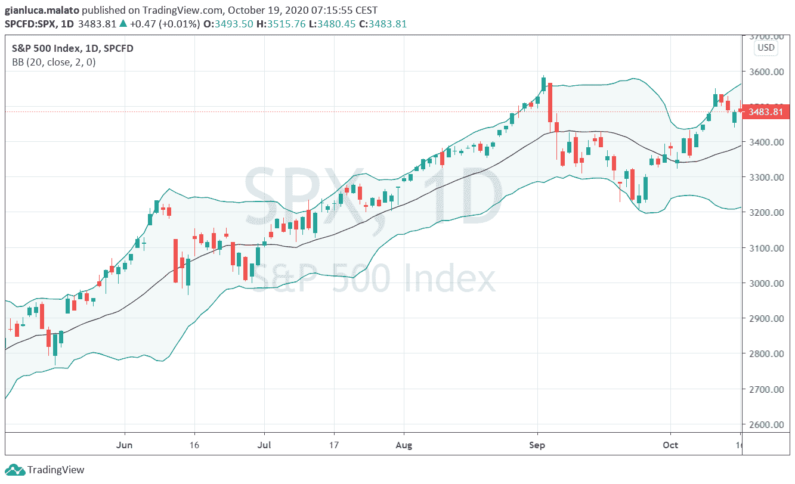
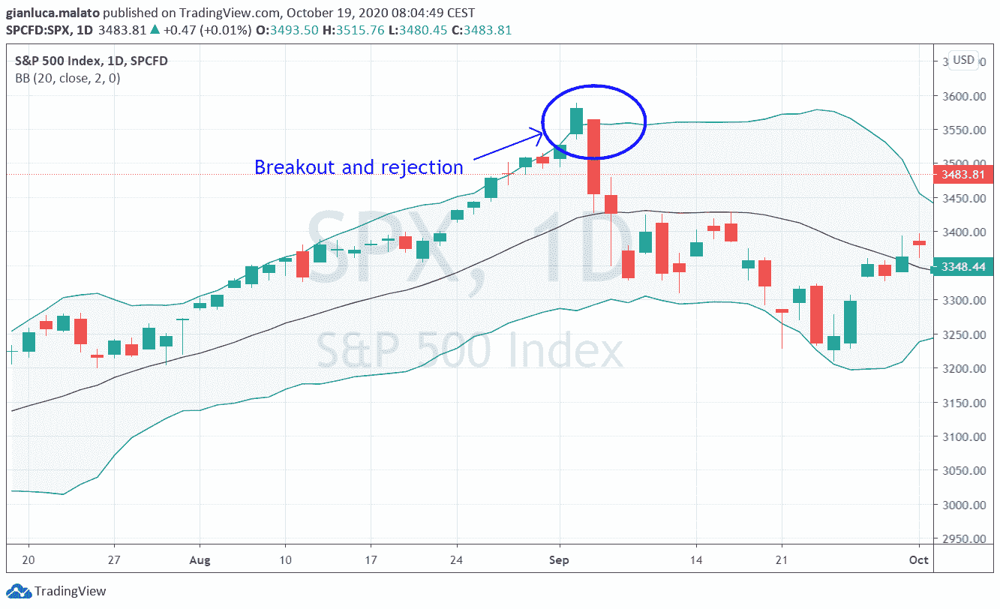
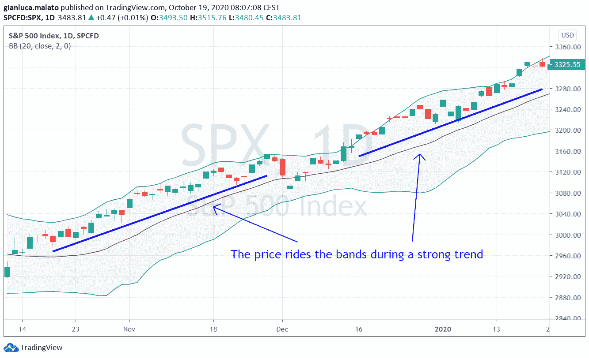
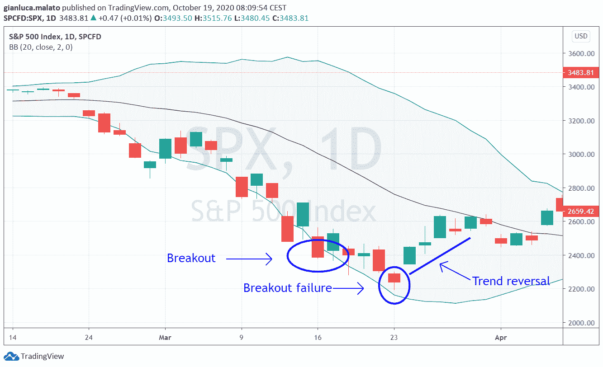
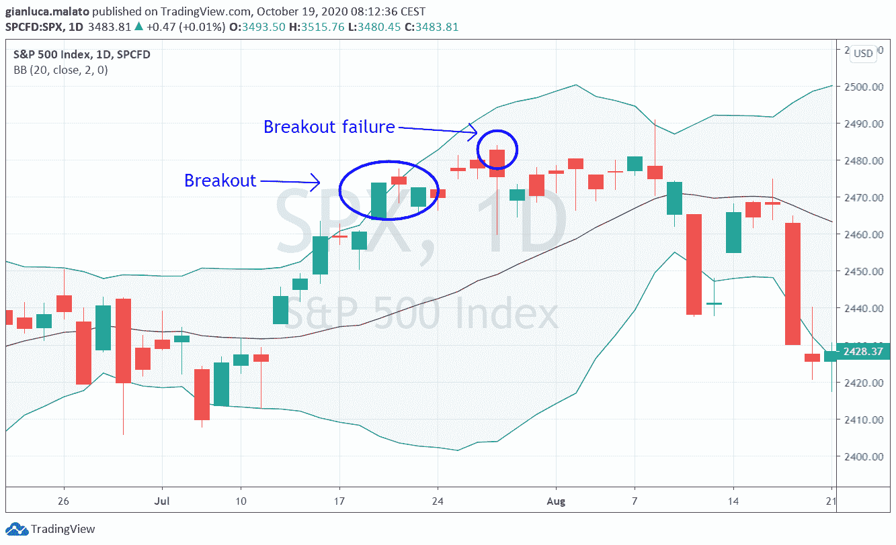
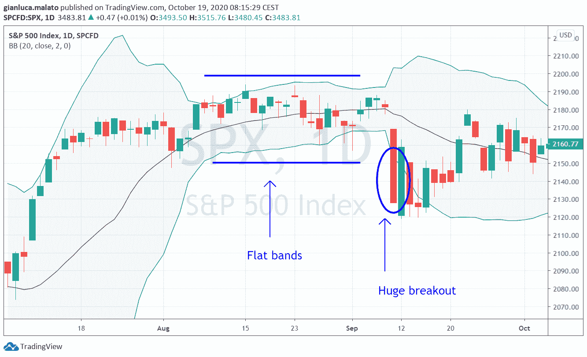
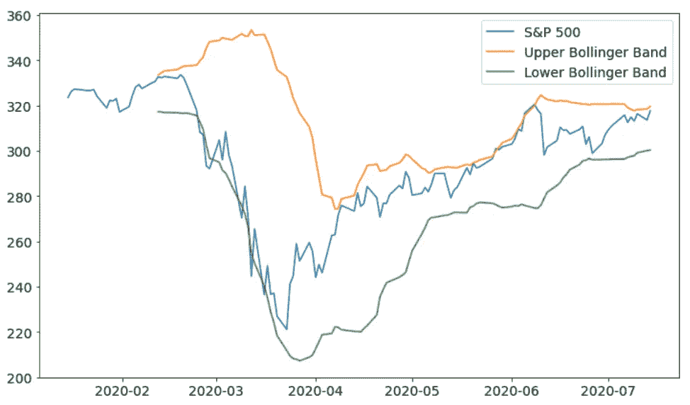

# 股票交易的布林线 Python 中的理论与实践

> 原文：<https://towardsdatascience.com/bollinger-bands-for-stock-trading-theory-and-practice-in-python-7d3e79d30e02?source=collection_archive---------13----------------------->

## 让我们看看 Python 中一个简单但有效的交易工具



作者图片

量化交易者经常寻找能发现趋势或反转的交易工具。这类工具应该能够自我适应市场条件，并试图以最准确的方式描述当前形势。

在本文中，我将讨论布林线以及如何在 Python 中使用它们。

***注来自《走向数据科学》的编辑:*** *虽然我们允许独立作者根据我们的* [*规则和指导方针*](/questions-96667b06af5) *发表文章，但我们不认可每个作者的贡献。你不应该在没有寻求专业建议的情况下依赖一个作者的作品。详见我们的* [*读者术语*](/readers-terms-b5d780a700a4) *。*

# 布林线有哪些？

布林线是量化交易者约翰·布林格在 20 世纪 80 年代推出的工具。它们由两条线组成，以与波动性相关的方式包裹价格时间序列。波动性越高，波动幅度越大。

它们通常以这种方式绘制:

*   高波段:20 周期简单移动平均线加上 2 倍的 20 周期滚动标准差，两者都是基于收盘价计算的
*   较低波段:20 期简单移动平均线减去 2 倍 20 期滚动标准差，两者都是根据收盘价计算的

这是应用于标准普尔 500 指数的 SPX ETF 的结果:


正如你所看到的，波段试图包裹价格，但当价格突破它们时，会发生一些特殊的事件，我们可以利用这些事件来建立许多交易策略。

# 布林线策略

让我们看看一些可以用布林线发现的交易设置。

## 拒绝

二元期权交易者最常用的方法是将布林线视为动态支撑和阻力。一旦价格打破了一个波段，一般认为它可能会回到均线。



突破和拒绝模式。图片由作者提供。

然而，虽然这种方法看起来不错，但布林格自己通常建议将波段与另一个指标结合使用，例如，振荡指标。我们将看到打破波段通常不是一个反向信号。

## 骑着乐队

如果趋势强劲，一些蜡烛的价格可能会接近一个区间。这是因为强劲的趋势意味着高波动性，所以波段扩大，价格跟随他们。



价格波动很大。图片由作者提供。

## w 和 M 模式

一组非常常用的模式是 W-M 模式。前者与后者相反。当价格打破下波段，然后上涨，然后再次下跌，最后上涨而没有再次打破波段时，出现 w 形态。真的好像画了个 W 字母。



w 模式示例。图片由作者提供。

当价格突破上带时，出现 M 型形态，然后在没有再次突破上带的情况下形成新的最大值。



m 模式示例。图片由作者提供。

这些模式通常被认为是动量的减少，所以它们以相反的方式使用。w 形态看涨，M 形态看跌。

## 挤压和破裂

不要忘记，市场波动会随着时间的推移而变化，有些低波动期会引发市场的大规模定向爆发。布林线可以很容易发现这种情况。你必须寻找一个市场条件，其中波段是平坦的，其宽度是恒定的。这被称为“挤压”，因为波动性正在降低。然后，你必须寻找一个巨大的蜡烛突破。这是价格定向爆发的前奏，你可以沿着突破的方向交易。



挤例子。图片由作者提供。

# 布林线参数

布林线有两个参数:均线和标准差的周期(相同)以及标准差的乘数。

20 周期的 SMA 经常被用来捕捉中期运动，所以 20 周期的值是根据经验选择的。

我们来谈谈标准差的乘数。根据正态分布，一个正态变量的值有接近 95%的概率远离均值 2 个标准差以上。这就是 2 这个数字的由来。

事实上，我们知道价格不遵循正态分布。根据几何布朗运动模型，对数正态分布是价格分布的一个很好的近似。而且根据[切比雪夫不等式](https://en.wikipedia.org/wiki/Chebyshev%27s_inequality)，任何一个有限方差的随机变量，其值远离均值超过 2 个标准差的概率小于 25%。所以，这相当高，与正常情况下的 5%有很大不同。

约翰·布林格本人建议使用一组略有不同的参数，根据某些特定情况改变乘数和周期。

然而，20-2 组合被广泛认为几乎是交易的标准。

# Python 中的一个例子

用 Python 计算布林线非常容易。我们将利用标准普尔 500 的历史数据来看看如何做到这一点。完整的代码可以在我的 GitHub 知识库中找到:[https://GitHub . com/gianlucamalato/machine learning/blob/master/Bollinger _ bands . ipynb](https://github.com/gianlucamalato/machinelearning/blob/master/Bollinger_Bands.ipynb)

首先，让我们安装 yfinance:

```
!pip install yfinance
```

然后让我们导入一些库:

```
import yfinance
import pandas as pd
import matplotlib.pyplot as plt
```

让我们从标准普尔 500 指数中导入一些数据:

```
name = "SPY"ticker = yfinance.Ticker(name)df = ticker.history(interval="1d",start="2020-01-15",end="2020-07-15")
```

我们可以定义周期和乘数:

```
period = 20
multiplier = 2
```

然后，我们可以最终计算波段:

```
df['UpperBand'] = df['Close'].rolling(period).mean() + df['Close'].rolling(period).std() * multiplierdf['LowerBand'] = df['Close'].rolling(period).mean() - df['Close'].rolling(period).std() * multiplier
```

最后的图表是:



作者图片

正如你看到的，波段包装的价格就像预期的一样。

# 结论

布林线在交易中非常有用，计算也非常简单。使用这种动态工具的不同策略会导致不同的结果，因此应该对交易策略进行良好的回溯测试，以微调指标的参数。