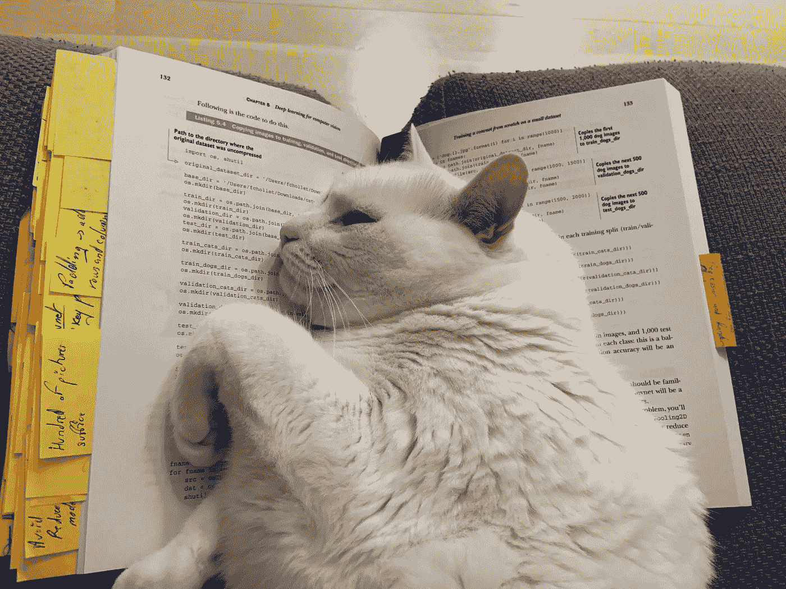

# 书评:用 Python 进行深度学习，2017，弗朗索瓦·乔莱，曼宁

> 原文：<https://towardsdatascience.com/book-review-deep-learning-with-python-2017-fran%C3%A7ois-chollet-manning-99c36faa5a29?source=collection_archive---------44----------------------->

作者 Take 用 Python 深度学习，2017，Franç ois Chollet 的书和我的猫

## 不到 10 分钟的深度学习世界之旅。

我花了很长时间才打开这本书。更多的是因为害怕发现自己什么都不知道，而不是因为害怕对什么都知道感到沮丧。我定期收到关于人工智能、机器学习或深度学习的“最佳”或“最受欢迎”书籍的简讯。*使用 Python 进行深度学习*一直被认为是最值得推荐的方法之一。给定的等级经常在高级、中级或专家之间变化。我认为，我们不应该停留在某个人估计的水平上。出于兴趣，出于需要，你必须拿起一本书来读。

任何想学习的人都可以接触到这本书。写作的流畅性和简单性允许理解所有的概念，不管水平如何。

# 第 1 部分:深度学习的基础

## 第 1 章——什么是深度学习？

这本书的第一章给了读者一个很好的**领域中使用的定义**的概述，以及我们确切地称之为算法方式的 ***学习*** 。作者简明扼要地讲述了**人工智能的历史**。

有很多**解释和上下文**来解释什么是深度学习，以及为什么它最近才出现在我们的行业和现实世界中(硬件、数据、摩尔定律……)。

作者为读者提供了不同机器学习算法和神经网络如何工作的清晰解释。

我很欣赏算法使用的背景以及与竞赛中使用的相似性(为什么这种类型用于特定的任务)。

## 第 2 章— [..]神经网络的数学构建模块

所以我们在这里，在本书的 ***数学*** 部分。嗯，每个人都会被这几句话吓到，但是，作者有一个 ***的特殊方法*** 来解释神经网络背后的数学。他自己的话是:

> 虽然这一节完全涉及线性代数表达式，但您在这里找不到任何数学符号。我发现，如果用简短的 Python 片段而不是数学方程来表达数学概念，没有数学背景的程序员会更容易掌握。所以我们将从头到尾使用 Numpy 代码。

没错，没有数学公式。所以，不要害怕数学，也不要疯狂地认为数学很难或者不可能。作者把学习过程 ***背后的数学不同部分剪得很简单，用 Numpy 代码*** 来解释。

通过这一章，你将熟悉 ***向量、矩阵和张量(以及它们对应的真实世界应用)*** 。与神经网络 的张量 和相应的 ***表示一起使用的不同 ***运算。您还将了解到 ***可微函数******梯度*** 以及什么是 ***梯度下降、*** 随机梯度下降，以及不同的 ***神经网络*** 的对应参数。******

简洁明了这一章解释得很好，并且 ***允许我们很好地理解张量操作和表征学习的*** 。

作者利用几何学让读者将他所解释的概念形象化。

另外，在短短几行中，你将熟悉 ***反向传播*** 及其背后的数学原理。作者重用了前一章的一个例子，并把它分成几部分来映射你刚刚学到的相关数学概念。

一开始我有点犹豫，但是我急切地浏览了这些 ***三十页*** 。

## 第 3 章—神经网络入门

有了这一章，读者能够用神经网络处理分类(二进制和多进制)和回归等大多数常见问题。

作者解释了神经网络的不同部分(层、输入数据、损失函数、优化器)。他提供了用 Keras 编写的代码块，并解释了它们是如何工作的。

你会发现损失函数和优化非常相关的信息。

这些例子。本章提供了三个，每个常见问题一个(二元分类、多类分类、回归)。作者提供了最佳实践以及可视化应该关注的内容。他强调了过度拟合，以及如何评估你的模型，对于不同的问题使用什么损失函数。

你会对这三种情况下神经网络的输出有很好的理解。突出显示的一点是网络的大小，考虑数据集的大小来扩展网络非常重要。如果数据集很小，请选择层数很少的小型神经网络，以避免过度拟合。

这 36 页非常有用，充满了信息和最佳实践。

## 第 4 章—机器学习的基础

本章将让读者对机器学习世界的不同分支做一个调查。你将接触到 ML 世界中四个概念的快速描述。

作者将介绍分类和回归之间的不同概念以及不同的度量和损失函数。

你将知道如何评估你的模型和准备一个项目所需的所有步骤。从数据开始，到超参数调整结束。

作者提出了培训、评估和测试的重要性。您将了解评估您的模型的常用方法以及不同方法背后的代码。您还可以找到关于特征工程和数据格式的适当信息。

您将找到关于过度拟合和欠拟合的适当信息，以及这对您的模型意味着什么以及避免它们的方法。作者提供了一个关于*辍学*以及如何使用它的很好的解释。

还有最后一点，每个项目都需要走的机器学习工作流程。当开始一个机器学习问题时，你会发现不同的假设和一步一步的遵循。

因此，这是一个小章节(26 页)，但在机器学习的研究项目中，有许多重要信息需要记住。

***简历第一部分***

在这一点上，你到达了本书第一部分的结尾，你通过了深度学习世界的所有基础部分，以及如何在你的项目中精确地使用它们。您将知道从哪里开始、寻找什么、如何准备数据、如何训练、评估和测试您的模型。理解算法每一部分背后的数学的重要性。但最重要的是，你有这个学科的背景和过程的定义。

# 第 2 部分:实践中的深度学习

## *第五章——计算机视觉的深度学习*

在这一章中，作者将解释卷积神经网络(CNN)的所有概念。这部分有很多信息。

作者从 CNN 如何工作的操作开始(过滤器、填充、步幅、池…)。然后你将知道如何在一个小的数据集中使用它们来获得好的结果。你将熟悉计算机视觉中的过拟合概念，以及如何避免它(数据扩充、丢失……)。

下一步是通过预先训练的模型，它们的目标，它们是如何获得的，以及如何在不同的情况下使用它们来提高预测的准确性。作者解释了特征提取的概念和微调的概念(调整预训练 CNN 的最后几层，以学习特定的过滤器或特定数据的表示)，以及如何在低数据集的情况下使用它们。

这一章以康文网如何看待世界的形象化结尾。研究模型每一层的不同抽象表示的三种方法。

作者用了一个图像分类(狗/猫)的例子，提供了很多代码解释他描述的所有事物的每一步。

## 第 6 章—文本和序列的深度学习

在探索了图像识别的世界之后，作者带领我们进入文本和序列数据的世界。对于那些对 NLP 和时间序列问题感兴趣的人来说，这部分真的很神奇。

这一章首先解释了需要如何准备数据。你将了解符号化、n-grams、一键编码和单词嵌入(我看到的最好的解释是 Coursera 提供的[深度学习专门化)。作者提供了大量代码来使用这些不同的技术和预训练的模型(*手套*，…)。](https://www.coursera.org/lecture/nlp-sequence-models/learning-word-embeddings-APM5s)

在关于数据的部分之后。你将探索递归神经网络(RNN)及其变体，LTMS，GRU 和双向的世界。作者提供了足够的理论来理解代码(Keras)与具体的例子。您将能够在文本数据上使用不同的模型，并轻松地重现本章第一部分中显示的结果。

本章的结尾是关于 RNNs 更高级的应用，如时间序列和文本生成。您还将学习如何在 RNN 使用 dropout，以及如何使用 CNN 处理文本或时间序列，但是在考虑时间序列时，您会看到这种类型的模型的缺点。

## 第 7 章—高级深度学习最佳实践

在本书的这一步，您将了解 Keras 的高级功能。作者为您提供了从顺序模型到函数式 API 的建议。为什么这很重要？因为有了这种可用性，你就可以拥有多输入模型或多输出模型。

您将对非循环图(作为初始模型)、剩余连接(ResNet 模型)、在层之间共享权重或使用模型作为层进行解释。

您还有关于使用 Tensorboard 和回调(不同的类型以及如何使用它们)来监控模型的最佳实践。您还将了解如何以及何时使用批量归一化和深度方向可分离卷积。

本章最重要的部分，对我来说，是超参数优化的部分。作者介绍了调整它们的不同方法以及如何使用集合模型。

你将有 36 页的浓缩信息，但它非常有用。

## 第八章——生成式深度学习

激动人心的一章，然后是这一章。第一部分是文本生成，您将学习如何编写一个语言模型来生成具有不同可能性的文本。最重要的是知道如何为下一个字符或下一个单词重新加权概率分布，以便在文本生成中产生创造力。

然后，你将可以访问 DeepDream 上的大量信息，以及如何将它用于预训练的模型。你将学习如何创造新的图片，以及这一代人的内在机制是什么。

神经风格转移，是什么？你会在这一章学到，这是一种将一张图片的内容和另一张图片的风格混合在一张新图片中的能力。是的，你将了解到*内容*和*风格*可以用数学方法写出来，并放入神经网络中进行混合。

变分自动编码器和生成对抗网络我们到了。在几页~20 页中，你有很多关于图像生成的 VAEs 和 GANs 的信息。您将找到相关信息来区分两者，并选择在您的案例中使用哪一个。GANs 是最难训练的，所以作者提供了不同的技巧让你更好地理解模型的行为。GAN 部分对我来说是最有趣的，因为我从来没有使用它们。

我带着对生成数据的不同技术的良好直觉完成了这一章。图像生成是 GANs 最大的部分，也是最有趣的部分。

## 第 9 章—结论

作者在这一章的开头提供了这本书的简明摘要。然后，作者很好地理解了深度学习的局限性，并将其置于 AI 的世界中。你也在你的探索中找到作者对深度学习未来的感受，以及往哪里看。有一点，关于 AutoML，与这个领域最近的进展相提并论是很有趣的。您还可以找到如何与该领域保持同步的信息。

## 最后的话

我希望这本书的简短摘要能给你关于内容的相关信息，让你找到你需要的东西。这本书在我的图书馆里已经放了很长时间了，购买它的目的主要是为了使用第 6 章中关于 NLP 的内容。

我目前正在进行一项不同的探索，来填补我自学的所有弱点。所以，我开始接受挑战，超越我的舒适区。第一步，把自我放在一边，承认我并不知道一切(远非如此)。剩下的，去攻克能有帮助的课本。使用 Python 进行深度学习是长期被列为基准的基石。在探索它并做了无数笔记和便利贴后，我觉得我已经准备好继续我的旅程，进入我感兴趣的子域。

## **关于作者:**

弗朗索瓦·乔莱(Franç ois Chollet)是谷歌大脑团队的人工智能研究员，也是 Keras 深度学习图书馆的作者。

**弗朗索瓦·乔莱，*用 Python 进行深度学习* (2017)，曼宁**

> 等待第二版的出版