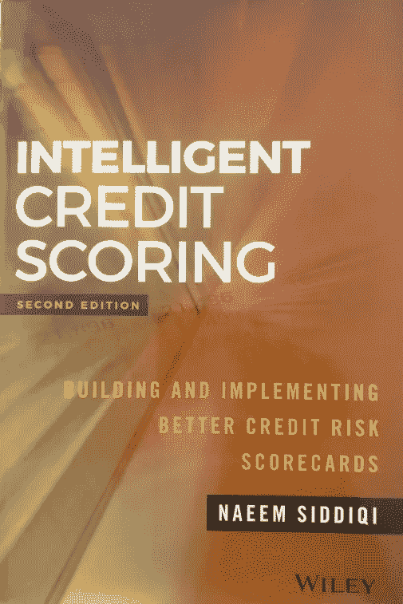

# 书评:Naeem Siddiqi 的“智能信用评分”

> 原文：<https://towardsdatascience.com/book-review-intelligent-credit-scoring-by-naeem-saddiqi-334dacb001a9?source=collection_archive---------44----------------------->

## 关于如何开发和使用信用风险记分卡的完整指南

《智能信用评分》图书封面(作者本人*法师)。*

# 1.介绍

从信用卡到房屋抵押贷款，记分卡是所有现代贷款业务的核心。记分卡的核心思想是将客户支付贷款的概率(个人的信誉)转化为易于理解的数字，以指导商业决策。尽管记分卡并不新鲜，但随着新的大数据/人工智能场景的出现，它已经发生了很大变化，尤其是在 2008 年金融危机之后。

> “[智能信用评分](https://amzn.to/2zj1rFF)”为您提供的不仅仅是对该主题的介绍。这是一个由该领域最有影响力的作者之一撰写的关于如何工作和构建记分卡的完整指南。

乍一看，当我收到 [*智能信用评分*](https://amzn.to/2zj1rFF) 时，我想这将是一本更无聊的书，我会阅读介绍，也许是前几章，然后把它装饰在我的书架上，也许在需要时用它进行研究。但是我完全错了！阅读这本书实际上是令人愉快的，对于一本 400 页、包含信贷监管和模型监控章节的技术信息的书来说，阅读速度超出了我的预期。

# 2.图书主要受众

[*智能信用评分*](https://amzn.to/2zj1rFF) 是一本面向广大受众，从行业初学者到经验丰富的专业人士的通俗易懂的书。无论你是信用分析师，信用评分经理，还是数据科学家，这本书的内容将提供关于如何创建，评估和监控记分卡的更深入的观点。

# 3.这本书的结构

在介绍(第 1 章)之后，作者描述了负责记分卡开发和实施的团队中每个人的角色(第 2 章)。信用评分的一个有趣的方面是，它通常是由一个大团队执行的工作，有各种各样的专业人员。

下一章定义了维护成功记分卡所需的基础设施，并总结了从数据收集到模型实施和监控的过程。从第 4 章到第 14 章，作者详细描述了记分卡开发的每个阶段，将流程分为 7 个部分。

## 第一阶段，规划

在开始记分卡开发之旅之前，你需要回答一些关于你的商业计划的问题，以及你的公司是否有可用的基础设施和人力资源。还列出了开发内部和外部记分卡的优点和缺点，以帮助您做出决定。

## 阶段 2，数据审查和项目参数

虽然我们生活在一个大数据时代，但拥有大量数据是不够的。为了让你的项目成功，你需要的不仅仅是数量，还有组织有序的数据。在这个阶段，Siddiqi 指导读者如何设置默认定义，这是开发过程中的一个关键步骤。基于新巴塞尔协议的当前监管信息对记分卡行业非常重要，在第 7 章中有很好的介绍。目前，新巴塞尔协议第三版和第四版的更新已经在讨论和实施中，如果能在新版本中提供这些信息，那就太好了。

## 阶段 3，数据库创建

就像任何数据科学项目一样，在记分卡开发中，拥有高质量的数据比使用更好的模型更重要。这就是这本书的这一部分如此重要的原因。创建和过滤要素以及替换缺失值是数据库创建过程的一部分，应该非常小心谨慎地执行。本课程中提到的另一个重要方面是将数据集分为训练数据集和测试数据集，以评估模型性能。本次会议还提到了记分卡中使用的替代数据和更大数据集(大数据)的潜力，监管和技术相互影响，决定了该领域的创新。

> “在一个不缺乏信息的时代，最有行动洞察力的银行才是赢家。”— [智能信用评分(第二版)，纳伊姆·西迪奇](https://amzn.to/2zj1rFF)

## 阶段 4，记分卡创建

数据库准备就绪后，是时候开始处理您的要素了。在本书的这一部分，你将学习如何运用证据权重，用它将你的变量分成同类的类别。在特征选择的过程中使用了像信息值这样的其他概念。以下部分描述了如何使用逻辑回归来创建记分卡，以及如何从结果模型中计算分数。

## 阶段 5，记分卡管理报告

记分卡只有在表现出反映当前客户群体的一致绩效时才有价值。这就是监控模型如此重要的原因。本书的这一部分介绍了一些性能指标和报告模板，以帮助你设计自己的管理系统。

## 阶段 6，记分卡实施

记分卡创建完成后，就该投入生产了。但是仅仅用它来获得新客户是不够的。你必须确保它根据经验证的数据集表现良好。因此，跟踪人口稳定性指数等指标有助于监控模型性能。此外，根据业务战略，可以使用多个记分卡来评估客户的信用风险状况。本课程将介绍组合记分卡和设置临界值的不同策略。

## 第 7 阶段，监控

最后，记分卡开发的整个周期在团队使用一套工具来监控模型性能的阶段结束。客户的概况受各种外部事件的影响，所以不要指望你的模型能长时间保持最初的性能。作者提出了一系列的方法和策略来使用记分卡，以帮助您管理您的投资组合和做出明智的商业决策

# 4.主要要点

正如简介中所提到的，**智能信用评分是一本面向广大读者的通俗易懂的书，所以即使你是新手，它也会对你有很大的价值。**

**这本书的另一个有趣的方面是，它背后的数学和统计学相对简单。所以即使你在精确科学领域没有很强的背景，你也能真正理解关于所呈现概念的逻辑。**

**最后，记分卡从来都不是一个人或一个小团队的产品。它的发展需要来自机构内部各种专业人士的反馈，以反映业务逻辑，并显示其对公司和银行内部决策的真正价值。**

# **非常感谢你阅读我的文章！**

*   **你可以在我的[个人资料页面](https://medium.com/@gabrielsgoncalves) **找到我的其他文章🔬****
*   **如果你喜欢并且**想成为中级会员**，你可以使用我的 [**推荐链接**](https://medium.com/@gabrielsgoncalves/membership) 来支持我👍**

# **创建信用评分的额外资源**

**这本书缺少的一点是让你自己实现记分卡的代码示例。作者给出的例子都使用了 SAS 平台，这个平台对记分卡的发展有着重要的历史意义。但是，除非您的公司使用 SAS 环境，否则您可能需要使用其他语言实现逻辑。**

**好消息是，开源(或以非常便宜的价格)资源可以帮助你构建自己的记分卡。如果您是使用 Python 的数据科学家或开发人员，我强烈建议您查看以下资源:**

## **A) [OptBinning](https://github.com/guillermo-navas-palencia/optbinning) (Python 库)**

**由 [Guillermo Navas Palencia](https://github.com/guillermo-navas-palencia) 开发的这个库有一些强大的工具来执行变量的宁滨。Optbinning 提供了对证据权重、信息值和每个变量的其他重要指标进行可视化的方法，帮助您为模型选择最佳特征。OptBinning 最近加入了一个记分卡开发模块，使整个过程快速而稳定。**对于使用 Python 的记分卡开发者来说，这可能是一个必看的项目！****

** [## 吉列尔莫-纳瓦斯-帕伦西亚/奥普宾宁

### OptBinning 是一个用 Python 编写的库，它实现了一个严格而灵活的数学编程公式来…

github.com](https://github.com/guillermo-navas-palencia/optbinning) 

## Python 2020 中的信用风险建模(Udemy)

如果你刚刚开始使用记分卡，并使用 Python 作为你的主要编码语言，我强烈推荐你参加这个课程。解释信用评分背后的理论的视频具有很好的教育意义，并且每一步都是使用 Pandas、Scikit-Learn 和 Matplotlib 在 Python 中实现的。因此，在构建记分卡时，你会真正理解每种方法背后的逻辑。

 [## Python 课程中的信用风险建模

### 嗨！欢迎学习 Python 中的信用风险建模。教你银行如何使用数据科学的唯一在线课程…

www.udemy.com](https://www.udemy.com/course/credit-risk-modeling-in-python/)**