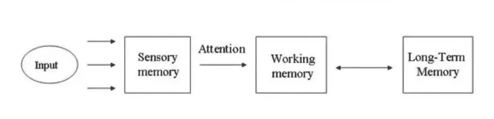
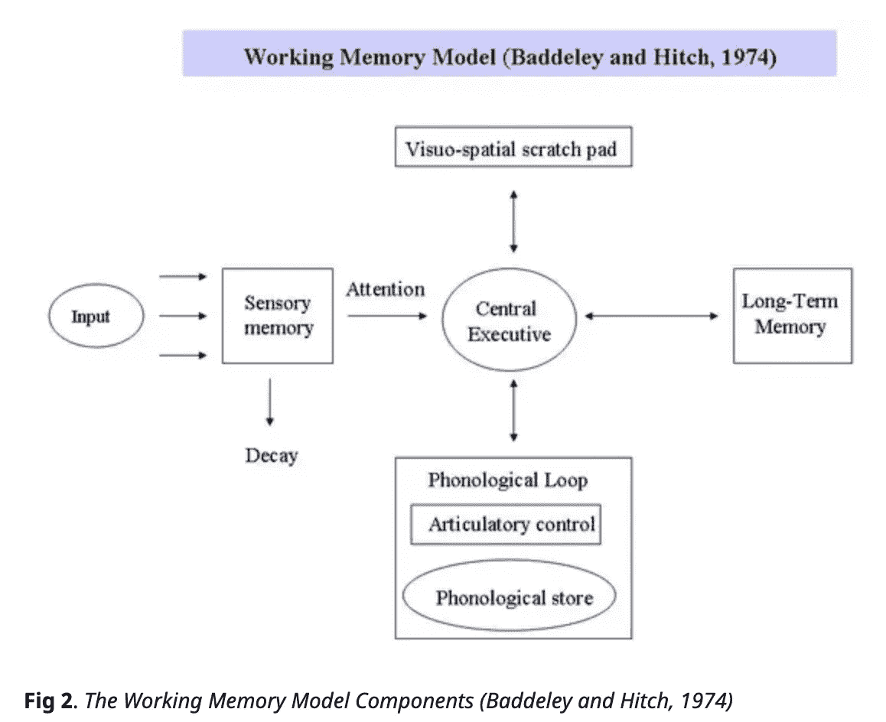

# 书评:其他想法(1/2)

> 原文：<https://towardsdatascience.com/book-review-other-minds-4176bd62edae?source=collection_archive---------64----------------------->

## 上午 12 点的对话

## 动物的大脑，我们的大脑，还有电脑的大脑…

阿什·埃德蒙兹在 [Unsplash](https://unsplash.com?utm_source=medium&utm_medium=referral) 上拍摄的照片

这个星期我想做一些不同的事情，分享一些我刚刚读完的一本书的想法。这本书名叫《T4:其他意识:章鱼、海洋和意识的深层起源》，作者是*彼得·戈弗雷-史密斯。*

我看过的所有关于这本书的书评都集中在章鱼有多聪明。这是有道理的，因为章鱼是这本书的主角，但我想说点别的。我想分享的一件事是，书中的一些概念如何奇怪地让我想起计算机科学中的概念。比如章鱼左右脑交流的方式，让我想起了 XG bosting 的优化。我们记忆系统的理论让我想起了数据结构。

**还有一个是关于主观体验的话题，**我很感兴趣的东西。作者对什么是主观体验进行了一次非常有趣的讨论。例如，当我们看到一种颜色和机器人看到一种颜色相比，为什么我们会认为它是不同的。我将用章鱼的例子来介绍这个话题，因为章鱼，伪装的大师，可以改变甚至比变色龙更多的颜色，是色盲。他们是怎么做到的？他们“看见”一种颜色吗？最后，我还想讨论一下，机器人是否有一天也能拥有主观体验。

[列宁·埃斯特拉达](https://unsplash.com/@lenin33?utm_source=medium&utm_medium=referral)在 [Unsplash](https://unsplash.com?utm_source=medium&utm_medium=referral) 上的照片

## 章鱼的大脑和 XG Boosting 的优化

我们都知道我们身体有左右两边，比如左脑和右脑，或者左手和右手。然而，大多数时候，我们只是把我们的大脑称为大脑，因为我们没有从左右两侧获得单独的信息。我们从左右两边作为一个整体得到一条连贯的信息。

但是在动物世界里这并不总是正确的。在一项使用九只鸟的研究中，其中八只不在左右脑之间传递信息(Godfrey-Smith，84)。例如，如果一只鸟用一只眼睛学习一个非常简单的技能，那么这只鸟只使用另一只眼睛进行测试，这只鸟将无法做到。(是啊..)

GIF via [GIPHY](https://media.giphy.com/media/5hs5eKmprnJK5hTVGq/giphy.gif)

乍一看，你觉得这太疯狂了！但是，Giorgio Vallortigara 等动物研究人员指出，这实际上是有道理的。不同的任务需要不同类型的处理，所以最好有专门的方面，不要把它们彼此联系得太紧密。章鱼呢？

章鱼介于鸟类和我们之间。有些信息确实被传递了，但并不总是如此，而且这个过程并不像我们这样简单和同步。此外，章鱼也有许多遍布全身的神经元。这意味着章鱼的手臂可以看、感觉和思考…

它是这样工作的:章鱼的手臂可以随心所欲地做事情，不需要大脑的任何命令。大脑可能不知道手臂接触或学习了什么。而且，如果大脑想和手臂一起工作，它会向手臂发送信号，T2 希望手臂会配合。然而，当章鱼警觉时或在某些情况下，大脑似乎可以很好地控制手臂。整个章鱼就像我们一样作为一个整体一起工作。

我喜欢作者在书中的比喻。想象一下我们与呼吸的关系。当我们想要的时候，我们可以控制我们的呼吸，但是通常，我们不会注意到他们在做什么。

这与 XG boosting 算法有什么关系？

很多人把我们的大脑比作机器。我们知道，我们的大脑可以快速处理大量信息，具有非常高的计算能力。为了拥有这样的力量，大脑有 860 亿个神经元，是灵长类动物中最多的，它消耗了我们身体 20%的能量。这是一种昂贵的机器，大多数其他动物的大脑无法承受这样的功率。因此，他们找到了优化操作的方法。

将此放入算法的上下文中，找到最优解的一种方法是使用蛮力算法。该算法与贪婪算法形成对比。该算法保证全局最小值，这是贪婪算法所不能保证的，但是它很慢并且需要很高的计算能力。

决策树使用贪婪算法，经常会遇到过拟合的问题。虽然 XG Boosting 是一种基于树的算法，但它不会遇到这个问题，因为它实际上使用了一种强力算法。然而，即使在处理大型数据集时，它仍然可以高效运行。因为它实际上使用了半蛮力。我想称之为选择性蛮力，因为它在选择性样本上运行蛮力算法。(更多信息: [*XGBoost 第四部分:疯狂酷炫优化*](https://www.youtube.com/watch?v=oRrKeUCEbq8&list=PLblh5JKOoLUICTaGLRoHQDuF_7q2GfuJF&index=55) )

这就是我如何把动物世界和三种算法联系起来的。我们的大脑就像是蛮力算法。它会自动进行大量计算并找到最佳解决方案。其他计算能力较低的动物大脑就像树算法。大脑的每一侧，或者说对于每一个不同类型的问题，它都会构建一个树算法来解决这个特定的问题。

说到章鱼，它们就像一个内置了许多优化工具的 XG boosting 算法。他们只传递一些信息，如果需要，他们会有意识地传递更多的信息。这样，大脑需要更少的计算能力，但仍然相当聪明。你知道当我读到章鱼的手臂会思考时让我想起了什么吗？那是 XG boosting 的并行学习…

GIF via [GIPHY](https://media.giphy.com/media/ZmTJBhmeyd83K/giphy.gif)

## 人类记忆和计算机数据结构

书中谈到了英国心理学家艾伦·巴德利(Alan Baddeley)和格拉姆·希奇(Gramham Hitch)的名著《工作记忆模型》(model of working memory)。该模型认为，工作记忆是对少量信息的短期储存。当我们需要进行有意识思考/系统 2 思考时，我们会使用这些信息。

经过 simplypsychology.org 的[麦克劳德 2012](https://www.simplypsychology.org/working%20memory.html)

你们中的一些人可能更熟悉短时记忆这个词。短时记忆和工作记忆都是指不储存在长时记忆中的记忆。STM 只强调信息的储存，但是工作记忆框架关注的是我们实际上是如何使用这些信息的。所以大致来说，工作记忆框架涵盖的范围更广。(更多信息: [*关于工作记忆和短时记忆的区别*](https://www.ncbi.nlm.nih.gov/pmc/articles/PMC3425965/) )

[麦克劳德 2012](https://www.simplypsychology.org/working%20memory.html) 途经 simplypsychology.org

在工作记忆框架中，有三个组成部分:语音回路(P)，视觉空间画板(V)和中央执行，c。P 部分处理口语和书面材料。V 部分处理视觉和空间信息。C 部分是确保一切顺利进行的控制中心。(更多信息: [*工作记忆*](http://www.scholarpedia.org/article/Working_memory) )

从对短期记忆的研究中，我们知道我们的短期记忆储存了大约 7 个项目。所以，如果你想记住 10 个数字的电话号码，把它们分成 3 块:123-456-7890(啊哈！)

还记得任何以类似方式工作的数据结构吗？是哈希表 EE！！(更多信息: [*下架哈希表*](https://medium.com/basecs/taking-hash-tables-off-the-shelf-139cbf4752f0) )

GIF via [GIPHY](https://media.giphy.com/media/I6rvXpuoS5jLq/giphy.gif)

请这样想:我们可以储存在短期记忆中的 7 个项目就像是哈希桶。而中央执行部分的职责之一就是确保我们没有任何“冲突”。

在每个桶中，我们以数组的形式存储信息。这实际上也对应于当我们想要回忆一些事情时，我们的记忆是如何工作的。研究表明，短时记忆中的回忆是有顺序的，除非你已经知道它在序列中的位置。因此，为了回忆短期记忆，将事物按一定的顺序排列是有帮助的。就像在数组中搜索一个项目一样！

我们短时记忆的优缺点也像一个数组。它是为搜索而设计的，因为搜索很快，但它不适合存储大容量的内存。对于存储大容量内存，另一种数据结构，链表可以做得更好。

长期记忆的行为就像一个链表。长期记忆储存在我们大脑的不同地方，但短期记忆大多在前额叶皮层。从长期记忆中回忆，不是按顺序，而是通过联想。这就是为什么对于失去记忆的人来说，为了回忆，看看过去相关的事情会对他们有帮助。

长期记忆的储存空间仍然被认为是无限的。我怀疑它是无限的是因为长期记忆的空间客观上是如此之大，以至于我们还没有找到极限？或者是因为长期记忆可以有不同的大小，比如链表。因此，存储**看起来**是无限的。(更多信息: [*总之什么是链表【第二部分】*](https://medium.com/basecs/whats-a-linked-list-anyway-part-2-131d96f71996) )

[timJ](https://unsplash.com/@the_roaming_platypus?utm_source=medium&utm_medium=referral) 在 [Unsplash](https://unsplash.com?utm_source=medium&utm_medium=referral) 上拍照

你可能想知道为什么我在谈论记忆系统，而这本书是关于章鱼的？这是因为作者试图理解为什么章鱼在没有明显原因的情况下不断改变它们的颜色。比如他们完全独处的时候。他怀疑这是一个类似于人类自言自语的想法。

拥有工作记忆就是当我们在头脑中说话时，人类能够听到我们自己的声音。这将我们与章鱼区分开来。章鱼被认为缺乏自言自语的能力。我将在下一篇博客中继续这个讨论，在这篇博客中，我想谈谈主观体验和高阶思想。

参考:

*   巴尔斯，B . j .和 N M .盖奇。认知神经科学基础:初学者指南。n.p .:爱思唯尔学术出版社，2013 年。
*   伯特温尼克，硕士；王；考恩，e；罗伊；巴斯蒂亚宁，c；P.J .梅奥；侯克，J.C. (2009 年)。“猕猴的即时系列回忆表现分析”。*动物认知*。**12**(5):671–678。[doi](https://en.wikipedia.org/wiki/Doi_(identifier)):[10.1007/s 10071–009–0226-z](https://doi.org/10.1007%2Fs10071-009-0226-z)。[PMID](https://en.wikipedia.org/wiki/PMID_(identifier))1946 21 89。
*   彼得·戈弗雷·史密斯。其他思维:章鱼、海洋和意识的深层起源。第一版。纽约:法勒，斯特劳斯和吉鲁，2016。打印。
*   McLeod，S. A. (2012 年)。工作记忆。单纯的心理学。[https://www.simplypsychology.org/working%20memory.html](https://www.simplypsychology.org/working%20memory.html)
*   页面，m；诺里斯博士(1998 年)。“首要模型:即时系列回忆的新模型”。*心理复习*。105(4):761–781。[doi](https://en.wikipedia.org/wiki/Doi_(identifier)):[10.1037/0033–295 x . 105 . 4 . 761–781](https://doi.org/10.1037%2F0033-295x.105.4.761-781)。PMID 9830378。

有关更多信息:

*   [XGBoost 第 4 部分:疯狂酷炫的优化](https://www.youtube.com/watch?v=oRrKeUCEbq8&list=PLblh5JKOoLUICTaGLRoHQDuF_7q2GfuJF&index=55) *，* Josh Starmer
*   [从货架上取下哈希表](https://medium.com/basecs/taking-hash-tables-off-the-shelf-139cbf4752f0)，Vaidehi Joshi
*   [总之，什么是链表【第二部分】](https://medium.com/basecs/whats-a-linked-list-anyway-part-2-131d96f71996)，Vaidehi Joshi
*   关于工作记忆和短时记忆的区别，巴特·翁瑞迪、斯文·斯塔佩特和阿尔扬·布洛克兰
*   [工作记忆](http://www.scholarpedia.org/article/Working_memory)，艾伦·巴德利和格雷厄姆·j·希奇