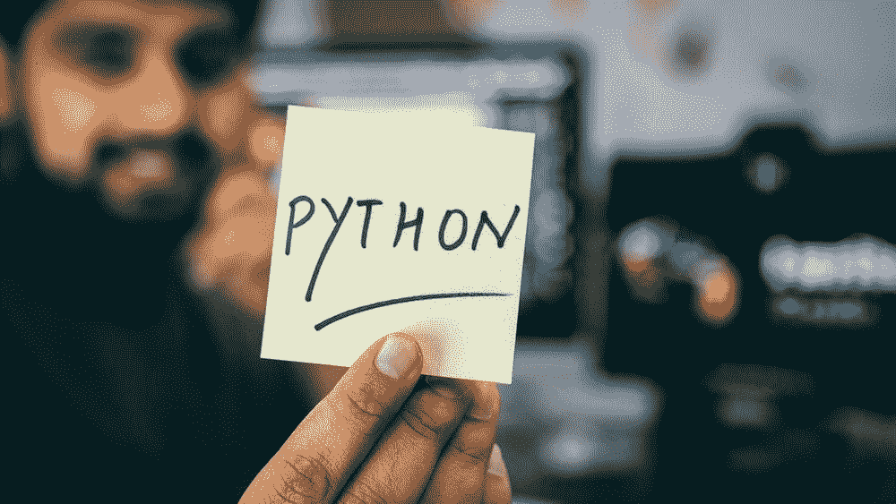

# 如果你是 Python 的新手(尤其是如果你是自学 Python 的话)，请将此加入书签

> 原文：<https://towardsdatascience.com/bookmark-this-if-you-are-new-to-python-especially-if-you-self-learn-python-54c6e7b5dad8?source=collection_archive---------3----------------------->

## Python 中简单但有用的技巧和提示列表

> 在我们的调查中，增长最快的主要编程语言 Python 再次在编程语言中排名上升，今年超过 Java，成为第二大最受欢迎的语言(仅次于 Rust)。[1]



在 [Unsplash](https://unsplash.com/s/photos/python3?utm_source=unsplash&utm_medium=referral&utm_content=creditCopyText) 上由 [Hitesh Choudhary](https://unsplash.com/@hiteshchoudhary?utm_source=unsplash&utm_medium=referral&utm_content=creditCopyText) 拍摄的照片

如果你是因为枯燥的隔离生活才开始接触 Python，那么恭喜你。你正在学习发展最快的主要编程语言。我相信你已经知道了 Python 的一些优点，比如它的简单、易学等。这些也是我五年前学习 Python 的主要原因。因为我希望你能更有效地学习 Python，并且能充分享受学习 Python 的乐趣，这里列出了一些简单但有用的技巧和提示。

提示:目前我正在使用 Python 3.8。如果您在学习我的示例时遇到任何问题，请检查这是否是因为您的 Python 版本。

# 目录

[数值比较](#f09e)

[条件返回语句](#12be)

[在列表/元组的一行语句中分配多个变量](#5819)

[列表理解](#810c)

[使用 zip 比较两个列表中的元素](#a20c)

[使用 lambda 按第二个元素对嵌套数组进行排序](#e916)

[滤镜，贴图](#52cf)

[检查列表中的所有元素是否唯一](#ebf5)

[字符串格式](#0e7b)

[列举](#654d)

[捕获数组的特定部分](#a437)

[形成组合和排列](#b4f4)

## 价值比较

```
>>> a = 1
>>> b = 3
>>> a == 1
True
>>> a == 2
False
>>> a == b
False
>>> a > b
False
>>> a <= b
True
>>> if a <= b :
...     print('a is less than or equal to b')
...
a is less than or equal to b
```

您可以比较两个对象的值。该返回为真/假。可以在 if-else 语句中直接使用比较作为条件。

## 条件返回语句

代替

```
>>> def compare(a,b):
...     if a> b:
...             return a
...     else:
...             return b
...
```

可以将条件直接放在 return 语句中。

```
>>> def compare(a, b):
...     return a if a> b else b
...
```

## 在 list/tuple 语句的一行中分配多个变量

而不是:

```
>>> arr_list = [1,4,7]
>>> a = arr_list[0]
>>> b = arr_list[1]
>>> c = arr_list[2]
```

您可以在语句的一行中完成相同的赋值:

```
>>> a, b, c = arr_list
>>> a
1
>>> b
4
>>> c
7
```

## 列表理解

代替

```
>>> arr_list = [1,4,7]
>>> result = []
>>> for i in arr_list:
...     result.append(i*2)
...
>>> result
[2, 8, 14]
```

你可以

```
>>> result = [x*2 for x in arr_list]
>>> result
[2, 8, 14]
```

## 使用 zip 比较两个列表中的元素

代替

```
>>> a = [1,5,8]
>>> b = [3,4,7]
>>> result = []
>>> for i in range(len(a)):
...     result.append(a[i] if a[i]< b[i] else b[i])
...
>>> result
[1, 4, 7]
```

你可以

```
>>> result = [min(i) for i in zip(a,b)]
>>> result
[1, 4, 7]
```

## 使用 lambda 按第二个元素对嵌套数组进行排序

```
>>> arr_list= [[1,4], [3,3], [5,7]]
>>> arr_list.sort(key= lambda x: x[1])
>>> arr_list
[[3, 3], [1, 4], [5, 7]]
```

## 过滤器，地图

代替

```
>>> arr_list = [-1, 1, 3, 5]
>>> result = []
>>> for i in arr_list:
...     if i > 0:
...             result.append(i**2)
...
>>> result
[1, 9, 25]
```

你可以

```
>>> result = list(map(lambda x: x**2, filter(lambda x: x > 0, arr_list)))
>>> result
[1, 9, 25]
```

编辑:是我的错，用列表理解更好:)

谢谢奥列格·卡普斯汀和库尔迪普·帕尔。

```
>>> result = [i**2 for i in arr_list if i > 0]
>>> result
[1, 9, 25]
```

## 检查列表中的所有元素是否唯一

使用 set 从列表中移除重复的元素，然后测试列表和集合的长度是否相等

```
>>> arr_list = [1,4,4,6,9]
>>> len(arr_list) == len(set(arr_list))
False
```

## 字符串格式

Python 3.6 之前

```
>>> a, b, c = 1,5,9
>>> print('a is {}; b is {}; c is {}'.format(a,b,c))
a is 1; b is 5; c is 9
```

Python 3.6 及更高版本

```
>>> print(f'a is {a}; b is {b}; c is {c}')
a is 1; b is 5; c is 9
```

## 列举

代替

```
>>> arr_list = [1, 5, 9]
>>> for i in range(len(arr_list)):
...     print(f'Index: {i}; Value: {arr_list[i]}')
...
Index: 0; Value: 1
Index: 1; Value: 5
Index: 2; Value: 9
```

你可以

```
>>> for i, j in enumerate(arr_list):
...     print(f'Index: {i}; Value: {j}')
...
Index: 0; Value: 1
Index: 1; Value: 5
Index: 2; Value: 9
```

## 捕获数组的特定部分

```
>>> arr_list = [1,4,6,8,10,11]
>>> a, *b, c = arr_list
>>> a
1
>>> b
[4, 6, 8, 10]
>>> c
11
```

## 形成组合和排列

```
>>> str_list = ['A', 'C', 'F']
>>> list(itertools.combinations(str_list,2))
[('A', 'C'), ('A', 'F'), ('C', 'F')]
>>> list(itertools.permutations(str_list,2))
[('A', 'C'), ('A', 'F'), ('C', 'A'), ('C', 'F'), ('F', 'A'), ('F', 'C')]
```

虽然这些技巧相当简单，但它们可以帮助您节省不必要的步骤，使您的代码更简单。我希望你看完这篇文章后明白使用 Python 是多么简单。享受学习，享受编码。下次见。

(编辑:第 2 部分已经发布。进一步了解 Python 中的技巧和窍门。)

[https://towards data science . com/bookmark-this-if-you-new-to-python-尤其是-if-you-self-learn-python-part-2-ab 3 ba 54 e 2 f 45](/bookmark-this-if-you-are-new-to-python-especially-if-you-self-learn-python-part-2-ab3ba54e2f45)

引用

[1]堆栈溢出开发者调查 2019 —堆栈溢出洞察，堆栈溢出，【https://insights.stackoverflow.com/survey/2019 