# 通过标准化和规范化将机器学习性能提高 30%

> 原文：<https://towardsdatascience.com/boost-machine-learning-performance-by-30-with-normalization-and-standardization-156adfbf215b?source=collection_archive---------44----------------------->

## 如果您不扩展您的数据，就等于放弃了性能

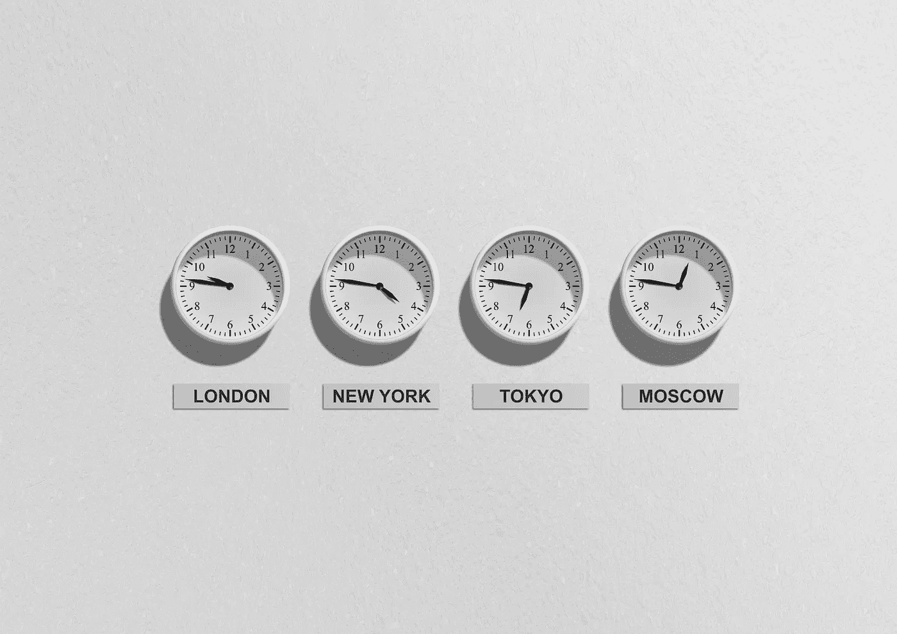

照片由[像素](https://www.pexels.com/photo/london-new-york-tokyo-and-moscow-clocks-48770/?utm_content=attributionCopyText&utm_medium=referral&utm_source=pexels)的[像素](https://www.pexels.com/@pixabay?utm_content=attributionCopyText&utm_medium=referral&utm_source=pexels)拍摄

预处理是机器学习管道中最被低估的方面。

**特征缩放**，将特征值控制在相似的数字尺度上，是其中的关键组成部分。

当数据没有缩放时，计算距离或相似性的模型表现不佳。这包括 KNN 和 SVM。

我将演示 KNN 的缩放数据如何将准确度从 72%提高到 96%。

如果您不扩展输入数据，您就放弃了轻松的性能提升。

**我们将用 3 种方法解决一个简单的 ML 问题，比较结果，然后解释为什么缩放有效:**
1)无缩放
2)缩放:标准化
3)缩放:标准化
4)为什么缩放可以提高性能

# 基本情况

在这里，我们将解决一个没有任何缩放的分类问题。

从 [Kaggle](https://www.kaggle.com/brynja/wineuci) 下载葡萄酒数据集。这是一个简单的数据集，我们在其中预测葡萄酒的品种(例如:cab sauv，merlot，riesling)。

```
import pandas as pdimport numpy as np
import pandas as pddf = pd.read_csv('Wine.csv', names=[
    'Class', 'Alcohol', 'Malic acid',
    'Ash', 'Alcalinity of ash', 'Magnesium',
    'Total phenols', 'Flavanoids',
    'Nonflavanoid phenols', 'Proanthocyanins',
    'Color intensity', 'Hue',
    'OD280/OD315 of diluted wines', 'Proline'])df.iloc[np.r_[0:2, -2:0]]
```

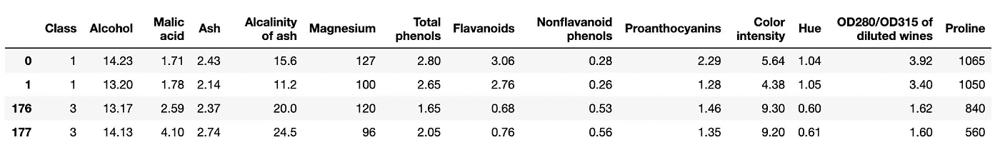

快速检查数据的形状。

```
df.describe()
```

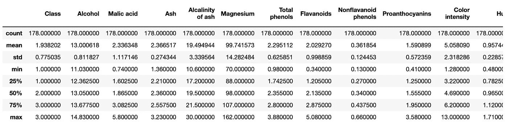

```
df.hist(figsize=(25, 15))
```

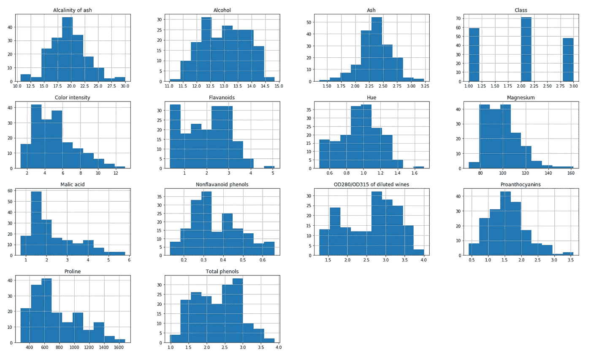

观察特征在完全不同的比例上。**酒精**从`11.03`到`14.83`不等，而**非黄酮类酚类**从`0.13`到`0.66`不等。

这应该会给你数据科学中的[代码味道](https://en.wikipedia.org/wiki/Code_smell)。不同的比例会混淆模型。

但是让我们用逻辑回归来分析一下。

```
# helper functionsimport numpy as np
from sklearn.model_selection import StratifiedShuffleSplit
from sklearn.neighbors import KNeighborsClassifierdef dataframe_to_X_and_y(df):
    X = np.asarray(
        df[['Alcohol','Malic acid','Ash',
            'Alcalinity of ash','Magnesium',
            'Total phenols','Flavanoids',
            'Nonflavanoid phenols',
            'Proanthocyanins','Color intensity',
            'Hue','OD280/OD315 of diluted wines',
            'Proline']])

    y = np.asarray(df[['Class']])

    return X, ydef split_data(X, y):    
    splitter = StratifiedShuffleSplit(n_splits=1, test_size=0.3, random_state=0)for train_index, test_index in splitter.split(X, y):
        X_train, X_test = X[train_index], X[test_index]
        y_train, y_test = y[train_index], y[test_index]return X_train, X_test, y_train, y_testdef fit_and_predict(X_train, y_train, X_test):
    classifier = KNeighborsClassifier()
    classifier.fit(X_train, y_train)
    y_pred = classifier.predict(X_test)

    return y_pred
```

对数据进行分类和评估。

```
X, y = dataframe_to_X_and_y(df)
X_train, X_test, y_train, y_test = split_data(X, y)
y_pred = fit_and_predict(X_train, y_train, X_test)from sklearn.metrics import classification_report
print(classification_report(y_test, y_pred))
```

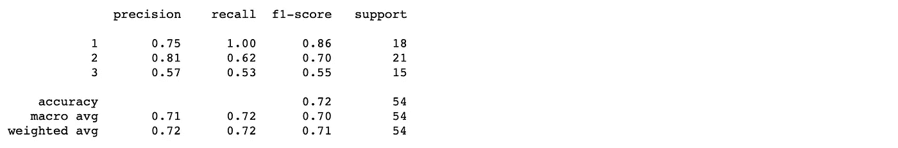

这导致了 72%的准确率。不可怕，但我打赌我们可以通过扩展做得更好。

# 正常化

## 什么是正常化

归一化也叫做“最小-最大缩放”，但我认为“挤压”这个术语更直观。

它强制数据在 0 和 1 之间的范围内，最低特征值为 0，最高特征值为 1。

归一化后，所有要素的值都将在此范围内。例如，比较标准化前后的`Total phenols`数据。

```
attribute = 'Total phenols'
df_copy = df.copy()
df_copy = df_copy[[attribute]]
df_copy.hist()
```

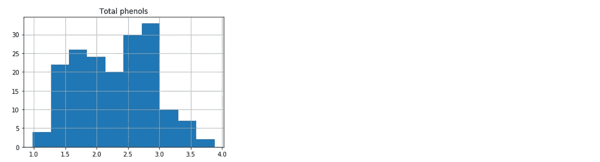

以前

```
from sklearn.preprocessing import MinMaxScaler
scaler = MinMaxScaler()
df_copy[[attribute]] = scaler.fit_transform(df_copy[[attribute]])
df_copy.hist()
```

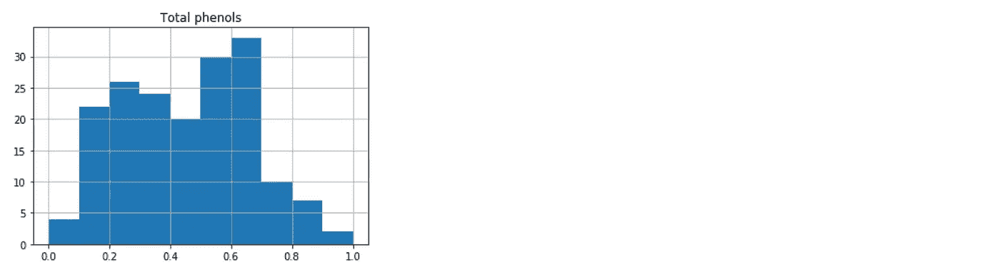

在...之后

请注意，在后者中，没有值低于 0 或高于 1。

这种缩放算法的一个缺点是，一个巨大的正异常值将变为 1，并将所有其他值挤到接近于 0。

例如，`[1,2,10]`会变成`[0.00, 0.11 ,1.00]`。

## 分类问题

回到我们上面解决的那个分类问题。这一次，我们将在进行预测之前对数据进行归一化处理。

```
df_copy = df.copy()
X, y = dataframe_to_X_and_y(df_copy)
X_train, X_test, y_train, y_test = split_data(X, y)from sklearn.preprocessing import MinMaxScaler
scaler = MinMaxScaler()
X_train = scaler.fit_transform(X_train)
X_test = scaler.transform(X_test)y_pred = fit_and_predict(X_train, y_train, X_test)from sklearn.metrics import classification_report
print(classification_report(y_test, y_pred))
```

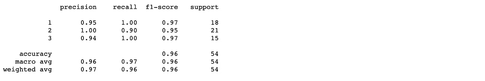

96%.这是一个巨大的进步！这是规范化数据帮助模型解决问题的一个很好的例子。

# 标准化

## 什么是标准化？

标准化减去平均值，然后除以样本方差，因此平均值为零，分布具有单位方差。

> z = (x — u) / s
> 
> 其中`u`是训练样本的均值，如果`with_mean=False`为 0，`s`是训练样本的标准差，如果`with_std=False`为 1。
> 
> - [Sklearn 文档](https://scikit-learn.org/stable/modules/generated/sklearn.preprocessing.StandardScaler.html)

请注意下面应用标准化前后的比例差异。

```
attribute = 'Hue'
df_copy = df.copy()
df_copy = df_copy[[attribute]]
df_copy.hist()
```

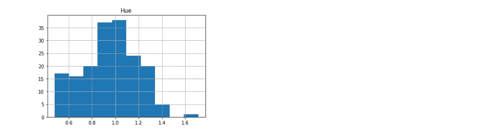

以前

```
from sklearn.preprocessing import StandardScaler
scaler = StandardScaler()
df_copy[[attribute]] = scaler.fit_transform(df_copy[[attribute]])
df_copy.hist()
```

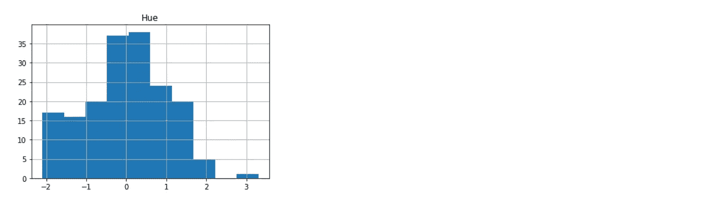

在...之后

## 分类问题

让我们解决同样的分类问题，但这一次我们将在进行预测之前对值进行标准化。

```
df_copy = df.copy()
X, y = dataframe_to_X_and_y(df_copy)
X_train, X_test, y_train, y_test = split_data(X, y)from sklearn.preprocessing import StandardScaler
scaler = StandardScaler()
X_train = scaler.fit_transform(X_train)
X_test = scaler.transform(X_test)y_pred = fit_and_predict(X_train, y_train, X_test)from sklearn.metrics import classification_report
print(classification_report(y_test, y_pred))
```

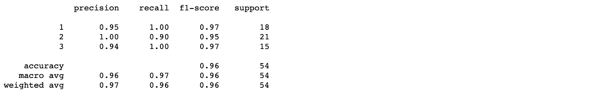

这也做到了！

# 为什么扩展可以提高性能？

缩放不会改进所有模型的预测。但是对于那些利用距离/相似性计算的人来说，这可能会有很大的不同。

假设我们正在根据购买价格(1000 美元)和行驶距离(公里)来比较二手车。

```
pd.DataFrame(
  {'purchase_price': [20, 25, 80], 
   'distance_driven': [10000,15000,11000]}
)
```

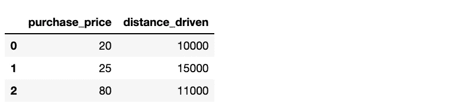

虚构数据

你可以看到一些距离的计算(虽然不是全部)会被`distance_driven`严重扭曲，因为它更大，即使`purchase_price`可能是相似性的更强指标。

# 结论

我们介绍了一个例子，其中缩放将 KNN 分类器的性能提高了 30%以上。虽然我们可以尝试其他模型，但扩展应该是标准做法。

即使缩放不能提高性能(例如:逻辑回归)，它也能使系数更容易解释。