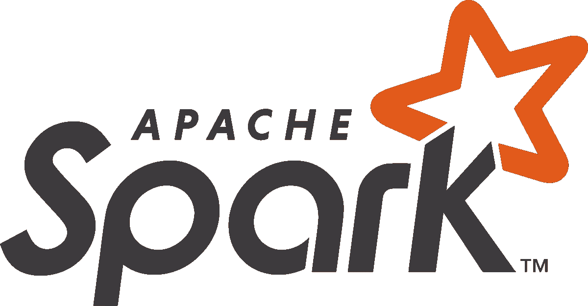

# 增强熊猫数据框架

> 原文：<https://towardsdatascience.com/boost-up-pandas-dataframes-46944a93d33e?source=collection_archive---------50----------------------->

## 优化数据框架的使用


作者图片

作为21 世纪的数据分析师或数据科学家，最基本的、被所有人广泛使用的框架是——**熊猫！**借助内存处理能力和数据帧的使用，Pandas 让生活变得更加轻松。与将整个数据集转储到 SQL 数据库中并使用 SQL 查询来查询数据库以查看输出相反，现在我们只读取 pandas df 中的数据集文件。所有这些繁琐的过程现在都被**熊猫** **数据框所取代。**

除了 pandas，还有更好的选择，可以通过优化 Pandas 的工作流程来进一步提高您的计算能力。这里有一些功能强大的替代品，易于安装，并允许您提高您的工作流程！

> 系好安全带，这将是一次颠簸的旅程

来源:[吉菲](https://media.giphy.com/media/3oAt1NNFH378qnqPKM/giphy.gif)

# 摩丁

厌倦了在处理大型数据帧时的漫长等待时间？— **摩丁**来救援了！


摩丁使用 [Ray](https://github.com/ray-project/ray/) 或 [Dask](https://dask.org/) 来提供一种毫不费力的方式来加速你的熊猫笔记本、脚本和库。与其他分布式数据框架库不同，Modin 提供了与现有 pandas 代码的无缝集成和兼容性。即使使用 DataFrame 构造函数也是一样的。

> 摩丁用一行代码的改变加速你的熊猫工作流程

**安装**

Modin 是加州大学伯克利分校 RISELab 的完全开源项目。这是该项目的 GitHub 链接

[](https://github.com/modin-project/modin) [## 摩丁-项目/摩丁

### 要使用 Modin，替换熊猫导入:Modin 可以从 PyPI 安装:如果你没有安装 Ray 或 Dask，你…

github.com](https://github.com/modin-project/modin) 

可以通过 PyPI 快速安装 Modin:

```
pip install modin
```

**用法**

使用 Modin 就像使用 Pandas dataframe 一样简单。把熊猫当 pd 换成 **modin.pandas 当 pd 就行了。**

```
# import pandas as pd
import modin.pandas as pd
```

你都准备好了！使用具有增强计算能力和更快速度的数据帧优化您的 pandas 工作流程:)

# 达斯克

需要比摩丁更快的处理能力？—向**达斯克问好！**


Dask.distributed 是一个用于 Python 分布式计算的轻量级库。Dask.distributed 是一个集中管理的分布式动态任务调度程序。中央`dask-scheduler`进程协调分布在多台机器上的几个`dask-worker`进程的动作以及几个客户机的并发请求。

**安装**

Dask 也是一个开源框架，由他们的开发者积极维护。这是他们 GitHub 链接上的源代码:

[](https://github.com/dask/dask) [## 达斯克/达斯克

### 带有任务调度的并行计算。在 GitHub 上创建一个帐户，为 dask/dask 开发做贡献。

github.com](https://github.com/dask/dask) 

Dask 可以使用 pip 轻松安装:

```
python -m pip install dask distributed --upgrade
```

# 光线

想要释放分布式计算的力量吗？—欢迎**雷！**


Ray 与 TensorFlow、PyTorch、MXNet 等深度学习框架完全兼容，在很多应用中很自然地会与 Ray 一起使用一个或多个深度学习框架(比如我们的强化学习库大量使用 TensorFlow 和 PyTorch)。

摩丁使用[射线](https://github.com/ray-project/ray/)来提供一种毫不费力的方式来加速熊猫的笔记本、脚本和库。Ray 是一个高性能分布式执行框架，目标是大规模机器学习和强化学习应用。

**安装**

Ray 也是一个开源项目。这是 Ray 的 GitHub 链接:

[](https://github.com/ray-project/ray/) [## 光线-投影/光线

### Ray 是一个快速而简单的框架，用于构建和运行分布式应用程序。雷被包装成…

github.com](https://github.com/ray-project/ray/) 

可以通过以下命令使用 pip 快速安装 Ray:

```
pip install ray
```

# PySpark

想要利用内存中的处理能力吗？— **PySpark** 正是正确的选择！



PySpark 是一种很好的语言，可以进行大规模的探索性数据分析，构建机器学习管道，为数据平台创建 ETL。PySpark 使用**内存**计算能力，使数据帧比以往更快。Spark 数据帧是数据科学家和数据工程师的首选，因为它们通过用内存资源取代计算能力来提高速度，并且提供了连接外部框架的巨大灵活性

**安装**

Spark 由 Apache 维护，是一个开源框架，拥有活跃的开发人员社区。下面是 GitHub 上 Spark 的源代码:

[](https://github.com/apache/spark) [## 阿帕奇/火花

### Spark 是用于大规模数据处理的统一分析引擎。它提供了 Scala、Java……

github.com](https://github.com/apache/spark) 

使用以下命令可以很容易地安装 Spark:

确保您的机器上安装了 **Java** :

```
brew cask install java
```

由于 spark 是用 **Scala** 编写的，我们需要包含 Scala 依赖关系:

```
brew install scala
```

最后，在安装完所有依赖项后，使用以下命令安装 **PySpark** :

```
brew install apache-spark
```

**用法**

产生火花就像下面这样简单。就像摩丁一样，spark 和熊猫也有语法上的差异

```
df = spark.read.json("examples/src/main/resources/people.json")
```

# 迷茫？

来源:[吉菲](https://media.giphy.com/media/Uni2jYCihB3fG/giphy.gif)

对很多选项感到困惑？别担心。只需分析您正在处理的数据集并选择合适的框架。假设您正在处理一个只有几个字节的数据集——选择 **Modin** 将是一个不错的选择，因为您可以最大限度地发挥笔记本电脑的潜力。但是，让我们假设您正在处理一个 ETL 管道，其中摄取的数据非常巨大。在这种情况下， **PySpark** 会完成这项工作，但是您可能会想到一个替代框架，比如 **Ray** ，在这个框架中，您可以将负载分布到一个机器集群上，并充分利用并行计算！

请随意评论更好的选择和您的建议，使熊猫数据帧更快！

# 参考

[1][https://www.kdnuggets.com/2019/11/speed-up-pandas-4x.html](https://www.kdnuggets.com/2019/11/speed-up-pandas-4x.html)

[https://github.com/modin-project/modin](https://github.com/modin-project/modin)

[3][https://github.com/ray-project/ray](https://github.com/ray-project/ray)

[https://modin.readthedocs.io/en/latest/](https://github.com/dask/dask)

[https://github.com/apache/spark](https://github.com/apache/spark)