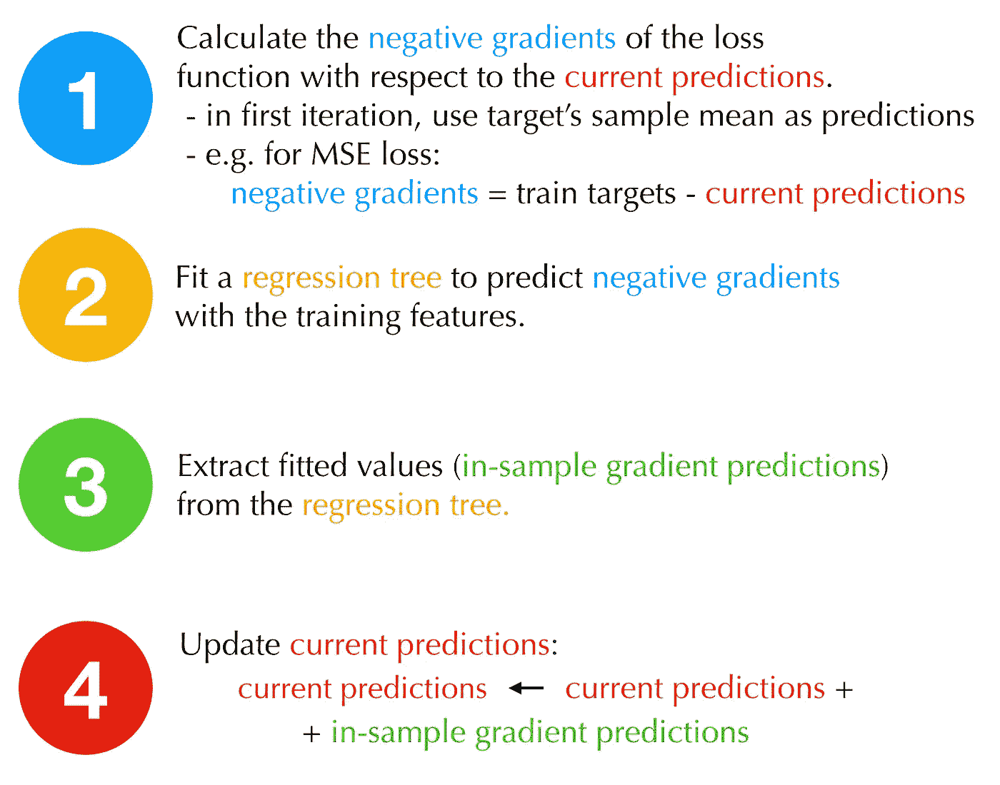

# 增强你对助推的把握🚀

> 原文：<https://towardsdatascience.com/boost-your-grasp-on-boosting-acf239694b1?source=collection_archive---------64----------------------->

## 揭秘著名的竞赛获奖算法。


比尔·杰伦在 [Unsplash](https://unsplash.com/s/photos/boost?utm_source=unsplash&utm_medium=referral&utm_content=creditCopyText) 上的照片

boosting 的普及是应用机器学习的重大突破。得益于多个软件包，boosting 天生易于实现，同时在许多任务上实现高性能，已经成为许多人的默认首选方法。在工业中，它被用来制造有价值的产品，被围棋大师用来赢得比赛。在本文中，我们将详细讨论升压。

请继续阅读，了解:

*   虽然最初令人生畏，但助推实际上很容易理解。
*   只需几行代码就可以实现不同的增强风格。
*   是什么让一个好的弱学习者得到提升，为什么树是一个普遍的选择。
*   自适应增强和梯度增强的区别。
*   你可以调整哪些旋钮来优化升压算法。


# 什么是助推？

Boosting 是一种集成技术，它将多个被称为“弱学习者”的顺序拟合的简单模型聚合成一个“强学习者”模型。本质上，增强预测只是弱学习者预测的加权平均，例如:

1.  较好的弱学习者获得较大的权重，
2.  当拟合时，每个弱学习者优先考虑被前一个错误预测的观察，从而专注于最困难的情况。

就这么简单。

特定的提升算法，比如我们马上要谈到的自适应或梯度提升，主要区别在于如何计算弱学习者的权重，以及如何对最困难的观察进行优先排序。


# 自适应增压

从实际的角度来看，从历史的角度来看，让我们看看第一个 boosting 算法。自适应增强，也称为 AdaBoost，早在 1997 年就被提出。它最初是为分类任务设计的，后来才扩展到回归设置。为了更加集中，我们将分析分类案例。

AdaBoost 的想法是使用样本权重来拟合弱学习者。我们从每个具有相同权重的观察开始，随着连续弱学习者的建立，观察权重得到更新，以将更多的重点放在困难的情况上。下面的模式概述了在单个自适应增强迭代中会发生什么。希望它能把这一点讲清楚。


自适应增压程序。

一旦合适了所需数量的弱学习器，就可以通过简单地对它们的预测进行平均来获得最终的预测，这些预测由各自的模型权重进行加权。

我们自己编码吧！我们的弱学习器将是简单的决策树，我们将对垃圾邮件数据集应用 AdaBoost，其中的任务是根据一组描述电子邮件中使用的词频的特征将电子邮件分类为垃圾邮件或非垃圾邮件。数据以及加载和处理数据的代码都可以在[这里](https://github.com/MichalOleszak/KnowledgeBank/tree/master/blog_posts/boosting/boosting.ipynb)获得。现在，你只需要知道我们有一个二进制目标，对于垃圾邮件编码为 1，对于非垃圾邮件编码为-1，还有一组功能，25%的数据已经作为测试集放在一边。

下面的代码遵循上面的模式。为了编程方便，我们将在每次迭代中添加加权弱学习者的预测，将累积和存储在*加权 _ 测试 _ 预测 _ 和*变量中。此外，每次迭代我们将评估当前的性能，以便我们可以看到它如何随着提升迭代的数量(即弱学习者的数量)的增加而提高。

```
Final accuracy 0.945
```

让我们画出测试精度在提升迭代中的图。


AdaBoost:测试 boosting 迭代的准确性

我们拟合的第一棵树(具有相等的观察权重)获得了大约 79%的准确度。然后，随着提升迭代次数的增加，精确度也在增加，尽管速度在下降。经过 500 次迭代，我们达到了几乎 95%的准确率！但是你有没有想过为什么我们使用决策树作为我们的弱学习器？


# 哪些是最好的弱学习者，为什么？

要回答这个问题，我们首先需要讨论一种叫做偏差-方差权衡的现象。简而言之:如果预测模型是错误的，这可能是由于以下三个因素之一:

*   当模型不够复杂，无法捕捉数据中的关系时，就会出现偏差(或拟合不足)；
*   当模型过于复杂、熟记训练数据并且在看不见的数据上表现不佳时，会出现方差(或过度拟合)；
*   我们无能为力的无法解释的错误。

在大多数机器学习模型中，倾向于在偏差和方差之间进行权衡。也就是说，具有高方差的模型通常具有低偏差，反之亦然。 **Boosting 通过拟合专注于解决难题的连续模型，旨在减少偏差。因此，可以从提升中受益最多的弱学习者候选是那些具有低方差(期望的)和高偏差(将在提升过程中减少)的学习者候选。**

好吧，那么什么样的模型符合这些标准呢？线性回归，一个人能想到的最基本的模型呢？根据定义(和一些假设),线性回归的普通最小二乘估计量是无偏的，例如:偏差可以显示为恰好为零。因此，它不是一个很好的候选人。

决策树呢？你可能已经注意到我们是如何在上面的 AdaBoost 代码中适应弱学习者的:

`model = DecisionTreeClassifier(max_depth=1)`

通过限制树的深度，我们不允许它变得太复杂以至于超出数据的范围；不仅如此:它不可能变得足够复杂以适应数据。这样，我们就有了一个低方差(没有能力过度拟合)和潜在高偏差(过于简单，无法捕捉数据中的信息)的学习者。这是升压的理想情况，我们已经看到它提高了多少精度。

为了验证以上所说的，让我们试着不要限制树。让我们对以下弱学习者运行相同的 AdaBoost 代码:

`model = DecisionTreeClassifier()`

我们期望什么？我们的弱学习器现在将是一个过拟合模型，即高方差、低偏差。因此，我们预计提振不会带来多少改善。这是测试精确度在提升迭代中的曲线图。


AdaBoost:使用过拟合弱学习器测试 boosting 迭代的准确性

正如预期的那样，AdaBoost 将过度拟合的弱学习器的准确率提高了约 1.5 个百分点，达到 92%。这发生在最初的几次迭代中，随后没有进一步的改进。与之前弱学习者的更好选择相比。在那里，准确率提高了大约 15 个百分点，几乎达到 95%。

总而言之，我们已经说过，好的弱学习者是那些对数据拟合不足的人。受限树是好的，复杂树和线性回归就不那么好了。其他低方差、高偏差模型呢？你也可以提升它们，但是树是最受欢迎的。其原因如下:

*   即使数据量增加，树也能快速适应和扩展。这一点很重要，因为在推进过程中，每个弱学习者都需要前一个学习者的输入来改进它。因此，模型必须按顺序拟合，不能并行计算。如果一个模型需要很长时间才能适应，那么提升许多模型将需要很长时间。
*   树拥有许多属性，使它们适用于杂乱的数据，而不需要太多的数据预处理。例如，他们对各自预测因子的尺度和应用于它们的单调变换漠不关心。它们还可以自动处理不同的变量类型，并通过构造对异常值和无用预测值具有鲁棒性。

现在让我们来看看另一种提升树木的方法！


# 梯度推进

梯度推进是另一种推进方式。与自适应增强类似，它也输出弱学习者预测的加权平均值。主要区别在于，AdaBoost 在迭代过程中更新观测值权重，而梯度提升则更新观测值本身。

程序如下。我们需要从训练数据的一些预测开始。因为在拟合任何模型之前，我们没有模型，我们简单地用目标的样本均值初始化它们。然后，我们重复下面的多次。我们计算相对于当前预测的损失函数的负梯度。下面的代码使用了均方误差损失的梯度，这对于二进制分类来说不是最佳的，但是我们使用它来保持简单。然后，我们将回归树拟合到这些负梯度，并将该树的拟合值(可能乘以某个学习率)添加到我们在开始时初始化的累积训练集预测中。一旦运行了期望数量的提升迭代，我们就可以提取最终的预测。因为我们的目标被编码为-1 或 1，我们简单地取累积预测的符号。

下面的模式概述了在使用树作为弱学习器的单个梯度提升迭代中发生的情况。希望它能把这一点讲清楚。



梯度推进程序

我们来编码吧！与前面的 AdaBoost 代码片段一样，这里我们也在 boosting 迭代中计算测试数据的预测，并在之后绘制。

```
Final accuracy 0.933
```


梯度增强:测试增强迭代的准确性

我们已经获得了与 AdaBoost 相似的精度。据推测，使用比 MSE 更合适的损失函数会改善结果。


# 参数化升压算法

您可能已经注意到，在梯度推进代码中，我们使用了一个名为学习率的超参数，我们将其设置为 1。因为它作为乘法因子进入等式，所以值 1 会影响结果。如果我们将其设置为 0.1，那么最终的精度将会提高 1 个百分点。自己随便玩吧！

在任何升压算法中，还有更多可以参数化的东西。然后可以调整这些参数来优化性能。在不涉及太多细节的情况下，让我列举其中的一些。这绝不是一个详尽的集合。

*   学习率:我们可以用一个介于 0 和 1 之间的因子来衡量每棵树对整体的贡献，以避免过度拟合。这在精神上有点类似于在岭回归中加入收缩。对于较小的学习率，我们可能需要增加提升迭代的次数。
*   提升迭代的次数:太大可能导致过度拟合，太小可能阻止提升算法达到最佳性能。
*   子采样行:在梯度推进模型中，可以让弱学习者适应数据的引导样本，而不是实际数据。bootstrap 样本是从原始数据行中替换抽取的样本。这往往会使模型更好地概括。
*   子采样列:在每次迭代中使用随机选择的特征列来拟合弱学习者。
*   所有弱学习者的参数。在树的情况下:最大树深度，在树的叶节点上进一步划分所需的最小损失减少，等等。


# 简单地

*   Boosting 是一种集成技术，它将多个被称为“弱学习者”的顺序拟合的简单模型聚合成一个“强学习者”模型。这个组合基本上是弱学习者预测的加权平均。
*   升压有利于减少偏差。因此，要提升的理想弱学习者是那些具有高偏差和低方差的学习者，即简单的欠拟合模型。一个流行的选择是约束树模型。
*   增强的两种主要方式是自适应增强和梯度增强。
*   自适应增强使用样本权重使弱学习者适应数据。在整个过程中，权重会更新，以便将更多的注意力放在最难正确预测的观察结果上。
*   梯度提升使弱学习器不适合原始数据，而是适合损失函数相对于当前预测的负梯度。后者随着迭代而更新。
*   为了优化 boosting 算法的性能，可以调整多个超参数，这些超参数定义了弱学习者如何学习以及它们具体适合哪些数据。


感谢阅读！我希望你已经学到了一些有用的东西，将推动你的项目🚀

如果你喜欢这篇文章，试试我的其他文章。不能选择？从这些中选择一个:

[](/a-comparison-of-shrinkage-and-selection-methods-for-linear-regression-ee4dd3a71f16) [## 线性回归中收缩法和选择法的比较

### 详细介绍 7 种流行的收缩和选择方法。

towardsdatascience.com](/a-comparison-of-shrinkage-and-selection-methods-for-linear-regression-ee4dd3a71f16) [](/linear-classifiers-an-overview-e121135bd3bb) [## 线性分类器:综述

### 本文讨论了四个流行的线性函数的数学性质和 Python 的实际应用

towardsdatascience.com](/linear-classifiers-an-overview-e121135bd3bb) [](/uncertainty-from-imputation-8dbb34a19612) [## 插补的不确定性

### 你在预测中考虑到它了吗？

towardsdatascience.com](/uncertainty-from-imputation-8dbb34a19612) 

# 来源

1.  Hastie，Tibshirani，r .，，j . h . Friedman(2009 年)。统计学习的要素:数据挖掘、推理和预测。第二版。纽约:斯普林格。