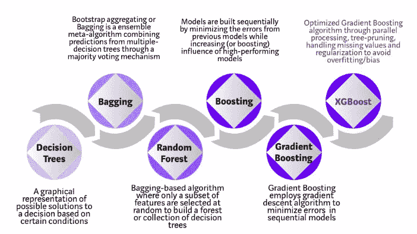
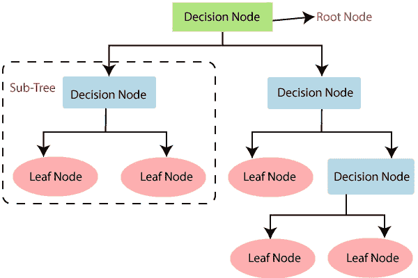
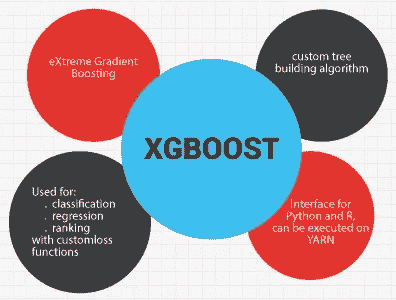
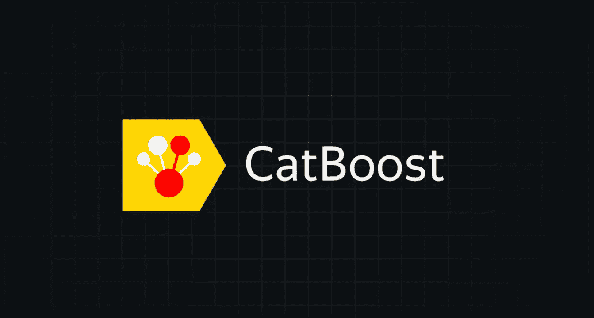

# 使用这些神奇的库来提高模型的性能

> 原文：<https://towardsdatascience.com/boost-your-models-performance-with-these-fantastic-libraries-8dc10579b7ff?source=collection_archive---------20----------------------->

## 将 XGBoost 和 CatBoost 应用到您的机器学习模型中！

> 质量取决于准确性和完整性。

公司使用机器学习模型来做出实际的商业决策，更准确的模型结果会带来更好的决策。错误的代价可能是巨大的，但是优化模型精度可以降低这种代价。机器学习模型准确性是一种衡量标准，用于根据输入或训练数据确定哪个模型最擅长识别数据集中变量之间的关系和模式。一个模型越能概括“看不见的”数据，它就能产生越好的预测和洞察力，从而带来更多的商业价值。



谷歌图片

**癌症预测数据集**

我选择的数据集是乳腺癌预测数据集。我们需要预测癌症是恶性的还是良性的。每一行对应一个患者，对于这些患者中的每一个，我们有几个特征，从凝块厚度，细胞大小的均匀性等。所有这些特征都是肿瘤的特征。如果我们得到 2 级，结果是良性的，如果我们得到 4 级，结果是恶性的。所以类别变量成为我们的因变量，告诉我们它是良性的还是恶性的。我已经建立了决策树模型，并实现了 95.3%的准确率，这是与其他分类模型相比最高的。

在这之后，我建立了 XGBoost 模型，我在同一个数据集上对它进行了训练，我想看看准确性是否跨越了决策树分类模型。我不仅在测试集上训练了它，而且还使用了 K-fold 交叉验证，我们将在 10 个测试集上测试它，以便我们可以获得相关的准确性度量。

现在让我们开始实施吧！

```
**Importing the libraries**import numpy as np
import matplotlib.pyplot as plt
import pandas as pd
```

首先，我们导入实现所需的库。

```
**Importing the dataset**dataset = pd.read_csv('/content/Data.csv')
X = dataset.iloc[:,:-1].values
y = dataset.iloc[:,-1].values
```

x 包含患者的所有特征，并由所有独立变量组成。y 包括因变量，即类别变量。

```
**Splitting the dataset into Training set and Test set**from sklearn.model_selection import train_test_split
X_train, X_test, y_train, y_test = train_test_split(X, y, test_size = 0.25, random_state = 0)
```

接下来，我们将数据集分为训练集和测试集，前者用于训练模型，后者用于评估结果。

在此之后，我们建立了三个不同的模型，并比较了所有模型的准确性。

**决策树分类**



谷歌图片

```
**Feature Scaling**from sklearn.preprocessing import StandardScaler
sc = StandardScaler()
X_train = sc.fit_transform(X_train)
X_test = sc.transform(X_test)
```

由于变量值的范围变化很大，我们需要应用特征缩放，以便所有变量都缩小到一个可比较的范围。我们只需要对决策树分类应用特征缩放，而不需要对 XGBoost 和 CatBoost 应用特征缩放。

```
**Training the Decision Tree Classification model on the Training set**from sklearn.tree import DecisionTreeClassifier
dtc = DecisionTreeClassifier(criterion = 'entropy', random_state = 0)
dtc.fit(X_train, y_train)
```

导入 DecisionTreeClassifier 类，然后创建该类的一个实例。然后应用拟合函数在训练集上训练模型。

```
**Making the Confusion Matrix for Decision Tree**from sklearn.metrics import confusion_matrix, accuracy_score
y_pred = dtc.predict(X_test)
cm = confusion_matrix(y_test, y_pred)
print(cm)
accuracy_score(y_test, y_pred)[[103   4]
 [  3  61]]0.9590643274853801
```

从度量模块导入混淆矩阵和准确度分数函数。

混淆矩阵显示出来，accuracy_score 给出了我们模型的准确度。这个模型的准确率我已经达到了 95.9%。

当我们在不同的测试集上测试我们的模型的性能时，我们获得了不同的精度。这就是为什么我们找到 10 个精度，然后取所有这些精度的平均值，找到我们模型的最佳精度。所以这种方法被称为 K 重交叉验证法。

```
**Applying the K-Fold Cross Validation for Decision Tree**from sklearn.model_selection import cross_val_score
accuracies = cross_val_score(estimator = dtc, X = X_train, y = y_train, cv = 10)
print("Accuracy:{:.2f} %".format(accuracies.mean()*100))
print("Standard Deviation:{:.2f} %".format(accuracies.std()*100))Accuracy:94.53 % 
Standard Deviation:1.91 %
```

应用此方法后，精度变量包含获得的所有精度的列表。然后我们打印出模型的总体精度和标准偏差。因此，在各种测试集上评估该模型，并且评估每个测试集的准确性。在所有测试集上验证后达到的准确度为 94.53%，标准偏差为 1.91%，这是相当低且相当好的。

**XGBOOST**



谷歌图片

[**XGBoost**](https://xgboost.ai/) 是一个优化的分布式梯度增强库，旨在高效、灵活、可移植。所以它是一个基于决策树的集成机器学习算法，使用了[梯度提升](https://en.wikipedia.org/wiki/Gradient_boosting)框架。

要安装 XGBoost，您可以参考本[文档](https://xgboost.readthedocs.io/en/latest/build.html)

```
**Training XGBoost to the training set**from xgboost import XGBClassifier
xgboost=XGBClassifier()
xgboost.fit(X_train,y_train)
```

现在我已经用一个惊人的库 XGBoost 库训练了这个模型。

```
**Making the Confusion Matrix for XGBoost**from sklearn.metrics import confusion_matrix, accuracy_score
y_pred = xgboost.predict(X_test)
cm = confusion_matrix(y_test, y_pred)
print(cm)
accuracy_score(y_test, y_pred)[[84  3]
 [ 0 50]]0.9781021897810219
```

最初，用决策树建立的模型准确率为 95.9%。但是在 XGBoost 之后，准确率达到了 97.8%，令人印象深刻。

类似地，我们对 XGBoost 模型执行 K-Fold 交叉验证。

```
**Applying the K-Fold Cross Validation for XGBoost**from sklearn.model_selection import cross_val_score
accuracies = cross_val_score(estimator = xgboost, X = X_train, y = y_train, cv = 10)
print("Accuracy:{:.2f} %".format(accuracies.mean()*100))
print("Standard Deviation:{:.2f} %".format(accuracies.std()*100))Accuracy:96.53 % 
Standard Deviation:2.07 %
```

我们的模型的整体准确率为 96.53%，这是非常酷的。

这是我们能达到的最高精度吗？让我们试着用其他库来测试它，看看我们是否能击败这个精度。

**CATBOOST**



谷歌图片

[**CatBoost**](https://catboost.ai/) 是一个高性能的开源库，用于决策树上的梯度提升。CatBoost 是一种基于梯度下降的算法，它有一个非常特殊的功能，称为自调整。它不需要调整，并将自我训练以找到最佳参数和最佳得分，例如，用于回归的最佳 R 平方，用于分类的最佳准确度。这是 CatBoost 的关键特性。

要安装 CatBoost，您可以参考此[文档](https://catboost.ai/docs/installation/python-installation-method-pip-install.html)

```
**Training CatBoost to the training set**from catboost import CatBoostClassifier
catboost = CatBoostClassifier() 
catboost.fit(X_train, y_train)
```

现在我已经用一个很棒的库训练了这个模型，这个库就是 CatBoost 库。CatBoost 经过几次迭代，将自己调整到最佳参数，以找到最高的精度(它将为特定问题找到最佳超参数)

```
**Making the Confusion Matrix for CatBoost**from sklearn.metrics import confusion_matrix, accuracy_score
y_pred = catboost.predict(X_test)
cm = confusion_matrix(y_test, y_pred)
print(cm)
accuracy_score(y_test, y_pred)[[84  3]
 [ 0 50]]0.9781021897810219
```

有趣的是，XGBoost 和 CatBoost 的精度是一样的。现在，让我们对 CatBoost 模型进行 K 倍交叉验证，并比较结果。

```
**Applying the K-Fold Cross Validation for CatBoost**from sklearn.model_selection import cross_val_score
accuracies = cross_val_score(estimator = xgboost, X = X_train, y = y_train, cv = 10)
print("Accuracy:{:.2f} %".format(accuracies.mean()*100))
print("Standard Deviation:{:.2f} %".format(accuracies.std()*100))Accuracy:97.26 % 
Standard Deviation:2.03 %
```

太好了！！我们在 K-fold 交叉验证上取得了 97.26%的准确率，这太不可思议了！因此，XGBoost 的准确率从 94.53%提高到 96.53%，但对于 CatBoost，准确率要高得多，因为我们在 CatBoost 的 K 倍交叉验证集上获得的准确率为 97.26%，这绝对令人惊叹。CatBoost 以将近 1%的优势击败 XGBoost。

这两个库非常强大，因为它们极大地提高了机器学习模型的准确性，并且背后涉及到大量的数学知识。理解数学以及它如何提高模型的性能也很重要。因此，使用这两个库非常好，因为它们可以提供更好的预测，还可以提高机器学习模型的性能。还有其他强大的库，比如 [Light GBM](https://lightgbm.readthedocs.io/en/latest/) ，它们在很大程度上提高了我们的准确性。

在这篇文章中，我试图详细讨论一切。但是你可以随时参考我的 [**Github 库**](https://github.com/mathangpeddi/Machine-Learning-Projects/tree/master/Boosting%20Models) 获取完整代码。

在 [**LinkedIn**](https://www.linkedin.com/in/mathang-peddi-23763317b/) 上与我联系

> “快固然好，但准确才是最重要的。”-怀亚特·厄普

我希望你觉得这篇文章很有见地。我很乐意听到反馈，以便即兴创作，并带来更好的内容。

非常感谢您的阅读！