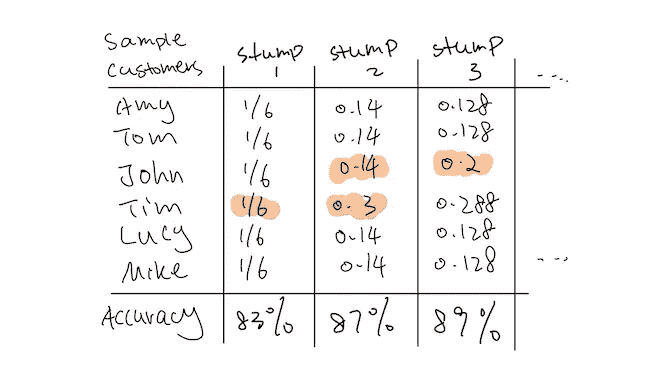
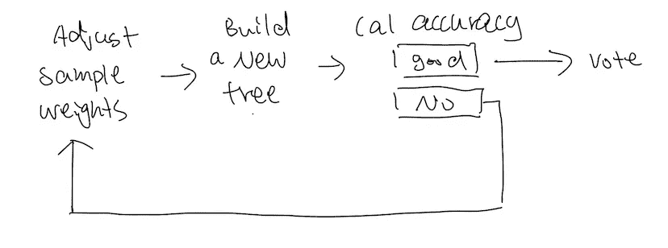
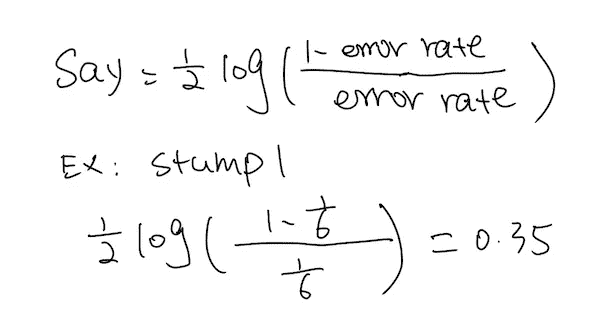
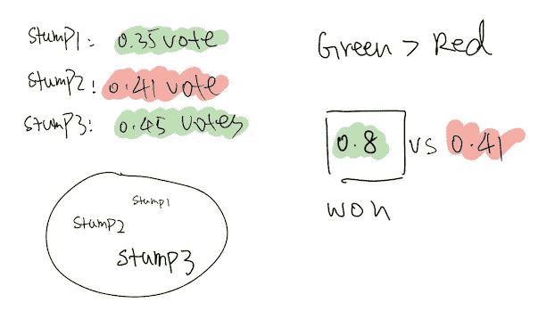
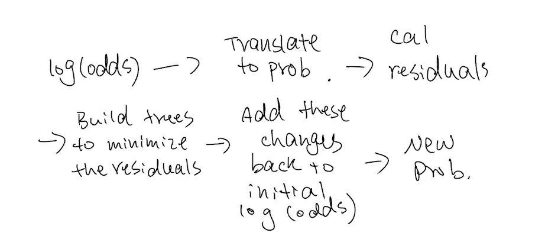
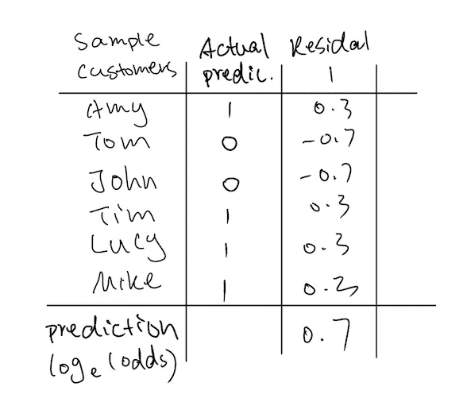
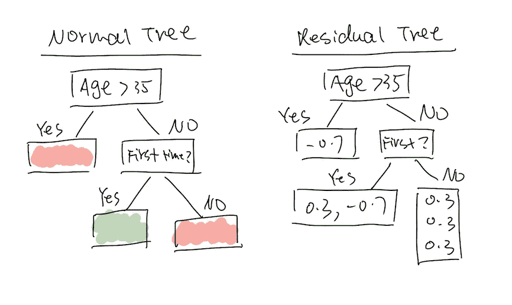
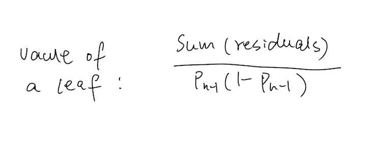
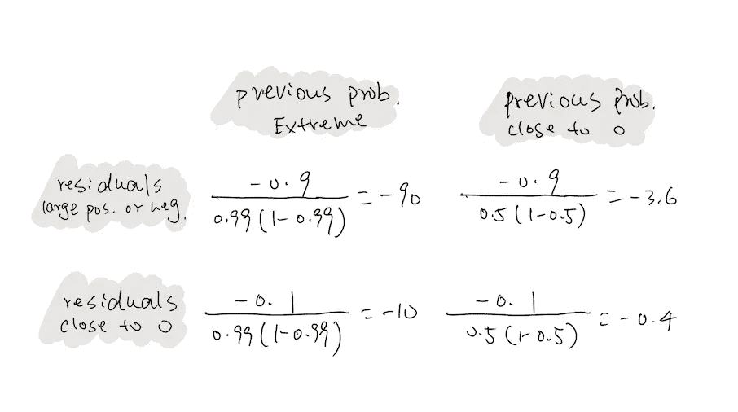

# 没有技术术语的助推算法

> 原文：<https://towardsdatascience.com/boosting-algorithms-without-technical-jargoons-e871414da2e2?source=collection_archive---------83----------------------->

## 没有术语的机器学习

## 不可能的任务？任务完成…

图片由 [Wasserstrom](https://www.wasserstrom.com/blog/2019/06/12/what-is-the-impossible-burger/) 通过谷歌图片提供

## 介绍

在我之前的帖子中(见下文)，我用人们投票的类比来展示加权随机森林和 boosting 算法之间的区别。概括地说，加权随机森林的规则是，投票给结果 A 的每个人都将被计算更多。提升算法的规则是，谁更有资格，谁就能投更多的票。如果结果 A 赢得了更多的选票，那么它就是。

 [## 从不平衡数据集到助推算法

### 不平衡数据集完整工具包

towardsdatascience.com](/from-imbalanced-dataset-to-boosting-algorithms-1-2-798cd6384ecc) 

这篇文章将介绍每个提升算法如何决定每棵树拥有的票数。通过理解算法是如何工作的，我们将理解我上一篇文章中所展示的性能差异。并且更好地知道何时使用哪个工具。

boosting 一家三口。它们是自适应增强、梯度增强和 XG 增强。它将被依次讨论。

## adaboost 算法

Adaboost 只使用一个因素来决定一棵树的发言权——它的准确性。然而，有一个偷偷摸摸的转折。每棵树都被一组略有不同的样本训练。为什么

想象一下，你正在准备你的 SAT 考试，有四个部分:阅读，写作，数学 1(有计算器)，数学 2(没有计算器)。为简单起见，我们假设每个部分有 15 个问题要回答，总共 60 个问题。你做了一次模拟考试，你意识到你在数学 1 中得分最低。所以下一次，你要多练习数学 1 题，少练习其他部分的题。因此，你仍然每次练习 60 个问题，但组合略有不同。

Adaboost 也是一样。Adaboost 的一个特别之处在于，它建立了一个带有“stump”的森林，一个一级深度的树。稍后我将对此进行更多的讨论。现在，把它当作一种约束。让我们先解决它是如何决定一棵树/树桩的话语权的。

假设我们想要建立一个模型来预测客户是否会购买我们的新产品。我们有 6 个样本客户。我们有来自 Amy、Tom、John、Tim、Lucy 和 Mike 的数据(见下图 1)。以下是建立目录林的步骤:

1.  像建一棵普通的树一样建一个树桩。所以选择能正确分类大多数样本的变量。这就是我们的树桩 1。如果你不熟悉一棵树是如何建造的，你可以通过阅读这篇文章了解更多。

 [## 什么是随机森林，为什么没有技术术语

### 使用业务语言并在业务环境中理解随机森林

medium.com](https://medium.com/swlh/programming-journal-2-what-is-and-why-random-forest-without-technical-jargon-c5a9a69d8739) 

2.树桩 1 有 83%的准确率，而蒂姆被错误地分类了。因此，我将把样本 Tim 的权重提高到 0.3，把其他样本的权重降低到 0.14，这样它们加起来就是 1。

等等…但是“提高样品的重量”是什么意思？很好的问题，但超出了我的帖子范围。你可以看看这个视频看看它是怎么做的。简而言之，有两种方法。您可以根据权重创建新的样品组，也可以使用加权 GINI 指数。但是，直觉和我上面给的 SAT 类比是一样的。

GIF via [GIPHY](http://GIPHY)

3.我使用新的加权样本构建 stump 2，准确率为 87%。约翰被错误地归类了。因为正确分类每个样本的权重现在略有不同，stump 2 有 87%的准确性(注意:这不是精确的计算)。

图片 1

4.下一次，我会提高约翰的重量，降低其他样品的重量。如果我们没有设置我们想要的最大树数，那么这个过程将会重复，直到我们达到 100%的准确率。

图片 2

假设我将限制设置为 3 个树桩。就像我之前提到的，每个树桩的投票数完全取决于他们模型的准确性。它用下面的公式来决定它的最终发言权。

图 3

括号内的一切反映了模型给出正确预测的可能性。例如，对于 stump 1，给出正确预测的可能性是错误预测的 5 倍。

神奇的是日志部分。因为对数的性质，如果我们的模型有 0 个误差(分母趋向于 0)，我们给出无穷的正幂。如果我们有许多错误，我们将通过记录它给出一个大的负数(尝试将 99%作为错误率)。

5.在我们知道每个候选人有多少发言权后，我们简单地把他们的投票加起来。得票多的班级获胜。

图 4

## 好吧，但是我们为什么要用树桩呢？为什么不用树呢？

让我们退一步，看看整个画面。这里的关键思想是突出难以预测的样本，以便我们可以建立一个针对这些样本的模型。

当我们构建一个多于 1 层的树时，预测也取决于我们如何构建树。通过使用不同顺序的预测器，我们可以得到不同的预测。这削弱了我们的目标。你可以从这里了解更多关于如何构建一棵树的信息:

 [## 什么是随机森林，为什么没有技术术语

### 使用业务语言并在业务环境中理解随机森林

medium.com](https://medium.com/swlh/programming-journal-2-what-is-and-why-random-forest-without-technical-jargon-c5a9a69d8739) 

这也是为什么对于不平衡数据集，boosting 算法比随机森林和决策树提供了更健壮的分析。Boosting 算法结合了更好地预测少数类的模型。

Ada boost 的问题是，每次构建一个 stump，都需要重新构建整个样本集！想象一下，你有成千上万的样本，甚至计算机也不想做这项工作。所以才推出了 Gradientboost！

## 梯度推进:

Gradientboost 通过不使用样本构建树解决了这个问题。它使用预测和实际结果之间的差异，也就是残差来构建树。图 6 向你展示了什么是剩余树，如果你像我一样困惑的话。

GIF via [GIPHY](http://GIPHY)

图 5 简单地展示了这个过程。基于样本集，我们将首先给出一个对数(赔率)预测，也就是说，我们的模型预测一个类别优于另一个类别的可能性有多大。然后，我们将对数(赔率)转换成概率，并计算残差。从这里，我们将开始建立一个森林，使每棵树的残差最小化。然后我们把所有的东西和初始预测一起加起来。终于，我们有了新的概率！

图 5

如果你不知道什么是对数(赔率)以及我们为什么使用它，先学习逻辑回归。你可以通过阅读下面的文章来了解更多关于逻辑回归的知识。

 [## 没有技术术语的逻辑回归+与树模型的比较

### 如果你喜欢披萨，你就会明白逻辑回归和随机森林的区别！

towardsdatascience.com](/programming-journal-3-logistic-regression-cbf68f01bf7d) 

这里有一个例子来形象化这个过程，以便我们能更好地理解它。我们有一个分类问题，因此，我们的预测可以是 0 或 1。在这个例子中，我们有四个 1 和两个 0。因此，我们的对数(赔率)是 0.69。在我们把它转换成概率之后，它将是 0.67。Amy 的残差为 1–0.67，Tom 的残差为 0–0.67。在右边，我比较了一棵规则树和一棵剩余树。

图 6

在一棵普通的树上，树叶给我们一个最终的类别预测，例如，红色或绿色。在残差树中，树叶给了我们残差。比如从左到右，第一片叶子(-0.7)是-0.7(咄…)。第二片叶子(0.3，-0.7)是-0.4，最后一片叶子是 0.9。

这里的直觉是:如果叶子加起来是一个大的负数或大的正数，它把正确的样本组合在一起。另一方面，如果它们不是同一个东西，值会互相抵消，因此接近于 0。

一棵树的价值是它所有叶子的总和。在我们建立了所有的树之后，我们将所有的树值相加，并将它们添加到初始的对数预测中。因此，如果一棵树具有更大的值(更善于分裂组)，它将对初始预测应该如何改变具有更大的影响。

图 7

每棵树的价值将乘以 0.1。这个值被称为学习率，你可以任意选择任何值，但 0.1 是转换。它很小，所以它确保每棵树只是稍微改变初始值。

关于 Gradientboost 我想说的最后一点是，它实际上使用了一棵树，而不是树桩。但是通常我们将 max_depth 限制在 6 到 8 之间，以避免过度拟合。Gradientboost 不使用树桩，因为它不使用树来检测困难的样本。它正在构建树以最小化残差。

## 更多的技术见解(随意跳过):一棵树如何影响另一棵树。

当我们计算一片叶子的值时，我们实际上使用下面的公式，而不是简单地将残差相加。我想分享一些关于我们如何理解这个公式的直觉。这个公式的实际数学是超级讨厌的。它涉及二阶导数。所以我们不要去那里。

图 8

在上面的公式中，分母中的 P 是我们最后一棵树基于其总对数(odds)给出的概率。我在下面列出了四种情况，这样我们就能明白这个公式的含义了。

图 9

从分母来看，如果前一棵树对自己的预测非常有信心，那么下一棵树就有更大的值(更大的发言权)。从分子上看，如果当前树的残差很大，那么也会导致更大的值。这就像我们已经讨论过的一样。这也是最后一棵树的准确性如何影响下一棵树在森林中的发言权。

## 为什么我们还需要 XGboost？

GIF via [GIPHY](https://media.giphy.com/media/e3zlkCqYQBgzK/giphy.gif)

XGboost 是专门为大型数据集设计的，因为它非常快。它使用了许多优化和正则化技术，这超出了我想谈论的范围。

我想强调 XGboost 和 Gradientboost 之间的一个关键区别。在 Gradientboost 中，在我们计算每个样本的残差后，我们选择一个节点进行分割，并继续使用传统方法构建树。面对大型数据集时，这一过程可能会非常昂贵。

因此，XGboost 更进了一步。它没有使用谓词作为树节点。它构建树来将残差分组在一起。就像我之前提到的，相似的样本会有相似的残值。所以树节点是可以分隔残差的值。所以 XGboost 中的叶子是残差，XGboost 中的树节点是可以对残差进行分组的值！

XGboost 的速度使得它对于大型数据集来说确实可行。然而，当我们有合理数量的样本时，比如几千个样本，Gradientboost 实际上更健壮。

我希望这能说明为什么 Gradientboost 是我在做流失分析时最健壮的算法。只有 3333 个样本。您可以点击此处的文章查看完整的分析:

 [## 从不平衡数据集到助推算法

### 不平衡数据集完整工具包

towardsdatascience.com](/from-imbalanced-dataset-to-boosting-algorithms-1-2-798cd6384ecc) 

GIF via [GIPHY](https://media.giphy.com/media/14iPmDWiwIkyk0/giphy.gif)

我说完了:)

我在帖子中链接的视频和文章:

*   [没有技术术语的逻辑回归+与树形模型的比较](/programming-journal-3-logistic-regression-cbf68f01bf7d)
*   [从不平衡数据集到 boosting 算法](/from-imbalanced-dataset-to-boosting-algorithms-1-2-798cd6384ecc)
*   [什么是随机森林，为什么没有技术术语](https://medium.com/swlh/programming-journal-2-what-is-and-why-random-forest-without-technical-jargon-c5a9a69d8739?source=friends_link&sk=f569648b9b48c1b93bcc9a6eb0dc6140)
*   [梯度推进第三部分:分类](https://www.youtube.com/watch?v=jxuNLH5dXCs&list=PLblh5JKOoLUICTaGLRoHQDuF_7q2GfuJF&index=47)
*   [梯度增强第 4 部分:分类细节](https://www.youtube.com/watch?v=StWY5QWMXCw&list=PLblh5JKOoLUICTaGLRoHQDuF_7q2GfuJF&index=48)

其他重要资源:

*   [基本集成学习(随机森林、AdaBoost、梯度增强)-逐步解释](/basic-ensemble-learning-random-forest-adaboost-gradient-boosting-step-by-step-explained-95d49d1e2725)
*   [XGBoost 第 2 部分:用于分类的 XGBoost 树](https://www.youtube.com/watch?v=8b1JEDvenQU&list=PLblh5JKOoLUICTaGLRoHQDuF_7q2GfuJF&index=54)