# 用可解释的人工智能推进机器学习模型(XAI)

> 原文：<https://towardsdatascience.com/boosting-machine-learning-models-with-explainable-ai-xai-601683119c84?source=collection_archive---------19----------------------->

## 关于 Airbnb 房源的见解

对于典型的机器学习模型，传统的特征重要性分析的相关性通常具有有限的价值。在数据科学家的工具包中，是否有可靠的、系统的、模型不可知的方法来测量对预测的特性影响？答案是肯定的。

这里我们用一个建立在 Airbnb 数据上的模型来说明:

*   可解释的人工智能(XAI)技术
*   XAI 能为全球和地方解释做些什么
*   XAI 能为模型增强做些什么

# XAI——概述

随着人工智能在更多应用中获得牵引力，可解释人工智能(XAI)越来越成为清晰解释和自信部署的关键组件。对于机器学习和深度学习来说，XAI 技术正变得越来越成熟。这里有几个算法中立的方法，现在很实用:

## SHAP

SHAP 是由华盛顿大学的斯科特·伦德伯格提出的。SHAP 根据博弈论计算沙普利值，假设实例的每个特征值都是游戏中的“玩家”，预测就是支出。那么可以通过计算每个特征对预测的贡献来解释预测。注:SHAP 具有以下可取的特性:

1.**局部精度**:特征属性的总和等于我们试图解释的模型的输出

2.**缺失**:已经缺失的功能没有影响

3.**一致性**:改变一个模型，使一个特性对模型有更大的影响，这永远不会减少分配给那个特性的属性。

SHAP 支持树集成、深度学习和其他模型。它既可以用于全局解释，也可以用于局部解释。请参考斯科特·伦德伯格的 [SHAP 论文](https://arxiv.org/abs/1802.03888)。

## 石灰

局部可解释模型不可知解释(LIME)是基于代理模型的概念。当解释黑盒模型时，LIME 用数据的变化测试预测发生了什么，并用加权特征训练局部代理模型。最后，对“黑箱”模型的个别预测可以用局部的、可解释的替代模型来解释。

请参考石灰纸:[《我为什么要相信你》](https://arxiv.org/abs/1602.04938)

# Airbnb 预订率模型

这里使用的模型预测 Airbnb 的预订率。它使用从 insideairbnb.com 获得的洛杉矶地区列表数据进行训练。为了简单起见，我使用一个特征子集来训练 XGBoost 模型。

关于模型设计的更多信息，请参考[https://towards data science . com/predicting-market-rank-for-Airbnb-listings-59009 a886d 6](/predicting-market-rank-for-airbnb-listings-59009a886d6)

# 具有全局解释的洞察力

SHAP 摘要显示了主要功能贡献。它还显示数据点分布，并提供特征值如何影响预测的可视化指标。这里红色表示较高的特征值，蓝色表示较低的特征值。在 x 轴上，右边较高的 SHAP 值对应于较高的预测值(列表更可能被预订)，左边较低的 SHAP 值对应于较低的预测值(列表不太可能被预订)。

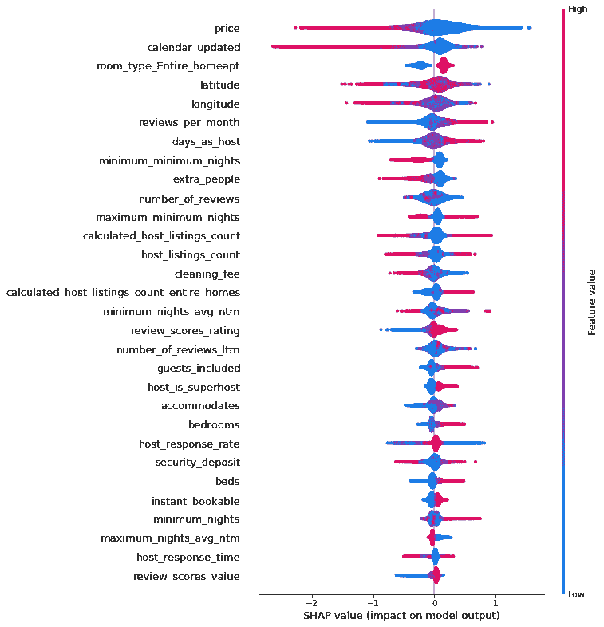

以下是通过全局要素分析获得的一些见解:

## 谁是最成功的主持人？

使用依赖图，我们可以检查特征值和预测结果之间的关系。在第一张图中，随着主机列表数量的增加，我们看到 SHAP 值呈下降趋势。在第二个图表中，x 轴显示主机列表计数，颜色显示“整个家庭”的列表计数。

我们大概可以得出这些类型的宿主:

*   拥有一个或几个列表的主机-这些是个人和家庭，他们的列表通常是有吸引力的，可能是由于关注和个人护理
*   拥有 15-60 个房源的房东——这些房东拥有最不吸引人的房源，他们可能是出租房间的小旅馆或汽车旅馆？
*   拥有超过 150 个列表的主机—在第二张图中，我们可以看到，随着主机列表的数量增加到 50 个以上，预计预订率将大幅增加(与之前的趋势相反)。进一步说，那些房源几乎都是“整栋住宅”。在最高端，那些拥有超过 100 个“全屋”房源的主机实现了 75%以上的预订率，远远高于其他任何人。那些是专业管理的 Airbnb 物业公司吗？

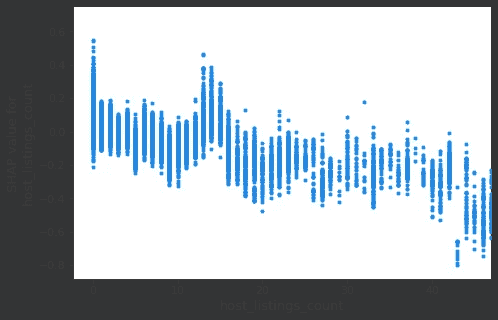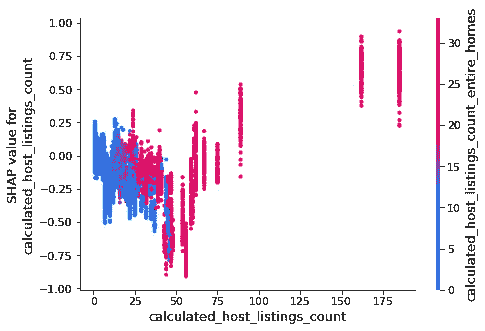

## 更高的清洁费还是更高的价格？

如果有选择的话，主人应该收取更多的每夜费用还是清洁费？相关性图显示了价格和清洁费之间的特征相互作用。红色表示较高的清洁费。沿着 x 轴，随着价格的上涨，预计预订率下降，这是意料之中的。此外，我们发现清洁费较高的列表(红点)往往位于清洁费较低的列表(蓝点)之上。

因此，清洁费较高的房源在预测预订率时实际上是有利的。**主人将更多的成本转移到清洁费上，可能会通过鼓励客人逗留更长时间，并使首页的标价看起来更便宜而获胜。**

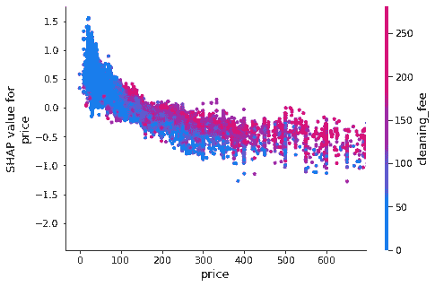

## 评论多还是评论评分高？

在图中，我们看到点评率(x 轴)的上升导致预订率的上升。然而，评论数量的增加并不意味着预订率的提高(红点垂直分布)。**一个主持人得到一些好评比有很多平庸的评论要好得多。**

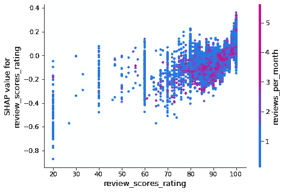

# 本地解释的洞察力

SHAP 力图可以用来解释个人的预测。

例如，我们可以看到基值(偏差项)为 0.01249，红色要素将该值向右推，蓝色要素将该值向左推，组合输出为 0.58。因此，top 特征的影响在具有局部精度的预测上被量化。特定的列表有许多强大的功能价值(超级主机，低价，整个家庭，最近的日历更新)，这使得它有利于预订。

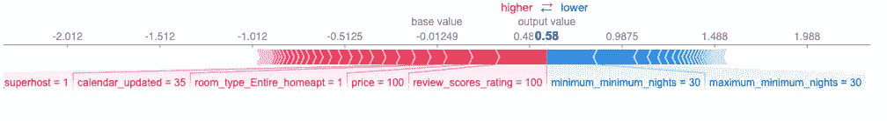

下面的列表有一些特色价值(390 美元的高价，最少 30 天的长时间停留，长时间日历没有更新)，这使得它不太可能被预订。

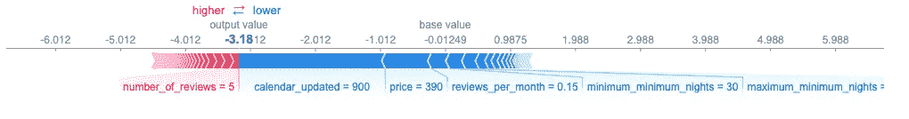

LIME 方法也可以用来解释单个预测，它定量地显示了顶部特征的影响(橙色为正，蓝色为负)。

第一个例子显示了一个主要是正面特征值的列表(它是一个超级主机提供的一整个家，有很多评论)。

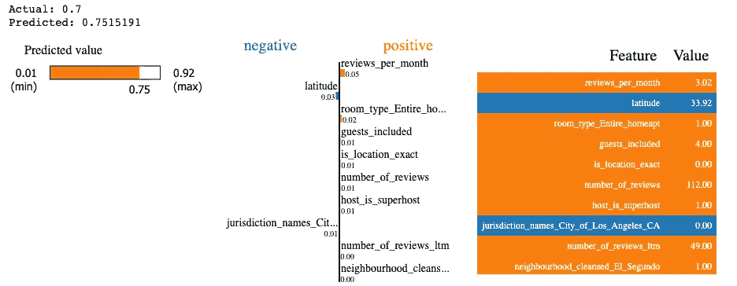

第二个示例显示了一个具有负特征值的列表(它要求最少入住 30 晚，并收取 150 美元的清洁费)。

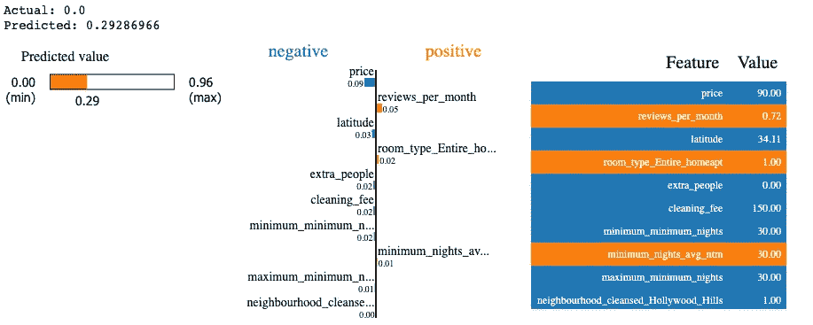

# 模型改进的洞察力

通过检查特性的全局和局部影响，我们通常可以揭示出人意料的数据模式，并获得新的见解。通过进一步分析，我们可能会发现以下原因之一:

*   商业分析的不足
*   数据收集出错
*   数据处理改进(估算和标度)
*   或者说，不寻常的模式是新知识学习的真实反映

下图显示了主要有两种类型的列表具有较高的“日历更新”值(红点)。x 轴最左侧的一组，在过去 12 个月中没有评论，基本上是具有负 SHAP 值的陈旧列表，因此预测预订率低。其他红点分散在上部区域，这表明它们具有更高的 SHAP 值，更有可能被预订。这些列表是持续可用的，并且不需要主机进行多少日历更新。这为特征工程提供了线索，其目标是区分稳定列表和训练数据。

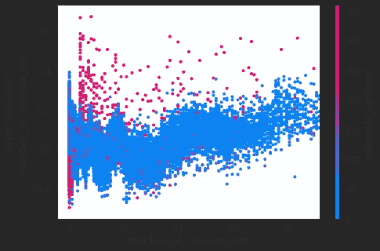

此处显示的另一个示例是溜冰者部分相关性图，它显示了纬度和经度特征的相互作用，纵轴表示它们对预测的影响。视觉上，这个 3D 图可以叠加在洛杉矶地区的地图上，该地图清楚地显示中部和北部地区更受欢迎，南部最不可能被预订。这种洞察力不能通过分析单个特征获得。

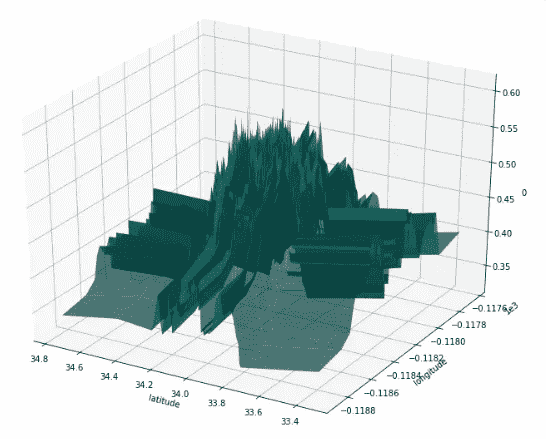

进行修正、调整和获取新知识是迭代模型生命周期的一部分，这将导致增量改进。XAI 可以发现隐藏的线索，并为此提供关键证据。

# 开源代码库

简化版的模型和 XAI 代码可以在这里找到:[https://github.com/seanxwang/XAI-airbnb-booking](https://github.com/seanxwang/XAI-airbnb-booking)

# 下一步是什么

Airbnb 房源具有丰富的信息功能，如图像和文本。将这些整合到模型中可以大大提高预测性能。拥有深度学习和远见的 XAI 应该既有挑战性又有回报。