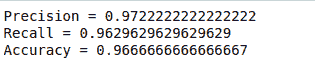
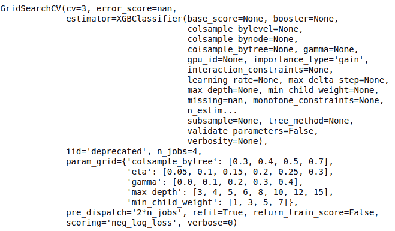

# 使用 XGBoost 提升性能

> 原文：<https://towardsdatascience.com/boosting-performance-with-xgboost-b4a8deadede7?source=collection_archive---------30----------------------->

在这篇博客中，我们将借助一个例子来看看 XGBoost 是如何工作的，以及 XGBoost 的一些重要特性。


来源:[正面消息](https://www.positive.news/environment/people-share-their-love-for-trees-and-forests-on-international-day-of-forests/)

所以，我们很多人都听说过树模型和助推技术。让我们将这些概念放在一起，讨论 XGBoost，这是目前最强大的机器学习算法。

XGboost 呼吁极端梯度助推树木。

> 【XGBoost 这个名字实际上是指提升树算法的计算资源极限的工程目标。这也是很多人使用 XGBoost 的原因。

自 2014 年推出以来，XGBoost 具有很高的预测能力，比其他梯度增强技术快近 10 倍。它还包括各种正则化，减少过度拟合，提高整体性能。因此也被称为“**正则化增强**技术。XGBoost 在性能和速度方面证明了自己的实力。


好吧！！！别急，我们来说说助推

# 什么是助推树？

我们遇到过许多基于树的算法，如决策树，在这些算法中，我们用来在特定数据集上训练我们的单一模型，可能需要一些参数调整。同样在集合模型中，我们习惯于单独训练所有的模型。

Boosting 也是一种集成技术，它将许多模型结合起来给出最终的模型，但不是单独评估所有模型，而是依次训练模型。这意味着，每一个新模型都被训练来纠正前一个模型的错误，当没有进一步的改进时，该序列被停止。这就是为什么它更准确。

# 安装 XGBoost

在 [XGBoost 文档网站](http://xgboost.readthedocs.io/en/latest/build.html)上有全面的安装指南。

它涵盖了 Linux、Mac OS X 和 Windows 的安装。

它还涵盖了在 R 和 Python 等平台上的安装。

# 设置我们的数据

所以，第一件事就是为我们的模型准备数据。我们将使用来自 Scikit Learn 的 iris flower 数据集。

这里，我们用 python 从 Sklearn 加载了数据集，还导入了 XGBoost 库

```
from sklearn import datasets
import xgboost as xgbiris = datasets.load_iris()
X = iris.data
y = iris.target
```

接下来，我们必须将数据集分成两部分:训练和测试数据。这是检验我们的模型表现如何的重要一步。因此，我们将把数据分成 80%-20%的部分。

```
from sklearn.model_selection import train_test_splitX_train, X_test, Y_train, Y_test = train_test_split(X, y, test_size=0.2)
```

与其他算法不同，XGBoost 需要将我们的数据转换成特定的格式，即 DMatrix。

**DMatrix** 是由 **XGBoost** 使用的内部数据结构，针对内存效率和训练速度进行了优化。

```
D_train = xgb.DMatrix(X_train, label=Y_train)
D_test = xgb.DMatrix(X_test, label=Y_test)
```

现在，我们将 NumPy 数组数据转换成 DMatix 格式，以提供给我们的模型。但在此之前，我们需要定义我们的模型。

# 定义 XGBoost 模型

我们要做的第一件事是定义梯度下降系综的参数。我们有 N 个参数可用于我们的模型，但现在，我们将把重点放在一些重要的。可能参数的完整列表可在官方 [XGBoost 网站](https://xgboost.readthedocs.io/en/latest/parameter.html)上获得。

```
param = {
    'eta': 0.2, 
    'max_depth': 4,  
    'objective': 'multi:softprob',  
    'num_class': 4
    }epochs = 20
```

这是我们的参数:

*   **max_depth** :被训练决策树的最大深度
*   **目标**:使用损失函数
*   **num_class** :数据集中类的数量
*   **eta** :学习率

正如我们已经知道的，这种模型是按顺序工作的，这使得它更加复杂。这种技术很容易过度拟合。

eta 参数/学习率帮助我们的算法防止过度拟合，这不仅是通过将新树的预测添加到具有全权重的集合中，而且 eta 将乘以正在添加的残差以减少它们的权重。

**注**:建议在 0.1 到 0.3 的范围内使用较小的 eta 值

我们现在已经定义了模型，让我们来训练它

## 培训和测试

```
model = xgb.train(param, D_train, steps)
```

这是一个与 Scikit Learn 非常相似的过程，运行评估也非常熟悉。

```
import numpy as np
from sklearn.metrics import precision_score, recall_score, accuracy_scorepreds = model.predict(D_test)
best_preds = np.asarray([np.argmax(line) for line in preds])print("Precision = {}".format(precision_score(Y_test, best_preds, average='macro')))
print("Recall = {}".format(recall_score(Y_test, best_preds, average='macro')))
print("Accuracy = {}".format(accuracy_score(Y_test, best_preds)))
```

输出:



太棒了，我们达到了 90%以上的准确率

如上所述，我们有很多参数，选择错误的参数，可能会影响你的模型性能很多。

所以这里的问题是:**如何选择合适的参数？**

嗯，用不同的值来比较模型性能太容易了。让我们看看

# 寻找最佳参数

设置任何 ML 模型的最佳超参数都是一项挑战。那么为什么不让 Scikit Learn 帮你做呢？我们可以很容易地将 Scikit Learn 的网格搜索与 XGBoost 分类器结合起来:

```
from sklearn.model_selection import GridSearchCVclf = xgb.XGBClassifier()
parameters = {
     "eta"    : [0.05, 0.10, 0.15, 0.20, 0.25, 0.30 ] ,
     "max_depth"        : [ 3, 4, 5, 6, 8, 10, 12, 15],
     "min_child_weight" : [ 1, 3, 5, 7 ],
     "gamma"            : [ 0.0, 0.1, 0.2 , 0.3, 0.4 ],
     "colsample_bytree" : [ 0.3, 0.4, 0.5 , 0.7 ]
     }grid = GridSearchCV(clf,
                    parameters, n_jobs=4,
                    scoring="neg_log_loss",
                    cv=3)grid.fit(X_train, Y_train)
```

**输出**:



如果你有时间的话，只在大数据集上这样做——进行网格搜索本质上是多次训练决策树的集合！

一旦您的 XGBoost 模型经过训练，您就可以将它的可读描述转储到一个文本文件中:

```
model.dump_model('dump.raw.txt')
```


这就是我们如何创建 XGBoost 模型，并为其选择理想的超参数。

保持曲调，快乐学习

最初发布于:[https://blog . knol dus . com/machinex-boosting-performance-with-xgboost/](https://blog.knoldus.com/machinex-boosting-performance-with-xgboost/)

在 LinkedIn 和 Twitter 上关注我，了解更多信息:

*   [领英](https://www.linkedin.com/in/shubham-goyal-0946b7127)
*   [推特](https://twitter.com/Shubham99142929)