# 通过客户细分分析促进销售:更好地了解市场

> 原文：<https://towardsdatascience.com/boosting-sales-through-customer-segmentation-analysis-knowing-the-market-better-8c7feebd3479?source=collection_archive---------25----------------------->

## 应用客户细分来洞察营销活动

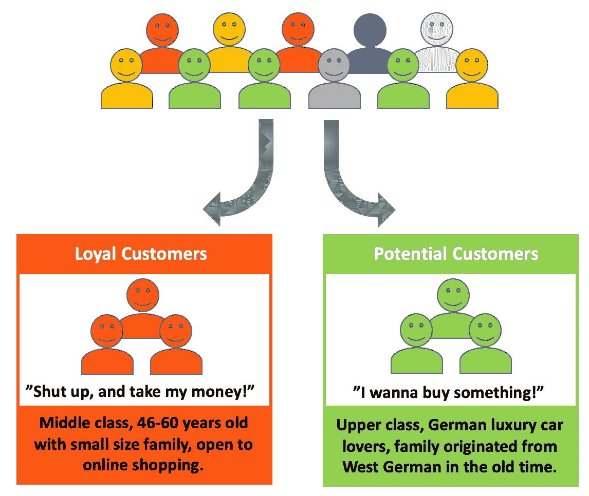

作者图片

客户细分是一个基于某些特征(年龄、性别、收入等)将公司的客户分成不同群体的过程。)，而有效的分析可以帮助一个公司做出更好的营销决策。在这篇文章中，我将分享一个基于 Arvato 公司提供的数据的客户细分分析。Arvato 是一家供应链解决方案公司，我用于分析的数据集包含一家客户公司的客户人口统计数据。我还建立了一个模型来预测邮寄广告的回复率。

下面，我将向您详细介绍我使用无监督和有监督学习方法进行的分析。我们分析了两个数据集，即来自 Arvato 客户公司的客户数据和来自德国的一般人口统计数据，以回答以下问题:

> 1.谁是客户公司的忠实客户，随着营销策略的改变以扩大客户群体，谁是潜在的目标客户？
> 
> 2.当客户公司发出邮件报价时，我们能预测回复率吗？

# 第一部分.客户细分

谁是客户公司的忠实客户，随着营销策略的改变以扩大客户群体，谁是目标潜在客户？

聚类分割有助于将客户公司现有客户的人口统计数据映射到德国的一般人群。在这里，我应用无监督学习来识别普通人群中的哪个部分代表客户公司的忠实客户，哪个部分代表他们可能瞄准的潜在新客户群。

## 数据探索

*数据科学家花 80%的时间清理数据。*

在这个项目过程中，我 90%的时间都花在了数据探索和预处理上。我在客户细分中使用的以下数据集包含大量原始数据:

*   **Azdias** —德国普通人口的人口统计数据(891211 x 366)。
*   **客户** —客户公司的人口统计数据(191652 x 369)。

在总体数据中，有 273 列包含缺失值。我决定删除缺失值率超过 30%的列(用红色表示)，因为大量的缺失值对于分析统计数据和构建模型是有害的(例如 ALTER_KIND1 和 EXTSEL992)。对于剩余的列(蓝色)，我会用最频繁的值来估算缺失的数据。

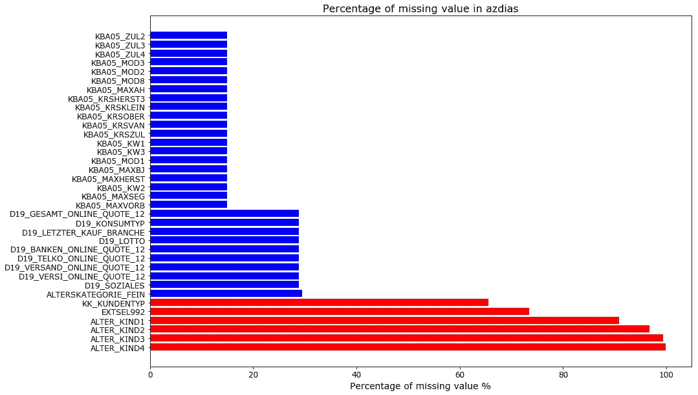

有 890919 行包含缺失值。通过检查缺失率的分布，大多数行的缺失值少于 10%，因此，我将删除阈值设为 50%。

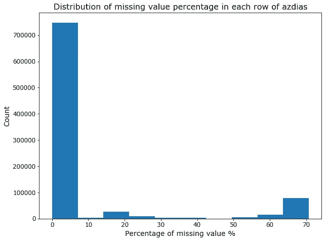

## **数据预处理**


数据预处理包括以下六个步骤:

*   **重新编码缺失值**:*我手工创建了特征描述文件 feature_summary.csv，包含属性名、特征类型、缺失值或未知值。根据功能描述文件，许多功能中的缺失值由–1 和 0 值表示(例如，在功能“AGER_TYP”中)。在这里，我根据特性描述文件将每个属性中所有缺失的值重新编码到 NaN 中(见下文)。*

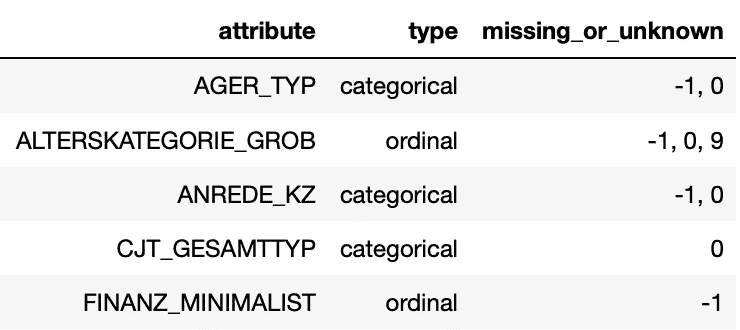

*   **丢弃缺失值:**注意缺失值重新编码后，各列缺失率的分布向百分比较高的区域偏移。丢失值超过 30%的所有列和丢失值超过 50%的所有行都从两个数据库中删除。

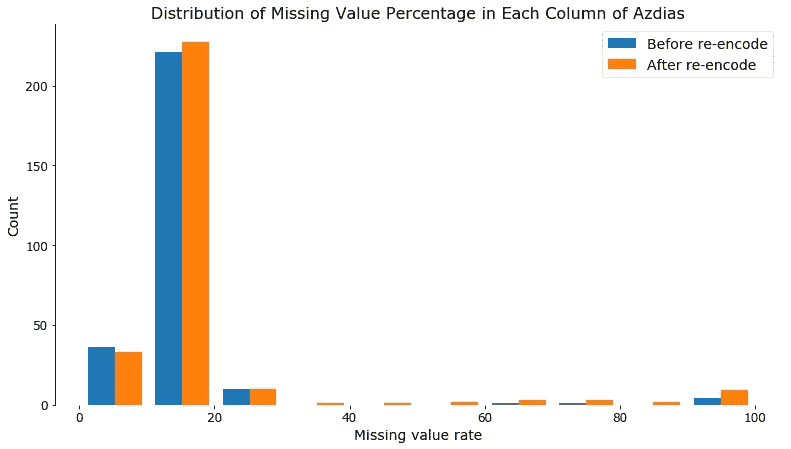

*   **丢弃高度相关的特征:**计算每个特征的皮尔逊相关系数。相关性可以是正的，也可以是负的，因此，我存储了相关性的绝对值。特征被阈值> 0.95 去除，比如 KBA13_BAUMAX，KBA13_FAB_SONSTIGE，LP_FAMILIE_GROB。

```
# Calculate Pearson's correlation matrix
corr_df = azdias_drop_missing.corr().abs()# Create and apply mask
mask = np.triu(np.ones_like(corr_df,dtype=bool))
tri_df = corr_df.mask(mask)# Find the features that meet threshold
to_drop = [c for c in tri_df.columns if any(tri_df[c] > 0.95)]
```

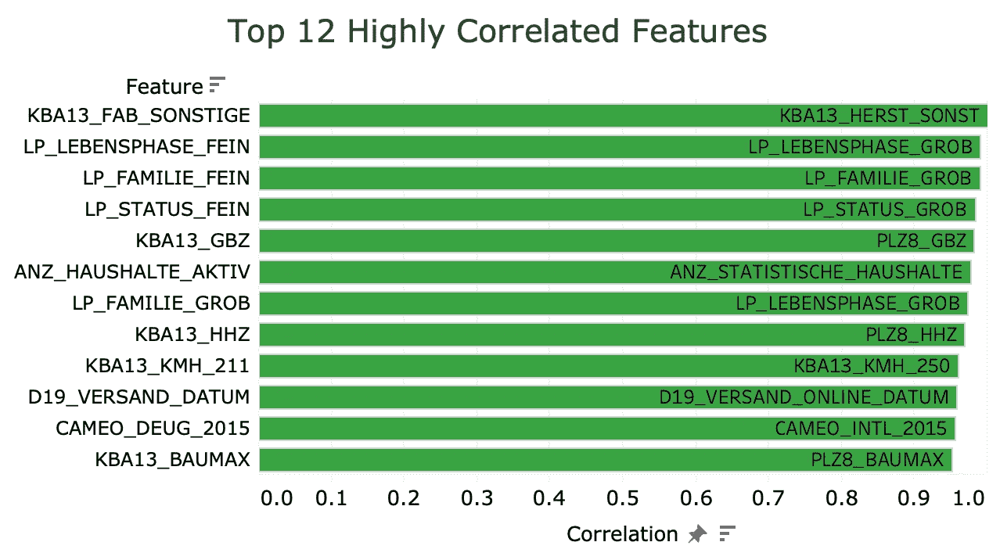

*   **一次性编码分类特征:**根据特征描述文件识别多级分类特征，每个分类特征都被一次性编码为虚拟变量。
*   **平移变换混合型变量:** 一些特征包含多个属性，被拆分成新的独立特征。例如，“CAMEO_INTL_2015”被拆分为“财富”和“人生阶段”属性。
*   **估算和缩放数据:**用*模式*方法估算剩余缺失值，用 StandardScaler 缩放数据。

```
imputer = SimpleImputer(strategy='most_frequent')
scaler = StandardScaler()
```

> 经过数据预处理后， **Azdias** 数据库的矩阵为 791244 x 395，**客户**数据库的矩阵为 140866 x 395。

## **主成分分析**

具有多个特征会使数据分析的过程变得复杂，并且有必要在聚类分割之前降低数据的维度。在这个项目中，我进行了主成分分析(PCA ),将原始数据分解成几个不相关的主成分，仅保留 395 个成分中的 200 个，这解释了原始数据集约 88%的累积可变性。

```
n_components=200
pca = PCA(n_components=n_components,random_state=42)
azdias_pca = pca.fit_transform(azdias_scaled)
```

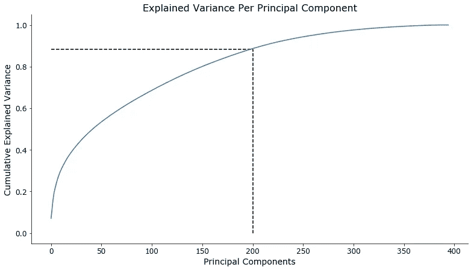

## 聚类和特征分解

我应用了 *k* -means 算法来将数据集分组到各个集群中，并使用了*肘*方法来找到正确数量的集群。*肘*方法的思想是运行*k*——意思是在数据集上对范围 *k* 进行聚类，并对 *k* 的每个值计算误差平方和(即*k*——意思是得分)。在 *k* 值和*k*-均值得分的图中，曲线上的“肘”是数据集的最佳聚类数。基于下面的*肘*方法结果，我使用 *k* 均值算法将数据集分成八个聚类。

```
# Number of different cluster counts
n_clusters = np.arange(2,21)# Run k-means clustering on the data and compute the average within-cluster distances.
scores = [MiniBatchKMeans(i).fit(azdias_pca).score(azdias_pca) for i in n_clusters]
```

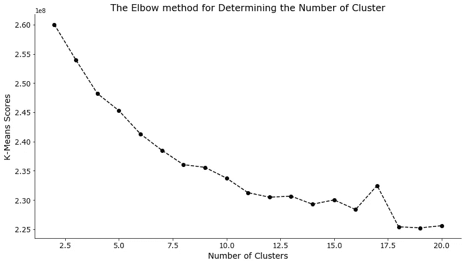

将客户数据映射到人口统计聚类后，现在我们能够比较普通人群和客户公司的客户群之间的聚类分布。结果表明，集群 7 是该公司的主要客户群，因为它在其他客户中拥有最高的客户比例。这个集群可以被认为是“忠诚的客户”相比之下，聚类 2 显示出最低的客户百分比，并展示出一般人群和客户比例之间的最高负差。这表明，考虑到当前的营销策略，集群 2 中的一小部分人可能会成为客户公司的客户。对于客户公司来说，这里的机会是，针对集群 2 的人口定制营销策略将有可能吸引新的客户群。

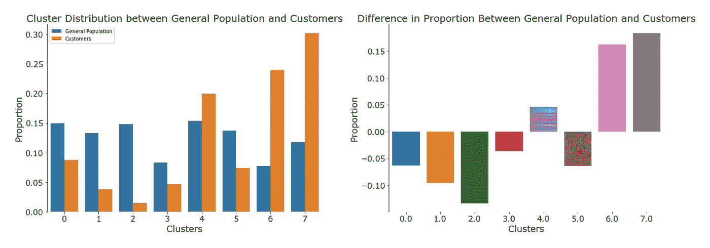

聚类信息的分解揭示了什么类型的个体构成聚类 2 和聚类 7。首先确定哪些主成分对聚类更有意义，然后评估哪些特征可以解释特定主成分中的更多方差，同时通过逆 PCA 变换和数据缩放收集原始特征值。总之，我能够找出哪些类型的个人属于第 2 类和第 7 类。

*忠诚客户:集群 7(中产阶级)*

下面，我列出了十个最正相关的特征(红色)，以及十个最负相关的特征(蓝色)。

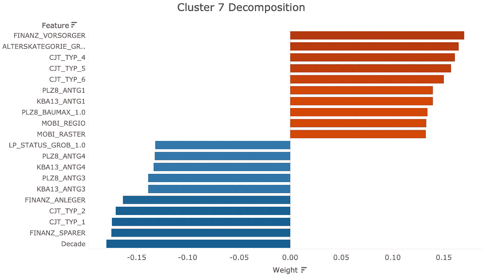

客户公司的忠实客户大多年龄在 46-60 岁之间，属于中产阶级，有小规模的家庭。这些客户生活稳定，对金融投资兴趣不大，热衷于网上购物。

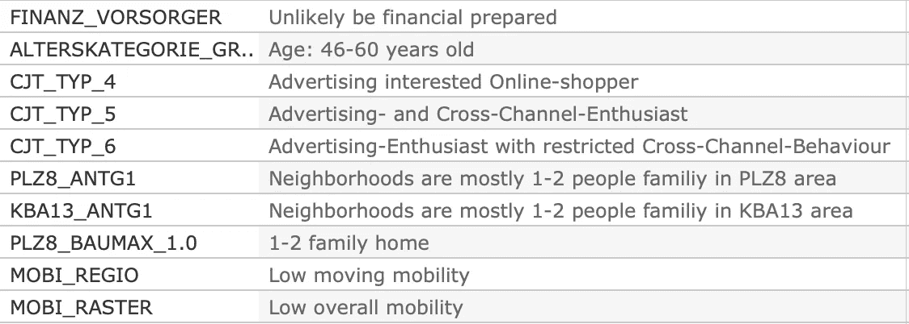

聚类 7 正相关特征

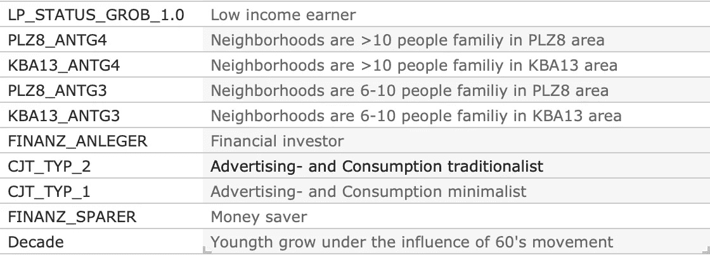

聚类 7 负相关特征

*潜在客户:集群 2(富裕的上层阶级)*

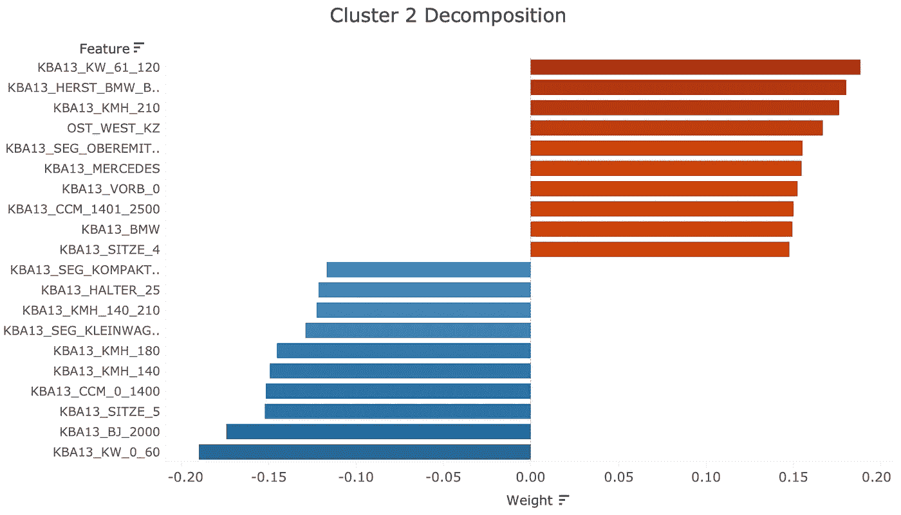

“车，车，车！”当我们看集群 2 的主要特征时，我们看到的都是豪华车。第二组中的人是昂贵的德国汽车的爱好者，除此之外，他们中的大多数人的祖先追溯到旧时代的西德。

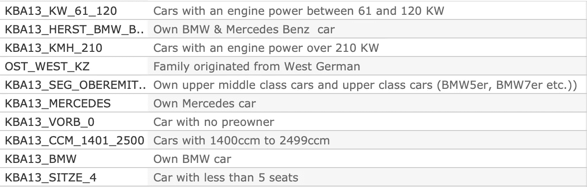

聚类 2 正相关特征

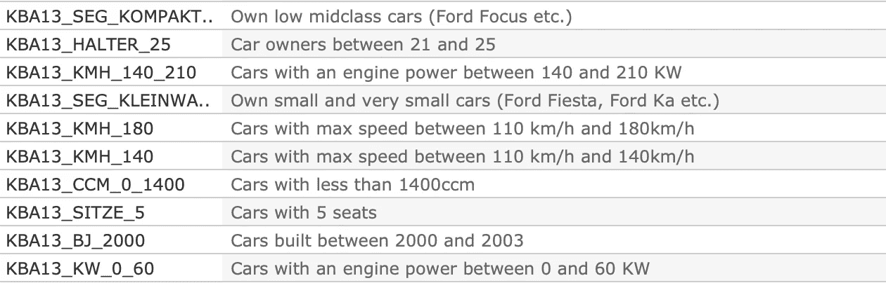

聚类 2 负相关特征

> 外卖:家庭小、网购习惯活泼的中产个人，是客户公司的核心客户。如果客户公司想要扩大他们的客户群体，对德国豪华车感兴趣的来自西德的上流社会人士是潜在的营销目标。

# 第二部分。监督学习

**当客户公司发出邮件报价时，我们能预测回复率吗？**

这是一个典型的分类问题，建立一个有监督的机器学习模型是一个很好的解决方法。这部分的主要焦点是使用训练数据集来训练模型，并使用训练的模型来预测“响应”属性，即，确定测试数据集中的个体是否会响应邮寄要约。

## **数据探索**

Arvato 提供的培训数据和测试数据包括以下内容:

*   **Mailout_train** —作为营销活动目标的个人的人口统计数据(42 982 x 367)。
*   **Mailout_test** —作为营销活动目标的个人的人口统计数据(42 833 x 366)。

如下图响应分布图所示，目标属性“response”在 **Mailout_train** 数据集中高度不平衡，有 42430 个否定响应，只有 532 个肯定响应，响应率仅为 1.2%。这种高度的不平衡会影响分类模型的训练，也会使常用的度量标准变得具有误导性(如准确性)。

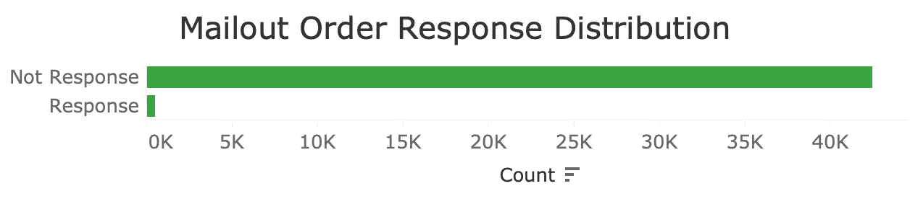

## **数据预处理**

第一部分的数据预处理过程已经实现为 *clean* 函数，可以在我的 [GitHub](https://github.com/giantseaturtle/Capstone_Arvato-Project/blob/master/clean.py) 中找到。这里，我只是复制了相同的步骤来预处理 **Mailout_train** 和 **Mailout_test 中的数据。**

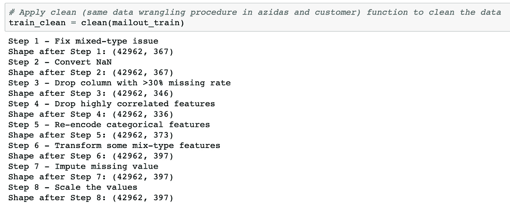

## **实施和细化**

由于“回应”中的数据高度不平衡，这里我采用的方法是计算个人对要约做出回应的概率，并分析做出回应的个人的集体特征，并使用这些信息来建议具有高回应概率的个人。ROC 曲线下的计算面积(假阳性率对真阳性率)用于评估机器学习模型的性能。

我考虑了以下五种分类算法:

*   *AB: AdaBoostClassifier*
*   *GB:GradientBoostingClassifier*
*   *LR:物流回收*
*   *RF:RandomForestClassifier*
*   *XGB: XGBClassifier*

为了评估这五种算法的性能，我创建了一个函数，当指定算法和参数时，它可以计算 ROC 得分。

```
def grid_search(estimator, param_grid, X=X, y=y):
    """
    Grid search a classifier by ROC score, using cross-  validation.

    INPUT:
    - estimator (classifier): name of classifier
    - param_grid (dict): parameters used with GridSearchCV
    - X (DataFrame): features from cleaned mailout_train dataframe
    - y (DataFrame): 'RESPONSE' from cleaned mailout_train dataframe

    OUTPUT:
    - classifier: fitted classifier
    - prints elapsed time and ROX AUC
    """

    grid = GridSearchCV(estimator=estimator, param_grid=param_grid, scoring='roc_auc', cv=5)
    grid.fit(X, y)
    best_estimator = grid.best_estimator_
    best_score = grid.best_score_
    return best_estimator, best_score
```

由于高度不平衡的响应属性，我通过 5 重交叉验证将 **Mailout_train** 数据集分成训练集和验证集，然后用默认超参数将数据拟合到五个算法中。

```
# Choose five classifiers, LR, RF, AB, XGB, and GB
models = []
models.append(('LR', LogisticRegression()))
models.append(('RF', RandomForestClassifier()))
models.append(('AB', AdaBoostClassifier()))
models.append(('XGB', XGBClassifier()))
models.append(('GB', GradientBoostingClassifier()))# Evaluate ROC AUC score of five classifiers with default parameter
for i in range(len(models)):
    score = grid_search(models[i][1], {})[1]
    print('ROC AUC score for {}: {}'.format(models[i][0], score))
```

AdaBoostClassifier (AB)和 GradientBoostClassifier (GB)是表现最好的模型，ROC AUC 得分分别为 0.7172 和 0.7564。从这一点开始，我使用网格搜索来调整 AB 和 GB 模型的超参数，将它们的 ROC AUC 分数分别增加到 0.7531 和 0.7570(见下面的红色柱)。

```
# Tune the hyperparameters of AB model
param_AB = {
          "learning_rate"     : [0.1,0.2],
          "n_estimators"      : [100,200,500]}
AB_tuned = grid_search(AdaBoostClassifier(), param_AB)# Tune the hyperparameters of GB model
param_GB = {
          "learning_rate"     : [0.1,0.2],
          "max_depth"         : [3,4],
          "n_estimators"      : [100,200],
          "min_samples_split" : [2,4]}
GB_tuned = grid_search(GradientBoostingClassifier(), param_GB)
```

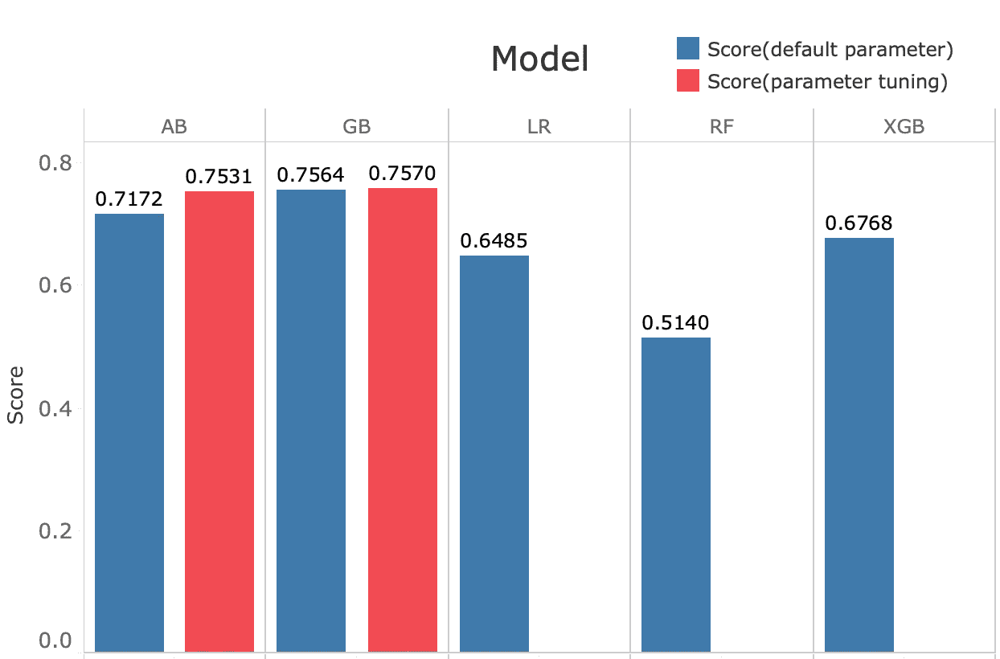

然后，我研究了 AB 和 GB 模型的特征，看它们是否验证了我在第二部分的客户细分分析中得出的结论。不幸的是，两种型号中唯一突出的功能是“D19_SOZIALES”，该功能不包含描述，并且在第二部分中没有被确定为忠诚客户的相关功能。对“D19_SOZIALES”特征含义的大胆猜测是，它可能与交易历史有关，因此暗示着社会经济地位。

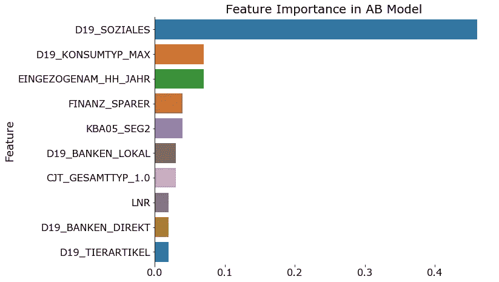

## **Kaggle 比赛**

AB 和 GB 模型被用于预测 **Mailout_test** 数据集中的“响应”。AB 机型取得了 0.781 的成绩，GB 机型取得了 0.777 的成绩。这些结果被提交给了 Kaggle。

> 要点:建立机器学习模型是解决分类问题的最有效方法。我使用 AB 和 GB 算法构建了两个模型，两个模型都能够预测邮寄要约的回复率，得分约为 0.78。

# **结论**

有人说 80–85%的数据科学项目在完成前失败，我感到幸运的是这个项目属于 15–20%。在这个项目中，我练习并应用了不同类型的数据科学技能来解决一个现实生活中的问题——找到忠诚和潜在新客户的特征，并预测个人是否会对邮件发送活动做出回应。

有改进的余地。主成分分析(PCA)受要素比例差异的影响很大，在这方面，使用 MinMaxScaler 等替代方法缩放数据可能会获得更好的性能。在监督学习部分，合成少数过采样技术(SMOTE)可能是解决不平衡分类问题的更好选择，因为这种方法允许人工合成数据以获得更平衡的数据集。

# **资信证明**

本文使用的所有代码都可以在我的 [GitHub](https://github.com/giantseaturtle/Capstone_Arvato-Project) 和 [Tableau](https://public.tableau.com/profile/zhili.wen#!/?newProfile=&activeTab=0) 上找到。

数据和资源由 Udacity 和 Bertelsmann&Arvato 提供。