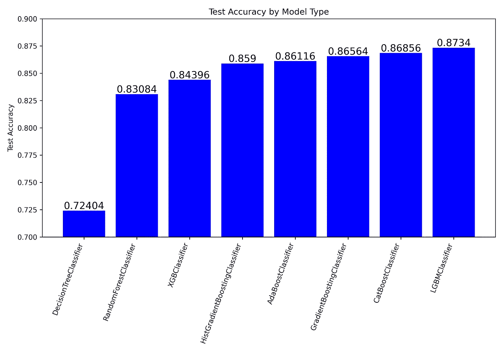
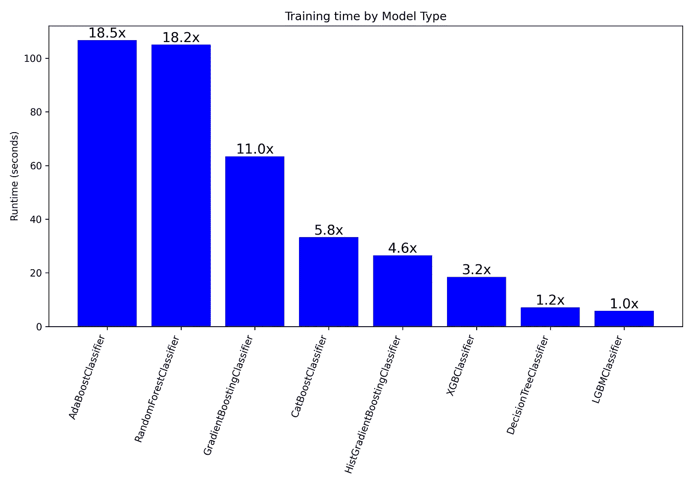
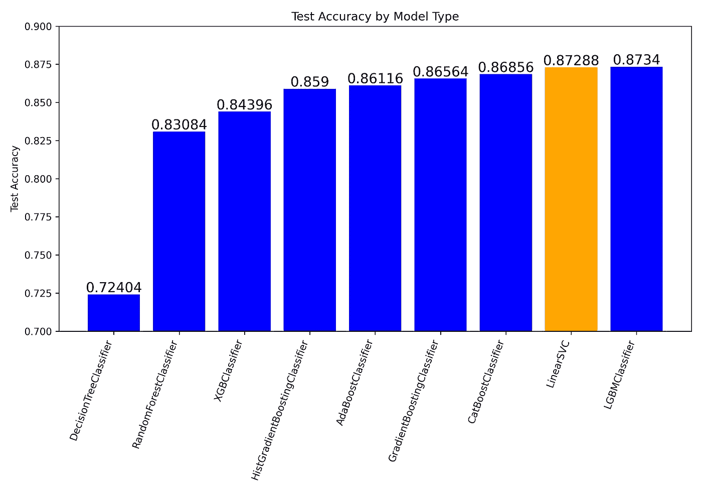
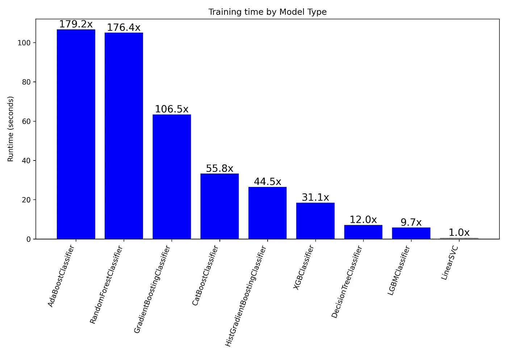
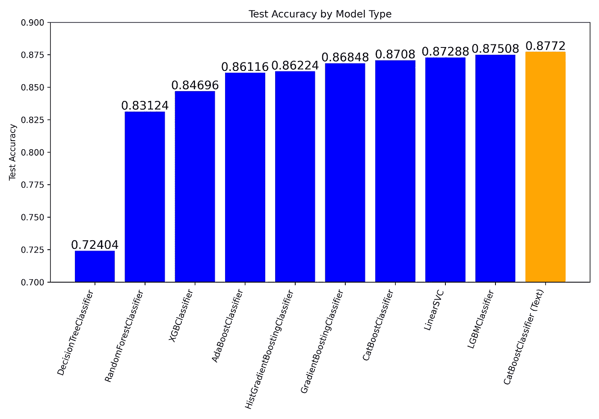
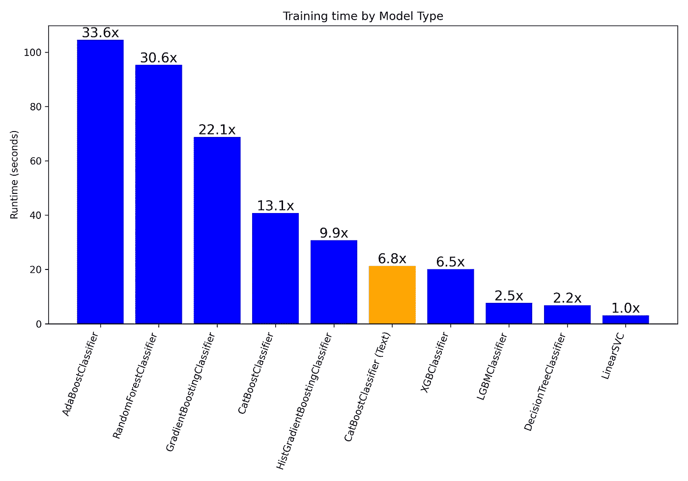

# 助推对决:情感分类中的 Scikit-Learn vs XGBoost vs light GBM vs CatBoost

> 原文：<https://towardsdatascience.com/boosting-showdown-scikit-learn-vs-xgboost-vs-lightgbm-vs-catboost-in-sentiment-classification-f7c7f46fd956?source=collection_archive---------3----------------------->

## 哪一个梯度增强库将在这场竞争中独占鳌头？


[图像来源](https://pixabay.com/photos/arm-wrestling-indian-wrestling-567950/)

**梯度推进**是近年来最流行的机器学习技术之一，统治了许多具有异构表格数据的 Kaggle 竞赛。类似于随机森林(如果你不熟悉这种集成算法，我建议你仔细阅读)，梯度提升通过集成许多决策树来执行回归或分类。但是，与随机森林不同，梯度增强按顺序生长树，根据前一棵树的残差迭代生长树。这样做可以让梯度推进专注于特别棘手的观察，并产生一个异常强大的树木集合。

这是一种过于简单化的做法，并没有提到现有的各种 boosting 实现，但这并不是本文的目的。如果你有兴趣阅读更多关于 boosting 如何工作的细节，我在文章底部附上了一些有用的资源。

随着 XGBoost、LightGBM 和 CatBoost 等竞争算法争夺用户，梯度提升空间近年来变得有些拥挤。刚刚提到的三个是 Kaggle 比赛中最常见的，因为它们的速度、功率和 GPU 兼容性。有几篇文章已经在异构数据上比较了这些增强变体，例如:

*   CatBoost vs Light GBM vs XGBoost:

[](/catboost-vs-light-gbm-vs-xgboost-5f93620723db) [## CatBoost 与轻型 GBM 和 XGBoost

### 谁将赢得这场预测战争，代价是什么？我们来探索一下。

towardsdatascience.com](/catboost-vs-light-gbm-vs-xgboost-5f93620723db) 

*   XGBOOST vs LightGBM:哪种算法赢得了比赛！！！

[](/lightgbm-vs-xgboost-which-algorithm-win-the-race-1ff7dd4917d) [## LightGBM vs XGBOOST:哪种算法赢得了比赛！！！

### 这篇文章是关于在人口普查收入数据集上对 LightGBM 和 XGBoost 进行基准测试。我注意到了…的执行时间

towardsdatascience.com](/lightgbm-vs-xgboost-which-algorithm-win-the-race-1ff7dd4917d) 

然而，还没有任何分析比较这些竞争对手在其他设置，如文本分类。这有一个很好的理由，因为梯度推进并不被认为是最适合这类问题的算法，但看看这种比较如何进行仍然很有趣！

# 关于数据

我们将分析斯坦福大学提供的大型电影评论数据集(链接如下)，其中包含 50，000 篇与“正面”或“负面”标签相关联的电影评论。这些数据已经被分成训练集和测试集，每一个都有 25，000 条评论。我们的标签也非常平衡，共有 25，000 个正面和 25，000 个负面评论。我们应该承认这是多么干净，因为在文本分类中，我们很少有这种级别的分类平衡！

# 准备我们的数据

由于我们在这里强调的是比较梯度增强方法，因此我们将对文本数据执行简单的预处理，只需将其强制转换到数据框中，执行 tfi df-矢量化，这是一种将可变长度文本转换为单词包表示的常用方法，该单词包表示表示所述文本中转换后的词频。如果你不熟悉这项技术，我再次在文章底部放了一个链接，因为这是 NLP 领域的必读内容。我们将限制预处理数据帧中的单词数量，以使用 TFIDF 频率方面的 2000 个顶级单词。

我们还将把我们的训练集分割成一个训练集和一个验证集，这样我们就可以对一些没有在内部执行这种分割的功能的 boosting 候选项执行早期停止，这是一种正则化技术。

```
# Importing packages and data
from time import time
import numpy as np
import pandas as pd
from sklearn.model_selection import train_test_split
from sklearn.feature_extraction.text import TfidfVectorizer
from sklearn.svm import LinearSVC
from sklearn.tree import DecisionTreeClassifier
from sklearn.experimental import enable_hist_gradient_boosting
from sklearn.ensemble import (RandomForestClassifier,
                              AdaBoostClassifier,
                              GradientBoostingClassifier,
                              HistGradientBoostingClassifier)
from xgboost import XGBClassifier
from lightgbm import LGBMClassifier
from catboost import CatBoostClassifier
import matplotlib.pyplot as pltdf_train = pd.read_csv('train.csv').sample(frac=1.0)
df_test = pd.read_csv('test.csv').sample(frac=1.0)# Preprocessing our data
tfidf = TfidfVectorizer(max_features=2000)
X_train = tfidf.fit_transform(df_train['text']).toarray()
X_test = tfidf.transform(df_test['text']).toarray()
y_train, y_test = df_train['negative'], df_test['negative']
X_train_sub, X_valid, y_train_sub, y_valid = train_test_split(X_train, y_train, test_size=0.1)# Setting up our results dataframe
df_results = pd.DataFrame(columns=['accuracy', 'run_time'])
```

# 设置我们的候选模型

我们将分析几个不同的基线模型以及我们的提升方法，每个方法都包含一个简短的总结，然后我们开始对我们的情感分类任务进行全面的比较。请注意，所有的准确性和运行时间将被记录在最终的视觉效果。在本节中，我们仅实例化我们的分类器。

## 决策图表

作为我们的第一个基线，我们将考虑最简单的情况:单个决策树分类器。我们将使用著名的 CART 算法的 Scikit-Learn 实现来逐级生成分类器，以对情感进行分类。请注意，这里我们可以做很多调整，例如正则化、树修剪和特征采样，但是对于我们的用例，我们将简单地指定速度的最大深度(否则，如果有 2，000 个特征和无限的深度，我们的树将会变得过深、过拟合，并且永远需要训练)。

```
dt = DecisionTreeClassifier(max_depth=12, random_state=1234)
```

## 随机森林

接下来，我们将考虑过去几十年中最有影响力的集成算法之一:随机森林。随机森林通过创建决策树的“森林”来工作，每个决策树都在训练数据的袋装(引导聚合)样本上进行训练。现在，我将继续从表面上概述 RF；如果你感兴趣，在页面底部有资源。随机森林在防止过度适应方面非常出色，并且往往开箱即用。我们将在我们的森林中使用 500 棵树，深度不限，作为比单一决策树更强的性能基准。

但是，请注意，从这一点开始，我们的所有增强算法(除 AdaBoost 之外)都将有一个类似于`max_features`的参数，该参数表示如何在每个树或分裂处对特征进行子采样(根据实现方式而不同)，我们将该参数设置为 0.06，这意味着我们将在每个间隔对 6%的特征进行子采样。这样做是为了提高速度，减少过度拟合，并确保我们的候选模型之间的公平比较。为了公平比较，我们还将分布式计算限制在 6 个内核上(即使这些算法中的一些可能会随着内核的增加而有所不同)。

```
rf = RandomForestClassifier(n_estimators=500,
                            max_features=0.06,
                            n_jobs=6,
                            random_state=1234)
```

## adaboost 算法

AdaBoost(T2 的简称)是早在 1997 年推出的首批主要助推技术之一。Adaboost 是梯度提升的一个特例，它使用一系列任何所需的弱学习器(这里通常选择决策树桩)来最小化指数损失。尽管早些年取得了很大成功，但这种算法在竞争环境中并不常见，因为它往往被更现代的提升技术超越。

如果你有兴趣了解 Adaboost 和梯度增强之间的区别，我在本文底部贴了一个链接。

```
base_estim = DecisionTreeClassifier(max_depth=1, max_features=0.06)                            ab = AdaBoostClassifier(base_estimator=base_estim,
                        n_estimators=500,
                        learning_rate=0.5,
                        random_state=1234)
```

## 梯度增强决策树(Scikit-Learn)

现在我们将进入第一个真正的梯度增强方法:梯度增强树。梯度提升是前述 Adaboost 算法的推广，其中可以使用任何可微分的损失函数。Adaboost 试图使用观察权重来通知训练，而梯度增强试图遵循梯度。在 Scikit-Learn 中，这个类的功能更加丰富；我们可以为正则化指定训练数据的子集化，并选择类似于随机森林的特征子集化百分比。请注意，虽然`n_estimators`被设置为 2000，但我们并不期望接近 2000，并且当我们的内部验证错误在 15 次迭代中没有改善时，早期停止将停止生长新的树。我们将遵循相同的早期停止过程，以便所有的增强方法都遵循这一过程。

请注意，大多数迭代算法都有可能提前停止，但我们没有将它与 AdaBoost 一起使用，因为它不包含在 Scikit-Learn 实现中。

```
gbm = GradientBoostingClassifier(n_estimators=2000,
                                 subsample=0.67,
                                 max_features=0.06,
                                 validation_fraction=0.1,
                                 n_iter_no_change=15,
                                 verbose=0,
                                 random_state=1234)
```

## XGBoost

大多数严肃的 ML 从业者已经很熟悉，或者至少听说过 XGBoost(E**X**treme**G**radient**Boost**ing 的简称)。XGBoost 是一个梯度增强库，在 2014 年赢得 Kaggle Higgs 机器学习挑战赛后声名鹊起。这个库变得流行有几个原因:

1.  它在底层树上实现了非常有效的正则化超参数。
2.  它被构建为高度可伸缩的，利用分布式计算来处理极大的数据集。
3.  它有许多不同的语言版本(如 Python、R、C、C++、Ruby、Julia 等。).

XGBoost 在现代比赛中仍然做得很好，XGBoost 社区在维护软件包和添加新功能方面做得很好。然而，它面临着来自其他 boosting 库(如 LightGBM 和 CatBoost)的竞争。XGBoost 库的一个缺点是，它不像竞争对手那样对分类特性进行任何特殊处理。这是不幸的，因为 boosting 库往往擅长表格数据，而表格数据通常包含离散的特性。然而，在我们的比较中，这无关紧要，因为我们的 TFIDF 表示只包含连续值特征。

还要注意，这里使用了与`GradientBoostingClassifier,`相似的参数，但也指定了`tree_method='hist’`。这将使用直方图宁滨对连续特征进行分类，减少需要分析的分割数量，这是 LightGBM 首先引入的技术。

```
xgb = XGBClassifier(n_estimators=2000,
                    tree_method='hist',
                    subsample=0.67,
                    colsample_level=0.06,
                    verbose=0,
                    n_jobs=6,
                    random_state=1234)
```

## LightGBM

在我看来，截至 2020 年 3 月，LightGBM 是梯度推进库的王者。由微软在 2017 年推出的 LightGBM 是一个速度快得离谱的工具包，旨在为高维度的超大数据集建模，通常比 XGBoost 快很多倍(尽管当 XGBoost 添加了自己的宁滨功能后，这一差距缩小了)。LightGBM 通过以下方式实现这一速度:

1.  与 XGBoost 类似，是高度分布式的。
2.  种植树木时，使用叶子方向而不是水平方向的分裂。
3.  使用连续特征的直方图宁滨(第一个这样做的增强算法)来减少分割的数量。

LightGBM 还通过使用一种特殊的最优分割算法，提供了对分类特性的特殊支持。

```
lgbm = LGBMClassifier(n_estimators=2000,
                      feature_fraction=0.06,
                      bagging_fraction=0.67,
                      bagging_freq=1,
                      verbose=0,
                      n_jobs=6,
                      random_state=1234)
```

## CatBoost

最新的流行梯度增强库 CatBoost(**Cat**egorical**Boost**ing)是由俄罗斯科技公司 Yandex 在 2017 年年中开发的，紧随 LightGBM 之后。不幸的是，我还没有看到 CatBoost 持续优于其竞争对手(尽管它有许多分类功能，但它确实倾向于名列前茅)，也没有比得上 LightGBM 的速度，但这肯定会随着未来的更新而改变。然而，CatBoost 适用于分类数据和文本数据，所以在决定为您的用例尝试哪些方法时，请对本文的结果持保留态度。

CatBoost 确实包括现成的文本功能(其他 boosting 库没有这种功能)，但我们不会使用这种功能，因为它会改变 CatBoost 训练集的标记化方法，这又会扭曲我们的比较。因此，我们将坚持使用 CatBoost 的 tfi df-矢量化。(更新:本文底部有一个更新，展示了如何使用这个特性，以及它与我们的普通 TFIDF-vectorization 相比如何)

```
cb = CatBoostClassifier(n_estimators=2000,
                        colsample_bylevel=0.06,
                        max_leaves=31,
                        subsample=0.67,
                        verbose=0,
                        thread_count=6,
                        random_state=1234)
```

## 奖励:基于直方图的梯度增强机器(Scikit-Learn)

Scikit-Learn 最近发布了自己的直方图增强版本，名为`HistGradientBoostingClassifier`，其操作与 LightGBM 非常相似，速度比精确梯度增强快很多倍。然而，一个很大的警告是，截至 2020 年 3 月，Scikit-Learn 的实现只是实验性的，并且只包括少数超参数和两个损失函数。相对于它的精确对应物,`HistGradientBoostingClassifier`的一个改进是它包含了对缺失值的内置支持，以及一些关于如何将缺失观察值分配给叶节点的简单规则。

```
hgbm = HistGradientBoostingClassifier(max_iter=2000,
                                      validation_fraction=0.1,
                                      n_iter_no_change=15,
                                      verbose=0,
                                      random_state=1234)
```

# 比较我们的竞争对手

是时候进行我们的比较了！在开始我们的训练循环之前，我们需要创建几个对象，例如将我们的模型放入一个列表中，并提取类名以便稍后绘制:

```
models = [dt, rf, ab, gbm, hgbm, xgb, lgbm, cb]
model_names = [i.__class__.__name__ for i in models]
```

我们还想指定哪些模型需要在`.fit()`方法中提前停止。就我个人而言，我更喜欢非 Scikit-Learn 包的约定，其中您将一个离散的验证集传递给 es 的 fit 方法，而不是在内部执行分割(这给了您更多的控制)。

```
es_models = ['XGBClassifier',
             'LGBMClassifier',
             'CatBoostClassifier']
```

最后，是时候训练我们每个候选模特了！我们将为需要在`.fit()`方法中传递验证集的模型添加一点逻辑，以便提前停止。在每次运行结束时，我们将在测试集上附加我们的准确度，以及训练每个模型需要多长时间:

```
for m, n in zip(models, model_names):

    start_time = time() if n in es_models:
        m.fit(X_train_sub,
              y_train_sub,
              eval_set = [(X_valid, y_valid)],
              early_stopping_rounds=15,
              verbose=0)
    else:
        m.fit(X_train, y_train)

    run_time = time() - start_time
    accuracy = np.mean(m.predict(X_test) == y_test)

    df_results.loc[n] = [accuracy, run_time]

    del m
```

# 检查结果

现在，我们已经存储了所有的精度和运行时间，我们将把所有的数据打包到一个带有模型名称的数据框中，以便于以后使用。最后，我们将使用 matplotlib 可视化我们模型的测试精度和运行时间:



图 1:比较我们的候选模型之间的测试准确性



图 2:用绝对和相对时间比较我们的候选模型之间的运行时间(秒)

哇！正如我们从上面的图中看到的，LightGBM 似乎是这个用例中的明显赢家，比下一个 boosting 算法快三倍以上，同时在测试准确性方面也是最好的！LightGBM 的实现实际上非常快，它可以比我们单一的深度决策树更快地训练整个树集合！虽然每次运行之间可能会有一些差异，但这是如此之大的差异，以至于我们可以相当肯定地说它是赢家。

另一个问题是，CatBoost 在速度上表现不佳，与较老的库 XGBoost 的速度不太匹配。然而，随着 GPU 支持的启用和一些超参数调整，这种情况可能会改变。同样令人惊讶的是 Scikit-Learn 的`HistGradientBoostingClassifier`的性能，它比 XGBoost 和 CatBoost 都快得多，但在测试准确性方面似乎表现得不太好。我预计这个 boosting 类只会继续变得更好(记住它现在是实验性的)，因为它甚至没有利用特性子集和其他库中存在的一些其他特性。

不出所料，AdaBoost 和 random forest 在运行时间上都落后了不少，但我对`GradientBoostingClassifier`的表现相当失望。这个类并不适合处理非常大的数据，但是如此大的性能差距是很有趣的。

看起来我们已经有了答案，LightGBM 是明显的赢家！

**但是……**

# 等等！其他算法呢？

我已经可以听到数据科学家和 ML 爱好者跃跃欲试地跳到评论区:“有更好的词汇袋模型！”，“你应该将这些与其他基线模型如神经网络或 SVM 进行比较！”，或者“在这里助推没有意义！”。

对于那些有这些想法的人，我完全同意你的观点。

我写这篇文章是为了看看 boosting 实现如何在非标准问题上进行比较，以及它们如何扩展到大范围的数据。不过，在我看来，boosting 算法对于这个用例来说并不理想，因为你可以用少得多的计算时间获得同样的性能。因为我们处理的是非常同质的数据，所以我们将我们的结果与一个简单得多的替代方法进行比较，这个替代方法通常用于单词袋的文本分类问题:SVM。特别是，我们将使用 Scikit-Learn 的`LinearSVC`类。

我们将在与我们的 boosting 候选数据相同的数据上运行我们的新模型，记录我们的测试准确性和运行时间，并将它们添加到前面的图中:

```
# Testing LinearSVC
svc = LinearSVC()
start_time = time()
svc.fit(X_train, y_train)
run_time = time() - start_time
preds = svc.predict(X_test)
score = np.mean(preds == y_test)df_results.loc['LinearSVC'] = [score, run_time]
```



图 3:比较我们的 SVM 与其他模型的测试精度



图 4:比较 SVM 和我们其他车型的训练时间

上面的两个图准确地显示了为什么当处理一个有大量先前文献的问题时，你不应该总是跳到最令人兴奋和最新的算法。支持向量机是一种已经存在了几十年的算法，其性能几乎与我们最好的最先进的 boosting 模型**一样好，而训练速度却快了近十倍！**这正好表明，根据手头的任务定制您选择的车型可能是几小时和几分钟的火车时间之差！

# 结论

我们查看了各种 boosting 库，以及它们如何在极宽的同质表格数据上进行比较，最终发现 LightGBM 是我们测试的所有库中最快、最准确的。然而，我们也表明，更传统的算法，如 SVM，仍然可以胜过最先进的和前沿的方法！看看当前流行的 boosting 库如何发展会很有趣！

感谢您的阅读！如果你有任何问题或意见，请在下面留下！

# 更新# 1—2020 年 4 月 28 日

CatBoost 团队最近发布了一个新版本 0.23，它将内部文本矢量化功能扩展到了 CPU(以前您只能使用 GPU 指定文本功能)。我不会深入讨论它们如何向量化的细节(你可以看看官方文档)。让我们来看看这个内置的矢量化与我们之前的结果相比表现如何:(注意，这是单独运行的结果，因此我们的结果与上面略有不同，但总体结果是相同的)

```
# Testing the CatBoost text feature
model = CatBoostClassifier(n_estimators=2000,
                           text_features=[0],
                           colsample_bylevel=0.06,
                           max_leaves=31,
                           subsample=0.67,
                           verbose=0,
                           thread_count=6,
                           random_state=1234)
model.fit(X_train_text,
          y_train_sub,
          eval_set = [(X_valid_text, y_valid)],
          early_stopping_rounds=15,
          verbose=0)
```



图 5:比较 CatBoost 内置文本矢量化的测试精度



图 6:比较 CatBoost 内置文本矢量化的训练时间

正如我们从上面看到的，利用 CatBoost 的内部文本矢量化功能，我们的火车时间几乎减少了一半！此外，我们可以看到，新的模型比我们迄今为止测试的任何其他方法都更通用。虽然我们没有达到与 LightGBM 相同的火车速度，但我们确实发现具有这一新扩展功能的 CatBoost 可以实现令人印象深刻的准确性！

# 参考

*   大型电影评论数据集【https://ai.stanford.edu/~amaas/data/sentiment/ T3
*   tfi df-矢量化
    [教程 https://towards data science . com/natural-language-processing-feature-engineering-using-TF-IDF-E8 b 9d 00 e 7e 76](/natural-language-processing-feature-engineering-using-tf-idf-e8b9d00e7e76)
*   随机森林简介
    [https://towards data science . com/an-implementation-and-explain-the-Random-Forest-in-python-77bf 308 a9b 76](/an-implementation-and-explanation-of-the-random-forest-in-python-77bf308a9b76)
*   Adaboost vs GBM 的有益帖子:
    [https://stats . stack exchange . com/questions/164233/intuitive-explaining-of-differences-between-gradient-boosting-trees-GBM-ad](https://stats.stackexchange.com/questions/164233/intuitive-explanations-of-differences-between-gradient-boosting-trees-gbm-ad)
*   梯度助推树上的幻灯片
    [https://homes . cs . Washington . edu/~ tqchen/data/pdf/Boosted tree . pdf](https://homes.cs.washington.edu/~tqchen/data/pdf/BoostedTree.pdf)
*   XGBoost 主页
    https://xgboost.readthedocs.io/en/latest/
*   LightGBM 主页
    [https://lightgbm.readthedocs.io/en/latest/](https://lightgbm.readthedocs.io/en/latest/)
*   CatBoost 主页
    [https://catboost.ai/](https://catboost.ai/)