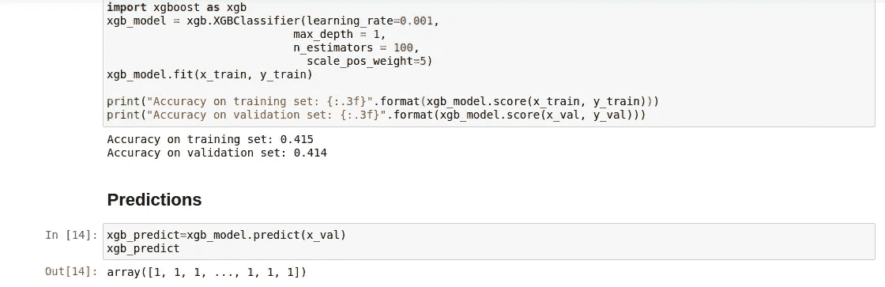

# XGBoost 和不平衡类:预测酒店取消

> 原文：<https://towardsdatascience.com/boosting-techniques-in-python-predicting-hotel-cancellations-62b7a76ffa6c?source=collection_archive---------5----------------------->

## Boosting 是机器学习中一种非常流行的技术，旨在通过将许多弱模型组合成一个强模型来提高预测精度。

为此，增强被称为**集成方法**。

在这个例子中，boosting 技术用于确定客户是否会取消他们的酒店预订。



# 数据概述和功能选择

训练数据从 AWS S3 时段导入，如下所示:

```
import boto3
import botocore
import pandas as pd
from sagemaker import get_execution_rolerole = get_execution_role()bucket = 'yourbucketname'
data_key_train = 'H1full.csv'
data_location_train = 's3://{}/{}'.format(bucket, data_key_train)train_df = pd.read_csv(data_location_train)
```

酒店取消表示响应(或相关)变量，其中 1 =取消，0 =继续预订。

用于分析的特征如下。

# 间隔

```
leadtime = train_df['LeadTime']
arrivaldateyear = train_df['ArrivalDateYear']
arrivaldateweekno = train_df['ArrivalDateWeekNumber']
arrivaldatedayofmonth = train_df['ArrivalDateDayOfMonth']
staysweekendnights = train_df['StaysInWeekendNights']
staysweeknights = train_df['StaysInWeekNights']
adults = train_df['Adults']
children = train_df['Children']
babies = train_df['Babies']
isrepeatedguest = train_df['IsRepeatedGuest'] 
previouscancellations = train_df['PreviousCancellations']
previousbookingsnotcanceled = train_df['PreviousBookingsNotCanceled']
bookingchanges = train_df['BookingChanges']
agent = train_df['Agent']
company = train_df['Company']
dayswaitinglist = train_df['DaysInWaitingList']
adr = train_df['ADR']
rcps = train_df['RequiredCarParkingSpaces']
totalsqr = train_df['TotalOfSpecialRequests']
```

# 绝对的

```
arrivaldatemonth = train_df.ArrivalDateMonth.astype("category").cat.codes
arrivaldatemonthcat=pd.Series(arrivaldatemonth)
mealcat=train_df.Meal.astype("category").cat.codes
mealcat=pd.Series(mealcat)
countrycat=train_df.Country.astype("category").cat.codes
countrycat=pd.Series(countrycat)
marketsegmentcat=train_df.MarketSegment.astype("category").cat.codes
marketsegmentcat=pd.Series(marketsegmentcat)
distributionchannelcat=train_df.DistributionChannel.astype("category").cat.codes
distributionchannelcat=pd.Series(distributionchannelcat)
reservedroomtypecat=train_df.ReservedRoomType.astype("category").cat.codes
reservedroomtypecat=pd.Series(reservedroomtypecat)
assignedroomtypecat=train_df.AssignedRoomType.astype("category").cat.codes
assignedroomtypecat=pd.Series(assignedroomtypecat)
deposittypecat=train_df.DepositType.astype("category").cat.codes
deposittypecat=pd.Series(deposittypecat)
customertypecat=train_df.CustomerType.astype("category").cat.codes
customertypecat=pd.Series(customertypecat)
reservationstatuscat=train_df.ReservationStatus.astype("category").cat.codes
reservationstatuscat=pd.Series(reservationstatuscat)
```

使用**树外分类器**和**前向和后向特征选择**方法进行分析时，确定的特征如下:

*   研制周期
*   原产国
*   细分市场
*   存款类型
*   客户类型
*   所需的停车位
*   到达日期:年
*   抵达日期:月
*   到达日期:周数
*   到达日期:当月的某一天

# 助推技术

XGBoost 是一种提升技术，因其执行速度和模型性能而闻名，并越来越多地被作为默认的提升方法，这种方法实现了梯度提升决策树算法，其工作方式类似于自适应提升，但实例权重不再像 AdaBoost 那样在每次迭代时调整。取而代之的是，尝试用新的预测器来拟合前一个预测器产生的残差。

# 精确度与召回率和 f1 分数

当比较准确度分数时，我们看到在每个混淆矩阵中都提供了大量的读数。

然而，在**精度**和**召回**之间存在一个特别重要的区别。

```
Precision = ((True Positive)/(True Positive + False Positive))Recall = ((True Positive)/(True Positive + False Negative))
```

这两个读数经常相互矛盾，也就是说，通常不可能在不降低召回率的情况下提高精确度，反之亦然。

对理想指标的评估很大程度上取决于所分析的具体数据。例如，癌症检测筛查出现假阴性(即表明患者没有患癌症，而事实上他们患有癌症)是一大禁忌。在这种情况下，召回是理想的衡量标准。

然而，对于电子邮件，人们可能更喜欢避免误报，例如，将一封重要的电子邮件发送到垃圾邮件文件夹，而实际上它是合法的。

f1 分数在设计一个更通用的分数时考虑了精确度和召回率。

哪个因素对预测酒店取消更重要？

从酒店的角度来看，他们可能希望更准确地识别出最终会取消预订的客户，这使得酒店能够更好地分配房间和资源。确定不打算取消预订的客户不一定会增加酒店分析的价值，因为酒店知道，无论如何，很大一部分客户最终都会坚持预订。

# 分析

该数据首先被分为 H1 数据集的训练和验证数据，H2 数据集被用作比较 XGBoost 预测与实际取消发生率的测试集。

以下是 XGBoost 算法的实现:

```
import xgboost as xgb
xgb_model = xgb.XGBClassifier(learning_rate=0.001,
                            max_depth = 1, 
                            n_estimators = 100,
                              scale_pos_weight=5)
xgb_model.fit(x_train, y_train)
```

注意，本例中的 *scale_pos_weight* 参数设置为 *5* 。这样做的原因是对次要类别的错误施加更大的惩罚，在这种情况下，响应变量中的任何 *1* 事件，即酒店取消。权重越高，对次要类上的错误施加的惩罚就越大。这样做的原因是因为数据集中 0 比 1 多，也就是说，坚持预订的客户比取消预订的客户多。

因此，为了有一个无偏见的模型，次要类上的错误需要受到更严厉的惩罚。

# 验证集性能

以下是训练和验证集的准确性:

```
>>> print("Accuracy on training set: {:.3f}".format(xgb_model.score(x_train, y_train)))
>>> print("Accuracy on validation set: {:.3f}".format(xgb_model.score(x_val, y_val)))Accuracy on training set: 0.415
Accuracy on validation set: 0.414
```

预测是这样生成的:

```
>>> xgb_predict=xgb_model.predict(x_val)
>>> xgb_predictarray([1, 1, 1, ..., 1, 1, 1])
```

下面是一个混淆矩阵，比较了验证集上的预测取消和实际取消:

```
>>> from sklearn.metrics import classification_report,confusion_matrix
>>> print(confusion_matrix(y_val,xgb_predict))
>>> print(classification_report(y_val,xgb_predict))[[1393 5873]
 [   0 2749]]
              precision    recall  f1-score   support 0       1.00      0.19      0.32      7266
           1       0.32      1.00      0.48      2749 accuracy                           0.41     10015
   macro avg       0.66      0.60      0.40     10015
weighted avg       0.81      0.41      0.37     10015
```

请注意，虽然 f1 分数(41%)的准确性很低，但类别 1(取消)的召回分数是 100%。这意味着该模型会产生许多误报，从而降低整体准确性，但这具有将召回率提高到 100%的效果，即该模型可以 100%成功识别所有将取消预订的客户，即使这会导致一些误报。

# 测试集上的性能

和前面一样，测试集也是从相关的 S3 存储桶导入的:

```
data_key_test = 'H2full.csv'
data_location_test = 's3://{}/{}'.format(bucket, data_key_test)h2data = pd.read_csv(data_location_test)
```

这是 XGBoost 模型在 H2 上的后续分类性能，这是本例中的测试集。

```
>>> from sklearn.metrics import classification_report,confusion_matrix
>>> print(confusion_matrix(b,prh2))
>>> print(classification_report(b,prh2))[[ 1926 44302]
 [    0 33102]]
              precision    recall  f1-score   support 0       1.00      0.04      0.08     46228
           1       0.43      1.00      0.60     33102 accuracy                           0.44     79330
   macro avg       0.71      0.52      0.34     79330
weighted avg       0.76      0.44      0.30     79330
```

f1 分数所指示的准确度稍高，为 44%，但是类别 1 的回忆准确度再次为 100%。

# 校准:磅秤位置重量

在这种情况下，观察到使用 5 的 *scale_pos_weight* 导致 100%的召回，同时将 f1 分数准确度非常显著地降低到 44%。

然而，100%的召回也是不可靠的。例如，假设 *scale_pos_weight* 被设置得更高，这意味着几乎所有的预测都表示响应为 1，即所有的客户都被预测取消预订。

如果预测所有客户都将取消预订，则该模型没有内在价值，因为不再有任何方法来识别可能会取消预订的客户与不会取消预订的客户的独特属性。

在这方面，更平衡的解决方案是具有高召回率，同时还确保整体准确度不会降得过低。

以下是分别使用 *2* 、 *3* 、 *4* 和 *5* 的权重时的混淆矩阵结果。

## 秤重= 2

```
[[36926  9302]
 [12484 20618]]
              precision    recall  f1-score   support 0       0.75      0.80      0.77     46228
           1       0.69      0.62      0.65     33102 accuracy                           0.73     79330
   macro avg       0.72      0.71      0.71     79330
weighted avg       0.72      0.73      0.72     79330
```

## 秤重= 3

```
[[12650 33578]
 [ 1972 31130]]
              precision    recall  f1-score   support 0       0.87      0.27      0.42     46228
           1       0.48      0.94      0.64     33102 accuracy                           0.55     79330
   macro avg       0.67      0.61      0.53     79330
weighted avg       0.70      0.55      0.51     79330
```

## 秤重= 4

```
[[ 1926 44302]
 [    0 33102]]
              precision    recall  f1-score   support 0       1.00      0.04      0.08     46228
           1       0.43      1.00      0.60     33102 accuracy                           0.44     79330
   macro avg       0.71      0.52      0.34     79330
weighted avg       0.76      0.44      0.30     79330
```

## 秤重= 5

```
[[ 1926 44302]
 [    0 33102]]
              precision    recall  f1-score   support 0       1.00      0.04      0.08     46228
           1       0.43      1.00      0.60     33102 accuracy                           0.44     79330
   macro avg       0.71      0.52      0.34     79330
weighted avg       0.76      0.44      0.30     79330
```

当 *scale_pos_weight* 设置为 3 时，召回率为 94%，而准确率为 55%。当 *scale_pos_weight* 参数设置为 5 时，召回率为 100%,而 f1 得分准确率降至 44%。此外，请注意，将参数从 *4* 增加到 *5* 不会导致召回率或整体准确度的任何变化。

在这方面，使用 *3* 的权重允许高召回率，同时仍然允许总体分类准确度保持在 50%以上，并允许酒店有一个基线来区分取消预订的客户和没有取消预订的客户的属性。

# 结论

在本例中，您看到了使用各种提升方法来预测酒店取消预订。如上所述，在这种情况下，boosting 方法被设置为对 minor 类施加更大的惩罚，其结果是降低了由 f1 分数测量的整体准确性，因为存在更多的假阳性。然而，召回分数因此大幅增加——如果假设在这种情况下假阳性比假阴性更容易容忍——那么人们可以认为该模型在此基础上表现得相当好。作为参考，在相同数据集上运行的 SVM 模型展示了 63%的总体准确性，而在类别 1 上的召回率下降到 75%。

您可以在这里找到原始文章[，它包括一个到 GitHub 资源库的链接，该资源库包含与上述示例相关的相关笔记本和数据集。](https://www.michael-grogan.com/articles/boosting-python-hotel-cancellations)

免责声明:本文是在“原样”的基础上编写的，没有任何担保。本文旨在提供数据科学概念的概述，不应以任何方式解释为专业建议。

# 有用的参考资料

*   [安东尼奥、阿尔梅迪亚和努内斯(2019)。酒店预订需求数据集](https://www.sciencedirect.com/science/article/pii/S2352340918315191)
*   [分类:精度和召回率](https://developers.google.com/machine-learning/crash-course/classification/precision-and-recall)
*   通过 Scikit-Learn 和 TensorFlow 进行机器实践学习
*   [机器学习掌握:应用机器学习 XGBoost 简介](https://machinelearningmastery.com/gentle-introduction-xgboost-applied-machine-learning/)
*   [什么是 LightGBM，如何实现？如何微调参数？](https://medium.com/@pushkarmandot/https-medium-com-pushkarmandot-what-is-lightgbm-how-to-implement-it-how-to-fine-tune-the-parameters-60347819b7fc)