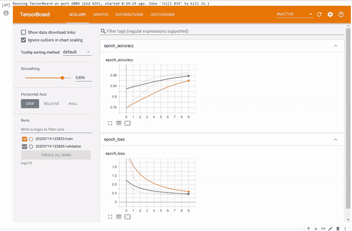
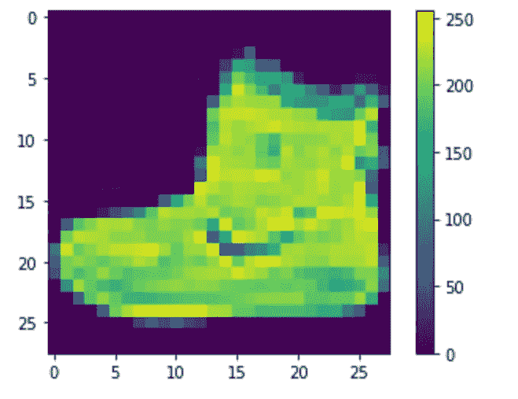
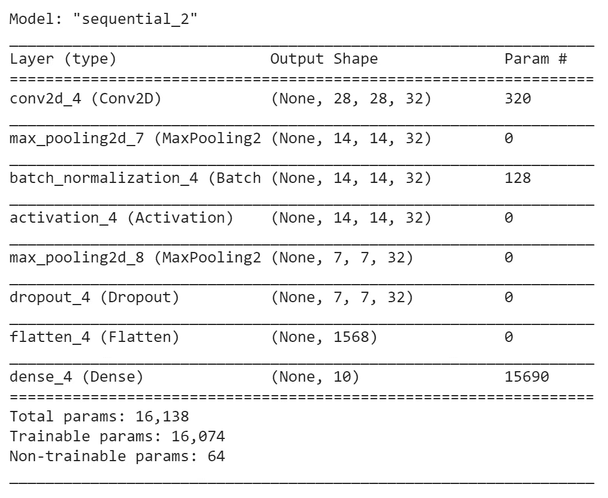
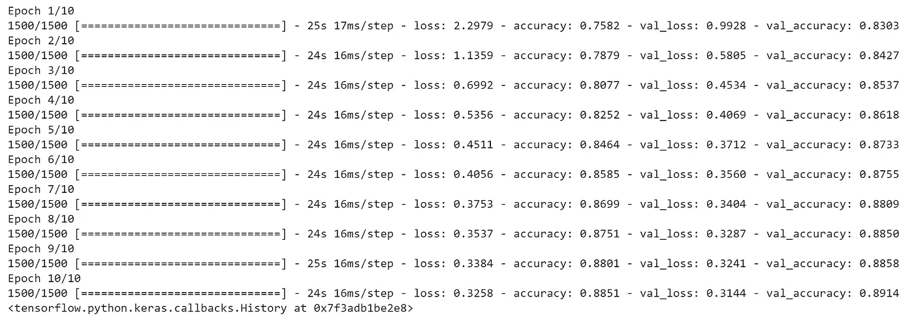
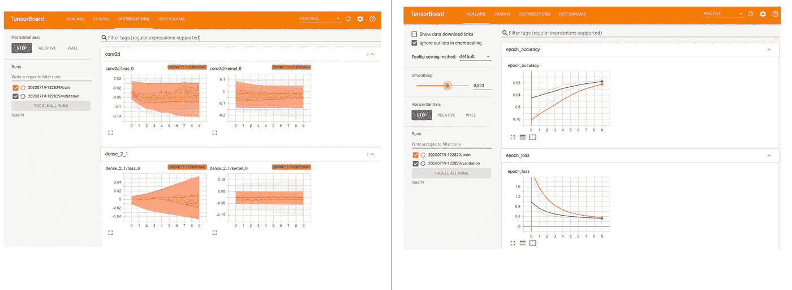
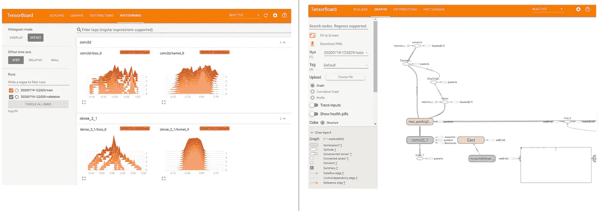
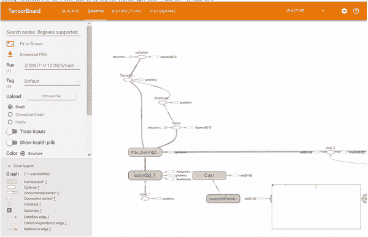

# 用 Tensorboard 增强你的神经网络

> 原文：<https://towardsdatascience.com/boosting-your-neural-networks-with-tensorboard-bc6ce815d55b?source=collection_archive---------40----------------------->



## 如何将你的实验结果形象化

神经网络(NNs)是强大的算法，通常用于深度学习任务。这类算法的美妙之处在于，神经网络是复合的，从某种意义上说，它们由多层组成，可以添加、删除、修改，通常还可以在训练后定制，以便尝试不同的网络配置(如果你想更深入地了解这种算法的功能，请查看我的文章[这里](https://medium.com/dataseries/understanding-the-maths-behind-neural-networks-108a4ad4d4db))。

这样做的最终目的是获得能够返回高精度的算法。

这就是为什么在训练时对算法中正在发生的事情以及训练后最相关的结果有一个有意义的见解，是机器学习项目管道中的一个关键步骤。带着这个目的，在这篇文章中，我将谈论 [Tensorboard](https://www.tensorflow.org/tensorboard) 。

Tensorboard 是一个强大的仪表板工具，可以通过 *pip* 轻松安装，并且在不使您的代码变得更加复杂的情况下，能够返回一个非常有意义的仪表板，反映您的 NN 性能。

为了向您展示这个工具的强大功能，我将使用 Keras 设置一个图像分类器。

## 用 Keras Sequential()构建卷积神经网络(CNN)

为了构建我的模型，我将使用一个卷积神经网络，使用 [t](https://keras.io/guides/functional_api/) he `Sequential()`方法(您也可以使用 [Keras Functional API](https://keras.io/guides/functional_api/) 来实现相同的目的)。

我要解决的任务是机密任务。更具体地说，我下载了时尚 MNIST 数据集(嵌入在 Keras 中)，其中包含 10 种不同时尚单品的图片。我们算法的目标将是正确地用相应的项目标记给定的图像。

因此，在开始构建模型之前，我们先来看看数据集。

```
#downloading necessary packagesimport tensorflow as tf
import datetime
from tensorflow import keras
import numpy as np
import matplotlib.pyplot as plt fashion_mnist = keras.datasets.fashion_mnist(train_images, train_labels), (test_images, test_labels) = fashion_mnist.load_data()#creating a list of labelsclass_names = ['T-shirt/top', 'Trouser', 'Pullover', 'Dress', 'Coat','Sandal', 'Shirt', 'Sneaker', 'Bag', 'Ankle boot']
```

让我们检查第一个火车图像及其形状:

```
plt.figure()
plt.imshow(train_images[0])
plt.colorbar()
plt.grid(False)
plt.show()
```



```
train_images.shapeOutput: (60000, 28, 28)
```

因此，我们的训练集由 60000 张 28x28 像素的图像组成。如果图像是彩色的(RGB)而不是灰度的，我们在上面的张量中也会有第四维，表示通道。

在构建模型之前，我们还需要三个步骤，即:

*   重塑 4D 物体中的张量(以便它们与 2D 卷积层兼容)；

```
train_images = train_images.reshape((train_images.shape[0], 28, 28, 1))
test_images = test_images.reshape((test_images.shape[0], 28, 28, 1))
```

*   一键编码标签集(训练和测试)；

```
train_labels = to_categorical(train_labels)
test_labels = to_categorical(test_labels)
```

*   在从 0 到 1 的范围内重新缩放像素(因为像素的范围是从 0 到 255)。

```
train_images = train_images / 255.0
test_images = test_images / 255.0
```

太好了！现在让我们建立一个简单的 CNN，它有以下几层。注意，在本文中，我不打算深入探究每一层和整个结构背后的数学原理。如果你对 NNs 的特性感兴趣，我推荐你阅读这篇[文章](https://medium.com/dataseries/understanding-the-maths-behind-neural-networks-108a4ad4d4db)。

```
#initializing Tensorboard extension%load_ext tensorboard#creating a logs directorylog_dir = "logs/fit/" + datetime.datetime.now().strftime("%Y%m%d-%H%M%S")tensorboard_callback = tf.keras.callbacks.TensorBoard(log_dir=log_dir, histogram_freq=1)# number of possible label values
nb_classes = len(class_names) #10model = tf.keras.models.Sequential()model.add(tf.keras.layers.Conv2D(32,(3,3), padding='same', input_shape=(28, 28,1)))
model.add(tf.keras.layers.MaxPooling2D(pool_size=(2, 2)))
model.add(tf.keras.layers.Activation('relu'))
model.add(tf.keras.layers.MaxPooling2D(pool_size=(2, 2)))
model.add(tf.keras.layers.Dropout(0.25))
model.add(tf.keras.layers.Flatten())model.add(tf.keras.layers.Dense(nb_classes, activation='softmax'))
model.summary()
```



现在让我们训练我们的模型，确保将训练集的 20%作为验证集:

```
log_dir = "logs/fit/" + datetime.datetime.now().strftime("%Y%m%d-%H%M%S")
tensorboard_callback = tf.keras.callbacks.TensorBoard(log_dir=log_dir, histogram_freq=1)model.fit(train_images, 
          train_labels, 
          validation_split=0.2,
          epochs=10,  
          callbacks=[tensorboard_callback])
```



注意，添加`tf.keras.callbacks.TensorBoard`回调确保了日志的创建和存储:这在调用 Tensorboard 扩展时是需要的。

## 用 Tensorboard 可视化这一切

一旦我们的模型被训练好，通过使用`%tensorboard logdir logs/fit` magic 命令，我们可以可视化我们的结果的一个很好的仪表板:



当然，一切都是互动的:


正如你所看到的，Tensorboard 提供了各种各样的视觉项目，有助于深入了解 CNN 的表现和结构。请注意，在*图*字段中，您可以以互动的方式可视化您网络的整体结构。



因此，只需几行额外的代码，我们就成功地将我们的网络变成了一个具有非常有趣的洞察力的可视化仪表板。

我希望你喜欢阅读！如果你对这个话题感兴趣，我建议你阅读文档部分的更多内容。

## 参考资料:

*   [https://keras.io/guides/functional_api/](https://keras.io/guides/functional_api/)
*   https://keras.io/
*   [https://www.tensorflow.org/tensorboard/get_started](https://www.tensorflow.org/tensorboard/get_started)
*   “用 Python 进行深度学习”， *Francois Chollet*