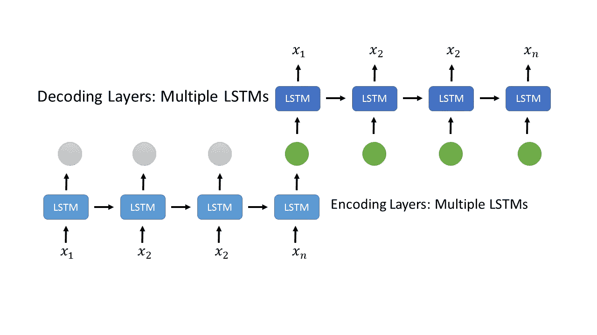

# 通过“波束搜索+语言模型”解码提升序列生成性能

> 原文：<https://towardsdatascience.com/boosting-your-sequence-generation-performance-with-beam-search-language-model-decoding-74ee64de435a?source=collection_archive---------11----------------------->


[*https://www . shutterstock . com/image-vector/digital-binary-code-matrix-background data-flood-1341680024*](https://www.shutterstock.com/image-vector/digital-binary-code-matrix-backgrounddata-flood-1341680024)

## 波束搜索和 LM 解码的时间、原因和方式

每当涉及图像处理、音频数据分析或自然语言处理(NLP)任务时，深度学习都被证明是一个理想的选择，并显示出出色的成果。基于神经网络的模型架构在理解复杂模式以及生成有意义和现实的数据方面非常出色。虽然基于深度学习的解决方案通常非常有效，但使用更好的后处理技术来使预测更加准确从来都不是一个坏主意。

复杂的问题，如神经机器翻译(NMT)，图像字幕生成(ICG)和语音识别(ASR)，今天都可以通过深度学习来解决。这些问题被归类为序列生成问题，其中给定一个输入，模型学习生成一些文本序列。如果你看一看显示这些任务最先进( *SOTA* )结果的研究论文，你可能会发现他们的解决方案利用波束搜索解码器与语言模型融合来提高结果。让我们通过例子来了解更多关于这些解码技术的知识——

> 更进一步，我们将定义一个示例序列生成问题，并探索后处理(解码)技术。我们将从贪婪搜索解码技术开始，并引入融合语言模型的波束搜索解码来进一步改善整体结果。

# 示例问题

考虑一个英语文本生成的问题，并假设我们已经训练了一个模型来做这件事。根据问题的性质或解决策略，我们的模型可能是字符级模型或单词级模型。字符级文本生成器模型通过一次预测一个字符来生成文本。类似地，单词级文本生成器一次预测一个单词，多个预测的单词组成一个序列。

假设我们已经训练了一个字符级模型，它通过一次预测一个字符来生成文本。此问题可能与以下任何问题相关—语音转文本、光学字符识别、图像字幕生成等。此类问题通常使用编码器-解码器架构来解决，如下图所示。编码器部分负责获取输入向量(音频、图像或文本……)并产生编码的上下文向量。然后，解码器部分使用该上下文向量，通过一次预测一个令牌(char/ wordbbb)来生成输出序列。



[*https://stack overflow . com/questions/45977990/tensor flow-how-to-embed-float-sequences-to-fixed-size-vectors*](https://stackoverflow.com/questions/45977990/tensorflow-how-to-embed-float-sequences-to-fixed-size-vectors)

由于我们的模型是字符级的，它将为输出序列中的每个标记生成所有可能字符的概率分布。换句话说，对于我们的模型预测的每个单词(char)，它将生成一个长度为 ***26*** 的概率数组(根据英语——a 到 z ),概率将显示特定字符成为输出单词的可能性。

对于一个长度为 ***10(字符)*** 的预测序列，我们的模型的输出看起来像这样

```
output_shape = **10 * 26** output = [[**0.1**, 0.01, 0.03, ... ... ... ... ... (len-26)],
          [0.1, 0.002, **0.6**, ... ... ... ... ... (len-26)],
            ''         ''         ''      ''       ''    
            ''         ''         ''      ''       '' 
          [**0.9**, 0.01, 0.01, ... ... ... ... ... (len-26)]]
```

要将这种概率输出转换成可读形式(英文文本)，我们需要一种解码算法。最简单的解码器是贪婪搜索解码器。让我们写一个贪婪搜索解码器和一个叫做波束搜索解码器的复杂解码器

*   **注意—** 序列生成问题不一定涉及文本生成，它可以是任何种类的序列。我们以文本生成问题为例，因为在这篇文章中我们也将讨论语言建模。

# 贪婪搜索解码器

解码模型预测的最简单方法是将最可能的序列视为输出。贪婪解码器，也称为最佳路径解码器，在每次预测中考虑具有最高概率的标记(字符或单词),并连接所有预测的标记以获得最终的输出序列。这是获得输出序列的简单而快速的方法。但它可能不会总是给你最好的输出。

下面是你如何用 Python 为你的模型写一个贪婪的解码器—

这里模型预测的形状是 **5*4** 这意味着，模型试图生成一个长度为 5 的序列。由于词汇表中只有四个不同的标记，该模型预测序列中每个标记大小为 4 的概率分布。根据定义，贪婪解码器通过在每个时间步长选择最可能的记号来生成具有最高概率的序列。

# 波束搜索解码器

波束搜索解码是另一种流行的解码模型预测的方法，它在几乎所有情况下都比贪婪搜索解码器产生更好的结果。与贪婪解码器不同，它不仅仅考虑每次预测最可能的令牌，它还考虑具有更高概率的前 k 个令牌(其中 k 被称为*波束宽度*或**波束尺寸** )。虽然波束搜索给出了更好的结果，但是由于计算复杂，它使得整个流水线很慢。

因此，它不只是给你一个输出序列，它给你 k 个不同的输出序列以及它们的可能性(概率)。与只有一个输出序列的贪婪解码器不同，这里有 k 个不同的输出序列，这 k 个序列中很有可能有一个是正确的输出序列。

## 算法

对于第一个时间步预测，选择 k 个概率较高的令牌，而不是一个(因为在 greedy 中我们只选择一个)。现在更进一步，考虑当前预测的每个记号，并将其附加到所有先前解码的 k 个序列，并继续计算新序列的相应概率。现在根据概率得分从新序列中选择前 k 个序列，并移动到下一个时间步。重复这个过程，直到最后一个令牌。最后，返回 k 个序列及其对应的概率值。

***提示:*** [***单词波束搜索***](https://ieeexplore.ieee.org/document/8583770) 是波束搜索解码技术的另一种变体，其限制或选择仅具有字典单词的输出序列。在大多数情况下，它比普通的波束搜索执行得更好。

用 Python 编写波束搜索解码器—

## 为什么是对数似然法？

这是因为当有更长的序列时，常规概率会引起问题。例如—考虑由模型生成的长度为 ***100*** 的序列。并且序列中每个记号的概率是 ***0.10*** 那么输出序列的概率将是所有这些概率的乘积—

```
Probability of a sequence with 100 tokens would be--
P(sequence) = **p(t1) * p(t2) * p(t3) .............. * p(t100)**
            = 0.1 * 0.1 * 0.1 * .................... * 0.1
            = **10 ^ (-100)** # An extremely small number 
```

正如我们所见，这是一个非常小的数字。任何编程语言都可能无法比较如此小的浮点数，因为这可能导致下溢。这就是为什么我们计算对数概率而不是常规概率。如果你注意到我们用负对数概率相乘来计算分数(代码中的第 16 行)，这是因为概率的对数(0 < 1.0)总是负数。因此我们选择对数分数最小的前 k 个序列。

> 有 N 个记号的序列的概率是—

```
**P(seq)** = p(t1) * p(t2) * p(t3) ........ p(tN)### taking log on both sides (calculate **log-likelihood**)**log(P(seq))** = **log(**p(t1) * p(t2) * p(t3) ........ p(tN)**)   log(P(seq)) = log(p(t1)) + log(p(t2)) + .. log(p(tN))**### logarithm of a number < 1.0 will be always negative so  in this ### case log-likelihood of the sequence would be negative.
```

如果我们在两边取一个*的对数，这个乘法就会转换成求和。因此，对数似然的计算而不是真实概率的计算会更快更有效。我们知道一个数< 1.0 的**T5【对数】T6**永远是负数。所以我们的序列会得到一个负的分数。我们可以通过取该分数的反对数，将该分数(对数似然)转换为原始概率。为了使用波束搜索找到 k 个最佳序列，我们只需要比较某些序列的概率，所以对数似然法就可以了。*

# *++语言模型*

*现在我们知道，波束搜索解码器给你 k 个不同的输出序列，而不是一个，很有可能这些序列之一是正确的输出。但是我们没有办法确定哪个输出序列是最好的。这就是语言模型发挥作用的地方。*

## *什么是语言模型？*

*语言模型是给定语言的统计表示。如果给定一个句子中先前出现的单词列表，它应该能够猜出下一个单词。换句话说，语言模型可以确定给定文本序列(句子)的概率，其中序列标记(字符/单词)是从固定词汇表(语言词汇)中提取的。所以，基本上它能给你的句子打分。一个好的分数意味着句子在语境上是正确的，并且属于给定的语言。*

*语言模型通常在非常大的文本语料库上训练，并且能够理解(学习)给定句子中单词的上下文(共现)。语言模型不一定是单词级别的，我们也可以在字符上训练语言模型。字符级语言模型应该在给定前几个字符的情况下猜测序列中的下一个字符。同样，字符级模型也可以给你一个给定句子的概率(或可能性)。*

## *对文本序列评分的语言模型*

*考虑一个场景，其中深度学习模型试图生成一些文本(或者考虑一个问题，其中模型试图将语音转换为文本)，并且得到的字符概率分布被发送到波束宽度为 5 的波束搜索解码器。假设以下是使用波束搜索解码生成的前 5 个序列。*

```
***Generated Sequences **                  **           Probability (model)**1\. *speech recogniiion is a hald problem* ***0.41*** *2\. speech recog niiion isa hard problem           0.39
3\.* ***speech recognition is a hard problem*** *0.37
4\. spe ech recogniion is a hard problem           0.32
5\. spe ech recogni tion is ahard problem          0.29**
```

*贪婪搜索解码器将给出第一个序列作为输出，因为根据我们的模型，它是具有最高概率(0.41)的序列。但显然(3)是正确的输出，只是概率稍小。*

*为了找到这 5 个序列中的最佳序列，我们将使用语言模型来检查每个英语序列的可能性。如果我们的语言模型训练有素，它应该给第三个序列一个很好的概率(分数)，因为它按照英语是 *100%* 正确的。*

*假设根据我们的语言模型，以下是这 5 个序列的可能性。*

```
***Generated Sequences **                  **      Probability  Probability
                                              (model)      (L.M.)**1\. *speech recogniiion is a hald problem* ***0.41*** *0.20
2\. speech recog niiion isa hard problem         0.39        0.40
3\.* ***speech recognition is a hard problem*** *0.37* ***0.70*** *4\. spe ech recogniion is a hard problem         0.32        0.35
5\. spe ech recogni tion is ahard problem        0.29        0.47**
```

*现在，为了选择最佳输出序列，我们将考虑两种概率的加权和—*

```
 ***P(final)** = *Alpha* ***** **P(model)** **+** *Beta* ***** **P(L.M.)***
```

*常量`*Alpha*`和`*Beta*`的值是在验证数据集上调整后决定的。我们选择在验证集上给出最佳结果的值。然后，我们使用这些值在测试集上评估我们的模型。*

****注:**有时在计算一个序列的最终得分时，也会考虑序列长度。如果我们不惩罚序列长度的分数，我们的模型将给予更小的序列更多的优先权。因为对于更长的序列，分数会更小(更多概率值的乘积(p < 1.0)会导致更小的分数)。*

****提示:*** 据观察，使用 ***单词级语言模型*** 在大多数情况下会给出更好的结果。为了能够使用单词级语言模型进行评分，输出序列应该仅限于字典单词。因此，使用词束搜索算法来得出受限制的词束，然后用语言模型对这些词束重新评分，以决定最终输出。*

***PS:** 通常，根据研究论文，当应用波束搜索时，使用非常大的数字作为波束大小(~ 1000–2000)。它提供了更好的结果，但是以速度为代价，因为推理变得非常慢。*

*原刊[此处](https://dropsofai.com/boosting-your-sequence-generation-performance-with-beam-search-language-model-decoding/)。*

***很少有研究论文利用波束搜索解码和语言模型来改善结果—***

1.  *[*https://papers . nips . cc/paper/5346-sequence-to-sequence-learning-with-neural-networks . pdf*](https://papers.nips.cc/paper/5346-sequence-to-sequence-learning-with-neural-networks.pdf)*
2.  **听、听、拼(*[*https://arxiv.org/pdf/1508.01211.pdf*](https://arxiv.org/pdf/1508.01211.pdf)*)**
3.  **展示和讲述(*[*【https://arxiv.org/pdf/1411.4555.pdf】*](https://arxiv.org/pdf/1411.4555.pdf)*)**
4.  **音序器(*[*https://arxiv.org/pdf/1901.01808.pdf*](https://arxiv.org/pdf/1901.01808.pdf)*)**

## *图像来源:*

1.  **(矩阵图像)*[*https://www . shutterstock . com/image-vector/digital-binary-code-matrix-background data-flood-1341680024*](https://www.shutterstock.com/image-vector/digital-binary-code-matrix-backgrounddata-flood-1341680024)*
2.  **(LSTM 自动编码器)*[*https://stack overflow . com/questions/45977990/tensor flow-how-to-embed-float-sequences-to-fixed-size-vectors*](https://stackoverflow.com/questions/45977990/tensorflow-how-to-embed-float-sequences-to-fixed-size-vectors)*

> *就这样吧！*

*感谢阅读，别忘了和我分享你的想法。*