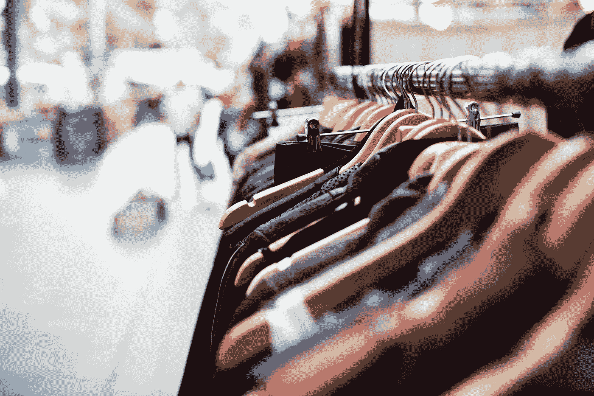

# 在 2020 年推动您的小型企业

> 原文：<https://towardsdatascience.com/boosting-your-small-business-in-2020-6ae3529cbfb0?source=collection_archive---------33----------------------->

照片由[Á·阿尔瓦罗·塞拉诺](https://unsplash.com/@alvaroserrano?utm_source=medium&utm_medium=referral)在 [Unsplash](https://unsplash.com?utm_source=medium&utm_medium=referral) 上拍摄

毫无疑问，2019 年是人工智能(AI)年。我们已经听说了很多，但许多人不确定这是否只是最新的时尚，或者是否会持续下去。

如果我们稍微观察一下我们周围世界正在发生的事情，到 2025 年，人工智能产业将在全球范围内增长到 1900 亿美元的产业。23%的企业已经在以某种形式使用人工智能，到 2021 年这一比例将上升至 75%。事实上，根据国际数据公司(IDC)的数据，今天 40%的数字化转型都使用了人工智能服务。

有人可能会说，这适用于大公司，但不适用于小企业。这种假设与事实相去甚远。在这篇文章中，我们将看看人工智能如何帮助小企业，特别是；餐馆，零售商，服务行业和那些在酒店工作的人。

照片由[丹金](https://unsplash.com/@danielcgold?utm_source=medium&utm_medium=referral)在 [Unsplash](https://unsplash.com?utm_source=medium&utm_medium=referral) 上拍摄

让我们看看餐馆。公司账目已经记录了与原材料采购相关的大部分数据。销售记录可以通过销售点系统获取。此外，如今大多数餐馆都有自己的网站或 facebook 页面。如果将这三条信息结合起来，再加上一些人工智能，餐馆老板就能对未来的经营有一些难以置信的洞察力。该系统可以很容易地计算客流量(即使考虑到季节性、节日等)。)，并且它将能够分析客户。它本质上意味着人工智能可以预测；什么时候有人会预订一张桌子，有多少人，他们可能会点什么。这样做的效果是，餐馆老板可以采用一种及时的订购系统，从而减少食物浪费，最终降低约 12%的成本。人工智能甚至可以分析社交媒体上的评论，并对餐厅提出可能的改进建议。

[人工摄影](https://unsplash.com/@artificialphotography?utm_source=medium&utm_medium=referral)在 [Unsplash](https://unsplash.com?utm_source=medium&utm_medium=referral) 上拍摄

谈到零售，大多数商店都依靠冲动购物。为了满足顾客的需求，零售商需要根据顾客的喜好增加库存。然而，过多的库存可能会有问题，因为它可能会导致库存积压。同样，鉴于大部分数据都是可用的，人工智能可以用来帮助零售商提高销售额。聊天机器人可以通过脸书网页回答用户的询问，还可以一周七天、一天 24 小时出售特定商品。在线门户网站，结合有针对性的宣传活动，可用于在线销售无库存商品。剖析客户有助于预测未来的购买。然后它会减少库存订单；从而储存更少的库存，但获得更显著的销售。这种系统还能够预测客户流失，并显著提高现有客户的保留率。

蒂姆·莫斯霍尔德在 [Unsplash](https://unsplash.com?utm_source=medium&utm_medium=referral) 上的照片

在服务行业中，时间至关重要。正因为如此，简单的自动化任务可以走很长的路。最基本的是安排约会。想象一下，一家理发店雇佣了四名理发师。每个理发师每个月可以服务大约 375 个客户(假设每个客户 30 分钟，一周工作 6 天)。因此，这家有四名理发师的商店每月总共有 1500 个预约。如果每个预约都是通过电话进行的，并且每个电话持续 1 分钟，这意味着一个理发师每个月花整整三个工作日来安排预约而不是理发。在这种情况下，一个简单的在线系统就可以实现整个过程的自动化！

照片由[菲利奥斯·萨泽德斯](https://unsplash.com/@filios_sazeides?utm_source=medium&utm_medium=referral)在 [Unsplash](https://unsplash.com?utm_source=medium&utm_medium=referral) 上拍摄

酒店业也可以从人工智能中受益，不管你是拥有一家小型 Airbnb 还是一家大型酒店。人工智能系统可以用来分析列表，对评论进行情感分析，并就如何改善这个地方提出建议。自动翻译使与外国人的交流更加容易，因为电子邮件可以被翻译成地球上最常用的语言。分析有助于预测未来趋势和入住率。客户特征分析将有助于为客户提供个性化的独特体验。最后，人工智能可以用来缓解人员招聘和提供足够的培训。

从上面提到的各种例子中可以看出，无论业务规模大小，AI 都在几个用例中使用。2020 年，我们将在不同的经济领域体验到更广泛的人工智能应用，因为人工智能为任何使用它的组织提供了竞争优势。正因为如此，为什么不制定一个新年计划，并开始关注人工智能带来的可能性。

*本文原载于*[*【https://www.businesstoday.com.mt】*](https://www.businesstoday.com.mt/people/people/517/interview__alexiei_dingli_malta_ideal_place_to_launch_and_deploy_ai_solutions)

[**Alexei Dingli**](http://www.dingli.org/)**Prof 是马耳他[大学](https://www.um.edu.mt/)的 AI 教授。二十多年来，他一直在人工智能领域进行研究和工作，协助不同的公司实施人工智能解决方案。他的工作被国际专家评为世界级，并赢得了几个当地和国际奖项(如欧洲航天局、世界知识产权组织和联合国等)。他已经出版了几本同行评审的出版物，并且是马耳他[的成员。由马耳他政府成立的人工智能工作组，旨在使马耳他成为世界上人工智能水平最高的国家之一。](https://malta.ai/)**