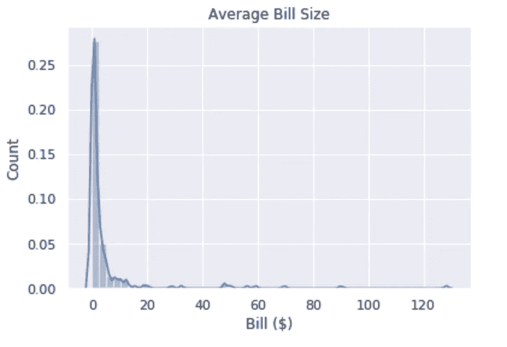
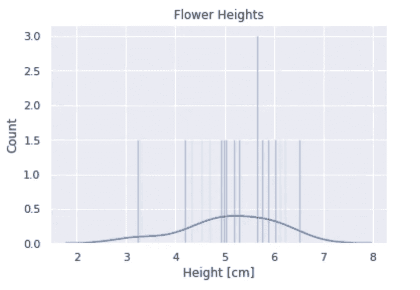
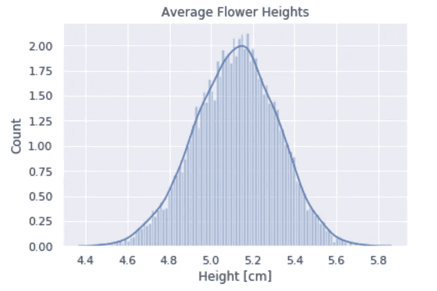
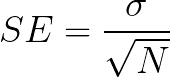
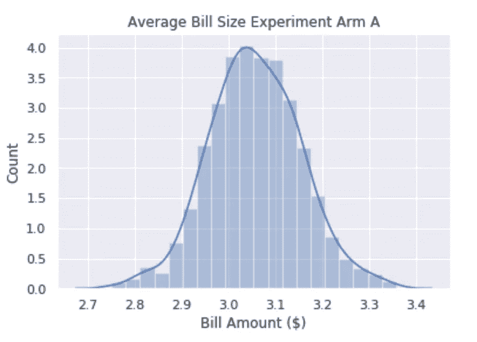
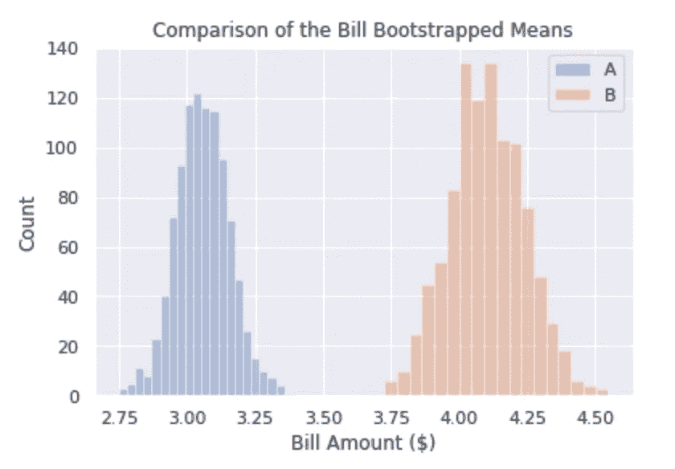

# 自助估计和实验

> 原文：<https://towardsdatascience.com/bootstrap-estimates-and-experimentation-adf084d7c6e7?source=collection_archive---------58----------------------->

## 蒙特卡罗估计第一部分


莫里茨·金德勒在 [Unsplash](https://unsplash.com?utm_source=medium&utm_medium=referral) 上拍摄的照片

这些天进行的许多数字实验可以用频率统计方法愉快地分析，因为我们期望数据是正态分布的*。然而，有些指标并不那么容易。以一个旨在增加税收或支付发票的实验为例。如果所有发票要么全部支付，要么根本没有支付，这可以用*二项式比例检验*或*卡方检验*进行分析。然而，发票的某一部分将被部分支付，使得这些测试不合适。即使我们试图比较实际的账单分布，这些很可能是某种形式的指数分布，有许多小额账单和较少的大额账单，如下所示。*

**

*那怎么办呢？处理这个问题的一种方法是使用随机抽样统计工具，通常被称为*蒙特卡罗模拟*。与评估实验结果特别相关的两个是**(*用于确定平均值等统计参数的分布)和 ***排列测试*** *(* 用于确定两个分布之间的统计数据是否存在差异，以及这种差异与偶然情况相比有多大可能是真实的)。在这篇文章中，我们将讨论自举。**

****

**照片由[克里斯蒂·金](https://unsplash.com/@christieckim?utm_source=medium&utm_medium=referral)在 [Unsplash](https://unsplash.com?utm_source=medium&utm_medium=referral) 上拍摄**

**自举使用 ***替换采样*** 的概念来生成参数的分布。为了说明这一点，假设我们要估计二十朵花的平均高度。如果没有电脑，我们可以这样做:**

1.  **测量每朵花，并在一张纸上记录花的 ID 和高度**
2.  **计算样本中花朵的平均高度，并写下来。**

****

**上面我们用 Python 生成了 20 朵花的正态分布高度**

*****现在是有趣和(稍微)神奇的部分……*****

1.  **把纸片放在帽子里，随机选择一张。**
2.  **写下你选择的花的高度，然后把纸放回帽子里。**
3.  **随机再选一次——你可能会再选同一个！这就是所谓的 ***抽样替换。*****
4.  **重复 20 次，以符合原始样本大小。这些应该是一样的。**
5.  **再次计算平均值**并记下来——这是平均值的第二个估计值。****

****如果你重复上述 1000 次，你会得到 1000 个略有不同的平均值，这些平均值是:****

1.  *****正态分布，*****
2.  ****提供您估计的花朵平均高度的平均值 的 ***标准误差。*******

****在(非常不优化，但也许更可读？！)Python 我们可以这样做上面的内容:****

```
****#generate a few normally distributed heights for demonstration
N_flowers = 20
flower_heights = np.random.normal(5,size = N_flowers)data_points = flower_heights
number_of_bootstraps = 1000
average_estimate = [np.mean(data_points)]for j in range(0,number_of_bootstraps):
    random_sample = []
    for i in range(0,len(data_points)):
        random_sample.append(np.random.choice(data_points))
    average_estimate.append(np.mean(random_sample))ax = sns.distplot(average_estimate, bins = 100).set_title('Average Flower Heights')
plt.xlabel("Height [cm]")
plt.ylabel("Count")****
```

********

****这里我们有我们在这个例子中使用的 20 朵花的平均高度分布的 boostrapped 估计。****

****作为健全性检查，有必要将自举标准误差与我们使用 frequentist 方法从正态分布中预期的标准误差进行比较。标准偏差为σ、样本大小为 N 的正态分布的平均值(SE)的标准误差如下所示:****

********

****我们可以使用以下公式将上述内容与我们的自举估计进行比较:****

```
****#normal distribution estimate
std_error_mean = np.std(flower_heights) / np.sqrt(N_flowers) -- 0.1983#bootstrap estimate
bootstrap_estimate = np.std(average_estimate) -- 0.1977****
```

****我听到你们有些人在后台嘀咕- ***有什么大不了的！如果没有这些乱七八糟的选择，我们本可以做到的。*******

******但是** …如果(而不是花)我们有一些其他非正态分布的样本呢？那么通常具有某种指数分布的钞票呢？****

****下面显示的账单的含义是什么？对于实验来说更重要的是*(我们试图确定两个均值或其他统计参数之间是否存在差异)*均值估计的 ***标准误差*** 是多少？****

```
****bill_size = np.random.pareto(1,200)
sns.distplot(pareto).set_title("Average Bill Size")
plt.xlabel("Bill ($)")
plt.ylabel("Count")****
```

********

****这就有点棘手了，不是吗…****

****让我们尝试使用 bootstrap 技术对此进行估计，但这次让我们稍微整理一下，并使用一个函数…****

```
****def get_bootstrap_mean(data_values, n_bootstraps):
    '''
    data_values: Pandas Dataframe
    n_bootstrapes: Number of bootstrap estimates to calculate
    Return:
    Pandas Dataframe of the mean estimates
    ''' bootstrap_means = []
    for j in range(0, n_bootstraps):
        sample = data_values.sample(frac=1, replace=True).copy()
        bootstrap_means.append(sample.mean())
    return(pd.DataFrame(bootstrap_means))bill_size_experiment_a = pd.DataFrame(np.random.exponential(3,10000) )
average_estimate_a = get_bootstrap_mean(bill_size_experiment_a, 100)ax = sns.distplot(average_estimate_a, bins = 100).set_title('Average Bill Size Experiment Arm A')
plt.xlabel("Bill Amount ($)")
plt.ylabel("Count")****
```

********

****太好了！但是这对实验来说意味着什么呢？对于实验来说，我们想让自己相信干预确实有效果。例如，假设我们做了一个旨在增加平均还款的实验？我们怎么知道它起作用了？我们可以比较如下的自举平均分布:****

```
****bill_size_experiment_b = 1.1 +pd.DataFrame(np.random.exponential(3,10000) )
average_estimate_b = get_bootstrap_mean(bill_size_experiment_b, 100)****
```

****然后如下所述比较两个直方图(其中 A 和 B 分别是实验组 A 和 B):****

```
****fig, ax = plt.subplots()
for a in [average_estimate_a, average_estimate_b]:
    sns.distplot(a, bins = 20, ax=ax, kde=False)
plt.legend(["A","B"])
plt.title("Comparison of the Bill Bootstrapped Means")
plt.xlabel("Bill Amount ($)")
plt.ylabel("Count")****
```

********

****一件很棒的事情是，我们现在可以用 t 检验来比较两个均值分布****

```
****t2, p2 = stats.ttest_ind(average_estimate_a,average_estimate_b)****
```

****对于上述情况，我们得到 p~0，即两个样本的平均值相同的概率几乎为零。如果这是两个实验条件的代表，我们可以有把握地假设它们之间存在差异。****

****这是一种 ***非常*** 强大的技术——它可以用来估计任何统计参数的标准误差，不管底层数据是什么分布。此外，得到的估计值是正态分布的，这使得使用标准频率技术进行比较变得容易。****

****在下一篇文章中，我将描述 ***排列测试*** 。这些特别用于确定参数在两个分布之间不同的可能性。****