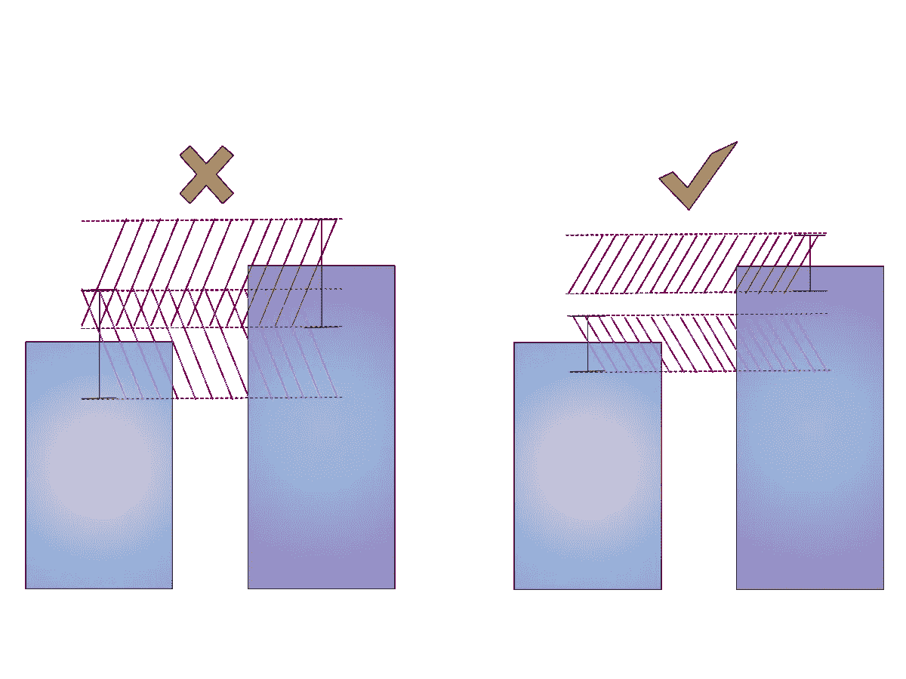
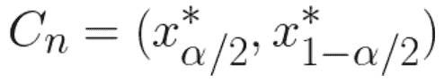
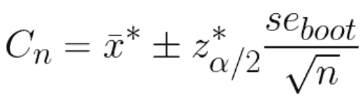
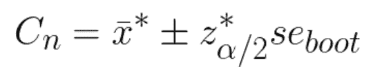
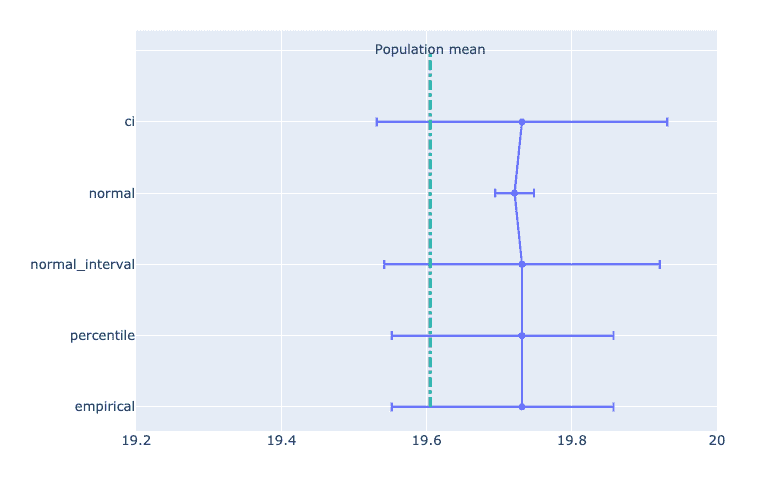

# 自举置信区间:基础

> 原文：<https://towardsdatascience.com/bootstrapping-confidence-intervals-the-basics-b4f28156a8da?source=collection_archive---------27----------------------->

## 如何在没有 t 检验和 p 值的情况下计算任何指标的置信区间

*两个 AB 测试:在左边，测试组之间没有统计学上的显著差异；在右边，这样的差异存在(图片作者)*

*如果你是数据驱动型公司的数据科学家、数据分析师或产品经理，你会对你的产品做很多实验，通常，你会做很多 AB 测试。让我们假设你有一个控制组和治疗组的 AB 测试。当分析结果时，您比较测试组中订单/访问/查看的平均数(或任何其他指标)。显然，您可以计算指标的平均值，甚至可以使用 t 检验和 p 值，如果两个平均值之间存在统计上的显著差异。但是通常，他们说不要只看 p 值，要看置信区间。在这篇博文中，我们发现了如何使用自举来计算置信区间。Bootstrapping 是一种很酷的估计置信区间的方法，因为它不依赖于任何数据分布的假设(例如，与流行的 Welch t-test 相比)，并且它很容易自己实现(下面我分享了一个我的实现的链接)。*

# 自举定义和原理

bootstrap 是一种估计标准误差和计算置信区间的方法。自举始于 1970 年[布拉德利·埃夫隆](https://projecteuclid.org/euclid.aos/1176344552#info)；它已经存在了 40 多年，因此从那时起，开发了许多不同类型和方法的自举。

尽管有许多变化，*所有的引导步骤看起来如下:*

1.  定义 *u* —从样本中计算出的统计数据(平均值、中值等)。
2.  替换原始数据样本的样本。让它成为 *F** —经验分布。重复 *n* 次( *n* 为引导迭代)。
3.  计算 *u** —从每个重采样中计算的统计量。

然后自举原理说:

如上所述，bootstrap 可用于不同的目标:

*   估计置信区间
*   假设检验
*   偏差消除

每个话题都应该有一个单独的帖子，今天我们只关注自举置信区间。

# 自举置信区间的方法

当我研究这个主题时，我还没有找到一个一次性包含所有 bootstraps 方法的单一来源，每个引用都有自己的类型。最常见的如下所示:

简而言之，这种方法近似于自举均值和样本均值之间的差异。

让我们考虑一个例子(其他方法也是如此):估计基础分布的均值 *μ* ，给出一个 80%的 bootstrap 置信区间。

经验自举说:

*   从重新采样开始，替换原始数据 *n* 次。
*   对于每个自举，计算平均值 *x** 。
*   计算每个引导样本的*δ* = x *—x*(*x*是原始数据的平均值)，将它们从最小到最大排序。
*   选择 *δ.1* 作为第 90 个百分位数， *δ.9* 作为 *δ** 排序列表的第 10 个百分位数，得到 80%的置信区间*[x-δ. 1，x-δ. 9】*。

[乏色曼的《统计学大全》一书](https://link.springer.com/book/10.1007/978-0-387-21736-9)为经验自助法提供了以下数学符号:

其中 *x* 是原始数据的平均值， *x** 是自举平均值。

2.**百分位自助法**

bootstrap percentile 方法使用 bootstrap 样本统计的分布作为数据样本统计的直接近似值，而不是计算差值 *δ** 。

对于百分位引导:

*   从重新采样开始，替换原始数据 *n* 次。
*   对于每个引导计算平均值 *x** ，从最小到最大排序。
*   选择 *x*.1* 为第 10 个百分位数， *x*.9* 为 *x** 排序列表的第 90 个百分位数，得到 80%的置信区间 *[x*.1，x*.9】。*

或者换句话说:

bootstrap 百分位法非常简单，但它依赖于基于特定样本的 bootstrap 分布，该分布很好地逼近了 *x* 的真实分布(因此，[该来源](http://www-math.mit.edu/~dav/05.dir/class24-prep-a.pdf)建议不要使用百分位 bootstrap)。

3.**正常自举**

正常的 bootstrap 方法不是取 bootstrap 均值的百分位数，而是计算这些 bootstrap 均值的置信区间。

*   从重新采样开始，替换原始数据 *n* 次。
*   对于每个引导，计算平均值 *x** 。
*   使用例如学生 t 检验，计算 *x** 数组的 80%置信区间:

其中 *x** 是来自 bootstrap 均值的样本均值， *se* 是 bootstrap 均值的[标准差](https://en.wikipedia.org/wiki/Standard_error_of_the_mean) s， *z** 是临界值(从正态 CDF 的分布表中找到)。

当我将这种方法与其他方法比较时，它的 CI 与其他方法相比总是很窄，这让我很困惑。据我所知，这是因为该定义强烈依赖于关于数据正态分布的假设。

过了一段时间，我在乏色曼的《统计学》中偶然发现了这种方法略有不同的措辞。计算仅在一个参数上有所不同，但它会产生巨大的差异。

4.**正常区间自举**

正常间隔引导重复正常引导的所有步骤，但对 CI 使用以下公式:

其中 *se_boot* 是标准差的 bootstrap 估计值。

除非 x*的分布接近正态，否则这个区间是不准确的。

基本上，这里的公式没有除以 *n.* 的平方根，我还没有找到为什么要这样做的解释。如果你有任何想法，请在评论中分享。

5.**参数自举**

参数自举非常接近经验方法，唯一的区别是自举样本的来源。对于参数 bootstrap，我们从参数化分布中生成 bootstrap 样本。它通常用于贝叶斯后验分布的有效计算，而不是用于实验分析，所以我在这里不详细介绍它。

# 比较方法

正如前面承诺的，[在这里](https://github.com/LizaLebedeva/bootstrap-experiments)你可以找到 Python 实现的所有方法。目标是估计目标度量平均值的 95% bootstrap 置信区间。我尝试了自举方法、自举样本的数量和数据本身的样本大小。

我的主要问题是:*哪种 bootstrap 方法会显示更可靠的结果*。首先，正态 bootstrap 显然产生了过于狭窄的 CI(因为正态假设)。在样本足够大的情况下，其他 3 种方法通常相互接近。百分位数和经验类型的优势在于，它们从左侧和右侧提供不同的区间(与正常区间自举相反)。通常，它更好，因为它考虑了数据的分布。正如您在下图中所看到的，百分位数和经验值的区间从左侧开始，在人口平均值所在的一侧。

*采用不同方法的自举置信区间(图片由作者提供)*

在百分位数和经验方法之间选择，我更倾向于百分位数方法，因为它简单。它的结果非常接近于经验方法，同时在计算中要求少一步。

另一个重要的问题是:要做多少 bootstrap 抽样。这取决于数据大小。如果数据点少于 1000 个，合理的做法是将引导数据库数量减少不超过数据大小的两倍(如果有 400 个样本，则使用不超过 200 个引导数据库，进一步增加不会带来任何改进)。如果您有更多的数据，100 到 500 之间的引导数量就足够了(更大的数量通常不会提高 CI 的准确性)。

# 而不是结论

使用自举应该记住的一个关键的评论是**它不能改善点估计**，这意味着自举的质量取决于收集的数据的质量。如果样本数据有偏差，不能很好地代表总体数据，bootstrap 估计也会出现同样的情况。因此，请始终记住，在实验过程中收集的数据应该是总体数据的良好近似值。

在这篇博文中，我描述并比较了基本的 bootstrap 方法。实际上，还存在更多的方法(如[泊松、高斯、阻塞等](https://en.wikipedia.org/wiki/Bootstrapping_(statistics)))。此外，bootstrap 不仅与置信区间有关，还用于估计中位数的标准误差、75%百分位数、假设检验等。所有这些都是下一篇博文的好主题🙂

# 参考

*   【https://projecteuclid.org/euclid.aos/1176344552#info 
*   [http://www-math.mit.edu/~dav/05.dir/class24-prep-a.pdf](http://www-math.mit.edu/~dav/05.dir/class24-prep-a.pdf)
*   [https://en . Wikipedia . org/wiki/Bootstrapping _(statistics)](https://en.wikipedia.org/wiki/Bootstrapping_(statistics))

*原载于 2020 年 5 月 17 日 https://elizavetalebedeva.com***。**