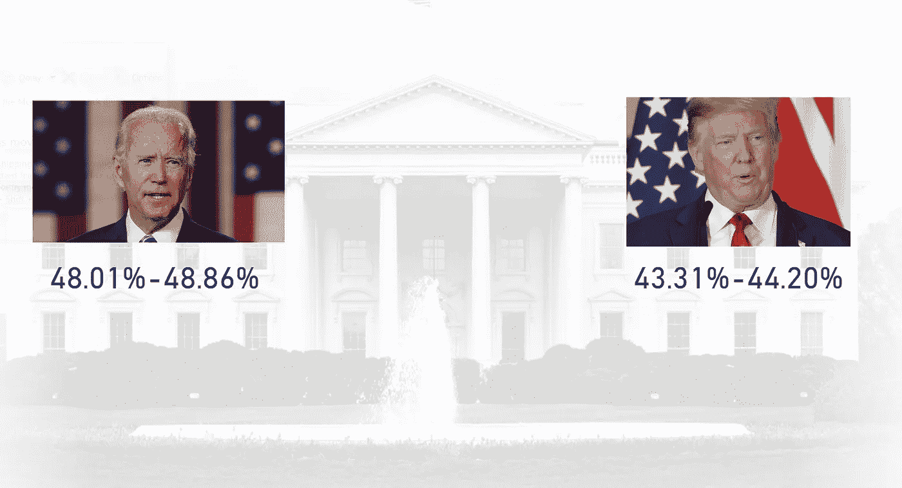

# 2020 年美国总统选举中估计选民偏好的自举方法

> 原文：<https://towardsdatascience.com/bootstrapping-method-to-estimate-voters-preferences-in-us-presidential-election-2020-d480ef13aef?source=collection_archive---------55----------------------->

## 替换抽样技术

声明:本文仅用于教育目的。它不反映或推断任何关于选举的事实信息


马库斯·温克勒在 [Unsplash](https://unsplash.com?utm_source=medium&utm_medium=referral) 上的照片

美国总统大选即将来临。美国总统选举以大量使用数据和分析而闻名。从了解选民的人口统计背景到估计不同州的选举结果，从预测选民的偏好到制定营销策略，数据无处不在。所有的政治活动都在数据分析上花费数百万美元来赢得选举。虽然我们之前已经看到不正确的采样技术未能预测选举结果，但我们不能简单地否认数据在美国总统选举中发挥的重要作用。在本文中，我们将尝试使用一种叫做 Bootstrapping 的抽样技术来了解选民在即将到来的总统选举中的总体偏好。

# **自举:**


图:Bootstrap 分布与传统抽样分布(图片由作者提供)

在统计学中，抽样分布理论告诉我们，如果我们从一个未知总体中抽取许多样本，样本的均值、中位数、标准差等统计量。从所有这些样本中得出一个分布，称为抽样分布。如果抽样分布遵循一定的规则，抽样分布的统计量就接近于总体均值、中位数、标准差等参数。这意味着即使我们不知道总体参数，我们仍然可以使用抽样分布理论来估计或推断未知参数。现在，开发抽样分布的主要挑战之一是从总体中获得几个样本。很多时候，我们只有一个总体样本，但要估计总体参数，我们需要几个样本。这就是 bootstrapping 方法在从给定样本生成许多数据样本时派上用场的时候。美国统计学家布拉德利·埃夫隆在 1979 年引入了自举法。在本文中，我们将采用不同选举民调的数据，并尝试应用 bootstrapping 来生成许多民调结果样本，以估计支持民主党和共和党的美国人的百分比。bootstrap 抽样分布的一个主要优点是，我们可以计算不同的统计数据，如均值、中值、方差等。从中。此外，分布不需要遵循任何特定的形状。
需要注意的一个缺点是，bootstrapping 方法从现有样本中生成数据。如果在我们的案例研究中给定的投票样本不能代表选举中所有类型的选民，那么 bootstrapping 方法将不会为不在给定样本中的群体生成数据。因此，我们尽可能多地进行民意调查，以代表所有选民群体，这一点非常重要。我们将使用 R 编程语言来做这个分析。

数据可以在这个链接上找到

https://github.com/PriyaBrataSen/US-Election-Poll

现在让我们来看看数据集…

# **数据:**

此分析中使用的数据集包括民意测验结果。总共有 51 个州，每个州都有不同的民调显示民主党和共和党的支持者比例。

```
df<-read.csv('pres_polls.csv')
head(df)
```


图:测向数据帧的前 6 行

从上表我们可以看出，这个数据集中有 8 个变量。Day 变量表示调查在一年中的哪一天完成。变量 state 表示完成调查的状态。区域变量描述了每个状态所在的 4 个区域。永远代表该州选举人票。Dem 和 GOP 代表给予民主党和共和党有利回应的人的百分比。日期列表示调查完成的日期，最后，民意测验者是民意测验的名称。

```
library(dplyr)poll=unique(pull(df,Pollster))
str(poll)
```


图:投票向量中的行数

让我们研究一下 Pollster 变量，看看这个样本中有多少池结果。我们可以使用“str”函数来查看数据集中有多少独特的投票。从输出中，有 233 个唯一的行，告诉我们给定的样本总共有 233 个投票。我们将使用 bootstrapping 来生成 10，000 个样本，每个样本中有 233 个池的结果。对于 10，000 个样本，我们将得到 10，000 个样本平均值，这将得出 bootstrap 抽样分布。由于自举是一种带有替换的重采样技术，一些样本可能多次具有相同的池。

# **估计选民的偏好:**

在本节中，我们将尝试为整个数据集创建 bootstrap 分布，而不考虑地区或州，以获得全国选民偏好的估计值。之后，我们将为美国的四个地区中的每一个地区构建一个引导分布。我们将计算这些 bootstrap 分布平均值的置信区间，以了解偏好水平。

让我们开始吧..

```
library(boot)
bootmean=function(x,i){mean(x[i])}prefer_country=function(data){
  boot.object=boot(data,bootmean,R=10000)
  boot.ci(boot.object,conf = 0.95,type = 'bca')
}Dem=round(prefer_country(df$Dem)$bca[,c(4,5)],4)
GOP=round(prefer_country(df$GOP)$bca[,c(4,5)],4)c('Democratc party:',Dem)
c('Republican party:',GOP)
```


图:输出(来自 bootstrap 分布的置信区间)

在 R 中，为了计算引导分布，我们首先加载“boot”库。如果我们是第一次运行这个库，我们必须在加载它之前安装它。为了开发 bootstrap 分布，我们首先需要开发一个函数，告诉 R 当我们从给定的样本生成多个样本时，我们想要计算什么统计量。在我们的例子中，我们希望计算从给定样本生成的每个新样本的平均值。因此，我们在第二行创建了一个名为“bootmean”的函数，它主要获取一个向量并计算其平均值。接下来，我们创建了一个函数‘prefer _ country ’,它主要创建 bootstrap 分布，然后计算 95%置信度下的区间。如果我们仔细观察函数内部，可以看到在第一行中，我们使用了 boot 函数创建了一个名为 boot.object 的引导对象。引导函数将获取我们将传递的数据，并从中计算出 10，000 个新样本，因为我们提到 R=10，000。最后，它将计算每个样本的统计数据，并将结果存储在“boot.object”中。这就是为什么在 boot 函数的第二个参数中，我们传递了在第二行代码中创建的“bootmean”函数。在 boot.object 中存储了不同的东西。如果我们想知道存储在其中的东西是什么，我们可以使用 str(boot.object)来查看对象的结构。然而，在我们的例子中，我们感兴趣的是得到双方均值的置信区间。因此，在下一行中，我们使用了 boot。ci 函数计算 95%置信水平下的均值区间。boot 中保存了几种类型的置信区间。对象，但我们希望偏差校正和加速(' BCA') bootstrap 区间。因此，我们提到了 type='bca '。

最后，我们为民主党和共和党的数据调用了 prefer _ country 函数，并将结果保存在“Dem”和“GOP”变量中。最后两行打印出了结果。因此，根据我们的 bootstrap 分析，我们可以在 95%的信心水平下，在这次总统选举中，48.01%至 48.86%的美国人倾向于民主党候选人，43.31%至 44.20%的美国人倾向于共和党候选人。



图:总体偏好水平的置信区间(图片由作者提供)

让我们看看地区层面，以了解双方的置信区间是什么。我们将使用相同的技术，但我们需要计算每个地区的 bootstrap 样本，而不是整个国家。下面是它的 R 代码

```
lower=c()
upper=c()
region=c()
a=unique(pull(df,Region))prefer_region=function(data){
  for (i in a){
    data_Dem=data[df$Region==i]
    boot.Dem=boot(data_Dem,bootmean,R=10000)
    p=boot.ci(boot.Dem,conf = 0.95)
    lower=c(lower,p$bca[,c(4)])
    upper=c(upper,p$bca[,c(5)])
    region=c(region,i)
  }
  preference=data.frame(region,lower,upper)
  preference}DEM=prefer_region(df$Dem)%>%rename(Dem_lower=lower,Dem_upper=upper)
GOP=prefer_region(df$GOP)%>%rename(GOP_lower=lower,GOP_upper=upper)
inner_join(DEM,GOP,by='region')
```


图:区域层面的置信区间

我们已经开始建立 3 个空向量'下'，'上'和'区域'。我们将在这些向量中保存引导输出，以开发数据帧。接下来，我们将不同地区的名称保存在向量“a”中，该向量有四个值:南方、东北、西方、中西部。我们将在 for 循环中使用这个向量来过滤特定区域的数据，然后使用过滤后的数据只为该区域开发引导样本。现在，我们已经编写了另一个名为‘prefere _ region’的函数，它从我们的 df 数据帧中获取一列作为输入。在函数内部，我们编写了一个循环，它主要获取指定的列，并针对特定区域对其进行过滤。该循环将从向量“a”中读取地区名称，并以类似于我们对整个国家所做的方式执行自举计算。每次，我们已经计算了间隔，我们已经在“下”向量中保存了下限，在“上”向量中保存了上限。此外，我们将区域名称保存在“区域”向量中。一旦所有区域的计算完成，for 循环结束。现在，我们采用了三个向量“下”、“上”和“区域”，并创建了一个名为“首选项”的数据框。这是我们函数的结尾。在最后三行中，我们主要调用了民主党和共和党的函数，并将结果保存在输出中显示的一个数据框中。

如果我们观察结果，我们可以看到，在 95%的信心水平下，民主党在西部、东北部和中西部地区的平均百分比区间更高。然而，在南部地区，间隔相互重叠。南部地区 46.19%至 47.56%的美国人倾向于民主党候选人，南部地区 45.41%至 46.81%的美国人倾向于共和党候选人。

# 结论:

从上面的讨论中，我们可以看到如何使用 R 编程语言实现自举。我们能够从 233 个观测值的给定样本中生成 10，000 个样本，每个样本有 233 个观测值。这里重要的一点是，我们试图从国家和地区层面的自举抽样分布中找出区间。它不一定能告诉我们哪个政党将赢得选举，因为这项研究不是在州一级进行的。选举人票因州而异。因此，本研究运用 bootstrapping 方法对选民的总体政治偏好进行了全面的了解。