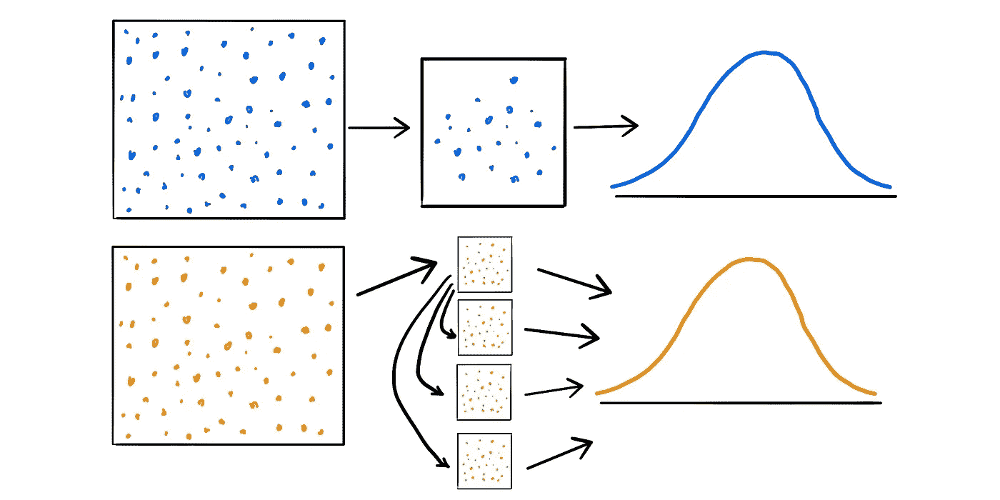
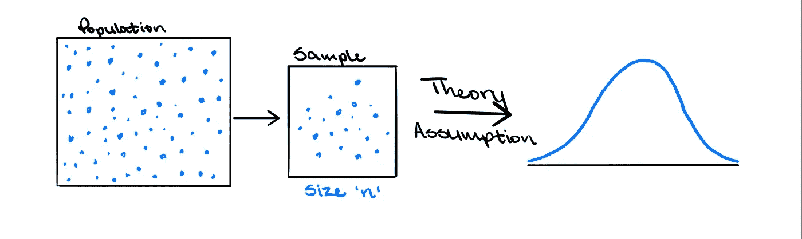
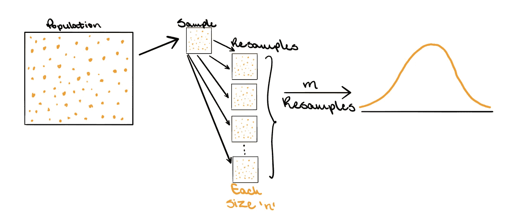
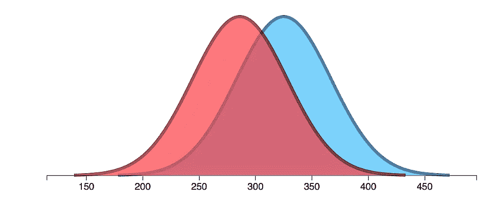

# 自举统计。它是什么，为什么使用它。

> 原文：<https://towardsdatascience.com/bootstrapping-statistics-what-it-is-and-why-its-used-e2fa29577307?source=collection_archive---------1----------------------->

## 比较自举方法和传统方法，并理解它为什么有用。

图片作者:特里斯特·约瑟夫

统计学是从数据中学习的科学。统计知识有助于收集数据的正确方法，使用正确的方法分析数据，并有效地展示从数据中得出的结果。这些方法对决策和预测至关重要，无论是预测消费者对产品的需求；利用文本挖掘过滤垃圾邮件；或者在自动驾驶汽车中进行实时决策。大多数情况下，在进行研究时，从人群中收集数据是不切实际的。这可能是因为预算和/或时间限制等因素。取而代之的是，取群体的一个子集，并从该子集收集洞察力以了解更多关于群体的信息。这意味着可以从适当提取的样本中快速且相对便宜地获得适当准确的信息。然而，许多因素会影响样本反映总体的程度；以及结论的有效性和可靠性。正因为如此，我们来说说自举统计。

图片作者:特里斯特·约瑟夫

“Bootstrapping 是一种对单个数据集进行重新采样以创建许多模拟样本的统计过程。这个过程允许计算标准误差、置信区间和假设检验”( *Forst)。*自举方法是传统假设检验方法的一种非常有用的替代方法，因为它相当简单，并且减少了传统方法中遇到的一些陷阱，这将在后面讨论。统计推断通常依赖于采样分布和感兴趣特征的标准误差。传统方法(或大样本方法)从总体中抽取一个大小为 *n* 的样本，该样本用于计算总体估计值，然后进行推断。现在，在现实中，只有一个样本被观察到。然而，有一个抽样分布的概念，它是一个所有可能估计的理论集合，如果人口被重新抽样的话。该理论指出，在某些条件下，如大样本量，抽样分布将是近似正态的，分布的标准偏差将等于标准误差。但是如果样本量不够大，会发生什么呢？那么，就不一定能假设理论抽样分布是正态的。这使得很难确定估计的标准误差，也很难从数据中得出合理的结论。

图片作者:特里斯特·约瑟夫

与传统方法一样，大小为 *n* 的样本是从 bootstrapping 方法的总体中抽取的。让我们称这个样品为 *S* 。然后，不是使用理论来确定所有可能的估计，而是通过用来自 *S* 、 *m* 次的替换对观测值进行重采样来创建采样分布，每个重采样集具有 *n* 个观测值。现在，如果取样适当， *S* 应该能代表总体。因此，通过替换重采样 *S* *m* 次，就好像从原始群体中抽取了 *m* 个样本，并且得出的估计值将代表传统方法下的理论分布。必须注意，增加重采样的数量 *m* ，不会增加数据中的信息量。也就是说，对原始集合重采样 100，000 次并不比只重采样 1000 次更有用。集合中的信息量取决于样本大小， *n* ，在每次重采样中保持不变。那么，更多重采样的好处是得到采样分布的更好估计。

图片作者:特里斯特·约瑟夫

既然我们已经理解了自举方法，那么必须指出的是，所得到的结果与传统方法的结果基本相同。此外，自举方法将始终有效，因为它不假设数据的任何底层分布。这与理论上假设数据呈正态分布的传统方法形成对比。知道了 bootstrapping 方法的工作原理，一个合乎逻辑的问题就是“bootstrapping 方法是否过于依赖观察到的数据？”这是一个好问题，因为重采样是从初始样本中得到的。正因为如此，假设一个异常值会扭曲重采样的估计值是合乎逻辑的。虽然这是事实，但如果考虑传统方法，将会看到数据集中的异常值也会扭曲平均值并增大估计值的标准误差。因此，虽然认为异常值可能会在重新采样的数据中出现多次并扭曲结果，从而使传统方法更好，但自举方法与传统方法一样依赖于数据。“自举法的优点在于，它是一种导出标准误差和置信区间估计值的直接方法，而且它很方便，因为它避免了重复实验以获得其他组采样数据的成本。虽然不可能知道大多数问题的真实置信区间，但 bootstrapping 是渐近一致的，并且比使用通过样本方差和正态性假设获得的标准区间更准确”( *Cline)。*

这两种方法都需要使用适当抽取的样本来对总体进行推断。然而，这两种方法之间最大的区别是估计抽样分布背后的机制。传统的方法需要一个满足特定假设的检验统计量来获得有效的结果，这在很大程度上取决于实验设计。传统的方法也使用理论来告诉抽样分布应该是什么样子，但是如果不满足理论的假设，结果就会分崩离析。另一方面，bootstrapping 方法获取原始样本数据，然后对其进行重新采样，以创建许多[模拟]样本。这种方法不依赖于理论，因为采样分布可以简单地观察到，人们不必担心任何假设。这种技术允许对统计数据进行准确的估计，这在使用数据做决策时是至关重要的。

**引文:**

克莱恩格雷森。使用 r .的非参数统计方法，联合王国，EDTECH，2019 年。

福斯特，吉姆。《统计学中的自举法介绍及实例》。吉姆的统计。[https://statisticsbyjim . com/hypothesis-testing/bootstrapping/](https://statisticsbyjim.com/hypothesis-testing/bootstrapping/)。访问日期:2020 年 6 月 17 日。

**参考文献:**

布朗利，杰森。“自举法的简明介绍”。*机器学习掌握，2018 年 5 月 25 日。*[https://machinelementmastery . com/a-gentle-introduction-to-the-bootstrap-method/](https://machinelearningmastery.com/a-gentle-introduction-to-the-bootstrap-method/)。访问日期:2020 年 5 月 24 日。

安东尼·库勒萨等人《抽样分布和自助》*自然方法*第 12 卷，6(2015):477–8。doi:10.1038/nmeth.3414

**其他有用的材料:**

[http://faculty.washington.edu/yenchic/17Sp_403/Lec5-](http://faculty.washington.edu/yenchic/17Sp_403/Lec5-bootstrap.pdf)

[bootstrap.pdf](http://faculty.washington.edu/yenchic/17Sp_403/Lec5-bootstrap.pdf)[https://web . as . uky . edu/statistics/users/pbre heny/764-F11/notes/12-6 . pdf](https://web.as.uky.edu/statistics/users/pbreheny/764-F11/notes/12-6.pdf)

[http://www . stat . Rutgers . edu/home/mxie/RC papers/bootstrap . pdf](http://www.stat.rutgers.edu/home/mxie/rcpapers/bootstrap.pdf)