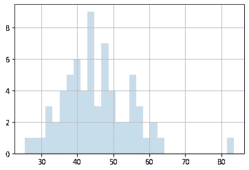
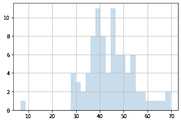
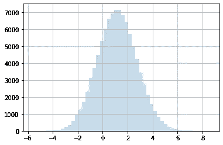
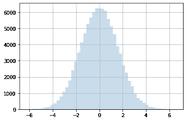
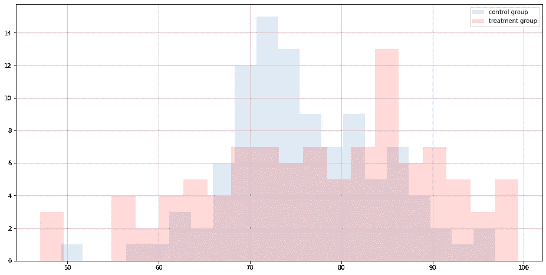
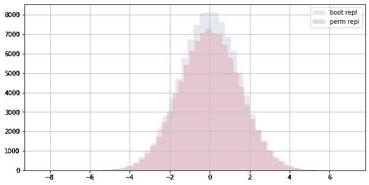
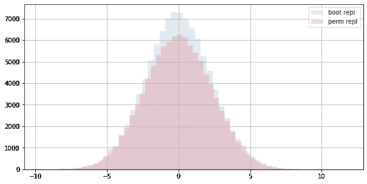

# 自举与置换测试

> 原文：<https://towardsdatascience.com/bootstrapping-vs-permutation-testing-a30237795970?source=collection_archive---------6----------------------->

## [入门](https://towardsdatascience.com/tagged/getting-started)

## 使用 Python 进行理论和实验比较

本文的主要目标是从理论上和实验上比较这两种重采样方法，然后在技术上有余地使用其中一种方法的情况下，就何时应该使用每种方法得出一些结论。促使我写这篇文章的原因是，我认为初学者在这个问题上缺乏免费的清晰指南。在一些学习材料中，我甚至遇到了这样的说法，我们可以使用其中任何一个，而没有任何进一步的解释。

文章的主要章节:
1。作为对 bootstrap】的**介绍，我们将计算置信区间并分析测试一些假设，然后使用 bootstrap 方法非参数地解决相同的问题。
2。作为排列测试**(也称为显著性测试)的**介绍，我们将在与第 1 节相同的数据上使用排列测试来测试假设。
3。我们将开发一个稍微复杂一点的例子，设计几个假设检验，并且**并排比较每个检验的重复统计的 bootstrap 分布和 permutation 分布**。**

我们邀请了一些最好的朋友过来:NumPy，SciPy 和 Matplotlib…熊猫将休息一天，因为我们将使用的数据集相当简单。

```
import numpy as np
from scipy import stats
from matplotlib import pyplot as plt
```

# 1.CI 计算和 HT——通过参数和自举

第一部分，我们将使用 2008 年美国总统选举的结果，来自宾夕法尼亚州和俄亥俄州的“摇摆州”，具体来说，是给定州每个县投票给民主党的选民的百分比(来源:[https://www.data.gov/](https://www.data.gov/))。

```
dem_share_PA = [60.08, 40.64, 36.07, 41.21, 31.04, 43.78, 44.08, 46.85, 44.71, 46.15, 63.10, 52.20, 43.18, 40.24, 39.92, 47.87, 37.77, 40.11, 49.85, 48.61, 38.62, 54.25, 34.84, 47.75, 43.82, 55.97, 58.23, 42.97, 42.38, 36.11, 37.53, 42.65, 50.96, 47.43, 56.24, 45.60, 46.39, 35.22, 48.56, 32.97, 57.88, 36.05, 37.72, 50.36, 32.12, 41.55, 54.66, 57.81, 54.58, 32.88, 54.37, 40.45, 47.61, 60.49, 43.11, 27.32, 44.03, 33.56, 37.26, 54.64, 43.12, 25.34, 49.79, 83.56, 40.09, 60.81, 49.81]
dem_share_OH = [56.94, 50.46, 65.99, 45.88, 42.23, 45.26, 57.01, 53.61, 59.10, 61.48, 43.43, 44.69, 54.59, 48.36, 45.89, 48.62, 43.92, 38.23, 28.79, 63.57, 38.07, 40.18, 43.05, 41.56, 42.49, 36.06, 52.76, 46.07, 39.43, 39.26, 47.47, 27.92, 38.01, 45.45, 29.07, 28.94, 51.28, 50.10, 39.84, 36.43, 35.71, 31.47, 47.01, 40.10, 48.76, 31.56, 39.86, 45.31, 35.47, 51.38, 46.33, 48.73, 41.77, 41.32, 48.46, 53.14, 34.01, 54.74, 40.67, 38.96, 46.29, 38.25, 6.80, 31.75, 46.33, 44.90, 33.57, 38.10, 39.67, 40.47, 49.44, 37.62, 36.71, 46.73, 42.20, 53.16, 52.40, 58.36, 68.02, 38.53, 34.58, 69.64, 60.50, 53.53, 36.54, 49.58, 41.97, 38.11]
```

对于本节和本说明的下一节，我们将使用相同的数据和相同的统计数据来保持示例的一致性，即 PA 和 OH 平均投票百分比之间的差异。

## 1.1 样品的 EDA

让我们看看每个州的平均值、中值、标准差和样本大小，以及直方图:

```
print("Mean:\t\t", round(np.mean(dem_share_PA),2))
print("Median:\t\t", round(np.median(dem_share_PA),2))
print("SD:\t\t", round(np.std(dem_share_PA),2))
print("Sample Size:\t", len(dem_share_PA))
plt.hist(dem_share_PA, bins=30, alpha=0.25)
plt.grid()
plt.show()
```

> 平均值:45.48
> 中位数:44.03
> 标准差:9.73
> 样本量:67



**各县的 PA Dem 投票百分比**(图片由 Gene Mishchenko 提供)

```
print("Mean:\t\t", round(np.mean(dem_share_OH),2))
print("Median:\t\t", round(np.median(dem_share_OH),2))
print("SD:\t\t", round(np.std(dem_share_OH),2))
print("Sample Size:\t", len(dem_share_OH))
plt.hist(dem_share_OH, bins=30, alpha=0.25)
plt.grid()
plt.show()
```

> 平均值:44.32
> 中位数:43.68
> 标准差:9.84
> 样本量:88



**各县的选民投票率(T22)**

**结论:**分布看起来并不完全正态，但它们可能足够接近于测试参数(分析)解，并且它们稍微*正偏*(平均值大于中间值，尾部在右侧/正侧更长)。

## 1.2 置信区间计算

置信度= 90%

## **1.2.1 CI** 通过参数方法计算

(假设总体呈正态分布)

首先，让我们使用正态样本分布(相应地，α/2 在左边，α/2 在右边的 z 分数)来找到下临界值和上临界值(LCV 和 UCV)。在 Python 中，这可以通过使用`scipy.stats.norm.ppf()`方法来完成，该方法将左侧的 *AUC(即百分位等级)作为输入，并返回与所提供的百分位等级相对应的 Z 分数。
**注 1** :这是`scipy.stats.norm.cdf()`方法的逆方法，采用 Z 分数并返回相应的百分位等级。这是用于这种分析的两种最常用的 Python 方法，但是这里的[是 SciPy 教程以获得更多信息。
**注 2** :如果我们想使用学生的 *t* 分布而不是正态分布，我们将使用`scipy.stats.t`类及其方法，它将自由度作为一个附加参数。](https://docs.scipy.org/doc/scipy/reference/tutorial/stats.html)*

```
# Lower Critical Value
lcv = stats.norm.ppf(0.05)
print("Lower CV:", round(lcv,3))
# Upper Critical Value
ucv = stats.norm.ppf(1 - 0.05)
print("Upper CV: ", round(ucv,3))
```

> 下 CV: -1.645
> 上 CV: 1.645

太好了！现在我们不需要携带这些愚蠢的查找表…
接下来，我们需要均值差异的标准误差(se)。
公式为:`sqrt(std(sample_1)^2 / len(sample_1) + std(sample_2)^2 / len(sample_2))`

```
se = np.sqrt( np.std(dem_share_PA)**2 / len(dem_share_PA) + np.std(dem_share_OH)**2 / len(dem_share_OH) )
print(round(se,3))
```

> 1.585

最后，我们需要均值的经验差异:

```
emp_diff_means = np.mean(dem_share_PA) - np.mean(dem_share_OH)
print(round(emp_diff_means,3))
```

> 1.158

现在我们准备好分析计算置信区间:

```
lower_lim_an = emp_diff_means + lcv * se
upper_lim_an = emp_diff_means + ucv * se
print(round(lower_lim_an,3), 'to', round(upper_lim_an,3))
```

> -1.449 至 3.766

**结论:**
我们以 90%的信心估计，PA 和 OH 的平均票数之间的真正差异在`-1.449`和`3.766`
(假设样本近似正态分布)
这一结果通过使用在线 CI 计算器进行验证，该计算器使用学生的 *t* 分布，结果与我们的非常接近，但比预期的要宽一些:`(-1.4676, 3.7876)`

## 1.2.2 通过 Bootstrap 方法计算 CI

一般来说，Bootstrapping 和重采样方法非常强大，因为它们对总体分布做了更少的假设(例如，没有正态约束)，通常不涉及公式，并且计算相对简单。

**关于自举的一些理论:**

*   首先，Bootstrapping 是一种从一个样本中找到抽样分布(至少是近似分布)的实用方法，而不是从总体中抽取多个随机样本。
*   它*模拟*从一个群体中仅用*一个*样本抽取多个随机样本，所以它非常依赖这个单一样本尽可能的随机。
*   与传统的 t 检验不同，Bootstrap 检验不对实际样本所来自的总体分布施加正态性限制。

首先，我们需要计算测试统计的大量 bootstrap 复制。

让我们定义一个可重用的函数，我们可以利用它来产生测试统计的引导复制，调用一些对每个样本进行操作的基本统计函数(预定义的或用户定义的)。
**注意**在重新采样和计算每个重复之前，我们不会混合来自不同样本的数据。

```
def boot_diff(sample_1, sample_2, base_stat_func, num_iter):

    # initialize the list for holding the bootstrap replicates
    bs_replicates = []
    # iterate for the specified number of bootstrapping iterations
    for i in range(num_iter):
        # create the resampled sets of data of the original lengths (WITH REPLACEMENT)
        sample_1_bs = np.random.choice(sample_1, len(sample_1))
        sample_2_bs = np.random.choice(sample_2, len(sample_2))
        # compute the BS replicate using the specified base statistical function and append it to the list of BS replicates
        bs_replicates += [base_stat_func(sample_1_bs) - base_stat_func(sample_2_bs)]

    return bs_replicate
```

为我们的任务生成 BS 复制:

```
bs_replicates = boot_diff(dem_share_PA, dem_share_OH, np.mean, 100000)
```

直观地检查测试统计副本的分布总是一个好主意:

```
plt.hist(bs_replicates, bins=50, alpha = 0.25)
plt.grid()
plt.show()
print("Mean:  ", round(np.mean(bs_replicates),3))
print("Median:", round(np.median(bs_replicates),3))
```



**平均值差异的 Bootstrap 复制**(图片由 Gene Mishchenko 提供)

现在，我们可以将`np.percentile()`函数应用于这个生成的 BS 副本的大集合，以便在一个步骤中获得置信区间的上限和下限。对于下限计算，我们提供 *alpha/2* 作为该函数的第二个参数，对于上限计算，我们提供 alpha/2 的*补码，因为该函数期望将累积百分位数作为第二个参数。
使用百分位数计算得出的置信区间称为 ***Bootstrap 百分位数置信区间*** :*

```
# the lower limit will be the 5th percentile
lower_lim_bs = np.percentile(bs_replicates,5)
# the upper limit will be the 95th percentile (5's complement to 100)
upper_lim_bs = np.percentile(bs_replicates,95)
print(round(lower_lim_bs,3), 'to', round(upper_lim_bs,3))
```

> -1.433 至 3.792

**注**:如果(且仅当)BS 重复分布呈正态且以真实参数值为中心(偏差较小)，我们可以用下面的公式计算 ***Bootstrap t 置信区间*** :
`BS_stat_mean +/- t * SE`

**结论:**
结果与分析结果`(-1.449, 3.766)`相当接近，但这里我们没有对样本的分布做任何假设。

## 1.3 双尾假设检验

首先，我们将检验总体均值之间的真实差异为 0 的假设。测试条件为:

***Ho*** :(平均 PA 投票%)——(平均 OH 投票%) = 0
***Ha*** :(平均 PA 投票%)——(平均 OH 投票%)！= 0
***CL***:90%
***方向*** :双尾

## 1.3.1 通过参数方法的双尾 HT

让我们使用 Z 值方法。
我们需要计算平均值的假设差异的 Z 值。公式为:
`Zc = [(sample_mean_1 - sample_mean_2) - (hyp_difference)] / SE`
临界 Z 值与上面计算置信区间中的相同:`-1.645`和`1.645`。
SE(标准误差)也可以在计算 CI 时重复使用:`1.585`。
均值之间的假设差异为`0`。

因此，对于计算的 Z 分数(Zc ),我们得到以下结果:

```
Zc = (emp_diff_means - 0) / 1.585
print(round(Zc,3))
```

> 0.731

**结论:无法在 90%的置信水平下拒绝** (FTR)零假设，因为`0.731`的计算 Z 值正好在`-1.645`和`1.645`的临界值之间。
直觉上，这是有意义的，因为两个样本的标准偏差相对于平均值而言相当大(分别为 21%和 22%)，并且比平均值的经验差异大几倍。

**注**:正态分布的这个 Z 值关联的右尾 p 值(AUC 到右边)是`0.23239`。
双尾 p 值是那个的两倍:`0.465`。
因此，如果我们想要使用 **p 值方法**进行分析，它也会导致 FTR 决定，因为这个 p 值比我们在尾部的拒绝区域之和(每个区域`0.05`大得多，由我们的总显著性水平`10%`定义。

## 1.3.2 通过自举方法的双尾 HT

在比较两组时，使用 bootstrap 方法比使用 analytical 方法的主要优点是，在 BS 方法下，对总体没有正态性限制。此外，我们在这里不仅限于手段的比较。

生成 bootstrapped test statistic 副本的基本过程与上一节 CI 中的过程相同(也没有混合样本总体，以及替换抽样)，因此我们将使用相同的函数:

```
bs_replicates = boot_diff(dem_share_PA, dem_share_OH, np.mean, 100000)
```

***额外的重要步骤*** (与查找 CI 相比)是围绕假设平均值确定重复的分布中心:

```
bs_replicates_shifted = bs_replicates - np.mean(bs_replicates) - 0
```

让我们确保我们的最终 BS 重复组是有序的(以假设平均值为中心，并且标准误差的 BS 版本接近分析版本):

```
print("Replicate 25th percentile, mean, 75th percentile:",
      round(np.percentile(bs_replicates_shifted, 25),3), 
      round(np.mean(bs_replicates_shifted)+1e-4, 2), 
      round(np.percentile(bs_replicates_shifted, 75),3))
print("Replicate Std Dev:", round(np.std(bs_replicates_shifted),3)) # the analytical version is 1.585
```

> 重复第 25 百分位，平均第 75 百分位:-1.085 ~ 0.0 ~ 1.07
> 重复标准差:1.595

看起来不错…现在我们可以得到这组 BS 重复数据中平均值的经验差异的百分位数等级:
( `scipy.stats.percentileofscore()`是`np.percentile()`的倒数)

```
emp_diff_pctile_rnk = stats.percentileofscore(bs_replicates_shifted, emp_diff_means)
print("Empirical difference of the sample means:", round(emp_diff_means, 3))
print("Its percentile rank among the replicates:", round(emp_diff_pctile_rnk, 2), "% (AUC to the left)")
auc_left = round(emp_diff_pctile_rnk / 100, 4)
auc_rght = round(1 - emp_diff_pctile_rnk / 100, 4)
print("AUC to the left:  ", auc_left)
print("AUC to the right: ", auc_rght)
```

> 样本的经验差异均值:1.158
> 其在重复中的百分位数排序:76.69 % (AUC 向左)
> AUC 向左:0.7669
> AUC 向右:0.2331

我们现在需要非常仔细地解释这个结果，这取决于我们正在进行的测试类型，以便获得 **p 值**:

*   如果我们正在进行左尾测试，我们需要将 AUC 带到左边
*   如果我们正在进行右尾检验，我们需要将 AUC 向右移动
*   如果我们正在进行一个双尾检验，我们需要取较小的 AUC 值(因为它总是代表一个尾区域)并乘以 T2

因此，我们正在进行的双尾检验的 p 值为:

```
auc_tail = auc_left if auc_left < auc_rght else auc_rght
p_val = round(auc_tail * 2, 4)
print("P-value:", p_val)
```

> p 值:0.4662

**结论:未能在 90%置信水平下拒绝(FTR)** 原假设，因为 p 值远大于`0.10`的显著性。

## 1.4 单尾假设检验

这里，我们将测试 PA 和 OH 平均值之间的真实差值小于或等于-2.0 的假设(换句话说，预计 OH 的平均投票百分比至少比 PA 大*2.0)。*

**注意**:在陈述这个单尾假设时，为了便于说明，我们保持了与上述例子中相同的均值顺序，尽管陈述这个不等式更自然的方式是“OH mean — PA mean > = 2”。

***Ho*** :(平均 PA 投票%)——(平均 OH 投票%)<=-2
***Ha***:(平均 OH 投票%)——(平均 OH 投票%)>-2
***CL***:90%
***方向*** :右尾(自 *Ho* 拒绝

## 1.4.1 通过参数方法的单尾 HT

我们需要计算平均值的假设差异的 Z 值。公式为:
`Zc = [(sample_mean_1 - sample_mean_2) - (hyp_difference)] / SE`
SE(标准差)可以从计算 CI 中重复使用，也就是`1.585`。
假设平均值之差为`-2`。我们假设人口的正态分布。
因此，对于计算的 Z 得分(Zc ),我们得到以下结果:

```
Zc = (emp_diff_means - (-2)) / 1.585
print(round(Zc,4))
```

> 1.9926

如果使用 **Z 值方法**，我们需要计算`0.10`的右尾 *alpha* 的上临界 Z 值，该值可以直接与计算的 Z 值进行比较:

```
round(stats.norm.ppf(0.9),4)
```

> 1.2816

如果使用 **P 值方法**，我们需要找到与计算的 Z 值相关的右尾 P 值。
首先，我们计算左边的 AUC:

```
# use scipy.stats.norm.cdf(), which is the inverse of stats.norm.ppf()
auc_left = round(stats.norm.cdf(1.9926), 4)
print("AUC to the left:", auc_left)
```

> 左边的 AUC:0.9768

因为我们正在寻找*右尾*下的 p 值，所以我们需要从`1` :
中减去这个值(如果我们正在进行左尾测试，我们将按原样取这个 AUC 值)

```
p_val = 1 - auc_left
print("P-value:", p_val)
```

> p 值:0.0232

**结论:拒绝零假设**因为:

*   计算出的`1.9926`的 Z 值大于`1.2816`的临界值上限
*   计算出的`0.0232`的右尾 p 值小于`0.10`的右尾显著性

## 1.4.2 通过自举方法的单尾 HT

生成引导复制的基本过程与之前相同:

```
bs_replicates = boot_diff(dem_share_PA, dem_share_OH, np.mean, 100000)
```

***额外的重要步骤*** (与查找 CI 相比)是围绕假设平均值确定重复的分布中心:

```
bs_replicates_shifted = bs_replicates - np.mean(bs_replicates) - 2
```

让我们确保我们的 BS 重复样本总体以假设平均值为中心，并且标准误差的 BS 版本接近分析结果:

```
print(“Replicate 25th percentile, mean, 75th percentile:”,
 round(np.percentile(bs_replicates_shifted, 25),3), “~”,
 round(np.mean(bs_replicates_shifted)+1e-4, 2), “~”,
 round(np.percentile(bs_replicates_shifted, 75),3))
print(“Replicate Std Dev:”, round(np.std(bs_replicates_shifted),3)) 
# the analytical version is 1.585
```

> 重复第 25 百分位，平均第 75 百分位:-3.077 ~ -2.0 ~ -0.94
> 重复标准差:1.584

看起来不错…现在我们可以得到这组 BS 重复数据中平均值的经验差异的百分位数等级:

```
emp_diff_pctile_rnk = stats.percentileofscore(bs_replicates_shifted, emp_diff_means)
print("Empirical difference of the sample means:", round(emp_diff_means, 3))
print("Its percentile rank among the replicates:", round(emp_diff_pctile_rnk, 2), "% (AUC to the left)")
auc_left = round(emp_diff_pctile_rnk / 100, 4)
auc_rght = round(1 - emp_diff_pctile_rnk / 100, 4)
print("AUC to the left:  ", auc_left)
print("AUC to the right: ", auc_rght)
```

> 样本的经验差异平均值:1.158
> 其在重复中的百分位数等级:97.55 % (AUC 向左)
> AUC 向左:0.9755
> AUC 向右:0.0245

解读:
由于这是右尾检验， **p 值就是右边**的 AUC(非常接近`0.0232`的分析结果)。
由于我们正在进行单尾检验，我们可以直接将该值与显著性水平进行比较。

**结论:拒绝零假设**，因为 p 值小于`0.10`的显著性。

# 2.使用排列测试的显著性测试

置换检验用于确定观察到的效应是否可以合理地归因于选择样本时引入的随机性。如果不是，我们有证据表明在样本中观察到的效应反映了在人群中存在的效应。置换测试在临床研究等受控环境中非常流行，在这些环境中，需要将接受某种治疗的组与未接受任何治疗的对照组进行比较。

## 2.1 PT 理论

**排列测试时*可以用*:**

*   当零假设表明两个总体相同时的两样本情形。我们可能希望比较总体的任何基本统计数据。就我们可以选择的统计数据而言，传统测试非常有限。
*   当零假设表明配对中只有随机差异时的配对情景。这里也可以进行广泛的比较选择。
*   当零假设表明变量不相关时的两个定量变量情景。通常相关性是最常见的度量，但不是唯一的。

基本上，当有两组数据并且零假设表明它们之间的一些观察到的效应是偶然观察到的时，我们可以执行 PT。

**排列测试的一般流程:**

1.  选择一个测试统计量来衡量我们在两组数据之间寻找的效果(这一步在 bootstrap 测试中很常见)。通常这是每个数据集的“基础”统计之间的差异。
2.  构建如果不存在该效应时该检验统计量将具有的抽样分布(这是排列检验的独特核心)。
3.  在这个假设分布中找到观察到的(经验的)检验统计值。分布主体中的值很容易偶然出现。尾部中的值很少是偶然出现的，这可能是除了偶然之外的东西在起作用的证据(这在自举中很常见)。

**当排列测试*时，是否应该使用*来代替自举测试:**

在双样本检验设置中，我们可以在 bootstrap 检验和 permutation 检验之间进行选择。即使双样本排列测试的测试统计量*可能被选择为与双样本 bootstrap 测试相同的*(例如，样本均值之间的差异)，测试的潜在性质却大不相同:排列测试实际上使用某个狭窄的统计量查看两个样本*是否可能假设来自同一个总体*，而 bootstrap 测试则专门查看统计量本身，因此排列测试是比 bootstrap 测试更“深入”更普遍的比较，但是(注意！)测试统计可能不会显示出来，这取决于您如何设计它，以及它如何捕捉样本之间的实际差异。

总之，**排列测试**应用于:

*   对影响的*存在*(或不存在)的假设检验(例如，某种影响是否存在，或者是否存在某种积极影响，或者是否存在某种消极影响)。

**自举**应该用于:

*   针对特定已知/预期效果的定量假设测试(例如，汽车电池的平均寿命实际上提高了一年或一年以上吗？).
*   非参数化确定置信区间。

## 2.2 介绍性 PT 示例

为了介绍这个过程本身，让我们使用同样的**双样本场景**，我们使用 bootstrap 测试(BT)来测试总体均值之间的差异:

***Ho*** :底层分布相同(均值等特征)
***Ha*** :均值(PA 投票%) —均值(OH 投票%)！= 0

**注意** *:* 这里的检验统计量和替代假设与我们进行的 bootstrap 检验相同，但是*零假设必须保持非常通用*，这仅仅是由于检验统计量通过排列复制的过程的性质(我们将很快看到为什么)。这里的逻辑是，一旦有足够的证据接受一个相当具体的替代假设，我们就可以拒绝一个非常笼统的零假设，这个零假设是很多东西的合取，包括替代假设的对立面。使用法律类比，在一个刑事案件中，可能只需要从所有可用证据中拿出一条非常具体的证据就可以打破非常普遍的无罪推定。然而，与法律环境不同的是，在排列测试*中，我们通常对零假设本身不感兴趣*(除非实际的测试目标是知道总体是否相同)。所以焦点转移到了另一个假设上。

让我们定义一个可重用的函数，我们可以利用它来产生一个测试统计的排列副本，调用一些对每个样本进行操作的基本统计函数(预定义的或用户定义的)。

```
def perm_diff(sample_1, sample_2, base_stat_func, num_iter):

    # initialize the list for the test statistic replicate
    perm_replicates = []
    # iterate for the specified number of iterations
    for i in range(num_iter):
        # concatenate the two samples into one
        samples_app = sample_1 + sample_2
        # permute the entire appended set (making this complete combined resampling WITHOUT REPLACEMENT)
        samples_perm = np.random.permutation(samples_app)
        # create the hypothesized samples by:
        #  pretending that the first len(sample_1) elements is the first sample
        sample_1_hyp = samples_perm[:len(sample_1)]
        #  and the rest is the second sample
        sample_2_hyp = samples_perm[ len(sample_1):]
        # compute the test statistic replicate and append it to the list of permutation replicates
        perm_replicates += [base_stat_func(sample_1_hyp) - base_stat_func(sample_2_hyp)]return perm_replicates
```

现在，让我们生成置换复制集:

```
perm_replicates = perm_diff(dem_share_PA, dem_share_OH, np.mean, int(1e5))
```

让我们简单看一下均值差的假设分布。它应该以零为中心，并且应该近似正常。

```
plt.hist(perm_replicates, bins=50, alpha=0.25)
plt.grid()
plt.show()
```



**均值差异的排列复制**(图片由吉恩·米先科提供)

现在我们需要从两个尾部得到 **p 值，该值与使用该分布的均值的经验差异相关。
**注意**由于中心极限定理，置换分布在大多数情况下应该是相对对称的，作为一个好的实践，最好直接得到两个尾部下的 AUC。有几种技术方法可以做到这一点:**

```
# looking at the absolute values on both tails and comparing them to the absolute empirical value simultaneously
p_val_2t_a = sum(np.abs(perm_replicates) >= abs(emp_diff_means)) / len(perm_replicates)
print(round(p_val_2t_a, 4))# Get the percentile rank of the NEGATIVE ABSOLUTE empirical value and take it as-is (looking at the left tail)
lt_p_val = stats.percentileofscore(perm_replicates, -abs(emp_diff_means) ) / 100
# Get the percentile rank of the ABSOLUTE empirical value and take the complement of it (looking at the right tail)
rt_p_val = 1 - stats.percentileofscore(perm_replicates, abs(emp_diff_means) ) / 100
# Add the two half-values together
p_val_2t_b = lt_p_val + rt_p_val
print(round(p_val_2t_b, 4))
```

> 0.4709
> 0.4709

**结论:FTR** (保留)原假设，即县对民主党人有利的投票百分比对 PA 和 OH 的分布是相同的，因为所得的 p 值大于`0.10`的显著性。

可能值得注意的是，这里的 p 值比使用分析法和自举法(`0.465`)比较平均值时略大...样本是相似的，所以很难判断结果的这种差异是否真的有意义，但一般来说，较大的 p 值是保持零假设的更强基础。

# 3.比较 Bootstrap 和置换分布

## 3.1 工作流程概述

因为在可以使用自举的情况和可以使用置换的情况之间有一些重叠，所以让我们实验性地比较复制的测试统计的相应总体，以便我们更好地理解使用它们的含义。
每次比较将包括以下假设检验工作流程，部分进行:

**(1)** 陈述高级业务目标，以及我们正在进行的研究与这些目标的关系。在陈述业务目标和当前研究目标时，要尽可能具体。
**【2】**定义可以帮助我们达到研究目标的统计数据(这里我们假设这些样本是我们得到的唯一数据集，但通常这个阶段包括数据发现、EDA 和/或新数据收集设置的迭代过程，视需要和可行而定)。
**(3)** 设计使用上述统计量来满足上述研究目标的统计推断任务。根据需要创建尽可能多的任务。对于每个*假设检验*，需要说明以下项目:

*   要使用的测试统计
*   根据选定的统计数据陈述的无效假设和替代假设
*   测试的方向(单尾/双尾)
*   置信度/显著性水平
*   要使用的方法(例如参数/引导/排列)

**(4)** 执行任务。

步骤(1)可能经常看起来琐碎和不必要，但它是选择统计数据和正确设计测试所必需的。在我们的比较中，步骤(1)和(2)将在 bootstrap 和置换测试中共享。
我们不会执行步骤(4)——实际进行测试——所以我们不需要定义置信区间。

**我们将重点比较检验统计重复的两种分布和相应的 p 值:**

*   引导复制分布
*   置换复制分布

## 3.2 示例设置

**研究目标**:这是一项关于一种新的教学方法对大学生成绩影响的假想对照研究。它被直接整合到新教学方法的开发和测试过程中。我们的任务是特别关注新方法的*效果，通过学生的考试成绩来衡量。这项研究的结论将与其他考虑因素一起，用于决定是否为该科目改用新的教学方法。
**研究设置**:一个随机组成的“治疗”组在一个学期内接受新的教学方法，另一个随机组成的“控制”组接受同一科目的传统教学方法。每组由 100 名学生组成。教授这门课程的教师必须同时教授两组学生，以便尽可能地消除教学中的人为因素。两组学生的期中和期末考试是一样的。
**为每个小组收集的数据**是每个学生的期中和期末考试成绩的平均值，满分为 100 分。*

让我们生成示例数据:

```
# draw the raw random data for the control sample from a normal distribution
np.random.seed(5)
cs_raw = np.random.normal(loc=75.0, scale=9.0, size=100)
# "pivot" the right tail around 100 with a multiplier 
# (there should not be many cases)
cs = [score - (score - 100)*1.5 if score > 100 else score for score in cs_raw]# draw the raw random data for the treatment sample from a normal distribution 
# with a slightly larger mean and a significantly larger standard deviation than for the control sample
# (it is expected that there will be quite a few instances here that go over 100)
ts_raw = np.random.normal(loc=78.0, scale=13, size=100)
# "pivot" the right tail around 100 with a multiplier, which caps the score at the max,
# making the right tail much thicker and shorter
ts = [score - (score - 100)*2.0 if score > 100 else score for score in ts_raw]
```

## 3.3 样品的 EDA

```
fig = plt.gcf()
fig.set_size_inches(16,8)
plt.hist(cs, bins=20, alpha=0.15, label = 'control group')
plt.hist(ts, bins=20, alpha=0.15, color='r', label = 'treatment group')
plt.legend()
plt.grid()
plt.show()
```



**对照和治疗样品**(由 Gene Mishchenko 成像)

```
print("Control   mean, 10th, 25th, 50th, 75th, 90th pctiles:", 
      round(np.mean(cs),2), "~", 
      round(np.percentile(cs,10),2), "~",
      round(np.percentile(cs,25),2), "~",
      round(np.percentile(cs,50),2), "~",
      round(np.percentile(cs,75),2), "~",
      round(np.percentile(cs,90),2))
print("Treatment mean, 10th, 25th, 50th, 75th, 90th pctiles:", 
      round(np.mean(ts),2), "~", 
      round(np.percentile(ts,10),2), "~",
      round(np.percentile(ts,25),2), "~",
      round(np.percentile(ts,50),2), "~",
      round(np.percentile(ts,75),2), "~",
      round(np.percentile(ts,90),2))
```

> 对照组均值，第 10、25、50、75、90 百分位数:75.82 ~ 67.12 ~ 70.62 ~ 74.43 ~ 81.78 ~ 86.67

**结论:**看起来平均分数提高了大约 2 分，并且相对于对照组，治疗组中的 A 和 B 学生要多得多，但是在低端也发生了一些事情——更多的学生不及格(分数< 70)并且差距更大。
因此，在本例中，我们可以看到潜在的正面影响和负面影响。

## 3.4 研究用例 1(平均学习进步)

让我们假设我们唯一关心的**商业目标**是所有学生平均学习成绩的*提高。
**测试统计**:我们认为治疗组和对照组学生之间的平均测试分数*的任何*统计显著正差异都是达到商业目标的证明。*

## 自举测试

***Ho*** :均值(治疗组得分)—均值(对照组得分)= 0
***【Ha】***:均值(治疗组得分)—均值(对照组得分)> 0
***方向*** :右尾

## 排列测试

***Ho*** :学生分数分布相同(含均值)
***Ha*** :均值(治疗组分数)—均值(对照组分数)> 0
***方向*** :右尾

## 生成和比较复制分布

首先，让我们生成并绘制两个复制分布:

```
boot_diff_mean_scores = boot_diff(ts, cs, np.mean, int(1e5))
# DON'T FORGET TO SHIFT TO THE HYPOTHESIZED MEAN (0 in this case)
boot_diff_mean_scores = boot_diff_mean_scores - np.mean(boot_diff_mean_scores) + 0perm_diff_mean_scores = perm_diff(ts, cs, np.mean, int(1e5))fig = plt.gcf()
fig.set_size_inches(10,5)
plt.hist(boot_diff_mean_scores, bins=50, alpha=0.15, label = 'boot repl')
plt.hist(perm_diff_mean_scores, bins=50, alpha=0.15, color='r', label = 'perm repl')
plt.legend()
plt.grid()
plt.show()
```



**自助复制和排列复制—均值差异**(图片由 Gene Mishchenko 提供)

分布之间没有很大的差异，排列重复分布略宽(对于较大的样本量，分布之间的差异较小，对于较小的样本量，差异更大)。

现在让我们看看 **p 值**。由于我们正在进行右尾检验，p 值是观察值的百分位秩的*补数:*

```
emp_val = np.mean(ts) - np.mean(cs)
boot_p_val = 1 - stats.percentileofscore(boot_diff_mean_scores, emp_val)/100
print("p-value by bootstrapping:\t", round(boot_p_val,5))
perm_p_val = 1 - stats.percentileofscore(perm_diff_mean_scores, emp_val)/100
print("p-value by permutation:\t\t", round(perm_p_val,5))
```

> 自举 p 值:0.09773
> 置换 p 值:0.10201

**结论:**排列法比自举法给测试过程增加了更多的随机性(这种差异在样本越小的情况下越明显)，所以我们得到了一个更保守的答案。这就是为什么**排列测试是分类假设测试的更好选择**。
在这个具体的例子中，如果我们的显著性水平设置为 10%，方法的选择将产生关键的差异，因为 p 值落在它的不同边上(这也是为什么我们应该*总是*在实施测试之前确定显著性水平，这样我们就不会试图回解)。

## 3.5 研究用例 2(留守学生)

现在，让我们说，就**商业目标**而言，大学管理层不仅关心平均学习成果，还关心学生的*辍学率和不合格率*(当然，尽可能保持这些比率较低)。
假设**研究目标、研究设置和收集的数据**自始至终都与这一新信息保持一致，我们能做些什么来实现研究目标？

好吧，鉴于这种人工数据集，我们无法测量辍学率(或课程完成率)，但在现实生活中，完成课程的学生的考试成绩会得到这种信息的补充…所以让我们专注于分析低端的考试成绩。

我们可能要考虑的每个数据集的**【基础】统计** *是低于下四分位数的平均分数。因此**检验统计量**将是治疗组的基础统计量和对照组的基础统计量之间的差异。就像平均测试分数的差异一样，这是一个*正*度量，意味着如果它有一个正的符号，它对业务有好处，反之亦然。
让我们定义一个用于计算基本统计数据的函数，我们可以将它传递给`boot_diff`和`perm_diff`函数:*

```
def low_quart_mean(arr):
    first_percentile = np.percentile(arr, 25)
    filt_arr = [x for x in arr if x <= first_percentile]
    return np.mean(filt_arr)
```

现在让我们在处理样品和对照样品上测试它…

```
low_quart_mean(ts)
```

> 60.97728174389116

```
low_quart_mean(cs)
```

> 65.93498145550805

从控制样本到处理样本的平均下降 5 个点…这应该很有趣…让我们来设置我们的测试。

## 自举测试

***Ho*** :均值(治疗组最低分之一)—均值(对照组最低分之一)>= 0
***Ha***:均值(治疗组最低分之一)—均值(对照组最低分之一)< 0
***方向*** :左尾

## 排列测试

***Ho*** :学生分数分布相同(包括分数最低的四分之一的均值)
***Ha*** :均值(治疗组分数最低的四分之一)—均值(对照组分数最低的四分之一)< 0
***方向*** :左尾

**注意**:我们有意将替代假设的方向设定为我们在 EDA 过程中所做的初步发现的方向……否则，置换测试在 FTR 结果(未能拒绝零假设)的情况下将不会非常有用，因为零假设非常普遍(在 PT 中也必须如此)。在研究过程中，必须在第一次测试后保留零假设，然后尝试构建一个不同的测试来“打破它”，这是完全正常的，但如果我们有一个基于 EDA 的“直觉”，并且我们认为我们可以在一个测试中做到这一点，为什么不这样做呢？
在 bootstrap 测试中，我们没有这种限制——零假设可以被定义在与替代假设相同的水平上，并且是相反的镜像，因此测试的方向变得任意。
此外，作为一个提醒，除了排列测试中对零假设的限制，排列测试中的*替代*假设也有一个限制——测量假设数据集之间差异的重复统计必须以 0 为中心，因为方向性在这个过程中丢失了。
Bootstrap 测试对 *Ho* 和 *Ha* 没有这些限制，这就是为什么**对于已确认/预期效果的定量测试来说 Bootstrap 是一个自然的选择**。

## 生成和比较复制分布

```
boot_diff_lqms = boot_diff(ts, cs, low_quart_mean, int(1e5))
# DON'T FORGET TO SHIFT TO THE HYPOTHESIZED MEAN (0 in this case)
boot_diff_lqms = boot_diff_lqms - np.mean(boot_diff_lqms) + 0perm_diff_lqms = perm_diff(ts, cs, low_quart_mean, int(1e5))fig = plt.gcf()
fig.set_size_inches(10,5)
plt.hist(boot_diff_lqms, bins=50, alpha=0.15, label = 'boot repl')
plt.hist(perm_diff_lqms, bins=50, alpha=0.15, color='r', label = 'perm repl')
plt.legend()
plt.grid()
plt.show()
```



**BS 复制和烫发。重复——下四分之一差异表示**(图片由 Gene Mishchenko 提供)

同样，排列复制似乎分布得稍宽。

现在让我们看看 **p 值**。因为我们正在进行左尾检验，所以每种情况下的 p 值都是观察值的*百分位:*

```
emp_val = low_quart_mean(ts) - low_quart_mean(cs)
boot_p_val = stats.percentileofscore(boot_diff_lqms, emp_val)/100
print("p-value by bootstrapping:\t", round(boot_p_val,5))
perm_p_val = stats.percentileofscore(perm_diff_lqms, emp_val)/100
print("p-value by permutation:\t\t", round(perm_p_val,5))
```

> 自举 p 值:0.01304
> 置换 p 值:0.01651

**结论**:在这个用例中，重复分布之间的差异甚至比平均值之间的差异更明显，置换法产生了更宽的测试统计分布，并产生了更大的 p 值，这是一个更保守的零假设拒绝标准。

## 3.6 BT 与 PT —总结

Bootstrapping 是一种更通用的方法，它不局限于具有两组数据的情况，不局限于假设检验，并且在无效假设和备选假设方面限制较少。它应该用于估计置信区间和已知效应的定量假设检验。

置换检验可用于两个数据集(两个样本、配对或一个样本中的两个变量)的设置中，当我们想要确认两个数据集之间存在(或不存在)某种可观察到的效应时，应使用置换检验。