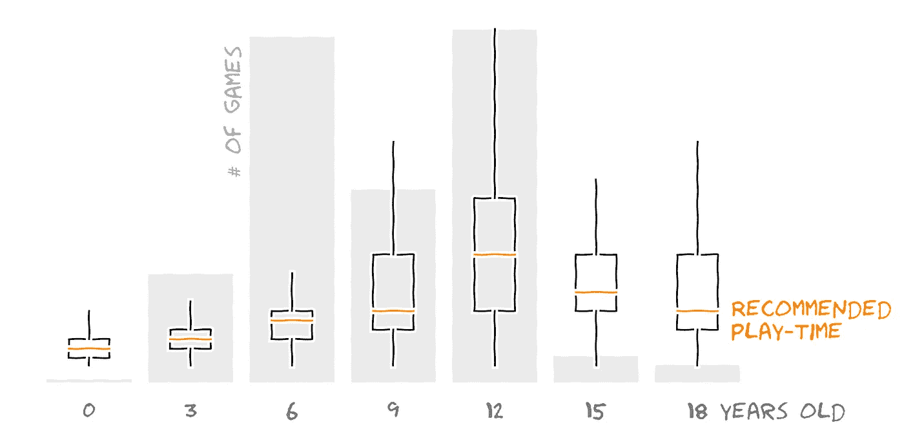
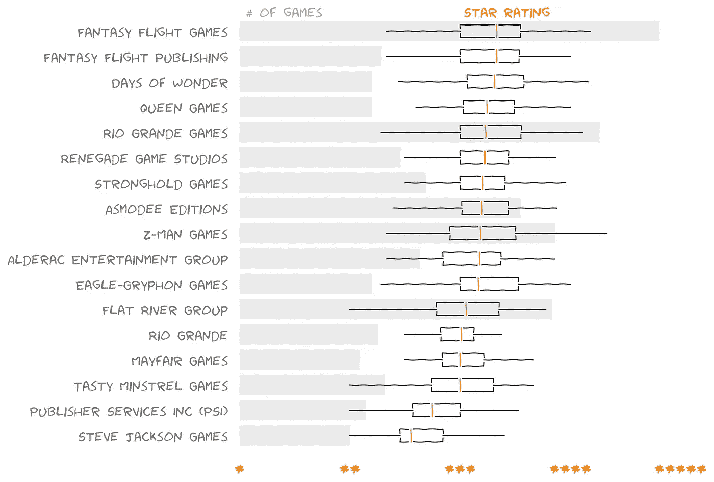
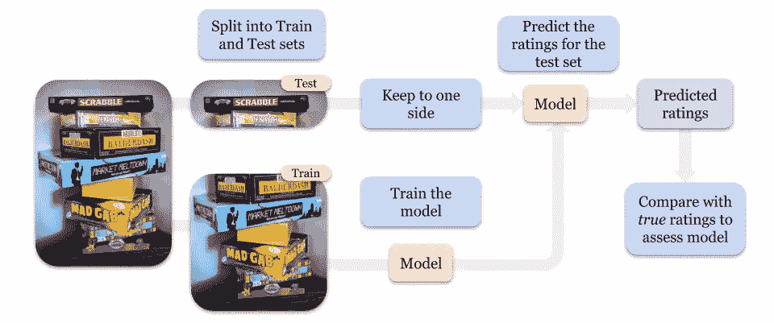

# 无聊的游戏——一个封闭的数据科学家的沉思

> 原文：<https://towardsdatascience.com/bored-games-c31340859bef?source=collection_archive---------69----------------------->

## Python 中探索性数据和回归分析的一个上午

(*图片作者*)

面对现实吧——在本月第十次拿出拼字板后，更多时间呆在家里的新鲜感开始消退。

抛开圣诞节前后的年度高峰不谈，一级防范禁闭已经让人们在网上搜索桌游的人数激增。这与搜索“无聊”的人增多不谋而合。

现在，虽然我不想宣扬[虚假的相关性](https://www.tylervigen.com/spurious-correlations)，但我发现在英国封锁期间，人们搜索“无聊”和“桌游”的[趋势](https://trends.google.com/trends/explore?geo=GB&q=bored,board%20games)很能说明问题。受此鼓舞，在几个小时的空闲时间里(大约是我在拼字游戏中选择下一个单词的时间)，我想知道我还能找到更多关于英国新的最受欢迎的过去时光的信息。

> [*Kaggle 数据集*](https://www.kaggle.com/datasets) 来救援了！

简单的搜索让我找到了一个取自 BoardGameArena 的精彩数据集，它提供了超过 100k 个游戏的全部信息！在看到数据集中的可用数据后，我发现自己想要深入的两个领域是年龄分级(“*适合 12 岁以上”等。* ) 以及为众多游戏收集的星级财富。我想到了以下问题:

1.  为年轻玩家设计的游戏是为了玩得更快吗？
2.  某些游戏发行商在创作高质量、受欢迎的游戏方面是否落后于其他发行商？
3.  给定这个不同的数据集，我能根据它的特点预测某个游戏将得到的评级吗？

前两个问题可以通过快速的*探索性分析来回答，也就是说，直观地检查数据的某些部分，所以让我们开始吧。*

> 为年轻玩家设计的游戏是为了玩得更快吗？

下图是一个方框图，显示了推荐的游戏时间是如何随着游戏的年龄范围而变化的。我还用灰色条显示了每个年龄有多少游戏被分级。

请注意，随着最小年龄从零开始增加，中值游戏时间(每个框中的橙色线)是如何增加的，然而，在 12 岁以上，建议的游戏时间似乎会减少。

似乎建议的游戏时间随着推荐年龄从零开始增加而增加，但是在 12 岁时达到一个转折点，之后它再次减少。

一个可能的原因是年龄限制的游戏，这里我认为是 15 岁以上，是为晚上/饭后聚会设计的，也许需要更快的游戏。

另一个可能的原因可能是这些年龄范围的样本量减少了，尽管每个范围都有 1000 多场比赛，我现在可以把这个问题放在一边。

> 某些游戏发行商在创作高质量、受欢迎的游戏方面是否落后于其他发行商？

在我们调查顶级发行商的游戏等级之前。

排名靠前的出版商按评分从高到低排序。

我们可以看到，虽然大约三分之二的顶级出版商拥有非常相似的评级，但有一些接近图表底部的出版商开始让这一方失望。

让我们简单地关注一下表现最差的出版商。当查看像这样的数据的单个切片时，需要考虑的一个问题是可能有一个被忽略的变量。这是回归分析中突然出现的一个概念，但在这里也适用。想象一下这个场景:

> 人们喜欢文字游戏，他们通常对它们评价极高。人们不太喜欢角色扮演游戏，对它们的评价也更低。如果某个发行商制作的角色扮演游戏比其他大多数发行商都多怎么办？后续的低收视率是发行商的影响，还是游戏类型的影响，或者两者兼而有之？

像这样同时考虑多种因素，挑出每个变量的真实影响会把我们带到回归分析的领域。

> 给定这些不同的数据集，*有可能根据某个游戏的特点预测出它的评分吗？*

要回答这个问题，我们可以用一种叫做线性回归的方法。本质上，我们希望利用我们所知道的关于一个游戏的所有因素(它的类别，它的年龄等级和推荐的游戏时间等等)。)并从中预测该游戏有多受欢迎。这类案件中出现的一个关键问题是:

> 我们如何知道一个预测是好的呢？

使用我们的案例来构建示例，评估预测是否是高质量的一种常用方法是预测一些游戏的评级，尽管我们手头有真实的评级，但在测试之前，我们没有让模型看到(并从中学习)。

一堆我们知道评级的游戏，使用分成训练和测试子集的方法来评估模型质量。(*图片作者*)

使用这种技术，我们可以创建所谓的 R 统计量。一个介于 0 和 1 之间的数字，它描述了在游戏评分中看到的*变化*有多少可以通过我们在模型中包括的因素*解释*——如果我们的模型给出的 R 为零，它在预测评分方面是无用的，如果它给出的 R 为 0.8，它将只使用我们提供的因素解释 80%的评分变化。

在这种情况下，使用:

`Year, Minimum Age, Minimum Play Time, Maximum Play Time, Number of Votes, Category, Game Mechanic, Minimum Player, Maximum Players`

…我们可以解释大约三分之一(R = 0.33)的评级变化。

让我们考虑一下这个问题。什么是好的棋盘游戏？是创作的年份吗？—也许有一点。是它需要的玩家数量吗？—我玩过一些很棒的双人游戏，也玩过一些很烂的！因此，虽然这些因素可能解释了一点什么使游戏变得有趣，但它们可能没有触及问题的核心——所以我们为什么要期待非常高的 R 值呢？

我想这可以归结为…回归方法不是魔法，它们只能显示关系，如果这些关系一开始就存在的话。

从另一个角度来看，如果你是一个游戏设计师，那么对于一个伟大的游戏来说，仅仅基于这里的因素，并不存在*制胜公式*。

所以我们有了它，有了几个小时的空闲时间和一个免费可用的数据集，我们对游戏如何为年幼的孩子设计有了一些了解，你的下一个游戏可以参考哪些出版商，并看到了使用线性回归预测的一瞥。

无论你是一个现在有更多时间的数据科学家，还是你仍然想知道[乐高套装](https://www.kaggle.com/rtatman/lego-database)是否真的变得越来越简单，有成千上万的开源数据集正等着你去发现…

你还在等什么？

*接下来我要看什么？*

在我的分析笔记本中可以找到我下一步要做的技术改变的细节。总的来说，这个快速调查向我展示了在短时间内可能发生的事情，无论这个问题是轻松的还是更深入的，我们对答案的搜索都不一定要以谷歌搜索和假设结束。外面有一整个世界的数据，你的问题的答案可能就在表面之下。

 [## Paul stub ley-LinkedIn 自由职业数据和决策科学家

### 我是一名经验丰富的数据科学家，在个人工作和管理团队方面都有卓有成效的工作经历。

www.linkedin.com](https://www.linkedin.com/in/paul-stubley/) 

如果你想联系我，你可以在 [*LinkedIn*](https://www.linkedin.com/in/paul-stubley) 上联系我。*如果您想查看完成此分析的* [*Jupyter 笔记本*](https://jupyter.org/index.html) *，请在*[*GitHub*](https://github.com/paul-stubley/Udacity/tree/master/Project_1__Board_Games)*上查看。google-trends lineplot-race 是使用* [*【兴盛】*](https://public.flourish.studio/visualisation/2603452/) *创建的。所有其他图表都是使用*[*Seaborn*](https://pypi.org/project/seaborn/)*创建的。封面图片和流程图都是我自己的内容。*

*【1】这个数据集是 Markus Shepherd 整理出来的，在这里***。**

**[2]如果你是盒状图的新手，关注中心的矩形。穿过中间的橙色线显示了中间值——如果所有游戏的评分从最低到最高排成一行，中间值将是列表中间的那个——而矩形的顶部和底部显示了 25%和 75%的界限——因此 75%的游戏评分低于矩形的顶部，但只有 25%的游戏评分低于矩形的底部。通过这种方式，箱线图不仅显示了分布的中心值，还显示了其分布的度量。**