# 冠状病毒封锁期间鲍里斯·自行车在伦敦的使用

> 原文：<https://towardsdatascience.com/boris-bike-usage-in-london-during-the-coronavirus-lockdown-9680a5e52e11?source=collection_archive---------47----------------------->

## 全球疫情时代的网络分析

[*点击此处更新截至 2020 年 8 月 9 日的最新 TfL 数据*](#ed4d)

在冠状病毒疫情期间，围绕公共旅行范围和所用交通方式的数据受到了密切关注——例如，在[英国政府的每日简报](https://www.gov.uk/government/collections/slides-and-datasets-to-accompany-coronavirus-press-conferences)和 [Citymapper 的移动指数](https://citymapper.com/CMI)中出现。据我所知，没有人调查过鲍里斯自行车的使用情况。

伦敦交通局(TfL)-通过他们的[统一 API](https://api.tfl.gov.uk/) 和[开放数据](https://cycling.data.tfl.gov.uk/)-提供伦敦使用桑坦德循环公共自行车租赁计划(即所谓的“鲍里斯自行车”)的所有旅程的综合数据。在这篇文章中，我试图找出冠状病毒封锁期间人们如何使用这些自行车的行为变化。所有数据都是作者对这个 TfL 数据的分析。

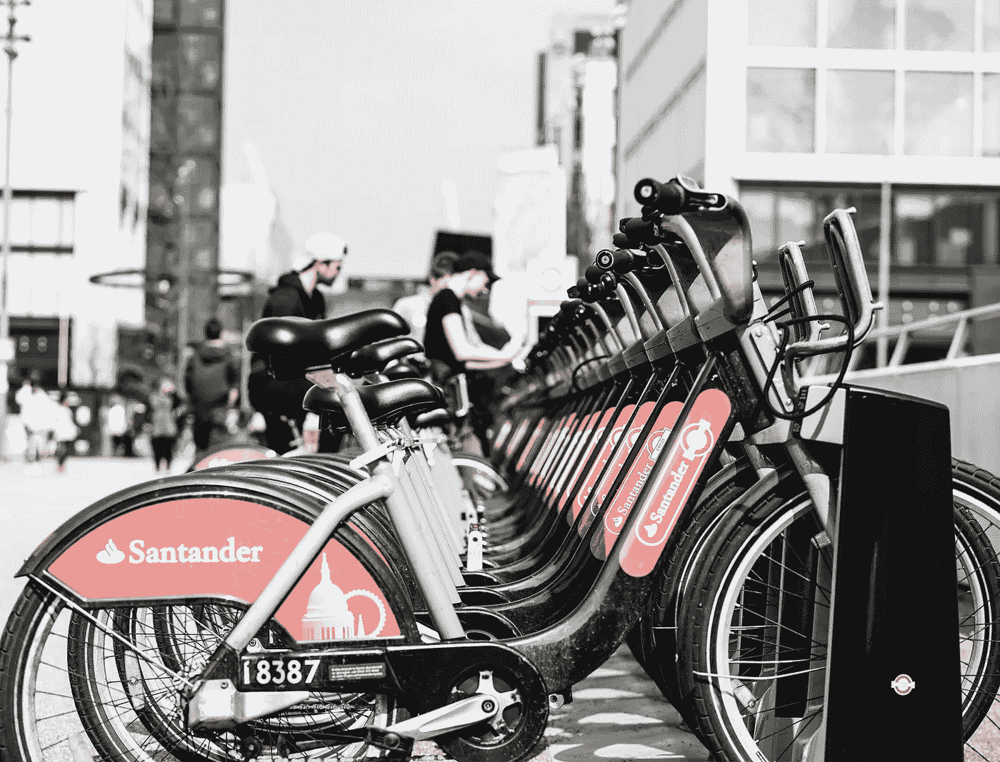

[来源:unspalsh.com]

**我们对每段旅程了解多少？**

在 TfL 的数据中，您可以看到每个完整旅程的以下详细信息:

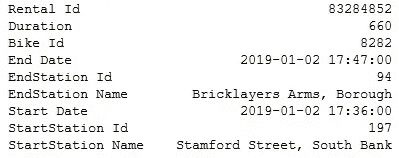

骑鲍里斯自行车的一次单独旅行[来源:作者自己的]

我使用 TfL 统一 API 将站点 id 映射到经度/纬度坐标。虽然这些数据非常全面，但不幸的是在可用性方面存在滞后——可用的最新数据截止到 2020 年 4 月底。

**鲍里斯自行车在“正常时期”是如何使用的？**

首先，利用 2019 年以来的所有旅程，我们需要了解鲍里斯自行车的“正常”用法。左图显示了工作日和周末行为的明显区别。自行车租赁在工作日是双峰式的——当自行车用于通勤时，在工作日的开始和结束时有两个明显的使用高峰。在周末，租用是单峰的——自行车用于休闲旅行或锻炼，租用高峰在下午三点左右。考虑到伦敦的天气，数据中有很多季节性就不足为奇了，如右图所示。夏季月份的使用率明显较高(7 月份的出行量几乎是 12 月份的两倍)，但随着人们骑车休闲，周末出行的比例在夏季也有所增加。

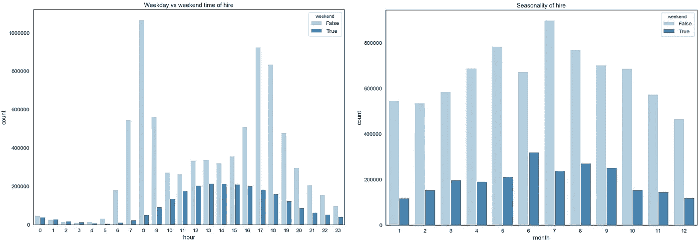

2019 年正常使用情况:周末和工作日呈现不同的使用模式(左图)；使用是季节性的(右图)[来源:作者自己的]

在冠状病毒封锁期间，行为发生了怎样的变化？

英国政府从 3 月 24 日星期二(今年的第 13 周)开始实施封锁。下图比较了 2020 年(深蓝色)和 2019 年(浅蓝色)每周的旅行次数，红线显示了 2020 年每周的使用量占 2019 年使用量的百分比。虽然旅行频率通常会增加(随着天气的改善)，但从第 12 周(封锁前的一周，政府建议不要社交)开始，使用率急剧下降，并在实施封锁后的第 13 周触底。有趣的是，使用率大幅反弹，截至 4 月底，已达到 2019 年水平的 85%。这与地铁、公共汽车和道路的使用形成对比(如政府每日简报所示)。

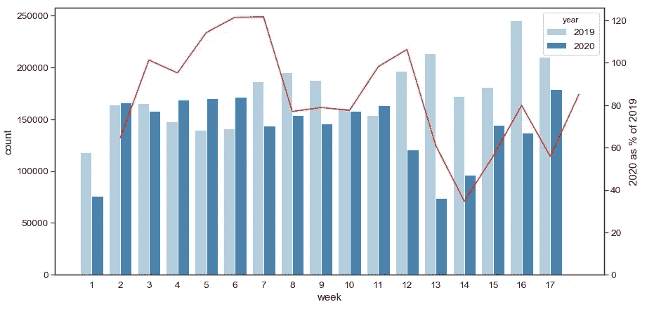

对比 2019 年(浅蓝色)和 2020 年(深蓝色)的周雇佣量。当宣布封锁时，使用停止了，但后来又恢复了[来源:作者自己的]

**自从封锁开始后，使用类型有变化吗？**

在封锁之前，使用率可以总结为主要由工作日通勤和周末休闲/锻炼驱动，有两种截然不同的租用制度。下面的左图显示，在封锁期间没有什么不同——每天看起来都像周末。在早上的通勤时间仍然有一个小的工作日高峰，因为一些人仍然在上班。与周末(下午 2 点至 4 点)相比，工作日的使用高峰在一天的晚些时候(下午 5 点至 7 点)。这表明人们在下班后骑自行车进行一天一次的锻炼。

如果你在同一个停靠站开始和结束一次旅行，这是一次纯粹的休闲或锻炼的最清晰的标志。下图显示了这种旅行的频率，增加了 5 倍。

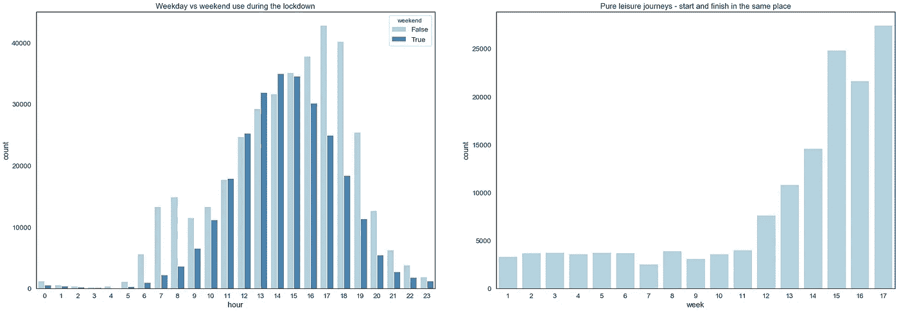

封锁期间的使用模式表明，自行车主要用于休闲和锻炼目的[来源:作者自己的]

**鉴于这种用法的变化，人们会去不同的地方吗？**

这些数据可以被认为是[图论](https://en.wikipedia.org/wiki/Graph_theory)的一个很好的应用，每个旅程代表一个顶点，每个停靠站代表一个节点。下面的图表将每个停靠站映射为红点，将每个旅程映射为蓝线(仅显示最受欢迎的 4000 条独特路线)。对接站节点的大小对应于在该站开始或结束的旅程的数量；这是按比例缩放的，以便最流行的扩展坞在两个图表上具有相同大小的节点。图中显示了泰晤士河的大致形状(尽管并不完全准确)。

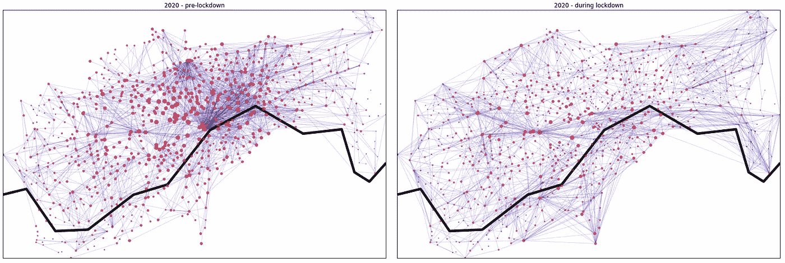

封锁期间的使用远不集中在伦敦市中心的交通枢纽国王十字和滑铁卢[来源:作者自己的]

在封锁之前，你可以清楚地看到伦敦市中心周围的焦点——特别是国王十字车站和滑铁卢附近的两大活动集中地，代表着交通网络的主要枢纽。虽然最繁忙的停靠站位于这些区域，但由于单个停靠站的自行车/停靠站数量有限，而且由于停靠站在这些区域的高度集中，因此没有单个停靠站占主导地位。

相比之下，在封锁期间，网络上的活动分散得多。伦敦市中心的交通枢纽不再占主导地位，使用率也不再集中在最受欢迎的停靠站。

然而，封锁导致一些停靠站变得异常繁忙，尤其是海德公园周围和沿河(威斯敏斯特，南岸)的停靠站。这可以通过查看最受欢迎的车站以及它们占旅程的百分比来看出。

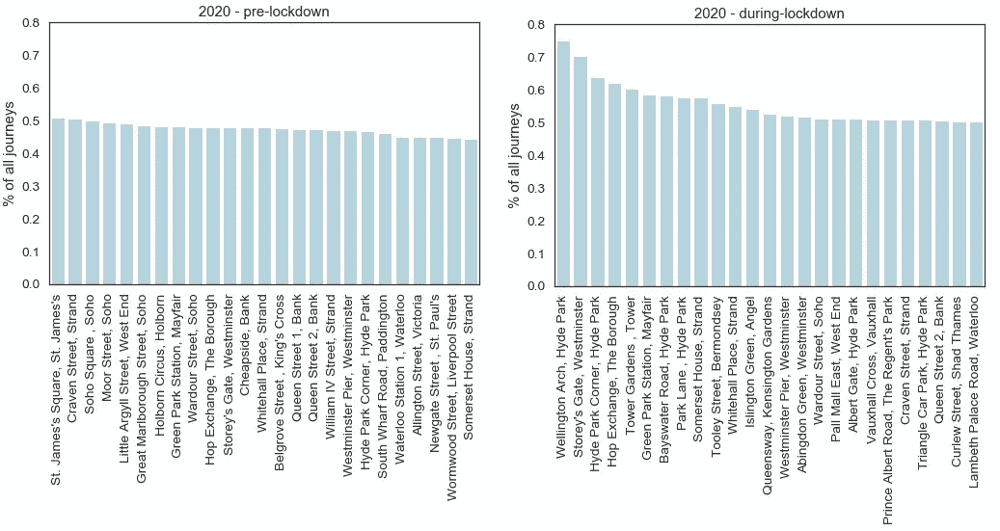

少数车站在封锁期间变得异常繁忙[来源:作者自己的]

通过使用 Python 中的 NetworkX 包，很容易计算一些图论度量。例如，根据扩展坞节点的[度中心性](https://en.wikipedia.org/wiki/Centrality#Degree_centrality)来确定扩展坞节点的大小(两个图表中的节点大小相同)强调了锁定前对国王十字车站和滑铁卢车站的关注，以及锁定期间更加统一的网络使用。这个软件包为更有趣的网络分析提供了很大的潜力。

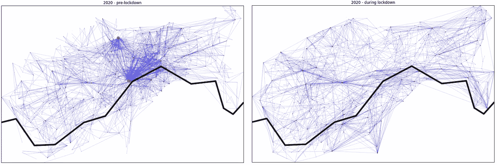

节点大小与对接站的中心度成正比[来源:作者自己的]

**有趣的下一步？**

> 当 TfL 发布新数据时，更新分析。尝试通过自行车租赁来确定人们返回工作岗位的程度是很有趣的
> 
> 更好的制图——如果有一张更准确、更容易辨认的伦敦地图就好了…
> 
> 更多 NetworkX 分析！

# **2020 年 6 月 6 日更新:TfL 发布下一批 2020 年 5 月数据**

在 2020 年 5 月，封锁程度略有缓解，这也是伦敦天气非常好的一个月。桑坦德自行车的使用率持续上升，每周总骑行次数现在回到(甚至到)2019 年的水平。

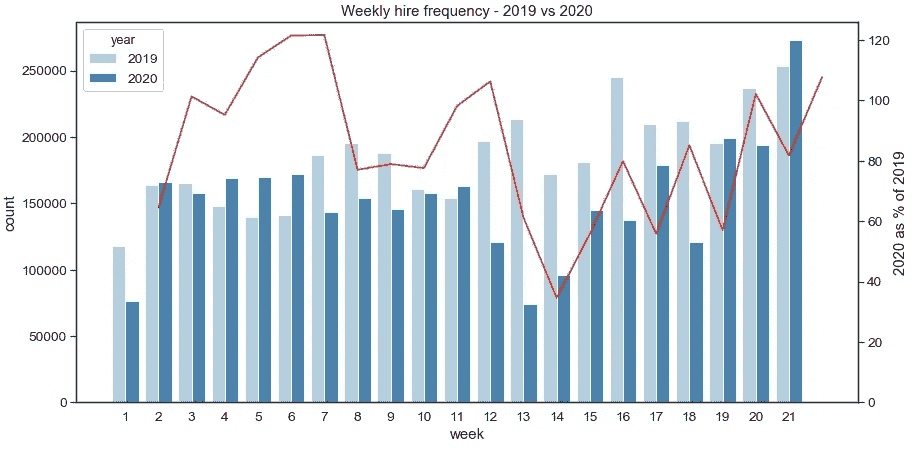

雇佣频率已恢复至 2019 年水平【来源:作者本人】

随着封锁的发展，桑坦德循环的数据可以用来理解行为变化吗？以下热图显示了一年中不同时间(y 轴)的雇佣频率(x 轴上的日期)。颜色越深，在那天的那个时间骑自行车的人就越多。

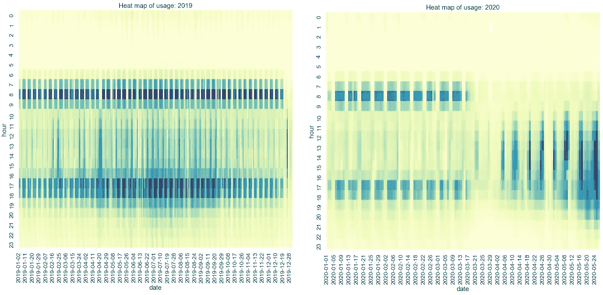

在 2020 年的数据中还没有回到通勤模式的证据[来源:作者自己的]

左边的图表显示了整个 2019 年。工作日的特点是上下班时间的使用高峰(如上所述)，而周末的使用更多地分布在一天的中间。可以预见的是，在夏季的几个月里，活动量会更大，五月至七月的漫长夜晚鼓励了晚间使用。

右边的图表显示 2020 年至今。在实施封锁之前，使用情况与 2019 年非常相似。3 月下半月的活动明显减少(如上所述),此后几周内，自行车租赁有所恢复。截至 5 月底，没有迹象表明正常的“朝九晚五的通勤模式”回归，活动集中在一天的开始和结束。休闲自行车似乎仍然占主导地位。

> 随着时间的推移，关注这些数据会很有意思，试图观察更广泛的办公室回报。

# 截至 2020 年 8 月 9 日更新: **TfL 发布下一批 2020 年 6 月和 7 月数据**

经过长时间的拖延，TfL 终于发布了截至 8 月 4 日的最新一批数据。在这段时间里，封锁继续放松，酒店行业开始开放，WFH 的指导已经放松，我们现在在外面吃饭来帮助解决问题。这些变化如何反映在桑坦德循环的使用中？

在较高的水平上，使用率仍然很高，与 2019 年的水平非常接近。

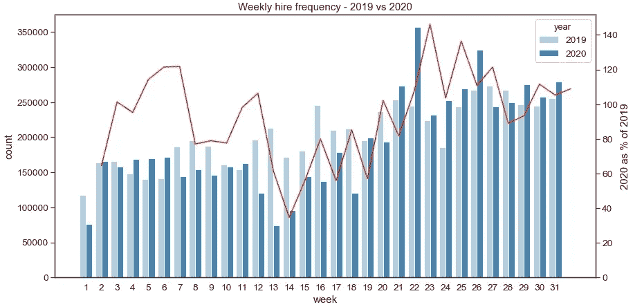

雇佣频率保持与 2019 年水平相当[来源:作者自己的]

然而，最新的热图(左图)显示**休闲自行车似乎仍然占主导地位，没有正常“通勤模式”回归的真正迹象。**

右边的图表更清楚地说明了这一点；这张图表比较了 2019 年和 2020 年每周工作日上午 8-9 点之间的旅行频率。历史上，这个时间是桑坦德自行车公司活动的高峰期，因为通勤者骑自行车去办公室。尽管鼓励通勤者骑自行车上班，而不是使用公共交通工具，但在此通勤期间的出行量**不到 2019 年**相应水平的 50%。

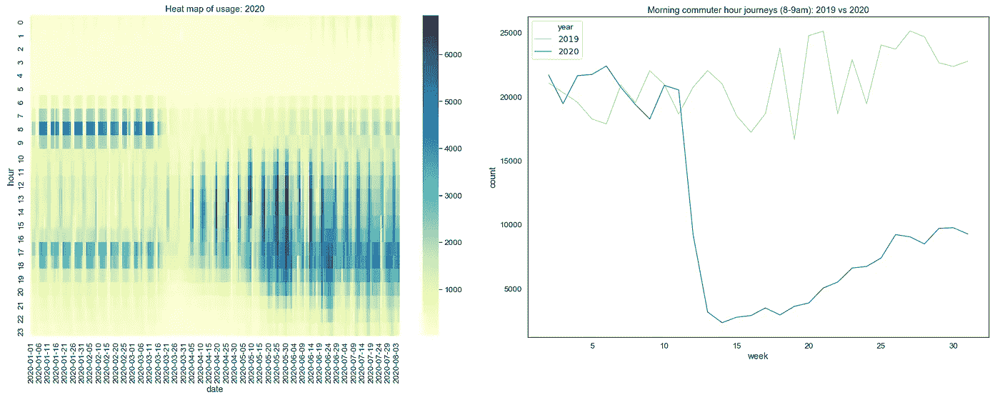

休闲自行车似乎仍占主导地位，通勤旅行不到 2019 年水平的 50%【来源:作者自己】

> 这一最新数据充分表明，迄今为止，重返办公室的步伐一直很慢。