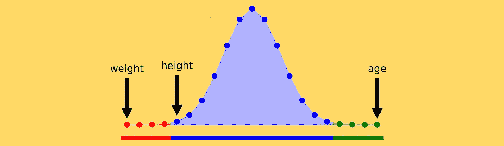
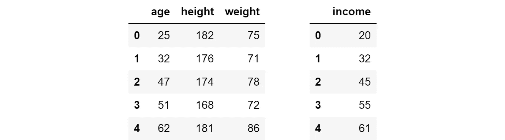
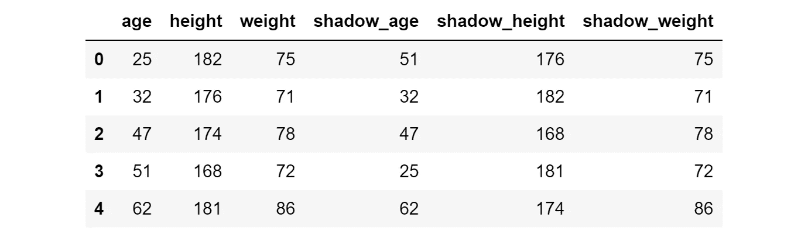
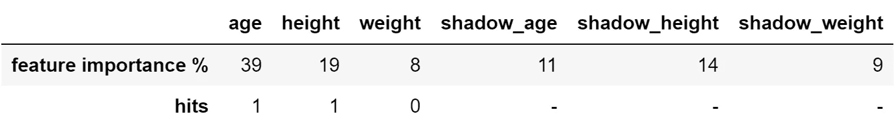
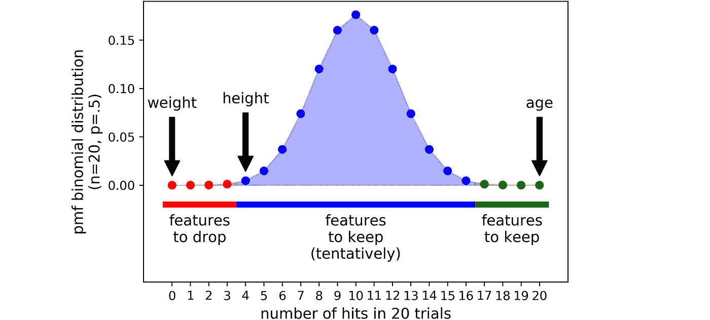

# 博鲁塔准确地解释了你希望别人如何向你解释

> 原文：<https://towardsdatascience.com/boruta-explained-the-way-i-wish-someone-explained-it-to-me-4489d70e154a?source=collection_archive---------0----------------------->

## 看看最有效的特征选择算法之一的 Boruta



特征选择是许多机器学习管道中的基本步骤。您丢弃了一堆特征，并且希望只选择相关的特征，而丢弃其他的特征。这样做的目的是通过去除会引入不必要噪声的无用特征来简化问题(听说过 [Occam](https://en.wikipedia.org/wiki/Occam%27s_razor) ？).

Boruta 是一种非常智能的算法，可以追溯到 2010 年，旨在自动对数据集执行特征选择。它是作为 R 的一个包而诞生的([这个](https://www.jstatsoft.org/article/view/v036i11)是最早描述它的文章)。Python 的一个版本 Boruta——叫做 BorutaPy——已经存在，可以在[这里](https://github.com/scikit-learn-contrib/boruta_py)找到。

在这篇文章中，我们将看到一些直接的 Python 代码来从头实现 Boruta——我相信从头构建是真正理解它的最好方法——并且，在文章的最后，我们将看到如何使用 borutay 来使我们的生活变得更容易。

# 1.一切都从 X 和 y 开始

为了看到 Boruta 的行动，让我们建立一个玩具数据集，它具有 3 个特征(*年龄*、*身高*和*体重*)、一个目标变量(*收入*)和 5 个观察值。

```
import pandas as pd### make X and y
X = pd.DataFrame({'age': [25, 32, 47, 51, 62],
                  'height': [182, 176, 174, 168, 181],
                  'weight': [75, 71, 78, 72, 86]})
y = pd.Series([20, 32, 45, 55, 61], name = 'income')
```



x 和 y

所以目标是在知道一个人的年龄、身高和体重的情况下，预测他/她的收入。这可能看起来很荒谬(至少在理论上是这样:在实践中，[身高已经被证明与薪水有关](https://edition.cnn.com/2007/US/Careers/02/02/cb.tall.people/))，但是总的来说，不要受个人偏见的影响是明智的。

在现实生活中，我们必须处理 3 个以上的特征(通常从几百到几千个)。因此，逐一检查并决定是否保留它是不可行的。此外，有些关系(例如非线性关系和相互作用)不容易被人眼发现，即使通过精确的分析也不容易发现。

理想情况下，我们希望找到一种算法，能够自主决定 *X* 的任何给定特征是否具有关于 *y.* 的一些预测值

# 2.为什么是博鲁塔？

一个流行的特征选择算法是 sklearn 的 [SelectFromModel](https://scikit-learn.org/stable/modules/generated/sklearn.feature_selection.SelectFromModel.html#sklearn.feature_selection.SelectFromModel) 。基本上，你选择一个方便的模型——能够捕捉非线性关系和相互作用，例如随机森林——然后把它放在 *X* 和 *y* 上。然后，从这个模型中提取每个特性的重要性，只保留高于给定重要性阈值的特性。

这听起来很合理，但这种方法的弱点是不言而喻的:谁来决定阈值，以及如何决定？这里面有很大的随意性。

当我第一次遇到这个问题时，我开始寻找一个更健壮的解决方案。直到我找到了博鲁塔。Boruta 是一种基于统计的特征选择算法，即使没有用户的任何特定输入也能非常好地工作。这怎么可能呢？

Boruta 基于两个绝妙的想法。

## 2.1 第一个理念:阴影功能

在 Boruta 中，特性之间并不竞争。相反——这是第一个绝妙的想法——他们与随机版本的他们竞争。

实际上，从 *X* 开始，另一个数据帧是通过随机洗牌创建的。这些置换的特征被称为**阴影特征**。此时，影子数据帧被附加到原始数据帧上，以获得一个新的数据帧(我们将称之为 *X_boruta* )，其列数是 *X* 的两倍。

```
import numpy as np### make X_shadow by randomly permuting each column of X
np.random.seed(42)
X_shadow = X.apply(np.random.permutation)
X_shadow.columns = ['shadow_' + feat for feat in X.columns]### make X_boruta by appending X_shadow to X
X_boruta = pd.concat([X, X_shadow], axis = 1)
```

在我们的例子中，这就是 *X_boruta* 的样子:



x _ 博鲁塔

然后在 *X_boruta* 和 *y* 上安装一个随机森林。

现在，我们将每个原始特征的重要性与一个阈值进行比较。这次，**阈值被定义为阴影特征**中记录的最高特征重要性。当特征的重要性高于这个阈值时，这被称为“命中”。这个想法是，只有当一个特性能够比最好的随机特性做得更好时，它才是有用的。

重现此过程的代码如下

```
from sklearn.ensemble import RandomForestRegressor### fit a random forest (suggested max_depth between 3 and 7)
forest = RandomForestRegressor(max_depth = 5, random_state = 42)
forest.fit(X_boruta, y)### store feature importances
feat_imp_X = forest.feature_importances_[:len(X.columns)]
feat_imp_shadow = forest.feature_importances_[len(X.columns):]### compute hits
hits = feat_imp_X > feat_imp_shadow.max()
```

对于我们的玩具数据集，结果是:



一次运行的结果

阈值为 14%(最大值为 11%、14%和 8%)，因此有两个特征命中，即*年龄*和*身高*(分别为 39%和 19%)，而*体重* (8%)得分低于阈值。

显然，我们应该放下*体重*，继续关注*年龄*和*身高*。但是，我们应该相信这次跑步吗？如果只是一次不走运的减肥跑步呢？如果这只是年龄和身高的运气呢？

这就是博鲁塔的第二个绝妙想法发挥作用的地方。

## 2.2 第二个想法:二项分布

就像机器学习中经常发生的那样(生活中？)，**关键是迭代**。毫不奇怪，20 次试验比 1 次试验更可靠，100 次试验比 20 次试验更可靠。

例如，让我们重复上述过程 20 次。

```
### initialize hits counter
hits = np.zeros((len(X.columns)))### repeat 20 times
for iter_ in range(20): ### make X_shadow by randomly permuting each column of X
   np.random.seed(iter_)
   X_shadow = X.apply(np.random.permutation)
   X_boruta = pd.concat([X, X_shadow], axis = 1) ### fit a random forest (suggested max_depth between 3 and 7)
   forest = RandomForestRegressor(max_depth = 5, random_state = 42)
   forest.fit(X_boruta, y) ### store feature importance
   feat_imp_X = forest.feature_importances_[:len(X.columns)]
   feat_imp_shadow = forest.feature_importances_[len(X.columns):] ### compute hits for this trial and add to counter
   hits += (feat_imp_X > feat_imp_shadow.max())
```

这是结果:


20 次运行的结果

现在，我们如何设定决策标准？这是博鲁塔所包含的第二个高明的想法。

就拿一个特征来说吧(不管*的年龄*、*的身高*还是*的体重*)，我们完全不知道它是否有用。我们保留它的可能性有多大？**该特性的最大不确定性以 50%的概率表示，就像扔硬币一样**。由于每个独立的实验可以给出一个二元结果(命中或未命中)，一系列的 *n* 试验遵循一个 [**二项分布**](https://en.wikipedia.org/wiki/Binomial_distribution) 。

在 Python 中，二项式分布的概率质量函数可计算如下:

```
import scipy as sptrials = 20
pmf = [sp.stats.binom.pmf(x, trials, .5) for x in range(trials + 1)]
```

这些值看起来像一个铃铛:



特征的二项式分布和定位

在 Boruta 案中，拒绝和接受之间没有硬性的界限。相反，有 3 个方面:

*   一个**拒绝区域**(红色区域):结束在这里的特征被认为是噪声，所以它们被丢弃；
*   犹豫不决的区域(蓝色区域):博鲁塔对这个区域的特征犹豫不决；
*   一个**接受区域**(绿色区域):这里的特征被认为是预测性的，所以它们被保留。

通过选择分布的两个最极端部分，即分布的**尾部来定义面积(在我们的例子中，每个尾部占分布的 0.5%)。**

因此，我们对玩具数据进行了 20 次迭代，最终得出了一些有统计依据的结论:

*   为了预测一个人的*收入*，*年龄*是预测性的，应该保留，*体重*只是噪音，应该去掉，
*   博鲁塔对*身高*举棋不定:选择权在我们，但在保守的框架下，还是保持为宜。

在这一段中，我们已经实现了必要的代码，但是在 Python 中有一个很棒的(优化的)Boruta 库。

# 3.在 Python 中使用 BorutaPy

Boruta 可通过 pip 安装:

```
!pip install boruta
```

这是它的使用方法:

```
from boruta import BorutaPy
from sklearn.ensemble import RandomForestRegressor
import numpy as np###initialize Boruta
forest = RandomForestRegressor(
   n_jobs = -1, 
   max_depth = 5
)
boruta = BorutaPy(
   estimator = forest, 
   n_estimators = 'auto',
   max_iter = 100 # number of trials to perform
)### fit Boruta (it accepts np.array, not pd.DataFrame)
boruta.fit(np.array(X), np.array(y))### print results
green_area = X.columns[boruta.support_].to_list()
blue_area = X.columns[boruta.support_weak_].to_list()print('features in the green area:', green_area)
print('features in the blue area:', blue_area)
```

如您所见，**存储在 *boruta.support_* 中的特征是那些在某个点上结束于验收区域的特征，因此您应该将它们包含在您的模型**中。存储在 *boruta.support_weak_* 中的特性是 boruta 无法接受或拒绝的特性(蓝色区域),这取决于数据科学家的选择:这些特性可能被接受，也可能不被接受，这取决于用例。

# 4.结论

特征选择是机器学习管道中的决定性部分:过于保守意味着引入不必要的噪音，而过于激进意味着丢弃有用的信息。

在这篇文章中，我们看到了如何使用 Boruta 在数据集上执行稳健的、基于统计的要素选择。事实上，做出关于特性的实质性决策对于确保预测模型的成功至关重要。