# 波士顿 Airbnb 探索性分析

> 原文：<https://towardsdatascience.com/boston-airbnb-exploratory-analysis-75012d987e51?source=collection_archive---------42----------------------->

## *分析波士顿 Airbnb 房源，寻找成为房东的机会*

[迈克尔·布朗宁](https://unsplash.com/@michaelwb?utm_source=unsplash&utm_medium=referral&utm_content=creditCopyText)在 [Unsplash](https://unsplash.com/s/photos/boston?utm_source=unsplash&utm_medium=referral&utm_content=creditCopyText) 上拍照

## **分析背景**

Airbnb，Inc 是一家总部位于加利福尼亚州旧金山的美国公司，是最著名的在线短期租赁公司之一。它专注于住宿交易、寄宿家庭和旅游体验，甚至没有任何真正的国有上市公司。

自成立以来，Airbnb 每年都在持续增长，这对任何有兴趣投资的人来说都是一个有吸引力的市场。随之而来的是，许多关于如何被引导做出最佳决策的问题。

在这个项目中，我们将通过数据分析探索波士顿市的 Airbnb 业务，确定哪些选项可能更有利可图，更值得投资。

## **数据集**

为了找到答案，我们将使用由[数据提供的来自 Airbnb 波士顿的文件。世界](https://data.world/fmascolo/aibnbboston)。该数据集由三个主要文件组成:从 2009 年到 2016 年的房源、评论和日历。

此外，还对有关波士顿市的其他信息进行了外部搜索。

## **数据探索**

***波士顿的 Airbnb 房源和旺季***

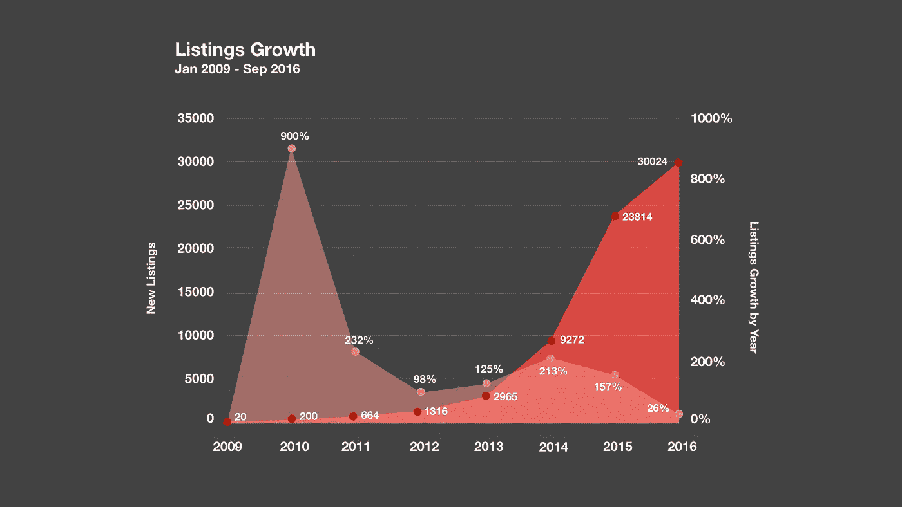

首先，我们将带来一个不考虑上市、旺季和价格变化的总体概述，这将帮助我们了解作为投资者我们可以期待什么。

上面的图表向我们展示了上市公司逐年增长的情况，从中可以观察到自 2009 年以来持续的大幅增长。然而，我们可以注意到增长逐年减弱。

以每年的平均增长作为初始参数，过去五年的增长约为新上市公司的 124%。对比过去几年，我们可以看到分析期内最弱的增长。新上市公司的估计数据显示，2016 年新上市公司的数量增长了 26%左右，与前一年(2015 年)相比增长了 157%。

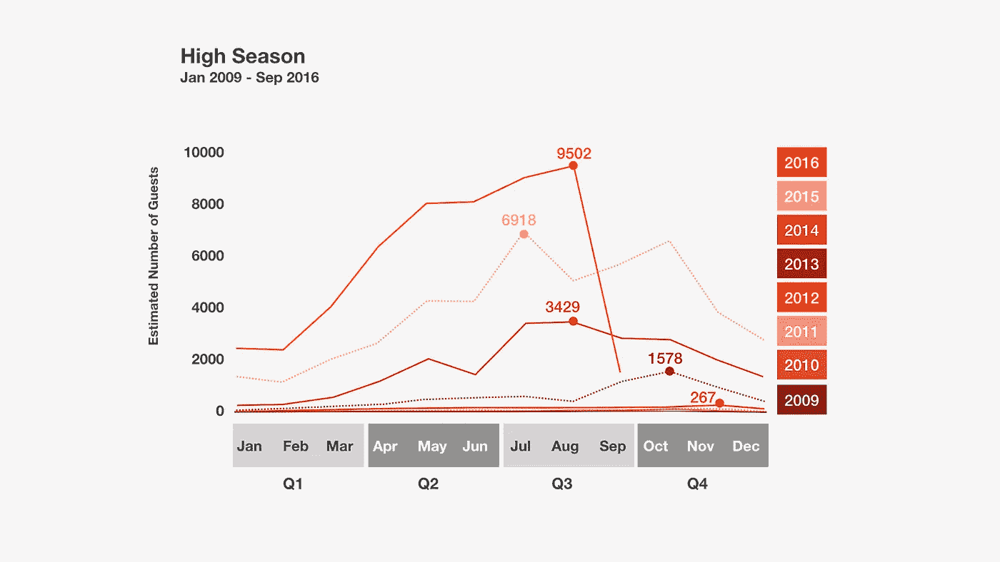

由于我们在数据集中没有关于预订的进一步信息，我们将点评数量和最短住宿时间放在了 2009 年 3 月至 2016 年 9 月期间。这个估计向我们展示了一个保守的结果，因为可能会有更多的预订，客人可能会停留更长的时间。

旺季图表明，7 月至 9 月期间是波士顿市最繁忙的时间，尤其是从 2013 年开始到 2016 年这段时间。峰值出现在 2016 年，达到 9.502 人次，同年平均增长约 49%。

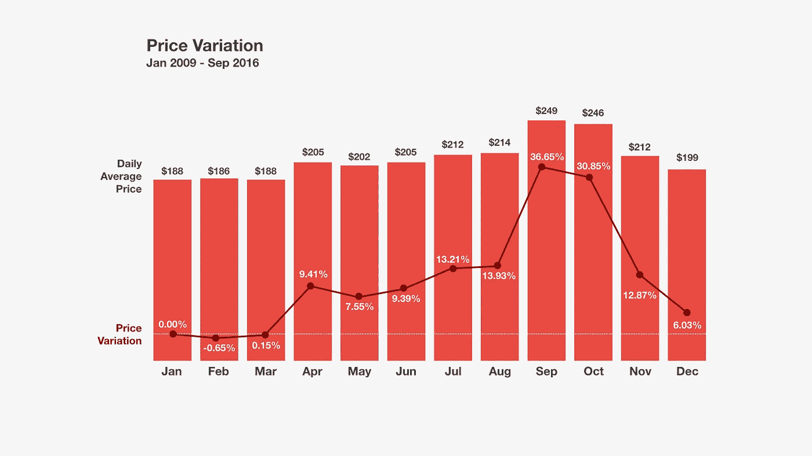

下图展示了 2015 年 10 月和 2016 年 10 月之间的价格变化。每天最高的平均价格也发生在第三季度，价格在 9 月达到高峰，几乎高出 37%，每天 249 美元。

更显著的价格下降发生在 12 月，此时平均价格相对于峰值下降了约 31%，达到每天 199 美元。观察到的最低值出现在第一学期，每天 188 美元。

如“旺季”图所示，可以观察到第三季度的上升趋势和第四季度的下降趋势，此时低需求相应地降低了价格。

***房产类型分析***

波士顿 Airbnb 提供许多不同的房屋出租。游客可以选择从整个房子或公寓，直到船，露营车或只是一个负担得起的房间。然而，我们将继续关注那些有更多房源、可能有更多需求的房产。

检查数据集，我们可以找到总共 2880 处房产，其中 7%是公寓，16%是住宅，77%是公寓，分布在 23 个街区。

另一个相关信息涉及哪种属性具有对主机和超级主机的偏好。总主机中有 78%的主机拥有公寓甚至是除其他房产外的公寓，65%的超级主机在其他房产中拥有公寓。

从现在开始，我们必须把重点放在公寓礼仪上。

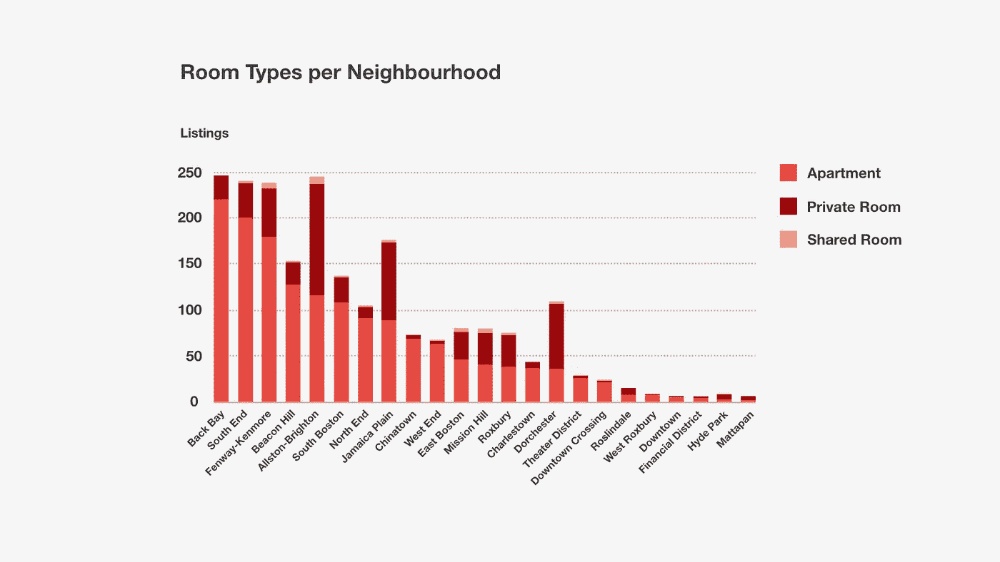

上面的分析向我们展示了每个街区的客人对房间类型的偏好。

大多数寻找公寓的客人都倾向于租用整个地方，从而产生 1528 套公寓，相当于 70%。私人房间是第二个首选，有 605 个单元，占总数的 28%。与之前的选项相差甚远，合租房间只有 2%的人响应偏好，有 38 个单元。

考虑到整个公寓选项，后湾，南端和芬威肯莫尔是更多的单位数量的街区。如果我们考虑所有的租金选择，奥尔斯顿-布莱顿附近出现作为一个新的选择。无论如何，我们可以看到他们中有相当多的人。

上面的重点表格显示了整个公寓的平均价格，包括每个街区的房间数量。

随着房间数量的增加，价格也会上涨，尽管会有一些异常值。我们还可以观察到，随着房间数量和每日价格的增加，公寓报价下降。除此之外，我们可以意识到，几乎每个社区都有两个房间的财产。

以房间数量来比较日均价格，我们可以看到价格平均上涨了 27%左右。尽管如此，最高的价格差异出现在一居室和两居室之间，第二居室要贵 38%。在多切斯特、米申山和罗斯林代尔，可以找到价格低于 100 美元的工作室。另一方面，Back Bay，Beacon Hill，Roxbury，South Boston，South End e 剧院区的价格普遍较高，在 400 美元以上。

***分析距离对价格的影响***

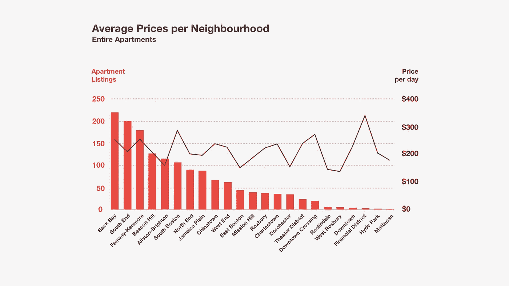

离市中心的距离对平均价格有很大影响。上面的图表显示了市中心每天的平均价格和距离之间的关系。

数字显示，随着离市区距离的增加，价格会下降。相比之下，如果我们考虑到距离市中心超过 7 公里的地方，每天的平均价格将是 170 美元，而距离市中心不到 1.5 公里的价格平均为 245 美元。

分析下面的图表，我们可以看到距离和入住率之间的关系，其中我们可以看到平均入住率约为 89%,分布在所有街区。

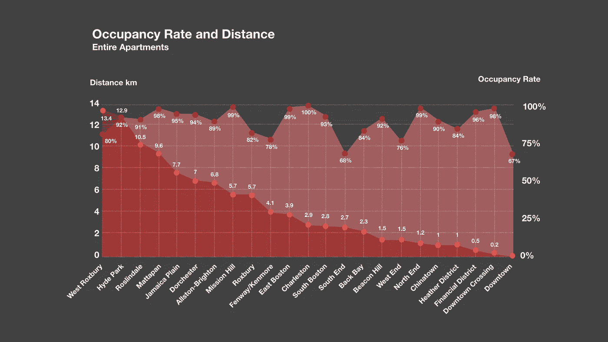

值得注意的是，一些地区的入住率远低于平均水平，尽管一些礼仪是在靠近市中心的街区。由于这些地区的价格较高，游客可能对价格比对距离更敏感。

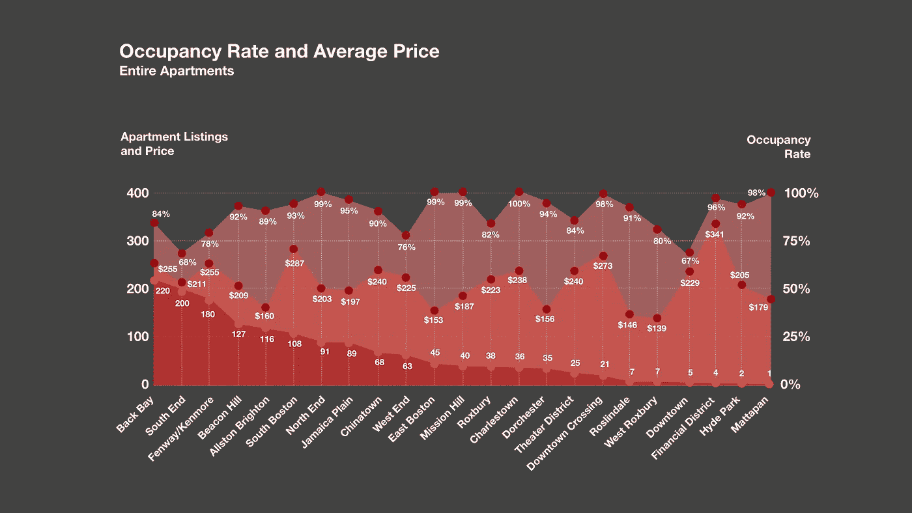

下一张图探究了入住率、平均价格和每个街区的房产数量之间的关系。正如我们从之前的图表中认识到的，平均价格对入住率的影响比离市中心的距离更大。

对于价格从每天 210 美元到 340 美元的地方，入住率为 85%，略高于距离市中心 2 公里。在一些地方，价格从 138 美元到 200 美元左右不等，相当于 93%的入住率。这些地区距离市中心仅 8 公里多一点。

以房源数量作为参考，我们可以看到市中心附近的公寓相当集中。总共 1528 套公寓中，约 78%位于距离市中心不到 4.1 公里的地方。其余 22%的单元更远，超过 5.7 公里。不出所料，靠近市中心的房产平均价格为 240 美元，远离市中心的为 177 美元。

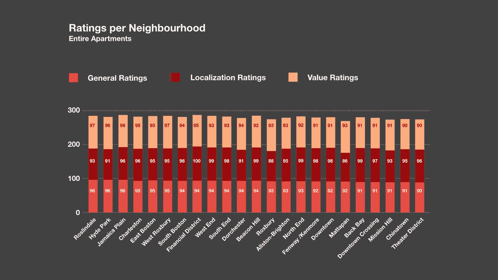

分析每个街区的评级，我们可以再次注意到，与市中心的物业距离有关的一些联系。

具体检查本地化评级，得分高于 98 分的整个街区(金融区、西区、灯塔山、北端、后湾、南端、芬威/肯莫尔和市中心)中有 39%位于距离市中心不到 4.1 公里的地方。仅分析评分超过 98 分的地方，78%的地方距离中心不到 2 公里。

总体评分和价值评分似乎更受价格的影响。如果我们选择一系列价值和综合评分高于 95 分的最高评分酒店(罗斯林代尔、西罗克斯伯里、海德公园、牙买加平原、查尔斯顿和东波士顿)，这些地方的平均价格为每天 180 美元。

***最赚钱的领域***

结束分析时，我们将带来一些最终图表，向我们展示最有利可图的领域，因此，对可能的投资更感兴趣。

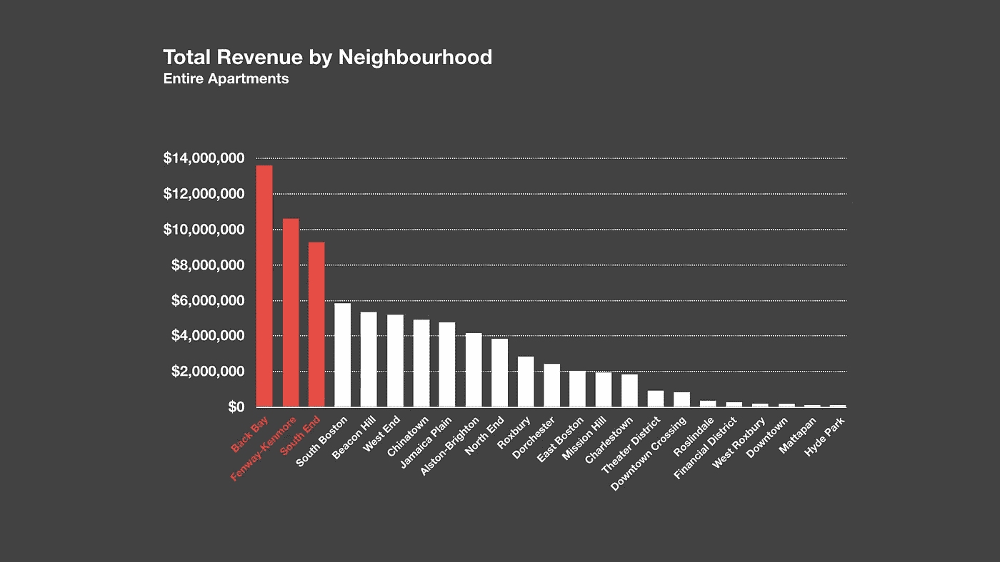

上图显示的是从 2009 年 1 月到 2016 年 9 月按街区划分的总收入。

Back Bay、Fenway/Kenmore 和 South End 的总收入最高，分别为 1360 万美元、1060 万美元和 930 万美元。这些价值的总和占所有社区总收入的 40%。

相比之下，收入第四高的社区南波士顿的总收入为 590 万美元，比第三名的南端少 63%。

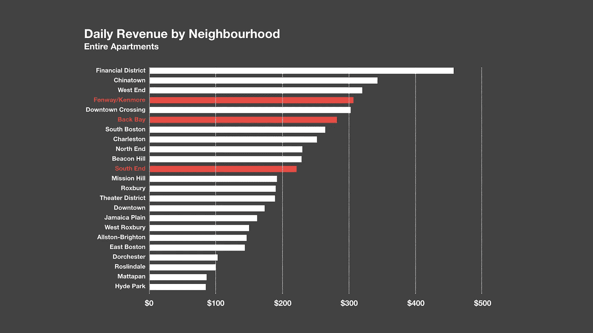

上图为我们带来了附近地区的每日收入，根据上图，可以观察到总收入最高的三个地区仍然保持着有趣的定位，尤其是芬威/肯莫尔和后湾。

这三个地区，后湾，芬威/肯莫尔东南端的平均日价格在 222 美元到 307 美元之间。即使是 South End 街区支付的最低值 222 美元，也高于所有街区的平均日收入 214 美元。

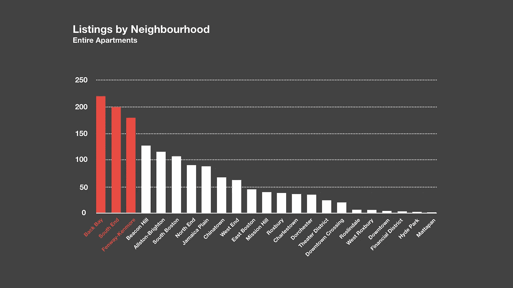

在这里，我们可以看到最高的总收入领域支持第一的立场。Back Bay、Fenway/Kenmore e South End 的公寓上市量最高，分别为 220、200 和 180 套。

收集所有三个社区，我们在每个地区拥有整个公寓系列的近 40%,平均每天收费 241 美元。

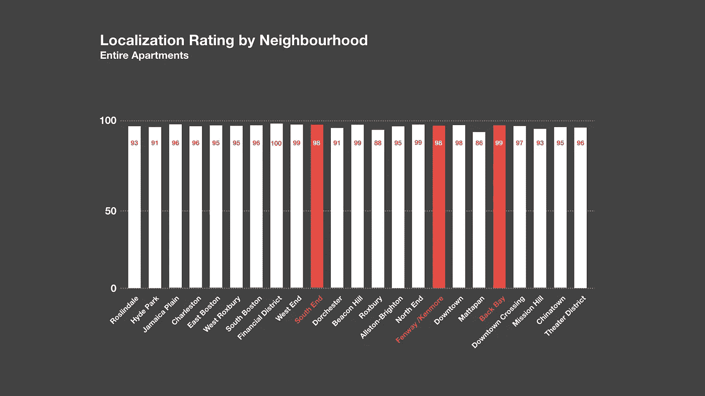

在每个街区的本地化评级中，我们将 Back Bay、Fenway/Kenmore 和 South End 列为最佳地区评论，从 100 分的最高分中获得 98 分以上的评级。

在总共 23 个地区中，只有 9 个地区得分超过 98 分，只有 5 个地区得分超过 99 分，比如 Back Bay。此外，Back Bay、Fenway/Kenmore 和 South End 距离市中心平均只有 3 公里。

## **一般结论**

*   在结束分析之前，让我们回顾一下通过这次探索性搜索收集到的主要见解；
*   第三季度是波士顿市最繁忙的时期。7 月至 9 月也是游览这座城市最贵的时候，价格最高，9 月份几乎达到 31%；
*   70%的主机和 65%的超级主机有公寓，或在不同的属性，也有公寓；
*   70%的客人更喜欢租赁整个公寓，而不是房间或合租房间，两室公寓在所有社区范围内的房源数量较多，这表明客人可能更喜欢这类物业；
*   靠近市中心的街区有最高的每日价格和总收入；
*   远离市中心的房产每日价格最低。多切斯特、米申山和罗斯林代尔距离市中心 7.7 公里，有 100 美元左右的选择。

## **最适合主持人的区域**

*   Back Bay、Fenway/Kenmore 和 South End 的总收入最高，在 1360 万美元、1060 万美元和 930 万美元之间。
*   Back Bay、Fenway/Kenmore 和 South End 的日均房价加在一起为 270 美元，比所有街区的平均房价高出 25%以上。
*   Back Bay、Fenway/Kenmore 和 South End 的公寓房源也最多，分别为 220、200 和 180 套。
*   Back Bay、Fenway/Kenmore 和 South End 是本地化评级评论中最好的，从 100 分中得到 98 分以上。

***希望你喜欢！感谢阅读！***

*这里* *可以访问* [*用于分析的数据。*](https://github.com/fmascolo/Aibnb_Boston.git)