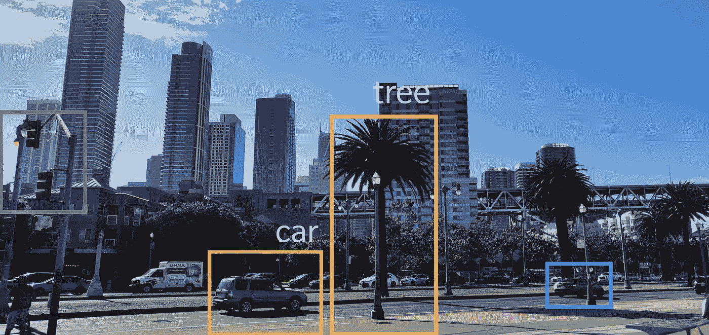
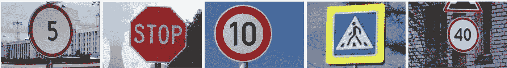

# 使用 PyTorch 从头开始预测包围盒

> 原文：<https://towardsdatascience.com/bounding-box-prediction-from-scratch-using-pytorch-a8525da51ddc?source=collection_archive---------1----------------------->

## 多任务学习——包围盒回归+图像分类

作者点击的图像

对象检测是计算机视觉中非常流行的任务，其中，给定一幅图像，你预测图像中存在的对象周围的框(通常是矩形),并且还识别对象的类型。你的图像中可能有多个物体，有各种最先进的技术和架构来解决这个问题，如 [Faster-RCNN](https://arxiv.org/pdf/1506.01497.pdf) 和 [YOLO v3](https://pjreddie.com/media/files/papers/YOLOv3.pdf) 。

本文讨论了图像中只存在一个感兴趣对象的情况。这里的重点是如何正确地读取图像及其边界框、调整大小和执行放大，而不是模型本身。目标是很好地掌握对象检测背后的基本思想，您可以扩展它以更好地理解更复杂的技术。

这里有一个笔记本的链接，其中包含了我在本文中使用的所有代码:[https://jovian . ml/aakanksha-ns/road-signs-bounding-box-prediction](https://jovian.ml/aakanksha-ns/road-signs-bounding-box-prediction)

如果你是深度学习或 PyTorch 的新手，或者只是需要复习，这可能会让你感兴趣:

# 问题陈述

给定由路标组成的图像，预测路标周围的边界框并识别路标的类型。

这些迹象可能属于四个不同的类别:

*   交通灯
*   停止
*   速度限制
*   人行横道

这被称为多任务学习问题，因为它涉及执行两个任务——1)回归以找到边界框坐标，2)分类以识别路标的类型

样本图像。[来源](https://www.kaggle.com/andrewmvd/road-sign-detection)

# 资料组

我使用了 Kaggle 的路标检测数据集:

 [## 路标检测

### 属于 4 类的 877 个图像。

www.kaggle.com](https://www.kaggle.com/andrewmvd/road-sign-detection) 

它由 877 幅图像组成。这是一个非常不平衡的数据集，大多数图像属于`speed limit`类，但由于我们更关注边界框预测，我们可以忽略这种不平衡。

# 加载数据

每个图像的注释都存储在单独的`XML`文件中。我按照以下步骤创建了培训数据框架:

*   浏览培训目录以获得所有`.xml`文件的列表。
*   使用`xml.etree.ElementTree`解析`.xml`文件
*   为每个图像创建一个由`filepath`、`width`、`height`、边界框坐标(`xmin`、`xmax`、`ymin`、`ymax`)和`class`组成的字典，并将该字典附加到一个列表中。
*   使用图像统计字典列表创建一个熊猫数据框架。

*   标签编码`class`列

# 调整图像大小和边界框

由于训练计算机视觉模型需要图像具有相同的大小，因此我们需要调整图像及其相应的边界框的大小。调整图像的大小很简单，但是调整边界框的大小有点棘手，因为每个框都与图像及其尺寸相关。

以下是调整边界框大小的工作方式:

*   将边框转换为与其对应的图像大小相同的图像(称为蒙版)。这个遮罩只有背景的`0`和边界框覆盖的区域的`1`。

原象

边界框的遮罩

*   将遮罩调整到所需的尺寸。
*   从调整大小的遮罩中提取边界框坐标。

辅助函数从包围盒中创建遮罩，从遮罩中提取包围盒坐标

函数来调整图像大小，写入新路径，并获取调整后的边界框坐标

# 数据扩充

数据扩充是一种通过使用现有图像的不同变体创建新的训练图像来更好地概括我们的模型的技术。在我们当前的训练集中，我们只有 800 张图像，因此数据扩充对于确保我们的模型不会过度拟合非常重要。

对于这个问题，我使用了翻转，旋转，中心裁剪和随机裁剪。我在本文中讨论了各种数据扩充技术:

 [## 计算机视觉的图像处理技术

### 图像处理是计算机视觉的一个组成部分。我们几乎总是想调整图像大小，增加数据…

towardsdatascience.com](/image-processing-techniques-for-computer-vision-11f92f511e21) 

这里唯一要记住的是确保边界框也以和图像相同的方式变换。为此，我们遵循与调整大小相同的方法—将边界框转换为遮罩，将与原始图像相同的变换应用于遮罩，并提取边界框坐标。

辅助函数用于居中裁剪和随机裁剪图像

变换图像和遮罩

显示边界框

# PyTorch 数据集

现在我们已经有了数据扩充，我们可以进行训练验证分割并创建 PyTorch 数据集。我们使用 ImageNet stats 标准化图像，因为我们使用预训练的 ResNet 模型，并在训练时在我们的数据集中应用数据扩充。

列车有效分离

创建训练和有效数据集

设置批处理大小和创建数据加载器

# PyTorch 模型

对于这个模型，我使用了一个非常简单的预训练 resNet-34 模型。因为我们在这里有两个任务要完成，所以有两个最后的层——边界框回归器和图像分类器。

# 培养

对于损失，我们需要考虑分类损失和包围盒回归损失，因此我们使用交叉熵和 L1 损失(真实值和预测坐标之间的所有绝对差的总和)的组合。我用因子 1000 来衡量 L1 损失，因为分类和回归损失都在相似的范围内。除此之外，这是一个标准的 PyTorch 训练循环(使用 GPU):

# 对测试图像的预测

既然我们已经完成了训练，我们可以选择一个随机的图像并在上面测试我们的模型。即使我们有相当少量的训练图像，我们最终在测试图像上获得了相当不错的预测。

这将是一个有趣的练习，用你的手机拍一张真实的照片，并测试模型。另一个有趣的实验是不执行任何数据扩充，训练模型并比较两个模型。

# 结论

既然我们已经介绍了对象检测的基本原理，并从头开始实现了它，您可以将这些想法扩展到多对象的情况，并尝试更复杂的模型，如 RCNN 和 YOLO！此外，查看这个名为[albuminations](https://github.com/albumentations-team/albumentations)的超酷库，轻松执行数据扩充。

# 参考

*   旧金山大学[数据科学](https://www.usfca.edu/arts-sciences/graduate-programs/data-science)硕士项目的深度学习夏季选修课
*   [https://www . usfca . edu/data-institute/certificates/fundamentals-deep-learning](https://www.usfca.edu/data-institute/certificates/fundamentals-deep-learning)