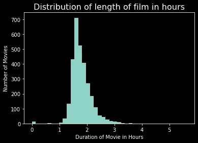
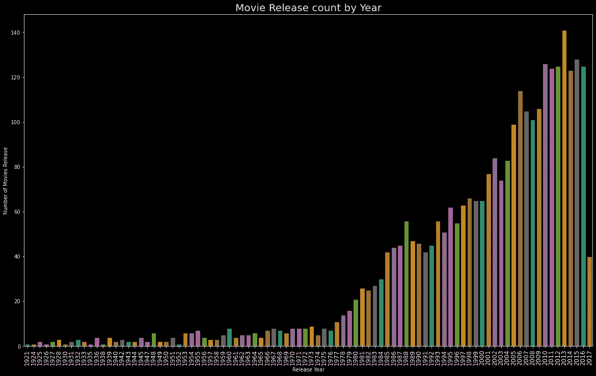
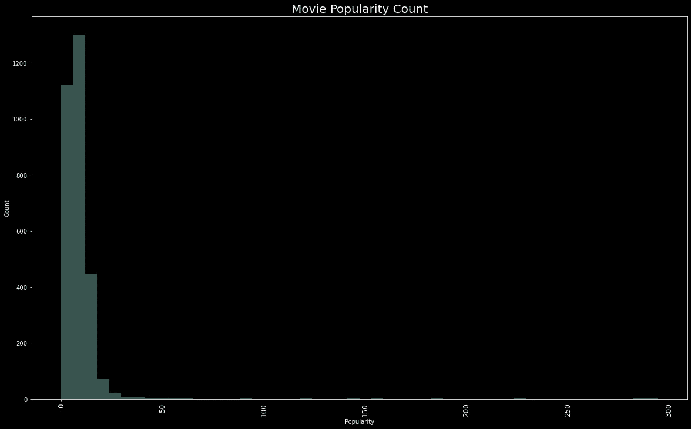
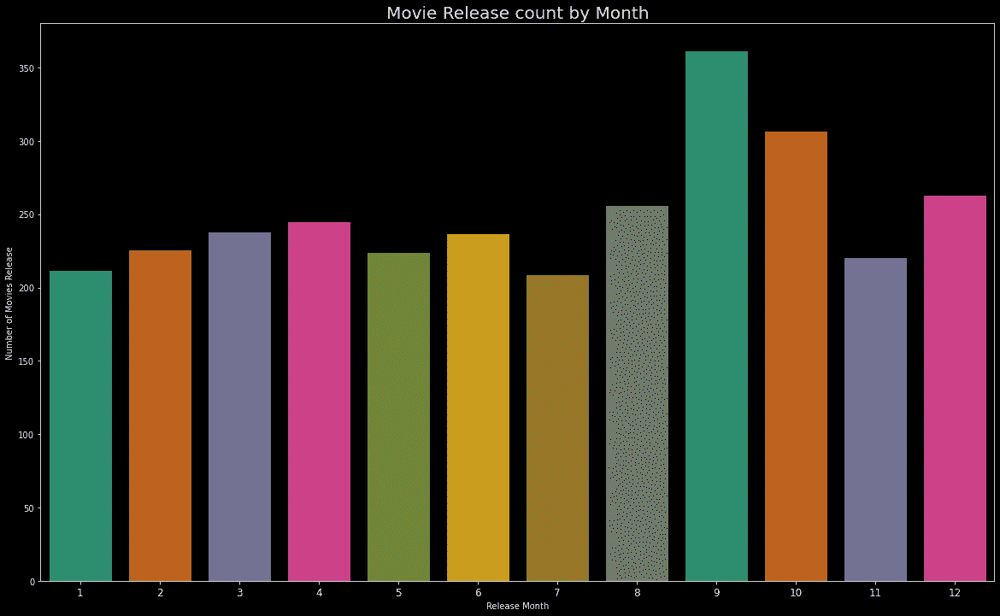
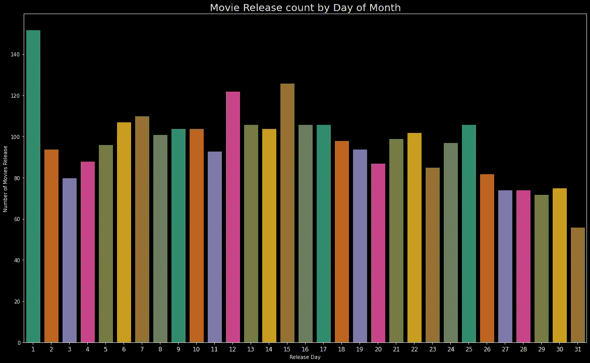

# 票房收入分析和可视化

> 原文：<https://towardsdatascience.com/box-office-revenue-analysis-and-visualization-ce5b81a636d7?source=collection_archive---------40----------------------->


克里斯特·卢哈尔斯在 [Unsplash](https://unsplash.com?utm_source=medium&utm_medium=referral) 上的照片

## 数据科学 100 天的第 4 天和第 5 天

欢迎回到我的 100 天数据科学挑战之旅。在第 4 天和第 5 天，我在处理在 [Kaggle](https://www.kaggle.com/c/tmdb-box-office-prediction/data) 上可用的 TMDB 票房预测数据集。

我将首先导入一些我们在这个任务中需要的有用的库。

```
import pandas as pd

*# for visualizations*
import matplotlib.pyplot as plt
import seaborn as sns
%matplotlib inline
plt.style.use('dark_background')
```

# 数据加载和探索

一旦你从 Kaggle 下载了数据，你将有 3 个文件。因为这是一个预测竞赛，所以您有训练、测试和 sample_submission 文件。对于这个项目，我的动机只是进行数据分析和可视化。我将忽略 test.csv 和 sample_submission.csv 文件。

让我们使用 pandas 加载数据帧中的 train.csv。

```
%time train = pd.read_csv('./data/tmdb-box-office-prediction/train.csv')# output
CPU times: user 258 ms, sys: 132 ms, total: 389 ms
Wall time: 403 ms
```

## 关于数据集:

```
id: Integer unique id of each moviebelongs_to_collection: Contains the TMDB Id, Name, Movie Poster, and Backdrop URL of a movie in JSON format.budget: Budget of a movie in dollars. Some row contains 0 values, which mean unknown.genres: Contains all the Genres Name & TMDB Id in JSON Format.homepage: Contains the official URL of a movie.imdb_id: IMDB id of a movie (string).original_language: Two-digit code of the original language, in which the movie was made.original_title: The original title of a movie in original_language.overview: Brief description of the movie.popularity: Popularity of the movie.poster_path: Poster path of a movie. You can see full poster image by adding URL after this link → [https://image.tmdb.org/t/p/original/](https://image.tmdb.org/t/p/original/)production_companies: All production company name and TMDB id in JSON format of a movie.production_countries: Two-digit code and the full name of the production company in JSON format.release_date: The release date of a movie in mm/dd/yy format.runtime: Total runtime of a movie in minutes (Integer).spoken_languages: Two-digit code and the full name of the spoken language.status: Is the movie released or rumored?tagline: Tagline of a movietitle: English title of a movieKeywords: TMDB Id and name of all the keywords in JSON format.cast: All cast TMDB id, name, character name, gender (1 = Female, 2 = Male) in JSON formatcrew: Name, TMDB id, profile path of various kind of crew members job like Director, Writer, Art, Sound, etc.revenue: Total revenue earned by a movie in dollars.
```

让我们看一下样本数据。

```
train.head()
```

正如我们可以看到的，一些特性有字典，因此我现在删除所有这样的列。

```
train = train.drop(['belongs_to_collection', 'genres', 'crew',
'cast', 'Keywords', 'spoken_languages', 'production_companies', 'production_countries', 'tagline','overview','homepage'], axis=1)
```

现在是时候看看统计数据了。

```
print("Shape of data is ")
train.shape# OutputShape of data is
(3000, 12)
```

数据帧信息。

```
train.info()# Output
<class 'pandas.core.frame.DataFrame'>
RangeIndex: 3000 entries, 0 to 2999
Data columns (total 12 columns):
 #   Column             Non-Null Count  Dtype  
---  ------             --------------  -----  
 0   id                 3000 non-null   int64  
 1   budget             3000 non-null   int64  
 2   imdb_id            3000 non-null   object 
 3   original_language  3000 non-null   object 
 4   original_title     3000 non-null   object 
 5   popularity         3000 non-null   float64
 6   poster_path        2999 non-null   object 
 7   release_date       3000 non-null   object 
 8   runtime            2998 non-null   float64
 9   status             3000 non-null   object 
 10  title              3000 non-null   object 
 11  revenue            3000 non-null   int64  
dtypes: float64(2), int64(3), object(7)
memory usage: 281.4+ KB
```

描述数据帧。

```
train.describe()
```

让我们为发布工作日、日期、月份和年份创建新的列。

```
train['release_date'] = pd.to_datetime(train['release_date'], infer_datetime_format=True)train['release_day'] = train['release_date'].apply(lambda t: t.day)train['release_weekday'] = train['release_date'].apply(lambda t: t.weekday())train['release_month'] = train['release_date'].apply(lambda t: t.month)

train['release_year'] = train['release_date'].apply(lambda t: t.year if t.year < 2018 else t.year -100)
```

# 数据分析和可视化


照片由[艾萨克·史密斯](https://unsplash.com/@isaacmsmith?utm_source=medium&utm_medium=referral)在 [Unsplash](https://unsplash.com?utm_source=medium&utm_medium=referral) 上拍摄

## 问题 1:哪部电影的收入最高？

```
train[train['revenue'] == train['revenue'].max()]
```

```
train[['id','title','budget','revenue']].sort_values(['revenue'], ascending=False).head(10).style.background_gradient(subset='revenue', cmap='BuGn')# Please note that output has a gradient style, but in a medium, it is not possible to show.
```

《复仇者联盟》电影的收入最高。

## 问题 2:哪部电影的预算最高？

```
train[train['budget'] == train['budget'].max()]
```

```
train[['id','title','budget', 'revenue']].sort_values(['budget'], ascending=False).head(10).style.background_gradient(subset=['budget', 'revenue'], cmap='PuBu')
```

《加勒比海盗:惊涛骇浪》是最昂贵的电影。

## 问题 3:哪部电影是最长的电影？

```
train[train['runtime'] == train['runtime'].max()]
```

```
plt.hist(train['runtime'].fillna(0) / 60, bins=40);
plt.title('Distribution of length of film in hours', fontsize=16, color='white');
plt.xlabel('Duration of Movie in Hours')
plt.ylabel('Number of Movies')
```



```
train[['id','title','runtime', 'budget', 'revenue']].sort_values(['runtime'],ascending=False).head(10).style.background_gradient(subset=['runtime','budget','revenue'], cmap='YlGn')
```

**卡洛斯是最长的电影，338 分钟(5 小时 38 分钟)的运行时间。**

## 问题 4:大部分电影在哪一年上映？

```
plt.figure(figsize=(20,12))
edgecolor=(0,0,0),
sns.countplot(train['release_year'].sort_values(), palette = "Dark2", edgecolor=(0,0,0))
plt.title("Movie Release count by Year",fontsize=20)
plt.xlabel('Release Year')
plt.ylabel('Number of Movies Release')
plt.xticks(fontsize=12,rotation=90)
plt.show()
```



```
train['release_year'].value_counts().head()# Output2013    141
2015    128
2010    126
2016    125
2012    125
Name: release_year, dtype: int64
```

**2013 年共有 141 部电影上映。**

## 问题 5:人气最高和最低的电影。

**最受欢迎电影:**

```
train[train['popularity']==train['popularity'].max()][['original_title','popularity','release_date','revenue']]
```

最不受欢迎的电影:

```
train[train['popularity']==train['popularity'].min()][['original_title','popularity','release_date','revenue']]
```

让我们创建流行分布图。

```
plt.figure(figsize=(20,12))
edgecolor=(0,0,0),
sns.distplot(train['popularity'], kde=False)
plt.title("Movie Popularity Count",fontsize=20)
plt.xlabel('Popularity')
plt.ylabel('Count')
plt.xticks(fontsize=12,rotation=90)
plt.show()
```



神奇女侠电影具有最高的受欢迎度 294.33，而大牌电影具有最低的受欢迎度 0。

## 问题 6:1921-2017 年大部分电影在哪个月上映？

```
plt.figure(figsize=(20,12))
edgecolor=(0,0,0),
sns.countplot(train['release_month'].sort_values(), palette = "Dark2", edgecolor=(0,0,0))
plt.title("Movie Release count by Month",fontsize=20)
plt.xlabel('Release Month')
plt.ylabel('Number of Movies Release')
plt.xticks(fontsize=12)
plt.show()
```



```
train['release_month'].value_counts()# Output
9     362
10    307
12    263
8     256
4     245
3     238
6     237
2     226
5     224
11    221
1     212
7     209
Name: release_month, dtype: int64
```

大多数电影在九月上映，大约是 362 部。

## 问题 7:大多数电影在哪个月的哪一天上映？

```
plt.figure(figsize=(20,12))
edgecolor=(0,0,0),
sns.countplot(train['release_day'].sort_values(), palette = "Dark2", edgecolor=(0,0,0))
plt.title("Movie Release count by Day of Month",fontsize=20)
plt.xlabel('Release Day')
plt.ylabel('Number of Movies Release')
plt.xticks(fontsize=12)
plt.show()
```



```
train['release_day'].value_counts().head()#Output
1     152
15    126
12    122
7     110
6     107
Name: release_day, dtype: int64
```

## 第一次约会上映的电影数量最多，152 部。

## 问题 8:大多数电影在一周的哪一天上映？

```
plt.figure(figsize=(20,12))
sns.countplot(train['release_weekday'].sort_values(), palette='Dark2')
loc = np.array(range(len(train['release_weekday'].unique())))
day_labels = ['Mon', 'Tue', 'Wed', 'Thu', 'Fri', 'Sat', 'Sun']
plt.xlabel('Release Day of Week')
plt.ylabel('Number of Movies Release')
plt.xticks(loc, day_labels, fontsize=12)
plt.show()
```


```
train['release_weekday'].value_counts()# Output
4    1334
3     609
2     449
1     196
5     158
0     135
6     119
Name: release_weekday, dtype: int64
```

## 周五上映的电影数量最高。

# 最后的话

我希望这篇文章对你有帮助。我尝试用数据科学来回答几个问题。还有很多问题要问。现在，明天我将转向另一个数据集。所有数据分析和可视化的代码都可以在这个 [GitHub 库](https://github.com/themlphdstudent/100DaysofDataScience)或者 [Kaggle 内核](https://www.kaggle.com/themlphdstudent/box-office-revenue-analysis-and-visualization)中找到。

**感谢阅读。**

我感谢任何反馈。

# 100 天的数据科学进步

[](/analysing-and-visualising-the-country-wise-population-from-1955-to-2020-with-pandas-matplotlib-70b3614eed6b) [## 用熊猫分析和可视化 1955 年至 2020 年的乡村人口

### 100 天数据科学的第 1、2、3 天。

towardsdatascience.com](/analysing-and-visualising-the-country-wise-population-from-1955-to-2020-with-pandas-matplotlib-70b3614eed6b) 

如果你喜欢我的工作并想支持我，我会非常感谢你在我的社交媒体频道上关注我:

*   支持我的最好方式就是在 [**中**](/@themlphdstudent) 关注我。
*   订阅我的新 [**YouTube 频道**](https://www.youtube.com/c/themlphdstudent) 。
*   在我的 [**邮箱列表**](http://eepurl.com/hampwT) 报名。