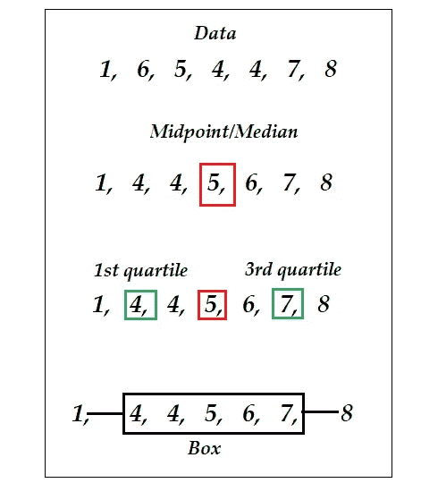
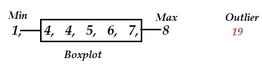
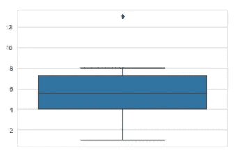
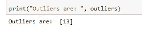

# 异常检测的箱线图

> 原文：<https://towardsdatascience.com/boxplot-for-anomaly-detection-9eac783382fd?source=collection_archive---------15----------------------->


照片由[晨酿](https://unsplash.com/@morningbrew?utm_source=medium&utm_medium=referral)在 [Unsplash](https://unsplash.com?utm_source=medium&utm_medium=referral) 拍摄

## 小型数据科学

在上一篇文章中，我写了关于使用简单的统计技术 Z-score 检测[异常值的文章。虽然这是一种创建筛选异常值的过滤器的简单方法，但还有一种更好的方法——使用箱线图。](/z-score-for-anomaly-detection-d98b0006f510)

箱线图是理解单变量和分类数据的分布、离散和变化的极好的统计技术——所有这些都在一个图中。

本文的目的是介绍 boxplot 作为异常值检测工具，我主要关注以下几个方面:

*   箱线图背后的统计直觉
*   如何在异常值检测中使用它们
*   一点点编程

## **箱线图:一种直觉**

箱线图是可视化数据相对于中心值的分布的有效工具。我真的不认为你需要了解很多细节，但下面是一个简单的描述，给一点它如何在引擎盖下工作的直觉。如果你没有 100%得到，也不要难过。

一张图胜过千言万语，所以不要用文字来描述这个概念，只需自上而下地看一下下图，就可以建立自己的直觉。这一切都始于一个由七个观察值组成的小数据集:1，6，5，4，4，7，8。



如果把数据从小到大重新排列，中点就是中位数。中位数将数据分成两半。每一半的中点称为“四分位数”。因此，我们得到两个四分位数，第一个四分位数是上半年的中点，第三个四分位数是下半年的中点。当您从顶部开始执行这些步骤时，在图的最后部分，您会看到一个箱线图及其包含的数据。

从统计学上来说，箱线图提供了几条信息，其中两个重要的信息是四分位数，由箱线图的两端表示。这两个四分位数之间的距离称为四分位数间距(IQR)。

在下面的盒状图中，盒子的长度是 IQR，最小和最大值由胡须表示。胡须通常延伸到盒子两侧的 1.5*IQR 距离。因此，这些 1.5*IQR 值之外的所有数据点都被标记为异常值。


与箱线图和异常值位置相关的统计概念

如果你有正确的直觉，理解一个“离群值”是如何发挥作用的并不困难。查看下图。



通常，最小值和最大值之外的任何数据点(由框两端的胡须表示)都被视为异常值。

## Python 中的示例

同样，如果你没有 100%理解统计概念，不要生气。我们可以在不了解很多机械原理的情况下驾驶汽车。但是我们必须知道如何开车！

就像知道如何开车一样，理解如何实现一个算法是业务中最重要的部分。下面是用 Python 构建编程直觉的一小段代码。

```
# import libraries
import numpy as np
import seaborn as sns
sns.set_style("whitegrid")# data
data = [1, 4, 4, 5, 6, 7, 8, 13]# create boxplot
sns.boxplot(y = data)
```



正如你所看到的，在这个箱线图中有一个异常值非常明显，我们可以很容易地过滤掉它。我们不知道异常值的确切值，但我们知道它大于 12。因此，让我们过滤那些异常值。

```
# filter outliers 
outliers = [i for i in data if i > 12]print("Outliers are: ", outliers)
```



现在，箱线图将 13 检测为数据集中的异常值。这个异常值是否是一个异常，这当然是一个不同的问题，只能使用领域知识和其他技术单独回答。

## 结论

本文的目的是给出 boxplot 背后的统计直觉，并通过一点编程示例演示它是如何工作的。箱线图的强大之处在于，您可以“看到”极值，并通过直观的解释来决定异常值的阈值。这里的演示基于单变量数据，但对于多变量数据集和分类值，它也可以以类似的方式工作。

如果你喜欢这篇文章，请随时在[媒体](https://medium.com/@mab.datasc)或[推特](https://twitter.com/DataEnthus)上关注我。