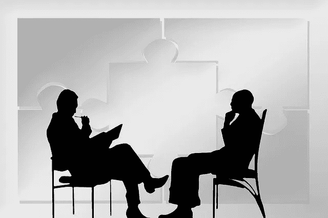
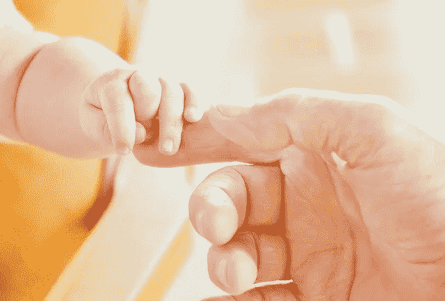

# 脑机接口——魔法师时代

> 原文：<https://towardsdatascience.com/brain-machine-interfaces-the-sorcerer-era-b19c2d5b6200?source=collection_archive---------76----------------------->

> 随着脑机接口在社会上的实现和商业化整合，不可能的事情很快就会变成可能——准备好称自己为巫师吧。

图片通过 [pixabay](https://pixabay.com/)

正如我在[的上一篇文章](https://medium.com/p/490c899be125/edit)中所讨论的那样，在我们人类大脑中集成计算机很可能在不久的或遥远的将来成为现实。如果这还不足以让你相信这项技术已经被讨论和研究了(查看 [Neuralink](https://www.neuralink.com/) 和 [NextMind](https://www.next-mind.com) )，那么让我们采取一种直观的、历史的方法。人类交流的历史始于公元前 500，000 年的语言起源。大约 30，000 年前，符号的发明彻底改变了交流。大约 20，000 年前，第一批[岩画](https://en.wikipedia.org/wiki/Petroglyph)被创造出来，不久之后[表意文字](https://en.wikipedia.org/wiki/Ideogram)和[象形文字](https://en.wikipedia.org/wiki/Pictogram)随之而来。然后又过了几千年，书面语言才成为现实。快进到几个世纪前，接下来出现了电、电报和留声机。不久之后，电话和移动电话出现了——现在你可以通过拇指与世界上的任何人保持全天候的联系。这些发展表明，通信在各个领域都得到了越来越多的改善——可访问性、易用性、可靠性和效率。我们如何才能提高更多？免提和无语音通信——脑对脑通信。这似乎是不可避免的。

对于这篇文章的其余部分，拿一杯水，沉浸在想象中。

最终，人们只能幻想戴上这种脑机接口设备后，我们的生活会有多大的改善。最终，就像移动电话一样，这项技术将如此融入我们的生活，以至于它几乎就像是我们人体的延伸。大多数人没有意识到的一件重要事情是，每个人本质上都已经是一个电子人。我们的手机一直握在手中，电脑触手可及，它们就像是我们身体和自我的一部分。我们的沟通将如何改善？在技术层面:

*   交流的速度会加快。为了将一个想法传递给另一个人，一个人必须将这个想法压缩成可解释的东西，然后压缩并重新组织成语言，然后通过他们选择的媒介(演讲、书面语言、文本)来翻译它。跳过这一切，直接分享想法，脑对脑。
*   通信带宽会增加。与其浪费时间用文字和图片来交流思想和观点，不如直接分享想法并立刻描绘出整个画面。
*   通信的准确性将是极好的。当前交流的一个典型的准确性障碍是语言障碍。忘记学习另一种复杂的语言，努力完善它的复杂性，只是分享你的想法或想法。此外，通过使用脑机接口，你可能真的能够“设身处地为他人着想”。

目前，脑机接口应用于认知或身体残疾的患者。这里有几个如何使用它的例子:

*   腰部以下瘫痪的患者可以利用脑机接口向有缺陷的身体部位发送刺激，最终能够再次行走。就像婴儿学习如何移动手指一样，身体残疾的病人可以重新学习如何重新激活受损的身体部位。
*   患有痴呆症的老年妇女可能能够修复她的神经退化，增强她的记忆，以记住她的孙子孙女。同样，患有神经疾病的患者将有机会获得神经增强，甚至刺激神经再生，以提高他们的思维能力。这尤其与经常经历神经退化的老年人相关。
*   通过使用脑机接口重新连接神经功能或屏蔽某些记忆，给受试者带来戏剧性应激障碍后的创伤经历可能能够神奇地忘记经历。

但是，正如上一篇文章所提到的，未来脑机接口的使用不会只延伸到认知或身体残疾的人。正如第一台计算机被设计用来计算火炮射表一样，它们被证明对无数的任务和需求都是有用的。这里是不可能变成可能的地方。

**用意念控制实物:**

图片来自 [pixabay](https://pixabay.com/)

首先，随着脑机接口成为一种社会规范，我们目前使用的许多设备(如果不是全部的话)可能有一天会连接到接口。以下是一些简单的脑机接口使用场景:

*   你早上醒来，闹钟响着‘醒醒！’你用意念让时钟在一瞬间关闭。糟糕…外面还是一片漆黑。想象一下灯打开了，加热器开始温暖房间，咖啡壶加热到想要的温度——继续想象一下，在你跳进去之前，淋浴器打开了。你吃了一顿健康的早餐，边喝咖啡边发邮件(用心地)。工作时间到了——告诉界面锁门关灯。走出家门，你就在上班的路上了。
*   你现在正开车去上班，但一些迷人的东西偷走了你的注意力。你就要撞上另一辆车了——用你的思维在瞬间改变方向。你刚刚用你的思想避免了一场车祸，避免了将危险的想法转化为实际行动所需的处理时间。
*   不要用手操作危险的机器(如伐木机)，直接用头脑操作。“思想到行动”技术的安全含义是巨大的。
*   吉他弹得很差？用你的思想去演奏它。音乐创作不仅仅是由想法决定的——它需要身心的联系来将想法转化为声音。任何人都可以成为自己的艺术家，通过脑机接口，创造力将得到极大的增强。

**储存**

图片来自 [pixabay](https://pixabay.com/)

如前所述，我们储存信息的能力对我们学习、成就和进步的方式有着深远的影响。以下是一些例子:

*   当你小睡一会儿的时候，写下你一直想开始写的文章。一旦你睡着了，你所有的编辑和更新都会以类似 Google Drive 的方式保存下来——全部保存在[云](https://www.infoworld.com/article/2683784/what-is-cloud-computing.html)上。
*   我们的大脑受限于储存信息的能力。想学习多门课程，但对需要记忆和学习的大量信息感到气馁？通过云端记录下来，交错在你的界面里。你想获得以后开发的信息和技能——进入界面，让它实时地用你想要的信息和技能替换不相关的信息和技能。只要有时间和毅力，任何人都可以成为 [**博学**](https://en.wikipedia.org/wiki/Renaissance_Man) 。
*   *这就是可怕的地方。*在前面的示例中，存储委托给了一个人。但是如果社会可以集体储存然后分享它的经验和知识会怎么样呢？每个人都可以访问(如果不是所有的东西，肯定是很多)。一个集体建造、清洗和改良的大脑。

**安全:**

图片来自 [pixabay](https://pixabay.com/)

这项技术的安全含义令人震惊。下面是一些基本的例子:

*   八月下旬，你的车在亚利桑那州中部抛锚了。气温超过了华氏 115 度。你手机没电了，你没水了，很可能很长时间都不会有其他人开车经过。使用你的界面拨打紧急求助电话，自救。
*   采石场工人刚刚经历了一场事故。其中一名工人不小心将一块沉重的花岗岩石头掉在了他们的一条腿上，无法触及他们的无线电——他可以向他的同事发送紧急信息，告知他的位置和状况。
*   一天晚上，天很黑，你在未铺砌的人行道上摔倒，不省人事，没有明显的呼救方式——界面正在跟踪你的神经状况，并向当地当局发出警报。你能活到明天。

**心与心的交流:**

图像通过 [pixabay](https://pixabay.com/)

心灵对心灵的交流——换句话说，心灵感应。人与人之间直接分享思想和观点的能力似乎是不可能的。脑机接口使这成为现实，极大地改善了我们交谈、合作和努力实现共同目标的方式。如果进步像乌龟一样移动，它现在可以像猎豹一样移动。

*   向某人解释一个困难的概念变得容易多了。当一个人参与关于抽象或概念性想法的对话时，通常很难将这些想法转化为另一方可以理解的语言。直接分享复杂的想法和想法，而无需将它们复杂而困难地翻译成语言。
*   小组会议看起来会有很大不同。“头脑风暴”将有一个新的、更直观的含义。人们将能够更有效、更准确地分享问题、想法和解决方案。更好的协作，更多的创新——进步。
*   你在疫情——法律强制要求你呆在家里，不见任何人。没问题—与您所爱的人连接到云，进行正常的对话。
*   你和你的朋友在一起。他们讨厌你发短信告诉你不要打电话。不能再发短信了？用你的思想给某人发送信息或想法。进行充分的交谈，没有打字的负担，也不会因为某人“老是打电话”而让他生气。

**感官和情感交流:**

图片来自 [pixabay](https://pixabay.com/)

这种类型的交流通常是最困难的。有人可能会说他们知道你在某个时刻的感受，但他们通常无法直接体验到。

如果之前事情看起来很不稳定，你就要被骗了。

有哪些脑机接口可以彻底改变这种交流方式的例子？

*   你没有时间和你的朋友去海滩，因为你必须完成那个项目。你确实有 30 分钟的休息时间，所以你利用你朋友的感官输入，通过她来替代生活。你可以闻到海浪撞击的盐味，感受到温暖的沙滩，听到放松的音乐。享受“海滩日”的新方式。
*   全国爆发了大规模抗议活动。抗议者要求所有种族之间的平等权利——虽然你在历史上被认为存在于特权群体中，但你可以挖掘那些破碎和痛苦的人的感觉，以了解那些需要帮助的人的观点。一个因同理心而强化的新世界。
*   错过了你想去的音乐会？也许你仍然可以购买数字门票，让自己沉浸在真实的体验中——听声音、感受人群、可视化等等。
*   付费观看湖人对凯尔特人的比赛。观看勒布朗詹姆斯在杰森·塔图姆上空的三分投篮。
*   还记得《T4》黑镜集里那个可以直接体验病人症状的医生吗？在那集里，他可以很容易地诊断出病人的问题，即使他自己也能体验到症状。没错。

我想你明白了。可能性和潜力的清单是不可思议的。

**为什么这很重要？**

脑机接口在人类智能和机器智能之间架起了一座桥梁。随着人工智能日益融入社会，我们最终可能会融合成一个电子人，并利用技术为我们服务，这似乎是相当自然的。那么，为什么不把这项技术直接集成到我们的大脑中呢？通信方法和技术的历史发展清楚地表明，下一步是脑对脑的通信——在不久的将来，我们可能会体验到它的超能力。