# 分解 R 中的地理编码:完全指南

> 原文：<https://towardsdatascience.com/breaking-down-geocoding-in-r-a-complete-guide-1d0f8acd0d4b?source=collection_archive---------4----------------------->

## 可视化|地图

## 如何使用 API 找到您感兴趣的地方，并在地图上可视化其位置

如果您想知道如何构建类似于您在应用程序中经常看到的地图，这可能是一个好的起点。在本教程中，我们将介绍如何根据描述或坐标找到一个地方，以及如何根据这些信息构建一个简单的地图。

请注意，本文假设读者对 R 语言有一定的了解:数据结构、操作符、条件语句、函数等等。本教程的所有代码都可以在 [GitHub](https://github.com/s-titoo/Geocoding-in-R) 上找到。

所以，让我们开始吧！


照片由 [Julentto 摄影](https://unsplash.com/@julensan09?utm_source=medium&utm_medium=referral)在 [Unsplash](https://unsplash.com?utm_source=medium&utm_medium=referral)

# **什么是地理编码？**

> **地理编码**是将一个地方的地址或名称转换成其坐标的过程。**反向地理编码**执行相反的任务:根据一个地方的坐标返回该地方的地址或描述。

仅此而已，就这么简单。因此，通过使用地理编码，您必须能够说在法国巴黎的*埃菲尔铁塔*可以在(48.858568，2.294513)纬度、经度坐标找到。在你的地图应用上输入(41.403770，2.174379)，你将到达西班牙巴塞罗那的*圣家族教堂*罗马天主教堂。你可以自己核实——只需在谷歌地图上输入这些信息。

# 有哪些地理编码工具可用？

当谈到在线免费地理编码工具时，其中一个选项是专门的网站。比如上面提到的[谷歌地图](https://www.google.com/maps)。稍微搜索一下，就能找到其他的。

如果你只需要找到几个地址，所有这些都是非常好的工具。但是想象一下有几百个呢？那成千上万呢？这项任务很快变得相当令人头痛。

对于批量请求，API 是更合适的选择。而这里最明显的选择大概就是[谷歌地图 API](https://developers.google.com/maps/documentation) 。为了能够使用谷歌服务，你需要在谷歌云平台上创建帐户，并获得你的 API 密钥。谷歌在他们的网站上提供了关于如何做的详细的[说明](https://developers.google.com/maps/gmp-get-started)。

另一个选择是使用来自 [OpenStreetMap](http://www.openstreetmap.org) 的一个名为[nomim](http://nominatim.org/release-docs/latest/api/Overview/)的公共 API。OpenStreetMap 是一个合作项目，其目标是为公众创建一个免费的地图服务。正如其网站所说:

> OpenStreetMap 是由一个地图绘制者社区构建的，该社区贡献并维护世界各地的道路、小径、咖啡馆、火车站等更多信息。

基本上，nomist 是一个在 OpenStreetMap 网站上进行搜索的工具。与谷歌地图不同，Nominatim 不需要你注册任何账户，也不需要你获得一个 API 密匙。但如果你想在应用程序中使用它的服务，你需要提供一个电子邮件地址，这样你的应用程序的活动就可以被跟踪，并在需要时受到限制——OSM 服务器的能力是有限的。

# 法律考虑

你可能会奇怪，如果 Google 提供了类似的功能，为什么我首先要告诉你关于 Nominatim API 的事情。你的第一个猜测可能是成本——与 OpenStreetMap 基金会不同，谷歌是一家私人公司，对其服务收费。这是事实，但只是部分事实。

首先，如果你现在在[谷歌云平台](https://cloud.google.com/)上注册，你将获得 12 个月的免费试用，你的账户上有 300 美元的信用来了解它的功能。其次，即使在那之后，谷歌也免费提供一些最常用服务的有限访问权限，作为[永远免费](https://cloud.google.com/free/docs/gcp-free-tier)套餐的一部分。如果你的唯一目的是学习，那么这个包里的限制就足够了。要了解更多关于谷歌地图 API 定价的信息，请访问谷歌的帮助页面。

那么，你会问我什么问题？谷歌地图平台[服务条款](https://cloud.google.com/maps-platform/terms)，其中声明:

> 3.2.4 对滥用服务的限制。
> **【一】** **无刮。**客户不得提取、导出或以其他方式抓取谷歌地图内容用于服务之外。
> **(c)不从谷歌地图内容创建内容。**
> **【e】非谷歌地图不使用。**

我不是法律界人士，不知道谷歌如何对待非商业目的使用其服务。但是我没有在这些服务条款中看到任何条款说明上述限制只适用于商业用途。所以，在你决定在你的应用中使用谷歌地图 API 之前，请注意这些限制。

与谷歌地图不同，OpenStreetMap 数据是在开放数据共享开放数据库许可证(ODbL)下获得许可的。正如作者自己所说，下面是 ODbL 1.0 的[人类可读摘要](https://opendatacommons.org/licenses/odbl/summary/index.html) :

> 您可以自由:
> ***分享:**复制、分发和使用数据库。
> * **创作:**从数据库中产生作品。
> * **适应:**对数据库进行修改、改造和建设。
> 
> 只要你:
> * **属性:**给原数据库做参考。
> ***Share-like:**在相同的许可下分发由原数据库改编的数据库。
> * **保持开放:**向公众开放对适配数据库的访问。

一个[全长许可](https://www.opendatacommons.org/licenses/odbl/1.0/)，如果你想看的话，可以在开放数据共享网站上找到。

说了这么多，现在让我们继续编码！


照片由[福蒂斯·福托普洛斯](https://unsplash.com/@ffstop?utm_source=medium&utm_medium=referral)在 [Unsplash](https://unsplash.com?utm_source=medium&utm_medium=referral) 拍摄

# 安装软件包

让我们先安装并加载本教程中用到的所有包，所以以后不用担心。每个包的用途将在文章的相应部分描述。另外请注意，我们使用的是适用于 Windows 的软件版本 R 3.6.2。

```
***# install packages***
install.packages("ggmap")
install.packages("tmaptools")
install.packages("RCurl")
install.packages("jsonlite")
install.packages("tidyverse")
install.packages("leaflet")***# load packages***
library(ggmap)
library(tmaptools)
library(RCurl)
library(jsonlite)
library(tidyverse)
library(leaflet)
```

# 使用 R 包进行地理编码

R 社区创建了几个包，可以用来访问 Google Maps 和 nomist API。让我们看看它们。

## 包 ggmap

第一个包叫做 [ggmap](https://cran.r-project.org/web/packages/ggmap/ggmap.pdf) ，它允许你连接到谷歌地图 API。在开始使用这个包之前，您需要向 R 提供您的 API 密钥。

```
***# replace "api_key" with your API key*** register_google(key = api_key)
```

现在让我们在 12 家伦敦酒吧的样本上使用这个包中的`geocode`函数来演示它是如何工作的。该函数接受以下任一参数作为其`output`参数:

*   *latlon* —经纬度；
*   *latlona* —以上所有加地址；
*   *更多* —以上所有加地点的类型和地理界限；
*   *全部* —以上全部加上一些附加信息。

每个选项对应于生成的信息类型。一般来说，我们不需要比*更多的*选项提供的信息。

运行 ggmap 地理编码功能

让我们看看我们的结果。正如你所看到的，我们有一个酒吧的名字，它的坐标，地点的类型，结果的精度( *rooftop* 意味着谷歌能够找到一个具体的建筑)和它的地址。

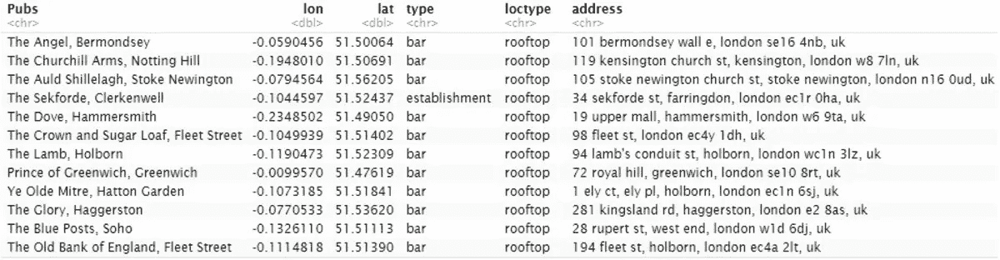

运行 ggmap 地理编码功能的结果

现在，让我们用刚刚找到的坐标对它们所属的地方进行反向地理编码。

`revgeocode`函数允许这样做。它需要两个参数:`location` —经度/纬度的数值向量和`output` —或者*地址*或者*全部*。选项 *all* for `output`返回的信息比我们需要的多得多，所以让我们坚持使用*地址*。

这次我们将把结果存储在一个列表中，而不是数据框中。这个列表的每个元素将包含另一个列表，其中包含关于酒吧的名称、坐标和地址的信息。

运行 ggmap 反向地理编码功能

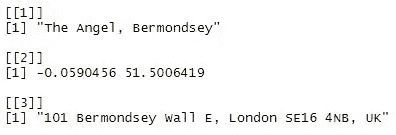

运行 ggmap 反向地理编码功能的结果

ggmap 到此为止。现在让我们进入下一个项目。

## 打包 tmaptools

tmaptools 是一个包，它提供了一套读取和处理空间数据的工具。它促进了另一个名为 [tmap](https://cran.r-project.org/web/packages/tmap/tmap.pdf) 的 R 包的功能，该包是为可视化专题地图而构建的。许多 tmaptools 函数依赖于 Nominatim API。

现在，让我们试着从 tmaptools 获得与使用 ggmap 提取的信息相同的信息。我不得不稍微修改一些搜索请求，因为 Nominatim 无法找到基于它的位置。尽管我尽了最大努力，还是找不到其中一家酒吧——荣耀酒吧。因此，请注意，不同的服务提供商的数据质量和完整性可能会有所不同。

运行 tmaptools 地理编码功能

我们在最终表中只包括坐标和完整地址。这是它的样子。

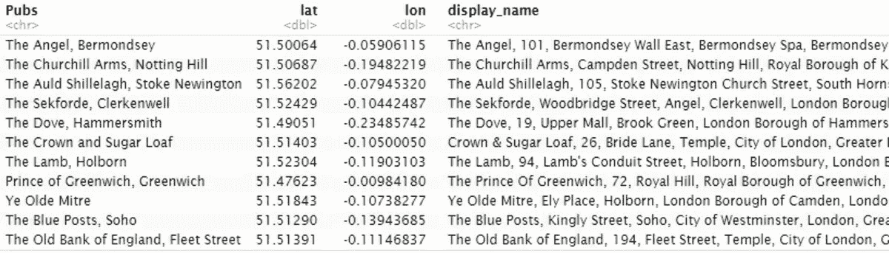

运行 tmaptools 地理编码函数的结果

现在，是反向地理编码的时候了。在我们的输出中，我们将显示与来自 ggmap 的反向地理编码请求完全相同的信息。

运行 tmaptools 反向地理编码功能

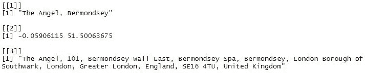

运行 tmaptools 反向地理编码功能的结果

这是我们讨论 R 地理编码包的最后一段代码。在这里你可以读完这篇文章，然后自己练习上面描述的一些技巧。除非…除非你想了解更多！如果是这样，那我们继续！


由[马丁·亚当斯](https://unsplash.com/@martinadams?utm_source=medium&utm_medium=referral)在 [Unsplash](https://unsplash.com?utm_source=medium&utm_medium=referral) 上拍摄的照片

# 使用 API 进行地理编码

使用包是一种非常方便快捷的完成事情的方式。对于您想要完成的大多数任务，这些包提供的功能已经足够了。然而，如果你需要一些额外的东西，或者你对其他 API 函数感兴趣，或者你只是想学习如何使用 API，你需要去 Google/nomist 帮助页面做一些阅读。或者在网上搜索一些像这样的视频/教程，提供简短的总结。或者更好——双管齐下。

# 谷歌地图 API

看了 ggmap 包之后，现在让我们尝试直接使用 Google Maps API 来获取这个地方的位置、地址以及它的电话号码和网站。为了完成这个任务，我们需要[地理编码 API](https://developers.google.com/maps/documentation/geocoding/start) 和[位置 API](https://developers.google.com/places/web-service/intro) 。

## 地理编码 API

地理编码 API 是一种提供地址和地点的地理编码和反向地理编码功能的服务。您可以通过 web 浏览器发送 HTTP 请求来访问地理编码 API，并获得 JSON 或 XML 格式的响应。虽然，在我们的例子中，我们将从 r。

地理编码 API 请求采用以下格式。

```
***# format***
[https://maps.googleapis.com/maps/api/geocode/outputFormat?parameters](https://maps.googleapis.com/maps/api/geocode/outputFormat?parameters)***# geocoding example***
[https://maps.googleapis.com/maps/api/geocode/json?address=The+Churchill+Arms,+Notting+Hill&key=YOUR_API_KEY](https://maps.googleapis.com/maps/api/geocode/json?address=The+Churchill+Arms,+Notting+Hill&key=YOUR_API_KEY)***# reverse geocoding example***
[https://maps.googleapis.com/maps/api/geocode/json?latlng=51.5069117,-0.194801&key=YOUR_API_KEY](https://maps.googleapis.com/maps/api/geocode/json?latlng=51.5069117,-0.194801&key=YOUR_API_KEY)
```

因此，您发送的 web 请求由几个部分组成 API url 后跟`outputFormat` (json 或 xml)和列表`parameters`。`outputFormat`和`parameters`之间隔着一个问号(？)和`parameters`本身被一个&符号(&)彼此分开。

请求所需的参数包括:

*   对于地理编码:`address` —地址或地名形式的搜索查询和`key` — API 关键字；
*   对于反向地理编码:`latlng` —您搜索的地点的纬度和经度，以及`key` — API 关键字。

我们不会在查询中使用任何可选参数。

你可以在这里和这里阅读更多关于如何构造 API 请求[的信息。](https://developers.google.com/maps/documentation/geocoding/intro#GeocodingRequests)

值得一提的是，如果你正在构建自己的应用程序，需要实时访问谷歌地图服务，你可以检查谷歌客户端( [JavaScript](https://developers.google.com/maps/documentation/javascript/geocoding) )或服务器端( [Java，Python，Go，Node.js](https://developers.google.com/maps/documentation/geocoding/client-library) ) API。

## 地点 API

如果您不想只局限于地点的地址和坐标，您可以使用 Places API。例如，要查找某个地方的电话号码和网址，我们需要使用[地点搜索](https://developers.google.com/places/web-service/search) 来获取[地点 ID](https://developers.google.com/places/web-service/place-id) ，并在以后使用它从[地点详细信息](https://developers.google.com/places/web-service/details)中检索该信息。

在进行 API 调用时，确保提供您想要提取的`fields`的列表。否则，谷歌将发送所有这些邮件，并向您收取相应费用。在我们的情况下，这并不重要，因为我们不会超过免费限额，但是如果您计划 **对大量请求使用 API，您可能会因此而被收费**。

对于 Place Search/Place Details API 调用，您还需要提供`outputFormat` (json 或 xml)，后跟一个列表`parameters`。

对于地点搜索，所需的参数包括:`input` —姓名、地址或电话号码(坐标不起作用)；`inputtype` — *文本查询*或*电话号码*；`key` — API 键。

对于地点细节，需要的参数是:`place_id` —可以通过使用地点搜索找到；`key` — API 键。

对于地点搜索和地点详细信息，我们将使用可选参数`fields`——我们希望 Google 返回的附加信息的逗号分隔列表。您可以在前面提供的相应帮助页面上阅读有关可能选项的更多信息。但是在我们的例子中，我们只需要来自地点搜索的字段 *place_id* 和来自地点详细信息的 *formatted_phone_number* 加上*网站*。**请记得阅读有关账单的信息！**

API 调用的格式如下所示。

```
***# PLACE SEARCH******# format***
[https://maps.googleapis.com/maps/api/place/findplacefromtext/outputFormat?parameters](https://maps.googleapis.com/maps/api/place/findplacefromtext/outputFormat?parameters)***# example***
[https://maps.googleapis.com/maps/api/place/findplacefromtext/json?input=The+Churchill+Arms,+Notting+Hill&inputtype=textquery&fields=photos,formatted_address,name,place_id&key=YOUR_API_KEY](https://maps.googleapis.com/maps/api/place/findplacefromtext/json?input=The+Churchill+Arms,+Notting+Hill&inputtype=textquery&fields=photos,formatted_address,name,place_id&key=YOUR_API_KEY)***# PLACE DETAILS******# format***
[https://maps.googleapis.com/maps/api/place/details/outputFormat?parameters](https://maps.googleapis.com/maps/api/place/details/outputFormat?parameters)***# example***
[https://maps.googleapis.com/maps/api/place/details/json?place_id=ChIJGTDVMfoPdkgROs9QO9Kgmjc&fields=formatted_phone_number,website&key=YOUR_API_KEY](https://maps.googleapis.com/maps/api/place/details/json?place_id=ChIJGTDVMfoPdkgROs9QO9Kgmjc&fields=formatted_phone_number,website&key=YOUR_API_KEY)
```

同样，如果您考虑构建一个实际的应用程序，那么值得看看用于服务器端应用程序的 [Java/Python/Go/Node.js](https://developers.google.com/places/web-service/client-library) 客户端或用于 Android 的[Places SDK](https://developers.google.com/places/android-sdk/intro)、用于 iOS 的[Places SDK](https://developers.google.com/places/ios-sdk/intro)和用于客户端应用程序的 [Places Library、Maps JavaScript API](https://developers.google.com/maps/documentation/javascript/places) 。

# 使用谷歌地图 API 进行地理编码

说了这么多，现在让我们来编写代码本身。

我们的代码由七个函数组成:

*   一个主要功能；
*   用于生成 API 调用的三个函数；
*   从 JSON 输出中提取数据的三个函数。

我们的主函数有三个参数:

*   `search_query` —搜索请求(地址或地点)；
*   `fields` —提取信息(*坐标*，*地址*，*联系人*或*全部*)；
*   `key` —谷歌地图的 API 键。

第一个和最后一个是必需的，第二个是可选的，默认*坐标*。

这些参数可以是以下类型:

*   `search_query` —字符串、字符向量、字符列表、一维矩阵或带有字符串数据的数据帧；
*   `fields` —字符串、字符向量、字符列表；
*   `key` —弦。

根据`fields`的值，该函数返回一个数据帧，其中包含:

*   *坐标* —经纬度；
*   *地址* —完整的地址和城市；
*   *联系人* —电话号码和网址；
*   *全部* —以上全部。

现在让我们来详细看看这个函数的每个组件。

## 正在生成 API 调用

一旦熟悉了我前面提供的信息，API 调用函数就非常简单了。

它分三步工作:

1.将搜索查询转换为列表。
2。对搜索查询进行百分比编码。
3。构造 API 调用字符串。

第一步是必需的，因为处理公共数据结构(在我们的例子中是一个列表)总是更容易。对于百分比编码，我们使用 [RCurl](https://cran.r-project.org/web/packages/RCurl/RCurl.pdf) 包中的`URLencode`函数。如果你不知道它是什么，访问这个[页面](https://developers.google.com/maps/documentation/geocoding/web-service-best-practices#BuildingURLs)有详细的解释。

谷歌地图 API 调用函数

## 从 JSON 中提取数据

Google 可以返回两种格式的数据——JSON 和 XML。在我们的例子中，我们使用 JSON 输出。这个输出需要转换成 R 对象，所以我们可以很容易地操作它包含的数据。一旦完成，我们的任务就是从格式化的列表中挑选我们需要的元素。

原始 JSON 输出及其格式化版本如下所示。

Google Maps API 的原始 JSON 输出

Google Maps API 的格式化 JSON 输出

那么，我们的函数是如何工作的呢？首先，使用 [jsonlite](https://cran.r-project.org/web/packages/jsonlite/jsonlite.pdf) 包中的`fromJSON`函数将 JSON 输出转换成 R 列表。之后，我们的函数检查 API 调用是否成功(`status = "OK"`)，如果成功，它从列表中只提取我们需要的元素来构建最终的数据帧。检索一个*城市*名称有点棘手，因为首先我们需要找出它存储在`address_components`中的序列号。对于*联系人*来说，将所有`NULL`替换为`NA`也很重要，如果谷歌没有关于电话号码或网站的信息，就会出现所有的`NULL`，这样我们在生成最终数据帧时就不会出错。

将 JSON 输出转换成 R 对象的函数

## 主要功能

我们已经提供了我们的主要功能的描述。现在让我们解释一下它是如何工作的。

首先，该函数从谷歌地图获取坐标和地址。它检查用户是否真的想要这个信息(即`fields`参数中存在*坐标*和/或*地址*)，如果是，它调用`url_google_geocoding`函数来构建 API 调用，并从 RCurl 包中调用`getURL`函数来实际创建它。

在我们收到 Google 的响应后，我们需要使用`get_geodata_from_json_google`函数将其从 JSON 格式转换成 R 列表。一旦完成，结果将存储在`geodata_df`数据帧中。

之后，对联系人重复相同的程序(即*电话号码*和*网站*)。仅此而已。

这是代码。

使用 Google Maps API 进行地理编码的主要功能

现在，我们终于可以调用我们的函数并检查结果了。

```
***# replace "api_key" with your API key***
pubs_google <- geocode_google(pubs, "all", api_key)***# check results***
pubs_google
```

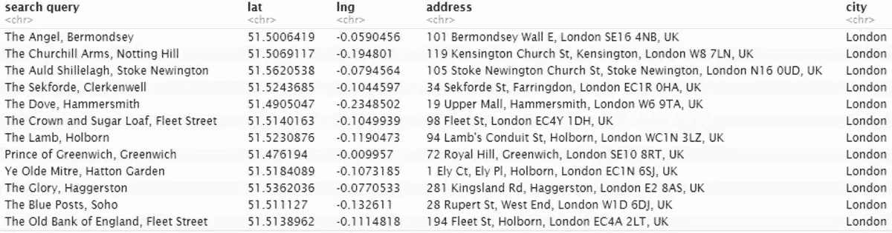

运行地理编码功能的结果—Google Maps API[第 1-5 列]

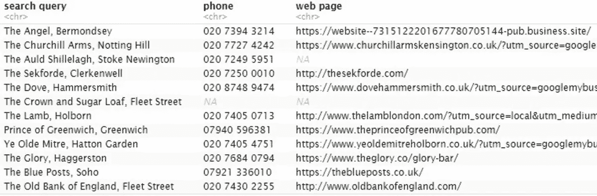

运行地理编码功能的结果—Google Maps API[第 6–7 列]

# 使用谷歌地图 API 进行反向地理编码

下面是几乎相同的功能，但反向地理编码。这一次，它只返回基于地点坐标的地址。我在这里没有给出任何详细的解释，因为到现在为止，你已经能够自己理解代码了。

除了`key`参数，主函数还需要`coordinates`作为输入，可以是:

*   带有纬度和经度的向量(单个请求)；
*   纬度/经度向量的列表；
*   有两列的矩阵——纬度和经度；
*   包含两列(纬度和经度)的数据框。

该函数接受数值和字符串值作为`coordinates`。

请注意，每次我们调用时，Google 可能会返回几个结果，但我们只使用第一个结果— `results[[1]]` —它对应于 Google 认为的最佳匹配。

另外，对要从 R 列表中提取的元素的硬编码引用也要小心。例如，在我们的例子中，第 5 个元素`$address_components[[5]]$long_name`可能指的是城市—伦敦(`$address_components$types = "postal_town"`)、二级行政区—大伦敦(`$address_components$types = "administrative_area_level_2"`)或一级行政区—英国(`$address_components$types = "administrative_area_level_1"`)。因此，在这种情况下，我们必须遍历 R 列表，找到我们需要的信息的`types`，并提取相应的`long_name`。

反向地理编码功能(谷歌地图 API)

下面是在伦敦酒吧样本上运行这个函数的结果，我们之前从同一个 API 获得了这些酒吧的坐标。

```
***# extract coordinates from pubs_google***
pubs_google_crd <- pubs_google[ , c("lat", "lng")]***# replace "api_key" with your API key***
pubs_rev_google <- rev_geocode_google(pubs_google_crd, api_key)***# check results***
pubs_rev_google <- cbind(pubs_df, pubs_rev_google)
pubs_rev_google
```

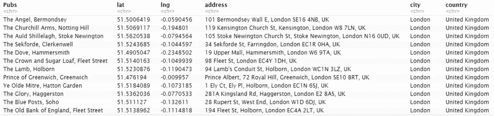

运行反向地理编码功能的结果— Google Maps API

# 命名 API

现在让我们把注意力转向 OSM 的提名 API。

nomim[search](http://nominatim.org/release-docs/latest/api/Search/)API 允许您根据描述或地址查找特定位置。它支持结构化请求和自由文本请求。搜索查询还可以包含对应于特定 OpenStreetMap 标签的[特殊短语](https://wiki.openstreetmap.org/wiki/Nominatim/Special_Phrases/EN)、**、**。在我们的例子中，这个特殊短语是一个“*pub”*。

[反向](http://nominatim.org/release-docs/latest/api/Reverse/)地理编码 API 从一个地方的纬度和经度生成一个地址。

API 调用的格式如下所示。

```
***# geocoding format*** [https://nominatim.openstreetmap.org/search/](https://nominatim.openstreetmap.org/search/)<query>?<params>***# geocoding example*** [https://nominatim.openstreetmap.org/search/The%20Churchill%20Arms,%20Notting%20Hill?format=json&polygon=1&addressdetails=1](https://nominatim.openstreetmap.org/search/The%20Churchill%20Arms,%20Notting%20Hill?format=json&polygon=1&addressdetails=1)***# reverse geocoding format*** [https://nominatim.openstreetmap.org/reverse](https://nominatim.openstreetmap.org/reverse)?<query>***# reverse geocoding example*** [https://nominatim.openstreetmap.org/reverse?format=json&lat=51.5068722&lon=-0.1948221&zoom=18&addressdetails=1](https://nominatim.openstreetmap.org/reverse?format=json&lat=51.5068722&lon=-0.1948221&zoom=18&addressdetails=1)
```

一些参数对于地理编码和反向地理编码调用都是通用的:

*   `format`=[html | XML | JSON | JSON v2 | geo JSON | geocode JSON]—输出格式；
*   `addressdetails` = [0|1] —将地址分解成元素；
*   `extratags` = [0|1] —附加信息(维基页面、开放时间等)。);
*   `accept-language` —以何种语言显示搜索结果(English = en)；
*   `email` —除非您提供一个允许跟踪您活动的电子邮件地址，否则您将无法在您的应用中使用 API(会出现错误消息)。

有些参数是每个 API 特有的。

搜索:

*   `query` —自由文本或地址；
*   `countrycodes` —通过 [ISO 3166-1 alpha-2](https://en.wikipedia.org/wiki/ISO_3166-1_alpha-2) 国家代码(英国= gb)限制搜索；
*   `limit` —限制返回结果的数量。

反转:

*   `query` = lat，lon — in [WGS 84](https://en.wikipedia.org/wiki/World_Geodetic_System) 格式；
*   `namedetails` = [0|1] —在结果中包含替代名称列表；
*   `zoom`=[0–18]—地址所需的详细程度(默认值为 18，即特定的建筑物)。

`query`、`format`和`email`为必选参数，其余为可选参数。我们不会在我们的函数中使用`namedetails`参数，也不会改变`zoom`参数的默认值——我提供它们只是供您参考。

这里一个重要的方面是标签[的使用，它指向 OpenStreeMap mappers 提供的特定信息。这些标签中有一些是重复的(像](https://wiki.openstreetmap.org/wiki/Tags)[电子邮件](https://wiki.openstreetmap.org/wiki/Key:email)和[电话](https://wiki.openstreetmap.org/wiki/Key:phone)和[网站](https://wiki.openstreetmap.org/wiki/Key:website)与[联系人](https://wiki.openstreetmap.org/wiki/Key:contact)名称空间中的类似标签)，所以不同的人可能会用不同的标签来标记同一类信息，你需要在你的应用程序中说明这一点。

还有一些[要求](https://operations.osmfoundation.org/policies/nominatim/)，您必须遵守这些要求才能使用提名服务:

*   限制同一网站/应用程序发送的请求数量——每个应用程序每秒一个请求；
*   不鼓励对大量数据进行批量地理编码，但允许较小的一次性任务(我们的例子)；
*   搜索结果必须被缓存，所以不要多次发送相同的请求。

# 使用命名 API 进行地理编码

下面的函数复制了我们为 Google Maps API 构建的函数，所以我们不会详细描述它。

唯一显著的区别是我们添加了两个额外的可选参数:`country`，它对应于 API 调用的`countrycodes`参数，用于将您的搜索限制在某些县(默认情况下不使用)和`language`，它对应于`accept-language`参数，允许您选择显示结果的语言(默认为英语)。两个参数都需要以字符串的形式提供:`country`作为逗号分隔的代码列表(例如“gb，dr，fr”)，而`language`作为单个值(例如“es”)。

地理编码功能(命名 API)

让我们看看运行这个函数的结果。

```
***# replace "email" with your email address*** pubs_nominatim <- geocode_nominatim(pubs_m, country = "gb", fields = "all", email = email)***# let's now see the results***
pubs_nominatim[, c(1:4)]
pubs_nominatim[, c(1, 5:10)]
pubs_nominatim[, c(1, 11:13)]
pubs_nominatim[, c(1, 14:17)]
```

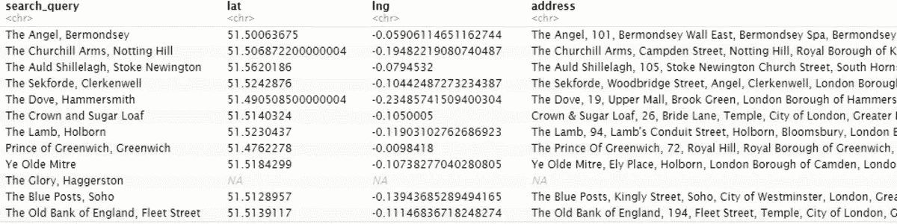

运行地理编码函数的结果-命名 API[第 1–4 列]

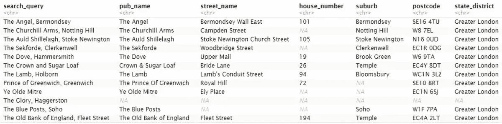

运行地理编码函数的结果-命名 API[第 5–10 列]

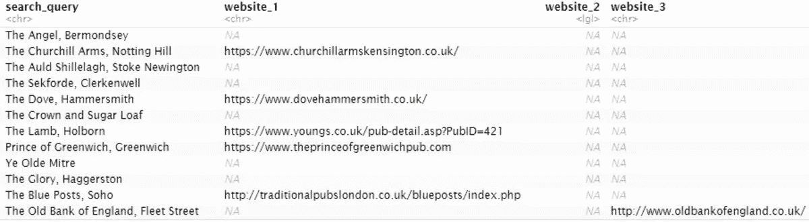

运行地理编码函数的结果-命名 API[第 11–13 列]

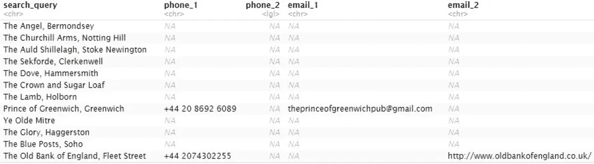

运行地理编码函数的结果-命名 API[第 14–17 列]

# 使用命名 API 进行反向地理编码

类似地，下面的反向地理编码函数在很大程度上类似于我们为 Google Maps API 构建的函数。

反向地理编码功能(命名 API)

下面是在 12 家伦敦酒吧的样本上运行这个函数的结果。

```
***# extract coordinates from geocoding results*** pubs_nominatim_crd <- pubs_nominatim[, c("lat", "lng")]***# replace "email" with your email address*** pubs_rev_nominatim <- rev_geocode_nominatim(pubs_nominatim_crd, email = email)
pubs_rev_nominatim <- cbind(pubs_m_df, pubs_rev_nominatim)***# let's now see the results***
pubs_rev_nominatim[, 1:4]
pubs_rev_nominatim[, c(1, 5:11)]
```

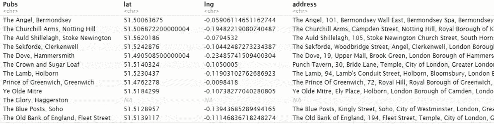

运行地理编码反向函数-命名 API 的结果[第 1–4 列]

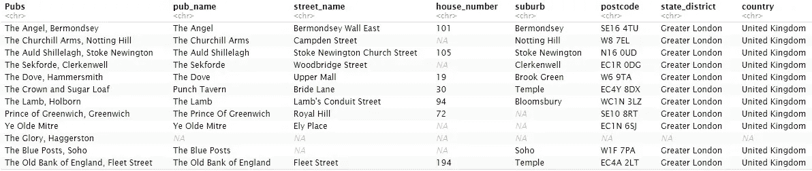

运行地理编码反向函数-命名 API 的结果[第 5–11 列]

# 使用传单库构建地图

普遍的事实是，只有当培训材料辅以实际应用的例子时，才能引起对该主题的真正兴趣。我向你们承诺过，基于我们从 API 获得的信息，我们将建立一个交互式地图，我打算兑现这个承诺。

轻松构建地图的方法之一是使用 JavaScript [传单](https://leafletjs.com/)库。传单在其网站上被描述为:*“[……]领先的移动友好互动地图开源 JavaScript 库。”许多大型科技公司、一些媒体甚至政府机构都在使用它:GitHub、脸书、Pinterest、金融时报、华盛顿邮报、Data.gov、欧盟委员会都在使用它。在我们的例子中，我们将依赖 RStudio 的[传单](https://rstudio.github.io/leaflet/)包，这使得在 r 中集成和控制传单地图变得很容易。*

我不会在这里描述这个伟大工具提供的所有特性，因为这是另一篇完整文章的主题。相反，让我们把注意力集中在最重要的事情上。

因此，在传单中创建地图的过程包括三个基本步骤:

1.  创建地图微件。
2.  向地图添加图层。
3.  显示地图。

微件本质上是地图的主干或容器。

图层允许您向地图添加以下元素:

*   [图块](https://rstudio.github.io/leaflet/basemaps.html) —本质上是地图的“皮肤”，它定义了地图的外观和细节层次。更多关于[平铺地图](https://en.wikipedia.org/wiki/Tiled_web_map)；
*   [标记](https://rstudio.github.io/leaflet/markers.html) —可用于显示地图上的特定位置；
*   [弹出窗口和标注](https://rstudio.github.io/leaflet/popups.html) —可用于向地图添加标注。例如，显示与某个位置相关联的地址或联系信息；
*   [多边形](https://rstudio.github.io/leaflet/shapes.html)——特定的区域或面积。例如，一个州内的一个区；
*   [图例](https://rstudio.github.io/leaflet/legends.html)等。

对于我们的地图，我们将使用 OpenStreetMap 中的图块(传单的默认图块),并根据我们从 Nominatim 中提取的坐标绘制酒吧的位置。此外，我们将在标记弹出窗口中添加关于酒吧名称、地址和联系方式的信息。由于 Nominatim 没有返回每个酒吧的详细信息，我自己搜索了这些信息。我们没有在我们的可视化中使用任何多边形或图例，我添加的链接仅供参考。

因此，在我们继续之前，让我们做一些数据准备。

构建地图的数据准备

现在我们可以继续构建地图本身。

首先，让我们准备要在弹出消息中显示的文本:酒吧的名称、地址和电话号码。网站将不会单独显示，而是作为一个超链接添加到酒吧的名称。我们将使用一些 html 来以我们想要的格式呈现我们的文本。这里有一个提示。仅当您单击弹出消息所附着的对象时，才会显示弹出消息。如果您想在光标悬停在标记上时显示一些信息，您需要使用标签。然而，与弹出窗口不同，标签不会自动识别 HTML 语法——你需要先使用 [htmltools](https://cran.r-project.org/web/packages/htmltools/htmltools.pdf) 包中的`HTML`函数来转换你的消息。一旦完成，我们可以“画”我们的地图。

小叶功能是不言自明的。您可能唯一不熟悉的是管道操作符`%>%`，它是由 [tidyverse](https://www.tidyverse.org/) packages 集合引入的。基本上，它允许您通过将一个函数的输出作为另一个函数的参数来传递，从而轻松地链接函数调用。更多关于那个[的信息在这里](https://magrittr.tidyverse.org/)。

```
***# text to be diplayed on pop-ups*** website <- paste0("<a href='", pubs_map$website, "'>", pubs_map$pub_name, "</a>")
center <- "<div style='text-align:center'>"
name <- paste0(center, "<b>", website, "</b>", "</div>")
address <- paste0(center, pubs_map$address_display, "</div>")
phone <- paste0(center, pubs_map$phone, "</div>")***# building the map*** pubs_map %>%
    leaflet() %>%
    addTiles() %>%
    addMarkers(~lng, ~lat, popup = paste0(name, address, phone))
```

最后看看结果吧。

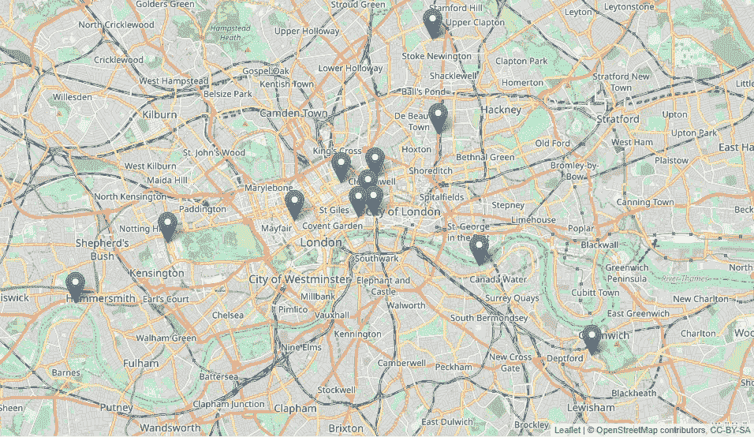

用传单包装制作的地图

# 结论

在本教程中，我们介绍了使用 Google Maps 和 Nominatim 检索地理编码数据的不同方法，并展示了如何使用 JavaScript 传单库将这些数据用于在地图上绘制特定位置。我希望本指南将作为您探索所有不同种类的 API 和映射工具的起点。