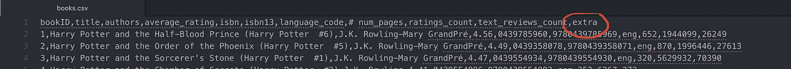
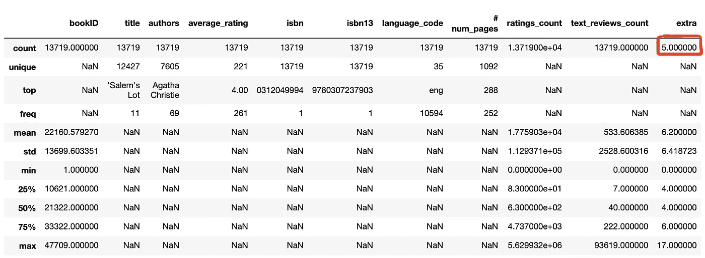
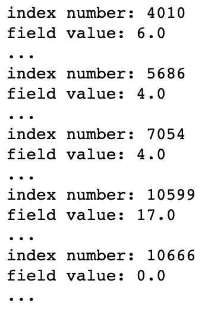
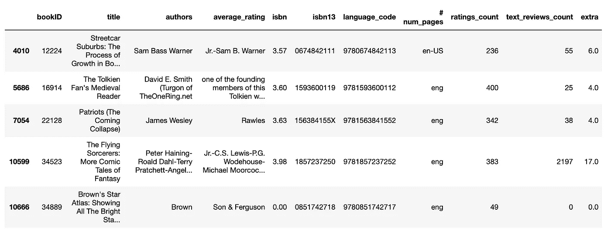
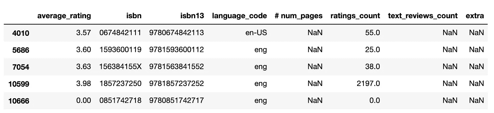
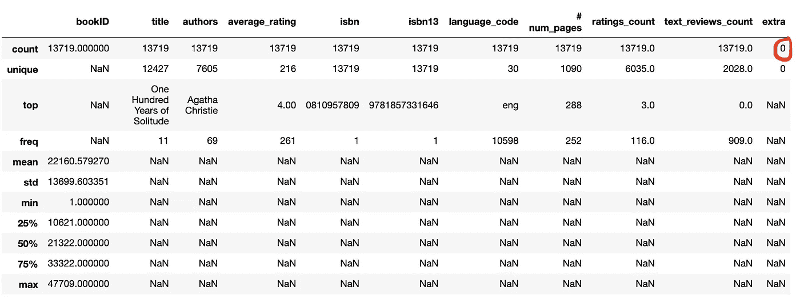
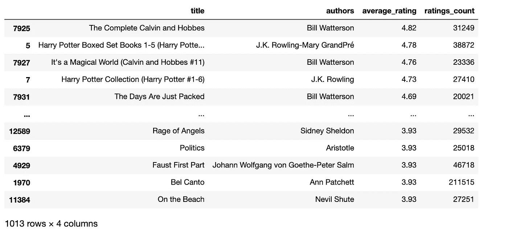
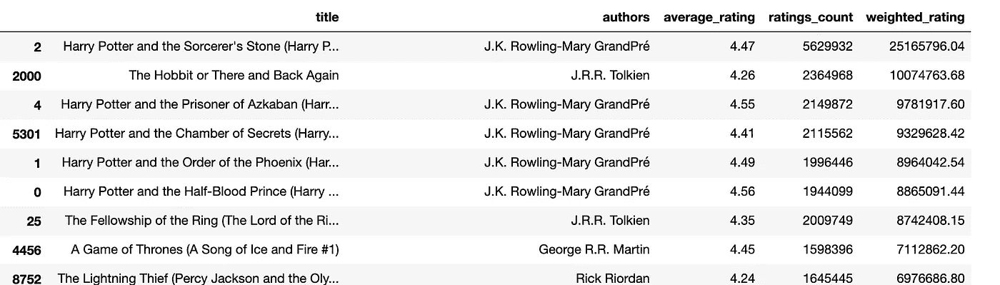
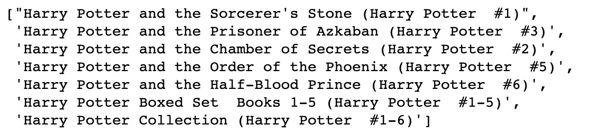
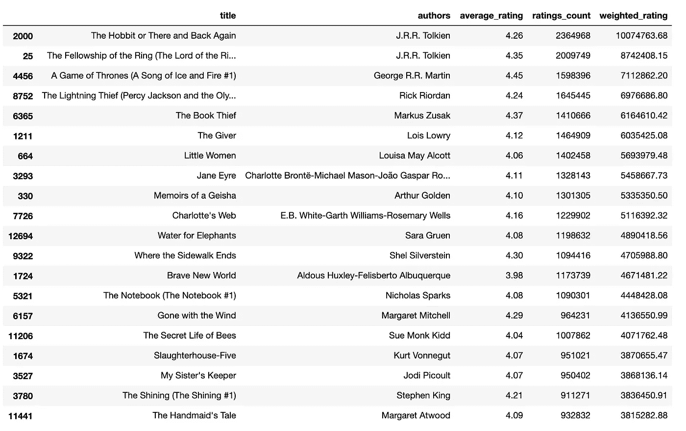

# 使用 Python 分解 Goodreads 数据集

> 原文：<https://towardsdatascience.com/breaking-down-goodreads-dataset-using-python-388e9b9d6352?source=collection_archive---------20----------------------->

## 找出下一本书


[Ed Robertson](https://unsplash.com/@eddrobertson?utm_source=unsplash&utm_medium=referral&utm_content=creditCopyText) 在 [Unsplash](https://unsplash.com/s/photos/books?utm_source=unsplash&utm_medium=referral&utm_content=creditCopyText) 上拍摄的照片

我喜欢看书，总是在寻找下一本书来读，甚至在我开始读最近买的那本之前。所以，我决定摆弄这个 [Goodreads 数据集](https://www.kaggle.com/jealousleopard/goodreadsbooks)我偶然发现了 Kaggle，看看我最终会得到什么样的书籍推荐。

这非常有趣，充满了学习！

和往常一样，我使用了 Jupyter 笔记本，并使用`virtualenv`建立了一个虚拟环境。所有步骤请查看本[帖](/demystifying-virtual-environments-in-python-7c0a0b255928)。

## 进口:

```
import sys
sys.path.append('./lib/python3.7/site-packages')
import pandas as pd
import re
import mathdata = pd.read_csv("books.csv")
```

## 错误:

读取 csv 文件时，会出现以下错误:

```
ParserError: Error tokenizing data. C error: Expected 10 fields in line 4012, saw 11
```

发生这种情况是因为，在某些行中，有逗号将所有值向右移动一个位置，从而添加了一个额外的列。

可能要做的事情:

*   完全跳过这些行。但是我们事先并不知道这些行是什么。该数据集的 Kaggle 讨论区列出了这些行，但是删除它们将导致数据丢失。
*   使用文本编辑器，用另一个分隔符如`;`或`|`替换所有逗号，然后手动转到有多个作者的行，并在那里放置逗号。这是一个麻烦的过程，需要太多的手动操作。如果损坏的行数太多，这个解决方案是不可行的。

我最终做的是——使用文本编辑器，并在最后添加一列以避免出现`ParseError`。我给专栏命名为`extra`，并使用`pandas`读取 csv 文件。



添加了名为“额外”的列

现在我们可以查看和分析数据了。

```
data.describe(include = "all")
```



`data.describe(include = "all")`

## 数据:

`bookID`:每本书的唯一标识号；
`title`:书的名字；
`authors`:该书作者的姓名。多个作者用`-`分隔；
`average_rating`:该书的平均评分；
`isbn`:识别图书的唯一编号，国际标准书号；
`isbn13`:一个 13 位的 ISBN 来标识图书，而不是标准的 11 位 ISBN；
`language_code`:书的主要语言；
`# num_pages`:书的页数；
`ratings_count`:该书获得的总评分数；
`text_reviews_count`:该书收到的文字评论总数。

## 损坏的行:

13719 行中有 5 行损坏，即它们在`extra`字段中有一个值。

为了找出这些行，我们检查哪些**在该字段中不具有值`NaN`，即具有整数值。因此，我将那些具有整数值的行的索引存储在字段`extra`中。**

```
corrupted_rows = []for index, i in data.iterrows():
     if -math.inf <= i['extra'] <= math.inf:
         print("index number:", index)
         print("field value:", i['extra'])
         print("...")corrupted_rows.append(index)
```



损坏的行

```
data.loc[corrupted_rows, :]
```



`data.loc[corrupted_rows, :]`

让我们将多个作者合并到一个字段中。我使用`authors`字段中的`;`加入它们:

```
data['authors'] = data['authors']+ ";" +data['average_rating']
```

我们得到一个警告:`SettingWithCopyWarning`。这不是一个错误，所以没有什么是坏的。然而，知道警告试图告诉我们什么总是好的，而不是忽视它。这里有一个[解释](https://www.dataquest.io/blog/settingwithcopywarning/)。

## 转变:

作者被合并在一个专栏中。现在剩下要做的是将列值从第三列开始(包括第三列，因为我们从索引 0 开始)，向左移动一个空格。这是通过使用`shift`操作符来实现的，这里我们指定需要向左(或向右)移动多少个空格，以及是沿着行轴还是列轴。

```
**#-1 indicates one space to the left and axis=1 specifies column axis**data.iloc[corrupted_rows, 3:] = data.iloc[corrupted_rows, 3:].shift(-1, axis = 1) 
```



移位的结果(**这不是正确的方式**)

这种移位的结果是两列中的值丢失:`# num_pages`和`text_reviews_count`。这是因为列的数据类型与最终移位值的数据类型不匹配。

解决方案是将所有列的数据类型临时转换为`str`，执行 shift，然后将它们转换回原始数据类型。

```
data.iloc[corrupted_rows, 3:] = data.iloc[corrupted_rows, 3:].astype(str) **#convert to str**data.iloc[corrupted_rows, 3:] = data.iloc[corrupted_rows, 3:].shift(-1, axis = 1) **#the shift**data.describe(include="all")
```



`data.describe(include="all")`

我们现在可以删除最后一列。

```
 del data['extra']
```

我们现在必须将列的数据类型转换回它们的原始类型。

`pd.to_numeric`自动配置`float`或`int`数据类型。

```
data["average_rating"] = pd.to_numeric(data.average_rating) data["ratings_count"] = pd.to_numeric(data.ratings_count) data["# num_pages"] = pd.to_numeric(data.["# num_pages"])data["text_reviews_count"] = pd.to_numeric(data.["text_reviews_count"])
```

## 过滤数据:

我只想保留那些英文书。首先，我们需要一个正在使用的不同语言代码的列表。

```
language_code_unique = data.language_code.unique() 
```

当我们打印列表时，我们看到英语语言代码以`en`开头。因此，简单使用`regex`将帮助我们过滤数据。

```
**#list to store the different English language codes**
english_lang_code = [] language_code_regex = re.compile(r'^en')for code in language_code_unique:
    mo2 = language_code_regex.search(code)
    if mo2 != None:
        english_lang_code.append(code)
```

输出是对应于英语的 5 种语言代码。然后，我们使用 define 函数直接在数据帧上使用。

```
def check_lang_code(row):
     if row.language_code in english_lang_code:
         return rowdata = data[data.language_code.isin(english_lang_code)]
```

这给我们留下了英文书籍，并将行数减少到 12651。为了进一步减少数据量，我们只提取相关的列:`title`、`authors`、`average_rating`、`ratings_count`。

```
data_filtered = data.iloc[:, [1, 2, 3, 8]] 
```

为了获得更高质量的图书列表，我们需要设置一个阈值`average_rating`和`ratings_count`。我决定两者兼顾。

```
ratings_count_mean = data_filtered["ratings_count"].mean()average_rating_mean = data_filtered["average_rating"].mean()data_filtered = data_filtered[(data_filtered.average_rating > average_rating_mean)]data_filtered = data_filtered[(data_filtered.ratings_count > ratings_count_mean)]
```

这留给我们一个 1013 行× 4 列的数据集。

## 高评价书籍列表:

使用`average_rating`作为获得顶级书籍列表的唯一因素是不够的。

```
data_filtered.sort_values(by=['average_rating'], ascending=False) 
```

下面的列表不对。



`data_filtered.sort_values(by=['average_rating'], ascending=False)`

我们需要考虑到`ratings_count`。我创建了一个新列`weighted_rating`，作为`ratings_count`和`average_rating`的乘积。

```
data_filtered['weighted_rating'] = data_filtered['average_rating'] * data_filtered['ratings_count']**#sort in descending order of 'weighted_rating'** data_filtered = data_filtered.sort_values(by='weighted_rating', ascending=False) 
```



data_filtered.head(10)

看起来好多了！

显然，哈利·波特是主角。现在，我已经读完了整个系列，所以我不想包括任何哈利波特的书。这是一个简单的`regex`案例。

```
match_regex = re.compile(r’Harry Potter’)**#list to store all 'Harry Potter' titles**
matched_titles = []for index, row in data_filtered.iterrows():
    mo1 = match_regex.search(row.title)
    if mo1 != None:
        matched_titles.append(row.title)
```



匹配的 _ 标题

```
data_without_hp = data_filtered[~data_filtered.title.isin(matched_titles)]
```

榜单前 20 本书:



data_without_hp.head(20)

列表中有我读过的书，通过添加到`match_regex`可以很容易地过滤掉，但我决定就此打住。脱颖而出的书是“*蜜蜂的秘密生活*”。我以前从未听说过这本书，这本书我一定要读一读！

## 局限性:(

不幸的是，这个数据集没有流派类别(恐怖/犯罪/搞笑/…)和小说/非小说类别，如果有这两个类别，这份名单会更具策划性和个性化(想到创建这样一份名单，我会兴奋得尖叫)！

## 要点:

→处理“损坏的行”
→尽可能过滤掉数据以获得期望的结果并提高性能
→一个主要的教训是尽可能减少`for`循环的数量，因为它们比其他方法慢:

*   定义一个函数，然后在数据帧上应用它
*   过滤数据框架括号内的数据
*   直接计算函数值

希望你喜欢带走一些有价值的见解！