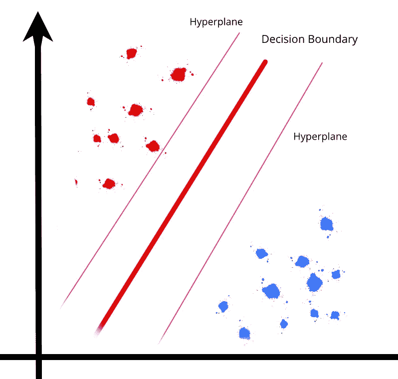
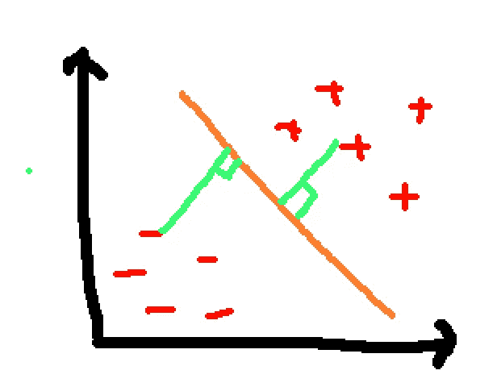
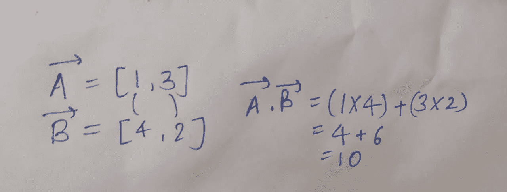
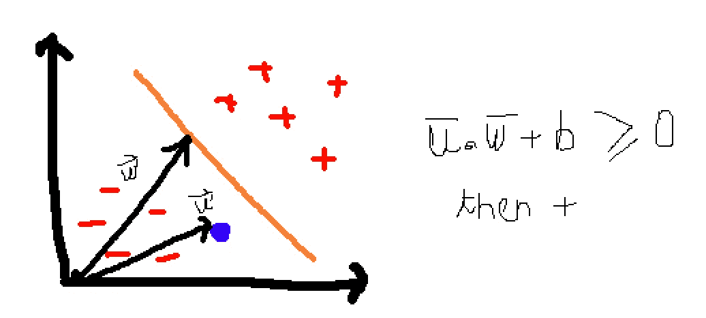
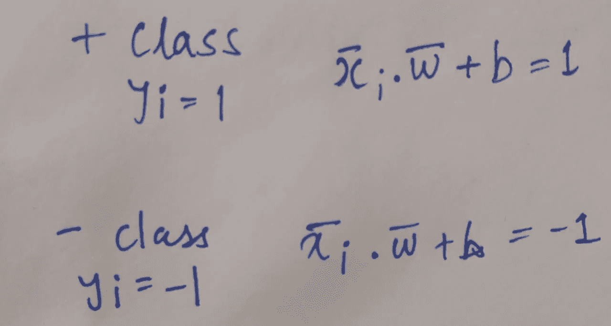
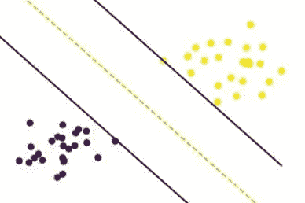
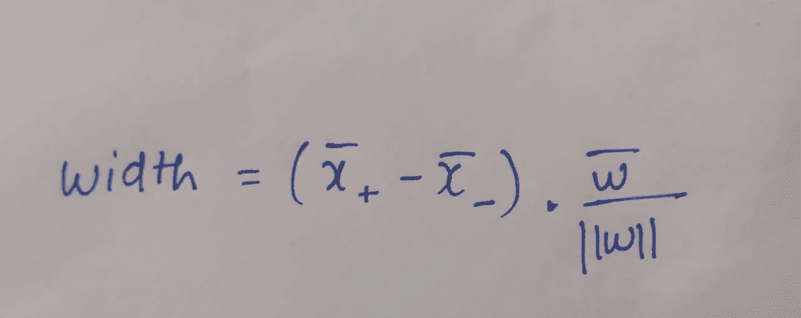
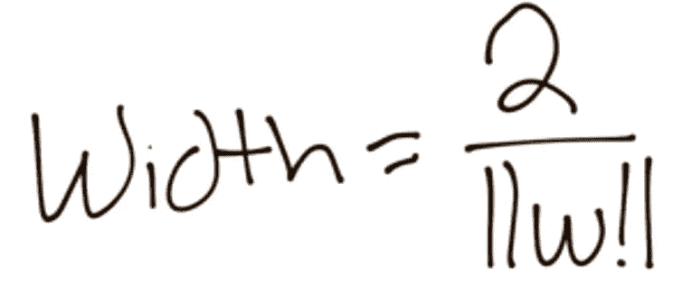
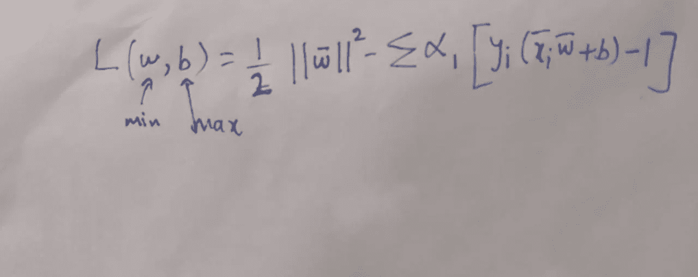
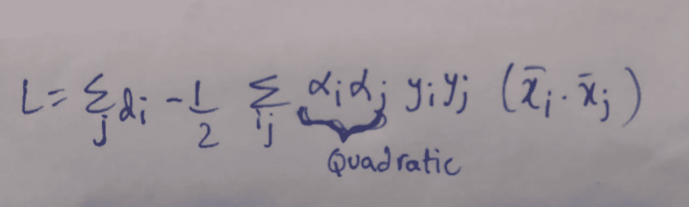

# 分解支持向量机(SVM)算法

> 原文：<https://towardsdatascience.com/breaking-down-the-support-vector-machine-svm-algorithm-d2c030d58d42?source=collection_archive---------33----------------------->

所以，我昨天在修改机器学习算法；我观察到 SVM 可能是一个广泛使用但复杂的机器学习算法。所以，在理解了其中的错综复杂并从头开始编码之后；我想我必须写一个帖子来帮助像我一样发现它比它的同行稍微复杂一点的人。

作者图片

所以，SVM 基本上使用向量空间来执行指定的任务。当谈到识别手写数字和相关任务时，你会惊讶地发现 SVM 实际上比一些神经网络更好。让我们开始吧！

# 基本直觉

在我们开始之前；你应该知道 SVM 一次只能划分两个组。但是嘿；这并不意味着它仅限于二元分类器(更强调单词‘一次’)。所以在直觉层面上。支持向量机在超平面的帮助下分离数据集中的两类数据。从超平面到数据点的垂直平分线表示最大可能距离。

SVM 超平面(决定边界)和垂线。作者图片

简而言之；即使可以有无限个超平面来分隔数据；最佳选择是可分离距离最大的一个(用数据点的垂线测量)。

因此，如果一个数据点位于超平面的任一侧；假设超平面是一堵分隔墙(只是打个比方)，我们就可以很容易地说出它的类别。但是，这也可以在回归的帮助下完成，对吗？实际上是的，但是 SVM 可以处理更复杂的分色，因为它使用向量空间。不仅如此，SVM 还在确定决策界限方面做了出色的工作。(这是最佳位置—垂直线的最大长度)。

现在我们已经清楚了我们的基本原则；让我们开始讨论它的技术细节。

# 让我们多刺激一下我们的大脑

简单来说，我们可以说向量是一个既有大小又有方向的量(基础物理/数学)。在 SVM；幅度是数值(可以通过取 x 和 y 坐标的模或和的平方根来计算；类似毕达哥拉斯定理中的斜边)。

除此之外；另一个要知道的是两个向量的点积，简单来说就是两个向量中的值相乘。可以通过下图来理解。

作者图片

例如，如果数据集中有一个数据点“u”(可以用 u 向量表示)，它被一个超平面(用红线表示)分隔开。现在，我们取另一个向量(w ),它是从超平面垂直画到原点的。现在，u 和 w 的点积加上偏差决定了我们的支持向量断言的输出。

SV 断言。作者图片

现在，如果我们方程的结果大于或等于零；然后我们可以对另一边的数据点进行分类(+ve)。在上面的例子中；我们可以直观地看到事实并非如此(我们的数据点显然不在+ve 一侧)。但是即使在复杂的情况下，这个等式也像魔法一样有效。

还有，你要注意，如果***u . w+b = 0***；然后，该点出现在决策边界上(一种罕见的情况)。

*“但是萨蒂扬，这并不复杂。那就好理解了。”嗯，如果是这样的话，我会很高兴的。但是 SVM 在获取偏差和向量值时有一些限制。但是是的，一旦你熬过这一关，我相信你会爱上 SVM 的。*

# SVM 的制约因素

SVM 的约束是 ***u.w + b*** 必须是 1 或者-1。即使数学上这些值可以是-1 到 1 之间的任何值，但是因为我们想用向量对值进行分类；我们假设它是绝对的 1 或-1。此外，这涉及到复杂的数学(拉格朗日乘数)。

所以，如果我们的等式是 1；那么属于+类。如果它是-1，那么我们的数据点属于-class。但是嘿，我们还是不知道 *w* 和 *b.* 的值是多少

得到 w；我们需要找到决策边界的最佳位置。因此，我们可以从它画一条垂线来测量矢量 w。

SVM 超平面和决策边界。作者图片

我们已经知道，决策边界应该与两侧的数据点有尽可能高的距离。(换句话说；决策边界和 2 个数据超平面之间的宽度必须最大)。

为了实现这一目标；我们需要最大化宽度。那就是:

在简化并用等式 *u.w+b -1 = 0* 和 *u.w+b+1 = 0* 替换 X 正向量和 X 负向量的值后；我们得到:

以便最大化宽度；向量 w 的值应该是最小值。如前所述；向量 w 的大小是 ***1/2 * |w|*** 。

所以，我们在看一个想要最小化的方程。

这是额外需要阅读的内容。但是为了得到约束，我们必须插入拉格朗日乘数。不仅如此，我们还会看到一个向量 w(我们希望最小化)和偏差(最大化)。

迷路了？坚持住。就差最后一步了。如果你对微积分感兴趣。我们需要对 w 和 b 做偏导数。这给了我们一个二次方程。

而这就是我们如何得到**向量 w** 和 **b** (bias)的值。天哪，我知道这很复杂。但仅此而已。

# 事物的利与弊

除了表演；从计算的角度来看，训练 SVM 可能是一个繁琐的过程，因为二次方程。但是，一旦训练出来；它可以很快预测出分数。因为它只需要计算 u.w+b 的符号(不管它是否大于零)。

## 我的朋友是支持向量机。

感谢 sklearn 让很多害怕数学的人只用一行代码就能使用这个漂亮的算法。无红利

*如果你想了解更多，你必须查看 sentdex 的解释和 MITOCW 讲座，了解更详细的数学解释。*

直到下一次！