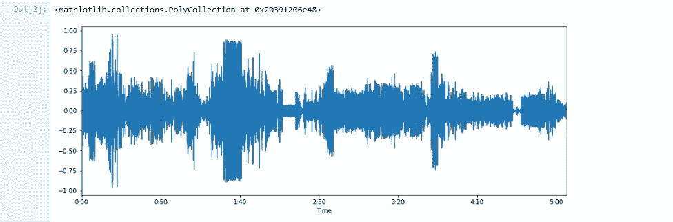
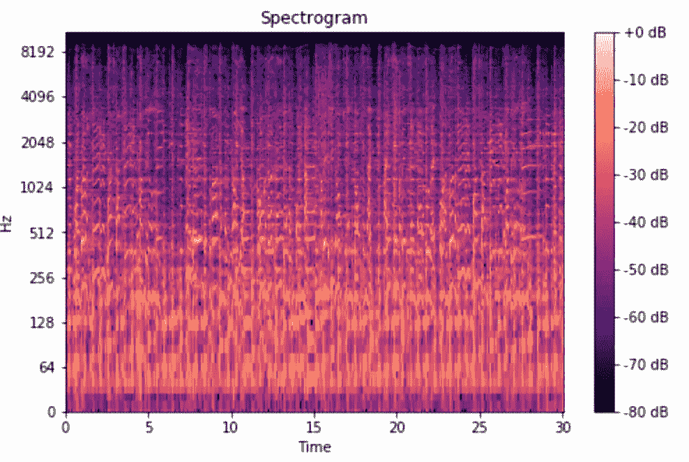
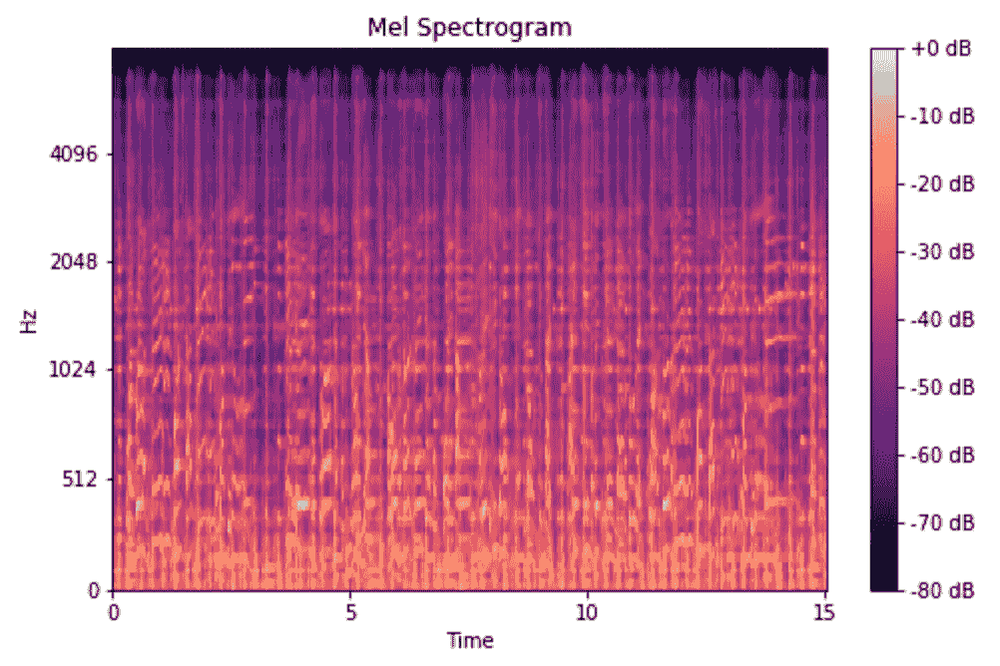

# 打破 Spotify 的音乐流派分类的算法！

> 原文：<https://towardsdatascience.com/breaking-spotifys-algorithm-of-music-genre-classification-31ecf8453af1?source=collection_archive---------16----------------------->

## 在这篇文章中，我将深入探讨构建您自己的模型的过程，该模型可以将音乐分类为不同的流派，并创建您自己的播放列表。


照片由[沃瓦·克拉西尔尼科夫](https://www.pexels.com/@vovaflame?utm_content=attributionCopyText&utm_medium=referral&utm_source=pexels)从[派克斯](https://www.pexels.com/photo/assorted-title-cassette-tapes-2796145/?utm_content=attributionCopyText&utm_medium=referral&utm_source=pexels)拍摄

# **简介**

这个行业中有许多不同类型的流派。但是基本的类型将会有几个主要的方面，使它们更容易被识别。流派是用来标记和定义不同种类的音乐，基于它们的创作方式或基于它们的音乐形式和音乐风格。

在本文中，您将学习构建自己的模型，该模型将接受一首歌曲作为输入，并预测或分类该特定歌曲的一个流派。我们将分为以下几个基本流派——布鲁斯。古典、乡村、迪斯科、嘻哈、爵士、金属、流行、雷鬼和摇滚。该模型将使用 LSTM 网络构建。如果你不知道 LSTM 是什么，不要担心。这篇文章将使你对 LSTM 及其工作有一个简单的了解。

以下是整个项目的 GitHub 链接—[https://GitHub . com/rajatkeshri/Music-Genre-Prediction-Using-RNN-LSTM](https://github.com/rajatkeshri/Music-Genre-Prediction-Using-RNN-LSTM)

整篇文章分为 4 个部分

1.  先决条件
2.  理论
3.  数据预处理
4.  训练模型
5.  根据新数据进行预测

# **先决条件**

在开始这个项目之前，你需要具备一些先决条件。你首先需要的是数据集。我在这个项目中使用的音乐数据可以从 ka ggle-[https://www . ka ggle . com/andradaolteanu/gtzan-dataset-music-genre-class ification](https://www.kaggle.com/andradaolteanu/gtzan-dataset-music-genre-classification)下载。

注意，这个数据集包含 10 个类，每个类中有 100 首歌曲。对于一个机器学习项目来说，这可能听起来很少，这就是为什么在下一节中，我将向您展示如何增加每类体裁的训练数据的数量。

您需要在 PC/笔记本电脑上安装一些模块，以便开始使用。我们将使用用 python 编码的 Tensorflow 来构建整个 LSTM 模型。我们将使用 python 3.6 或更高版本(如果您使用 python 2.7，则需要使用 python 3.6 或更高版本才能获得完整的支持和功能)。以下是需要安装的 python 包—

1.  Tensorflow —机器学习库
2.  librosa——从歌曲中提取特征的语音处理库
3.  numpy——科学计算的数学模型
4.  sklrean —另一个机器学习模型(我们将使用这个库来拆分训练和测试数据)
5.  json——对数据集进行 JSON 化(在下一节中解释)
6.  pytdub —将 mp3 转换为 wav 文件

这些模块可以使用 pip 或 conda 安装。您可以找到许多关于 pip 或 conda 入门的在线资源和 youtube 视频。一旦以上模块安装完毕，我们就开始编码吧！

# **理论**

对于任何机器学习项目来说，都有两件主要的事情——从数据中提取特征和训练模型。

对于用于机器学习目的的音频和音乐特征提取，通常从歌曲或音频中提取梅尔频率倒谱系数(**MFCC**，并且这些特征用于训练模型。MFCC 特征提取是一种仅从音频中提取相关信息的方法。

为了更好地解释这一点，当我们以数字格式表示一个音频文件时，计算机将其视为一个波，X 轴为时间，Y 轴为振幅。这如图 1 所示。



音乐在振幅和时间上的表现

这种表示格式不能给我们提供太多关于音频或歌曲的信息，因此我们通过使用快速傅立叶变换(FFT)在频域中表示音频。FFT 是一种主要用于信号处理的数学算法，用于将时域转换到频域。您可以参考此链接或观看一些 youtube 视频，了解什么是 FFT 以及它的具体工作原理—[https://www . nti-audio . com/en/support/know-how/Fast-Fourier-transform-FFT #:~:text = Fast % 20 Fourier % 20 transformation % 20 FFT % 20 2D % 20 basics，frequency % 20 information % 20 about % 20 the % 20 signal。](https://www.nti-audio.com/en/support/know-how/fast-fourier-transform-fft#:~:text=Fast%20Fourier%20Transformation%20FFT%20%2D%20Basics,frequency%20information%20about%20the%20signal.)

使用该 FFT，我们转换输入音频文件，并在频域和时域中表示它。在频域和时域显示音频数据的图形称为频谱图，如图 2 所示。



图 2

声谱图是一组叠放在一起的 FFT。这是一种直观表示信号响度或幅度的方式，因为信号以不同频率随时间变化。这里，y 轴被转换为对数标度，颜色维度被转换为分贝(你可以把这看作振幅的对数标度)。这是因为人类只能感知非常小且集中的频率和振幅范围，并且人耳根据对数标度的原理工作。

正常的频谱图可以用于提取特征，但是这仍然包含一些不需要的附加信息。由于人耳在对数尺度而不是线性尺度上工作，我们使用 mel 频谱图，该频谱图将该频谱图转换成对数表示，以通过移除或消除不想要的特征来更准确地获得特征。**梅尔频谱图**是一个频谱图，其中频率被转换为梅尔标度。图 3 显示了 mel 光谱图—



图 3

回到主题，MFCCs 使用 mel 标度，用于从音频信号中提取特征，当表示为图形时，结果是 mel 谱图。简而言之，我们在 mel 光谱图上看到的正是我们训练模型所需的特征。我在[部门找到了这篇精彩的文章，它解释了关于 mfccs 的一切。](http://practicalcryptography.com/miscellaneous/machine-learning/guide-mel-frequency-cepstral-coefficients-mfccs/)

一旦我们准备好数据集，我们就要训练我们的模型。音乐是一个时间序列数据。这意味着音乐与时间成线性关系。LSTM 非常擅长在输入特征空间中提取模式，输入数据跨越长序列。鉴于 LSTM 的门控结构具有操纵其记忆状态的能力，它们是解决这类问题的理想选择。更多信息可以参考这个[的博客](https://medium.com/@kangeugine/long-short-term-memory-lstm-concept-cb3283934359#:~:text=LSTM%20is%20a%20recurrent%20neural,time%20lags%20of%20unknown%20duration.&text=RNN%20cell%20takes%20in%20two,and%20observation%20at%20time%20%3D%20t) [。](https://medium.com/@kangeugine/long-short-term-memory-lstm-concept-cb3283934359#:~:text=LSTM%20is%20a%20recurrent%20neural,time%20lags%20of%20unknown%20duration.&text=RNN%20cell%20takes%20in%20two,and%20observation%20at%20time%20%3D%20t.)

# **数据预处理**

我们将在这里使用的数据集是从 Kaggle 下载的，在 10 个标签或流派下各有大约 100 首歌曲。每首歌曲时长 30 秒。如前所述，这个数据量对于训练 LSTM 模型来说要少得多。为了解决这个问题，我将每个音频文件分成 10 段，每段 3 秒长。因此，每个标签下的歌曲数量现在是 1000，这是训练模型以实现良好准确性的合适数量。

现在我们已经准备好了数据，我们需要提取适合于输入我们网络的特征。特征提取将通过使用 MFCCs 来完成。Librosa 用于从每个音频片段中提取特征。我们创建一个字典，以流派的标签或类别作为关键字，从所有 1000 个片段中提取的所有特征作为该标签下的特征数组。一旦我们在一个循环中对所有 10 个类别都这样做了，我们就把字典转储到一个 JSON 文件中。因此，这个 JSON 文件成为我们的数据集，模型将在这个数据集上进行训练。

转到数据集预处理的编码，我们首先定义段的数量和每个段的采样率。为了知道歌曲的回放速度，需要采样率。在这里，我们对每一段都保持不变。

```
dataset_path = "genres"
jsonpath = "data_json"sample_rate = 22050
samples_per_track = sample_rate * 30
num_segment=10
```

然后，我们创建一个循环，在这个循环中，我们打开每个流派文件夹中的每个歌曲文件，并将其分成 10 个片段。然后，我们提取每个片段的 MFCC 特征，并将其添加到字典中的流派名称(也是文件夹名称)下。

```
def preprocess(dataset_path,json_path,
               num_mfcc=13,n_fft=2048,hop_length=512,
               num_segment=5):
    data = {
            "mapping": [],
            "labels": [],
            "mfcc": []
    } samples_per_segment = int(samples_per_track / num_segment)
    num_mfcc_vectors_per_segment = math.ceil(samples_per_segment / 
                                             hop_length) for i, (dirpath,dirnames,filenames) in   
            enumerate(os.walk(dataset_path)): if dirpath != dataset_path:
            #Adding all the labels
            label = str(dirpath).split('\\')[-1]
            data["mapping"].append(label)
            #Going through each song within a label
            for f in filenames:
                file_path = dataset_path +"/" + str(label) + "/" + 
                            str(f)
                y, sr = librosa.load(file_path, sr = sample_rate) #Cutting each song into 10 segments
                for n in range(num_segment):
                    start = samples_per_segment * n
                    finish = start + samples_per_segment
                    #print(start,finish)
                    mfcc = librosa.feature.mfcc(y[start:finish], 
                           sample_rate, n_mfcc = num_mfcc, 
                           n_fft = n_fft, hop_length = hop_length)
                    mfcc = mfcc.T #259 x 13 #Making sure if
                    if len(mfcc) == num_mfcc_vectors_per_segment:
                        data["mfcc"].append(mfcc.tolist())
                        data["labels"].append(i-1)
                        print("Track Name ", file_path, n+1) with open(json_path, "w") as fp:
        json.dump(data, fp, indent = 4)
```

上述脚本将创建线段并提取要素，然后将要素转储到 data_json.json 文件中。

# **训练模特**

LSTM 用于训练模型。但在我们建立模型之前，我们必须将模型加载到我们的程序中，并将其分为训练和测试。这是通过打开我们在上一节中创建的 JSON 文件并将其转换成 numpy 数组来实现的，以便于计算。这个方法如下面的代码片段所示。

```
def load_data(data_path):
    print("Data loading\n")
    with open(data_path, "r") as fp:
        data = json.load(fp) x = np.array(data["mfcc"])
    y = np.array(data["labels"]) print("Loaded Data") return x, y
```

加载数据后，我们准备数据，并分成训练集和测试集，如前所述。这是通过使用 sklearn 的 train_test_split 函数来完成的。该函数如下所示。

```
def prepare_datasets(test_size,val_size): #load the data
    x, y = load_data(data_path) x_train, x_test, y_train, y_test =  
    train_test_split(x,y,test_size = test_size)
    x_train, x_val, y_train, y_val = 
    train_test_split(x_train,y_train,test_size = val_size) return x_train, x_val, x_test, y_train, y_val, y_test
```

接下来，使用 tensorflow 创建 LSTM 网络。这里，我们创建了一个 4 层的 LSTM 网络，包括两个隐藏层。下面的代码片段显示了网络的创建。

```
def build_model(input_shape): model = tf.keras.Sequential() model.add(tf.keras.layers.LSTM(64, input_shape = input_shape)
    model.add(tf.keras.layers.LSTM(64))
    model.add(tf.keras.layers.Dense(64, activation="relu"))
    model.add(tf.keras.layers.Dense(10,activation = "softmax"))
    return model
```

我们将模型初始化为序列，并添加一个具有 64 个神经元的输入层，一个隐藏层，一个密集 LSTM 层和一个具有 10 个神经元的输出层，因为有 10 个流派。输入层的大小取决于我们作为参数“input_shape”传递的 MFCC 系数的大小。您可以尝试更多的隐藏层，并测试准确性。

一旦定义了所有的方法和函数，就该调用它们并训练我们的分类模型了！

```
if __name__ == "__main__": x_train, x_val, x_test, y_train, y_val, y_test =     
    prepare_datasets(0.25, 0.2) input_shape = (x_train.shape[1],x_train.shape[2])
    model = build_model(input_shape) # compile model
    optimiser = tf.keras.optimizers.Adam(lr=0.001)
    model.compile(optimizer=optimiser,
                  loss='sparse_categorical_crossentropy',
                  metrics=['accuracy']) model.summary()
    model.fit(x_train, y_train, validation_data=(x_val, y_val), 
                                     batch_size=32, epochs=50)
    model.save("model_RNN_LSTM.h5")
    print("Saved model to disk")
```

首先，我们调用“prepare_datasets”函数，并传递测试日期百分比和验证数据百分比。验证数据是训练数据的一部分，模型不是用它来训练的，而是用它来验证模型。验证集告诉我们，在训练完成后，数据是否表现良好。

接下来，我们调用“build_model”函数来构建 are LSTM 网络并编译它。编译用于添加优化器(定义学习率)和损失计算功能。这里，我们使用了分类交叉熵数学函数。你可以点击此链接[这里](https://gombru.github.io/2018/05/23/cross_entropy_loss/#:~:text=TensorFlow%3A%20log_loss.-,Categorical%20Cross%2DEntropy%20loss,used%20for%20multi%2Dclass%20classification) [了解更多信息。](https://gombru.github.io/2018/05/23/cross_entropy_loss/#:~:text=TensorFlow%3A%20log_loss.-,Categorical%20Cross%2DEntropy%20loss,used%20for%20multi%2Dclass%20classification.)

编译后，model.fit()用于在我们的数据上训练模型。根据您的硬件，培训可能需要大约 1 小时到 1.5 小时。我们不想为了测试模型而一直训练我们的模型，因此在训练之后，我们保存模型，以便我们可以使用保存的文件来预测我们的新数据。在训练结束时，您可以看到达到的精确度。

# **根据新数据预测**

恭喜你！我们的模型已经被训练好了！现在是时候检查它预测不同歌曲并将其分类为不同流派的能力了。

在我们开始测试和预测新歌之前，我们必须定义这些常数。

```
###########################################################################
just_path = "genres/blues/"
song_path = "genres/blues/1.wav"
song_name = "1"
###########################################################################Constants which depend on the model. If you train the model with different values,
#need to change those values here too
num_mfcc = 13
n_fft=2048
hop_length = 512
sample_rate = 22050
samples_per_track = sample_rate * 30
num_segment = 10
############################################################################
```

如果你还记得，我们用 30 秒长的歌曲来训练我们的模型。因此，该模型将一次接受 30 秒的歌曲片段。为此，我们将要预测的输入歌曲分成多个 30 秒长的片段。这有三种不同的情况——歌曲长度小于 30 秒、歌曲长度等于 30 秒和歌曲长度大于 30 秒。对于长度小于 30 秒的歌曲，我们显示一条错误消息，说明没有达到最小值；对于长度大于 30 秒的歌曲，我们将整首歌分成多个 30 秒的片段，并将每个片段输入到模型中。以下片段是针对上述场景的。

```
#load the song
x, sr = librosa.load(song_path, sr = sample_rate)
song_length = int(librosa.get_duration(filename=song_path))
flag = 0
if song_length > 30:
        print("Song is greater than 30 seconds")
        samples_per_track_30 = sample_rate * song_length
        parts = int(song_length/30)
        samples_per_segment_30 = int(samples_per_track_30 / (parts))
        flag = 1
        print("Song sliced into "+str(parts)+" parts")
elif song_length == 30:
        parts = 1
        flag = 0
else:
        print("Too short, enter a song of length minimum 30 
        seconds")
        flag = 2for i in range(0,parts):
        if flag == 1:
            print("Song snippet ",i+1)
            start30 = samples_per_segment_30 * i
            finish30 = start30 + samples_per_segment_30
            y = x[start30:finish30]
            #print(len(y))
elif flag == 0:
            print("Song is 30 seconds, no slicing")
```

接下来，我们加载保存的模型，并定义不同的类别或流派。该模型将预测一个从 0 到 9 的数字，每个数字将代表训练期间定义的流派。

```
model = tf.keras.models.load_model("model_RNN_LSTM.h5") classes = ["Blues","Classical","Country","Disco","Hiphop",
                "Jazz","Metal","Pop","Reggae","Rock"]
```

该模型为输入歌曲的每个片段预测某种风格。组合了特定输入歌曲的所有切片片段的所有预测的预测最多的流派给出了最终的预测。例如，如果给定长度为 120 秒的歌曲作为输入，它首先被分成 3 个各 30 秒的片段，并且每个片段作为预测特定流派的模型的输入。平均预测次数最多的类型是整首歌的类型。对于预测，我们再次提取每个片段的 MFCC 特征，然后调用“model.predict()”来获得预测。

```
for n in range(num_segment):
            start = samples_per_segment * n
            finish = start + samples_per_segment
            #print(len(y[start:finish]))
            mfcc = librosa.feature.mfcc(y[start:finish], 
            sample_rate, n_mfcc = num_mfcc, n_fft = n_fft,   
            hop_length = hop_length) mfcc = mfcc.T
            mfcc = mfcc.reshape(1, mfcc.shape[0], mfcc.shape[1])

            array = model.predict(mfcc)*100
            array = array.tolist()#find maximum percentage class predicted
class_predictions.append(array[0].index(max(array[0])))occurence_dict = {}
for i in class_predictions:
            if i not in occurence_dict:
                occurence_dict[i] = 1
            else:
                occurence_dict[i] +=1max_key = max(occurence_dict, key=occurence_dict.get)
        prediction_per_part.append(classes[max_key]) prediction = max(set(prediction_per_part), key = prediction_per_part.count)
print(prediction)
```

现在你知道 Spotify 如何为你分类你的音乐了吧！希望你喜欢读这篇文章。感谢您的阅读。