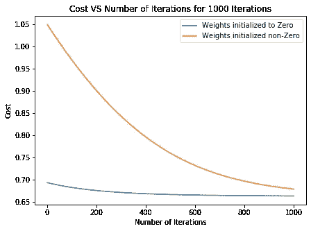
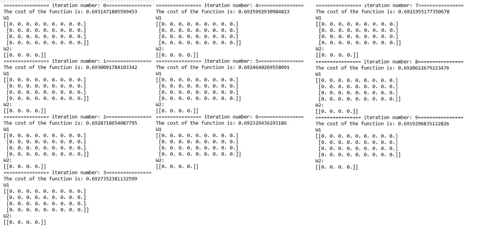
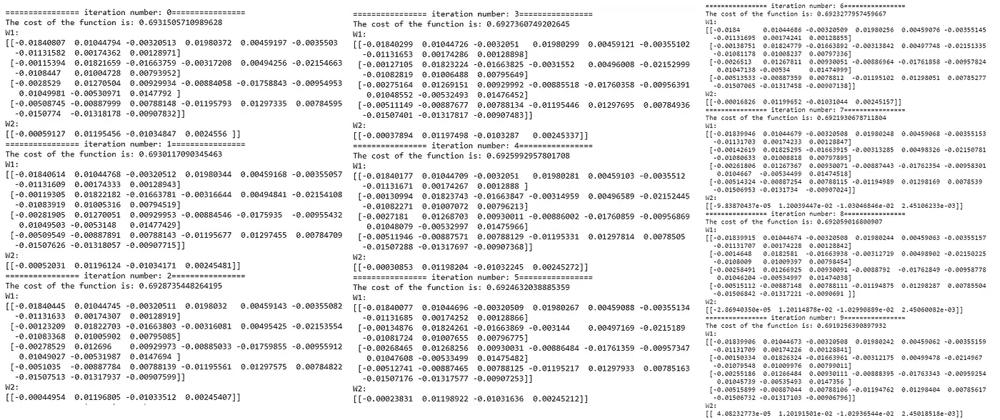
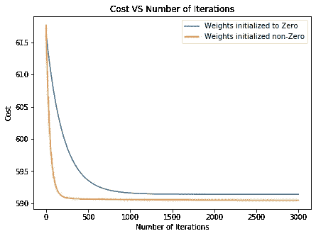

# 打破深度学习中的对称性

> 原文：<https://towardsdatascience.com/breaking-symmetry-in-deep-learning-fa5c67270b1d?source=collection_archive---------39----------------------->

## 在 L 层深度学习模型中将权重初始化为零矩阵可以导致成本降低，但权重不变。这篇文章讲的是深度学习中一个美丽却至关重要的术语“打破对称”。


照片来自 Unsplash，作者 [Ellicia@ellicia_](https://unsplash.com/@ellicia_)

T 深度学习算法的准确性让我们所有人着迷。每个领域都会不时地使用深度学习模型，无论是自动驾驶汽车、人工智能、语音到文本转换、图像识别、情感分析，还是更多。深度学习改善了许多问题的现状。但这些都是非常复杂的技术，仍处于开发阶段。

由于总是有一个起点，趋势表明，大概所有的深度学习指导者都是从“**逻辑回归作为神经网络**”开始的，这构成了深度学习的基本原理，它的单层深度学习模型使用交叉熵作为代价函数和梯度下降算法来更新权重。现在，我已经间接地提到了这篇文章的所有先决条件。

有一个假设非常小，就像埋在沙子里的铁钉一样，通常会被忽略，即我们将权重初始化为**零。当我们处理单层神经网络时，这个假设仍然有效。其中不包含任何隐藏层。**

让我们考虑著名的泰坦尼克号数据集问题，我们需要预测谁幸存下来，给定他们的某些特征。我们将不使用原始数据集，而是使用准备好进行训练的干净数据集。

## 案例 0:单层深度学习模型

因此，让我们使用激活函数为 sigmoid 函数的单层深度学习模型来预测谁在泰坦尼克号上幸存下来。这是一个逻辑回归，但是具有使用梯度下降算法的反向传播步骤和 0.001 的学习率。

```
################# WEIGHTS ARE INITIALIZED TO ZERO ##################
W = np.zeros((1,X.shape[0]))
b = np.zeros((1,1))################# WEIGHTS ARE INITIALIZED RANDOMLY #################
W = np.random.randn(1,X.shape[0])
b = np.zeros((1,1))################### ONCE WEIGHTS ARE INITIALIZED ###################
## dict for storing costs
ini_single = {}irts = 1000
while irts > 0 :
    irts = irts -1
    ## Forward Propagation
    Z = np.dot(W,X) + b
    A = sigmoid(Z)## Cost estimation
    logerror = -(np.multiply(Y, np.log(A)) +  np.multiply(1-Y, np.log(1 - A)))
    cost = logerror.sum()/m
    ini_single[1000-irts] = cost
    print('The cost of the function is: ' + str(cost))

    ## Backward Propagation
    dZ = A-Y
    dw = np.dot(dZ,X.T)/m
    db = np.sum(dZ)/m## Updating Weights    
    W = W - 0.001*dw
    b = b - 0.001*db
```

一旦我们执行了代码，我们就可以为两种权重初始化技术生成单层深度学习模型的成本与迭代次数。因此，我们可以说在几次迭代之后，两种权重初始化技术趋向于相同的成本，但是初始化为非零的权重最初具有较低的成本。



titanic 数据集的单层深度学习模型(作者发表)。

单层的结果是令人满意的，因为两种技术在一些迭代之后收敛到相同的成本。现在，让我们在模型中引入一个隐藏层，将权重和偏差初始化为零。

## 情况 1:两层深度学习模型，权重初始化为零矩阵

```
## dict for storing costs
ini_zero = {}## initializing weights of a 2 layer Deep Learning model as zero matrix.
W1 = np.zeros((4,X.shape[0]))
b1 = np.zeros((4,1))
W2 = np.zeros((Y.shape[0],4))
b2 = np.zeros((Y.shape[0],1))irts = 10
while irts > 0 :
    print('================ iteration number: ' + str(n-irts) + '================')
    irts = irts -1
    ## Forward Propagation
    Z1 = np.dot(W1,X) + b1
    A1 = np.tanh(Z1)
    Z2 = np.dot(W2,A1) + b2
    A2 = sigmoid(Z2)## Cost estimation
    logerror = -(np.multiply(Y, np.log(A2)) +  np.multiply(1-Y, np.log(1 - A2)))
    cost = logerror.sum()/m
    ini_zero[n-irts] = cost
    print('The cost of the function is: ' + str(cost)## Backward Propagation
    dz2 = A2 - Y
    dw2 = np.dot(dz2, A1.T)/m
    db2 = np.sum(dz2, axis=1, keepdims = True)/m
    derivative = 1 - np.tanh(Z1) * np.tanh(Z1)
    dz1 = np.multiply(np.dot(W2.T, dz2) , derivative)
    dw1 = np.dot(dz1,X.T)/m
    db1 = np.sum(dz1, axis=1, keepdims = True)/m## Updating Weights    
    W1 = W1 - 0.01*dw1
    b1 = b1 - 0.01*db1
    W2 = W2 - 0.01*dw2
    b2 = b2 - 0.01*db2
```

如上所述，这是一个两层深度学习模型，其中隐藏层的激活函数是 *tanh* ，输出层的激活函数是 *sigmoid* 函数，学习率等于 0.01。

如果我们仔细检查，那么成本在下降，但权重 W1 和 W2 的值保持不变。W 的无变化在深度学习中被称为**对称**。将权重初始化为零会给模型造成混乱，这就是为什么需要随机初始化权重，因此**打破了对称性。**



当权重初始化为零时，10 次迭代的成本、W1 和 W2 的值(由作者发布)。

但是为什么成本在变化呢？敏锐的观察表明，W 保持为零，但成本仍在下降。同样的问题让我很开心，现在我有了答案。改变成本的原因是“b2”，即输出层的偏差。对于梯度下降的第一次迭代，所有的预测都是相同的，但是我们发现:

> dZ2 = A2-Y 其中 **dZ2** 是代价函数相对于 Z2 的偏导数， **A2** 是输出层的输出， **Y** 是目标变量的实际值。

如果我们找到 dZ2，很明显它对于泰坦尼克号这样不平衡的数据会有一个非零值。因此，在梯度下降的迭代过程中唯一改变的参数是 b2，这是成本降低的原因。这也说明了梯度下降算法有多厉害。

现在，如果我们以非零的方式初始化权重，那么让我们看看会发生什么。

## 情况 2:两层深度学习模型，权重初始化为非零

```
## dict for storing costs
ini_nonzero = {}## initializing weights of a 2 layer Deep Learning model as randmon value matrix.
W1 = np.random.randn(4,X.shape[0])*0.01
b1 = np.zeros((4,1))
W2 = np.random.randn(Y.shape[0],4) *0.01
b2 = np.zeros((Y.shape[0],1))irts = n
while irts > 0 :
    irts = irts -1
    ## Forward Propagation
    Z1 = np.dot(W1,X) + b1
    A1 = np.tanh(Z1)
    Z2 = np.dot(W2,A1) + b2
    A2 = sigmoid(Z2)## Cost estimation
    logerror = -(np.multiply(Y, np.log(A2)) +  np.multiply(1-Y, np.log(1 - A2)))
    cost = logerror.sum()/m
    ini_nonzero[n-irts] = cost
    print('The cost of the function is: ' + str(cost))## Backward Propagation
    dz2 = A2 - Y
    dw2 = np.dot(dz2, A1.T)/m
    db2 = np.sum(dz2, axis=1, keepdims = True)/m
    derivative = 1 - np.tanh(Z1) * np.tanh(Z1)
    dz1 = np.multiply(np.dot(W2.T, dz2) , derivative)
    dw1 = np.dot(dz1,X.T)/m
    db1 = np.sum(dz1, axis=1, keepdims = True)/m## Updating Weights    
    W1 = W1 - 0.01*dw1
    b1 = b1 - 0.01*db1
    W2 = W2 - 0.01*dw2
    b2 = b2 - 0.01*db2
```

这里，我们已经通过正态分布随机初始化了权重，并改变了权重，但没有改变偏差，学习率也是相同的，但差异是巨大的**。**



当权重被初始化为非零时，10 次迭代的成本、W1 和 W2 的值(由作者发布)。

这是权重初始化有多重要的明显区别。但是敏锐的观察者会注意到偏差仍然初始化为零。正如我们已经看到的，梯度下降对偏差有直接影响，因此它们可能会也可能不会初始化为零。这不会像一个权重初始化为零那样产生巨大的差异。

另一个观察结果是，我们将权重乘以系数 0.01(恰好等于学习率)，以确保权重较小。如果权重足够大，并且我们使用类似 sigmoid 或 *tanh* 的激活函数，那么初始斜率(激活函数中的输入值很大)将会非常小。因此，性能会很好，但需要时间来达到最佳结果。

让我们运行这两个代码(案例 1 和案例 2)3000 次迭代。



3000 次迭代的成本与迭代次数(由作者发布)。

这表明情况 1 和情况 2 将在一些迭代之后收敛，但是在大多数情况下，在该迭代次数下，将发生数据的过度拟合。因此，最好选择第二种情况，在这种情况下，我们可以在更短的时间内获得结果，并且过度拟合的可能性也最小化。

# 总结

> 审视微小的步骤是令人钦佩的，因为它们可以创造巨大的差异。

初始化权重的一小步就能产生这样的差异，但重要的是要注意偏差仍然初始化为零。通过欣赏这一点，我们可以节省时间和巨大的数据问题，如过度拟合。完整的代码文件可以在[这里](https://github.com/aayushostwal/Symmetery-Deep-Learning)找到。